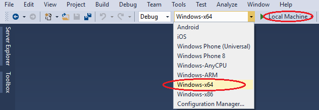
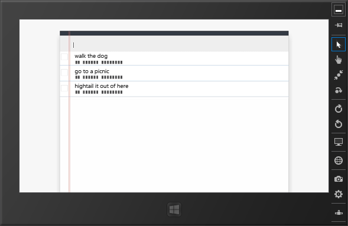

<properties
   pageTitle="Run your Apache Cordova app on Windows | Cordova"
   description="description"
   services="na"
   documentationCenter=""
   authors="Mikejo5000"
   tags=""/>
<tags ms.technology="cordova" ms.prod="visual-studio-dev14"
   ms.service="na"
   ms.devlang="javascript"
   ms.topic="article"
   ms.tgt_pltfrm="mobile-multiple"
   ms.workload="na"
   ms.date="09/10/2015"
   ms.author="mikejo"/>
# Run your Apache Cordova app on Windows

Visual Studio provides these three options for deploying an app built using Visual Studio Tools for Apache Cordova on Windows:

*   Local machine, to run the app on your PC.

*   Simulator, to run your app on the Windows Simulator.

*   Remote machine, to run your app on a remote device. To use this option, follow [these instructions](https://msdn.microsoft.com/library/windows/apps/hh441469.aspx) from the Windows Dev Center to install and use Visual Studio Remote Tools.

Windows 8, Windows 8.1, Windows 10, or Windows Server 2012 R2 (with Desktop Experience enabled) is required to deploy and run your app on Windows.

You can configure your Windows app to target your Windows versions using the configuration designer. For more information, see [Configure Your App Built with Visual Studio Tools for Apache Cordova](../develop-apps/configure-app.md).

Follow these instructions to run your app on your computer or on the Windows Simulator.

### To run your app

1.  With your app open in Visual Studio, open config.xml, choose the **Windows** tab, and select either **Windows 8.1** or **Windows 10** in the **Target Platform** drop-down box.

2. From the **Solution Platforms** list, choose a Windows platform such as **Windows-x64** from the **Solution Platforms** list.

    

    If you don’t see this list, choose **Solution Platforms** from the **Add/Remove Buttons** list to display it.

    >**Tip** To test plaform behavior, target **Windows-64* or **Windows-x86** rather than **Windows-Any CPU**.

3.  In the deployment target list, choose **Local Machine** or **Simulator**.

4.  Press F5 to start the app, or Shift+F5 to start the app without attaching the debugger.

5. If you are running on a device, Visual Studio will show you a message with a link so that you can enable developer mode. Once you enable developer mode, press F5 again.

    Visual Studio runs the app on your computer or in the Windows Simulator, as shown here.

    

### Troubleshooting? Let's fix it

If you have trouble deploying to Windows, see [Resolve Windows build and deployment errors](../tips-and-workarounds/windows/tips-and-workarounds-windows-readme.md).

 [Get the Visual Studio Tools for Apache Cordova](http://aka.ms/mchm38) or [learn more](https://www.visualstudio.com/cordova-vs.aspx)

### See Also

[Debug Your App Built with Visual Studio Tools for Apache Cordova](../debug-and-test/debug-using-visual-studio.md)
