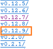

# Safely update Node.js (Visual Studio Tools for Apache Cordova)

Cordova uses [Node.js](http://nodejs.org/) to perform automation tasks. [Visual Studio Taco Update 8](https://docs.microsoft.com/visualstudio/cross-platform/tools-for-cordova/release-notes/release-update-8?view=toolsforcordova-2015) ensures that Cordova uses a compatible version of node.js. If you haven't installed the update, and you plan to install a new version of node.js onto your computer, make sure that it's compatible with the version of Cordova that your project uses. This topic helps you do that.

## Find out which version of Node.js is installed

If you're not sure which version of Node.js you've installed, do these things.

1. Open a Terminal (on a Mac) or open a Command Prompt (on a Windows computer).

2. Run this command: ```node -v```

   The Node.js version appears.

## Install a newer version of Node.js

*Only important if you haven't installed Update 8*

To use Node.js version ```4.x```, make sure that your project uses Cordova CLI version ```5.3.3``` or later.

To use Node.js version ```5.x```, make sure that your project uses Cordova CLI version ```5.4.1``` or later.

See [Change your project's CLI version](change-cli-version.md).

No other combination of Node.js and the Cordova CLI has been tested.

Unless you have a specific reason to use a newer versions of Node.js, use version ```0.12.x```  because it's compatible with all versions of the Cordova CLI.

## Install the most compatible version of Node.js (0.12.x)

*Only important if you haven't installed Update 8*

If you don't want to use version ```5.3.3``` or later of the Cordova CLI, install version ```0.12.x``` of Node.js. Then, you can use whatever version of the Cordova CLI that you want.

1. If you have Node.js installed, open **Control Panel**->**All Control Panel Items**->**Programs and Features**->**Uninstall or change a program** and uninstall it.

2. In your browser, open the [Node.js](http://nodejs.org/) page and choose the **Other Downloads** link.

    

3. In the **Downloads** page, choose the **All download options** link.

4. Choose the ```../``` link.

    

5. In the index of folders, open the folder for the most recent minor version of the the **v0.12.x**.

    The following image shows that the most recent minor version is **v0.12.9**

    

6. Choose the right installer file.

    * If you are installing this onto a Windows computer, run the file that has the ```.msi``` extension.

    * If you're installing this onto a Mac, run the file that has the ```.pkg``` extension.
