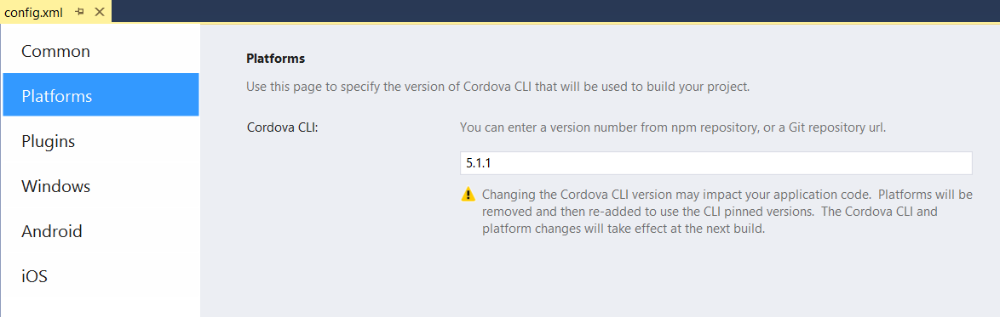
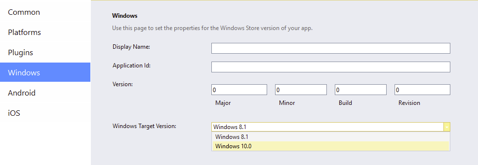

<properties pageTitle="Major Changes in Apache Cordova 5 & 6"
  description="Adapting to changes in Apache Cordova 5.x and 6.x"
  services=""
  documentationCenter=""
  authors="clantz" />

# Adapting to changes caused by Apache Cordova 5.x and 6.x
The Tools for Apache Cordova RTM have been tested with both Cordova 4.3.1 and Cordova 5.1.1 with subsequent updates being tested against more recent versions of Cordova including 6.0.0. 

As the major version number increase implies, **[Apache Cordova 5](http://cordova.apache.org/docs/en/5.1.1/index.html)** is a departure from 3.x and 4.x versions of Cordova in a number of very important ways.  **Cordova 6.0.0** adds in support for **Android Marshmallow** which forced some changes to Cordova itself along with breaking changes in plugins. 

The latest versions of a number of plugins now require Cordova 6.0.0 (Cordova Android 5.0.0+). **You should move your projects to Cordova 6.0.0** as soon as is feasible for plugin compatibility and Marshmallow support when targeting Android.

You can update your project to use Cordova 5 or 6 by following these steps:

1. Double click on config.xml.

2. Select the "Platforms" left navigation tab.

3. Change the version number to 5.1.1 or higher and save config.xml.

	

    When you build, this will **automatically remove any existing contents in the platforms folder in the filesystem**. If you have opted to customize the native project, you should consider migrating your custom assets to the **res/native** folder (ex: res/native/android) which will automatically add the files to the project before preparing the Cordova project to build.

    However, you'll want to exercise care here since **Android in particular has undergone significant revisions in Cordova 5 and 6.0.0 has introduced additional changes.** The remainder of this article will highlight these updates, and cover tips for adapting your existing apps to these changes.

### A Note on Cordova Version Numbers
Historically Cordova and all its components have used one unified version number. This was particularly true with Cordova versions prior to 3.0.0. This changed when Cordova 4.0.0 was released but most end users were never exposed to this difference. With the release of Cordova 5.0.0, you may also see reference to the release of "Cordova Android 4.0.0". This does not refer to the top level Cordova version but instead the **platform** version. You can think of a platform in many ways as a native project generator combined with a set of scripts designed to build the app.

Understanding these differences can be important when reading blog posts or updates on the Cordova web site. Here is how these different components are typically described:

- **Cordova 5.1.1** refers to version 5.1.1 of the [Cordova CLI](http://go.microsoft.com/fwlink/?LinkID=533773) (and an underlying core library called [cordova-lib](http://go.microsoft.com/fwlink/?LinkID=617661)). [Documentation](http://go.microsoft.com/fwlink/?LinkID=617659) on the Cordova web site will also refer to this version number.

- **Cordova CLI 5.1.1** is largely equivalent to Cordova 5.1.1 but is specifically referring to the [Cordova CLI npm package](http://go.microsoft.com/fwlink/?LinkID=617660).

- **Platform versions** follow a different numbering scheme. A given Cordova CLI version "pins" a set of platform versions by default because all testing for the release was done using this specific combination of components. The Cordova OSS project does not typically back-test earlier versions of the CLI with newer platforms unless specifically noted in the release notes. You will typically see these platform versions mentioned in a form similar to "Cordova Android 4.0.0". This naming scheme inherits its name from the [cordova-android](http://go.microsoft.com/fwlink/?LinkID=617662) and other similarly named npm packages that are installed when the platform is added to your project. Visual Studio will automatically perform this "platform add" operation on your behalf but you may notice a version number like this in the Output Window when you build.

	The following Cordova platform are pinned in **Cordova CLI 5.1.1** (or [see here](http://go.microsoft.com/fwlink/?LinkID=617667) for a complete list):

	- Cordova Android 4.0.2
	- Cordova iOS 3.8.0
	- Cordova Windows 4.0.0
	- Cordova WP8 3.8.1

Other components are also versioned independently, but typically you will not be directly exposed to them. It is the release of Cordova Android 4.0.0 that triggered the major version increase for Cordova as a whole given it had a number of breaking changes. Windows 4.0.0 is also a major release that includes Windows 10 support but was designed to not have breaking changes when building for Windows or Windows Phone 8.1.  

Similarly the major version update in Cordova 6.0.0 was triggered by breaking changes with the release of Cordova Android 5.0.0 .

Note that you can actually add different platform versions to your project for a given CLI version through the use of some XML elements or command line options for edge case scenarios. See the [May 26th, 2015 Android Cordova Platform Security Issue](../tips-and-workarounds/android/security-05-26-2015/tips-and-workarounds-android-security-05-26-2015-readme.md) article for a specific example of how this works.

## Changes with the release of Cordova 6
Cordova 6's main change was updates to the Android platform to support Android Marshmallow. While not as dramatic a change as Cordova 4 to 5, there are some impacts to both Cordova 5 and 6 users that you will want to know about.

First, Cordova 6.0.0 no longer supports plugins from the legacy plugin repository. Most users should not notice a change here, but only plugins in the npm-based repository at [plugins.cordova.io](http://go.microsoft.com/fwlink/?LinkID=618599) will work with Cordova 6.0.0+. That said, in general, you likely do not want to use plugins that have not made the transition already given it means they are very old.

### Plugin breaking changes caused by Cordova 6.0.0 / Cordova Android 5.0.0
Android Marshmallow introduced new security features that have resulted in breaking changes to Cordova itself and by extension core plugins including:

- cordova-plugin-camera
- cordova-plugin-geolocation
- cordova-plugin-contacts
- cordova-plugin-file
- cordova-plugin-media

As a result, in general we recommend moving to Cordova 6.0.0 or higher when targeting Android. Installing any of these plugins with an earlier version may result in a message telling you that Cordova Android 5.0.0 or higher is required. Switching to Cordova 6.0.0 will resolve this problem.

If you need to stay on an earlier version of Cordova, you may need to install an earlier version of the plugin from the command line as follows from your project directory:

```
npm install -g cordova@5.4.1
cordova plugin add cordova-plugin-camera@^1.2.0
```

...replacing the Cordova version and camera plugin Id with the appropriate one for your use case.

## Changes with the release of Cordova 5

<a name="security"></a>
### Security Model Changes for Android and iOS
One of the more confusing changes about Cordova 5 is that the updated version of the Android platform (also called Cordova Android 4.x) and iOS now follow a different, but more powerful security model designed to provide developers with the tools needed to prevent cross-site scripting attacks among other issues. A critical aspect of this security model is that **absolutely no network access of any kind is allowed without the installation of a Cordova plugin**.

There are a whole host of new security features available and we **strongly recommend you read the [whitelist and CSP guide](../security/cordova-security-whitlist.md)** for a introduction on them. This article will focus on getting you up and running with the basics.

#### The New Whitelist Plugin
The new [Cordova Whitelist plugin (cordova-plugin-whitelist)](http://go.microsoft.com/fwlink/?LinkID=617668) is the recommended base security plugin to use for managing network security access. Historically there was one **access** element in config.xml used to control all access to network resources.

The problem with this model is you may want to be able to make an XHR request to a service like Azure Mobile Services without actually allowing your app to navigate to an Azure web page in the same domain. The reason this is a concern is that this remote web page is then given access to all Cordova and plugin APIs. Further, for Android, the access element has been overloaded to control "intents" in the wake of a discovered [security issue in Cordova 3.5.0 and below](http://go.microsoft.com/fwlink/?LinkID=617669) which has led to a syntax that strayed away from the original [W3C Widget spec](http://go.microsoft.com/fwlink/?LinkID=617670) that config.xml's structure is based on. Some restructuring and improvements were therefore appropriate for the Cordova 5.0.0 release.

As a result, the new whitelist plugin actually introduces three separate elements designed to enable more discrete control. The **access** element returns, but only controls where your app can make XHR requests or access other external content from a web page for Android and iOS. It no longer controls whether you can navigate to a different domain. A new **allow-navigation** element has been added that then enables you to specify where the app can navigate instead. Finally, a new **allow-intent** element has been introduced specifically designed to control Android intents.

Projects created using the Tools for Apache Cordova or Cordova CLI itself contain fairly restrictive default rules that are intended to represent a reasonable starting point for most projects. Specifically it:

1. Allows XHR and images to originate from any URL.
2. Disallows navigation to external URLs (hosted content).
3. Disallows inline script (Meaning no &lt;script&gt; tags or "on" attributes on HTML elements) on recent versions of Android, iOS, or Windows via a W3C Content Security Policy (CSP) in index.html.
4. Allows the "tel:", "sms:", "mailto:", and "geo:" intents.

You'll want to start your project with roughly these same defaults and alter as needed. See below for how to add these defaults to your project and the [whitelist and CSP guide](../security/cordova-security-whitlist.md) for details on why these defaults are in place and how to change them.

####Configuring Security Settings from a VS Project
When you upgrade a project to Cordova 5.0.0+, you will want to take the following steps if you want to mirror the base security policy listed above. You can then customize them as needed to meet your needs.

1. Add the whitelist plugin to your project via config.xml:

	1. Double click on the **config.xml** file in your project.

	2. Click on the **Plugins** tab.

	2. Select **Whitelist** and click **Add**

	   

2. Update the config.xml file with the ```allow-intent``` or ```allow-navigation``` elements as needed:
	1. Right-click on config.xml and select **View Code**.

	2. Add the following XML elements under the &lt;widget&gt; element:

		```
		<allow-intent href="http://*/*" />
		<allow-intent href="https://*/*" />
		<allow-intent href="tel:*" />
		<allow-intent href="sms:*" />
		<allow-intent href="mailto:*" />
		<allow-intent href="geo:*" />
		```

		You should already have an &lt;access&gt; element in your config.xml. You can use the **Domain Access** list under the **Common** tab in the config.xml designer to add or edit your current list.

	3. Optionally, you can allow navigation to hosted content by adding URLs to config.xml as follows:

		```
		<allow-navigation href="http://www.microsoft.com" />
		```

3. Add a Content Security Policy (CSP) to your HTML pages:
	1. Add the following &lt;meta&gt; tag to each of your top level HTML pages (like index.html).

		```
		<meta http-equiv="Content-Security-Policy" content="default-src 'self' data: gap: https://ssl.gstatic.com 'unsafe-eval'; style-src 'self' 'unsafe-inline'; media-src *">
		```

		> Note: You don't have to add this tag to pages that are dynamically loaded by a JavaScript framework like AngluarJS or WinJS. Many times you just need to add it to index.html.

	2. Customize the CSP policy to meet your needs. See [whitelist and CSP guide](../security/cordova-security-whitlist.md) for details.

	3. You may wish to use the Crosswalk WebView plugin when targeting earlier versions of Android as CSP support was not introduced until Android 4.4. See [the section on Crosswalk later in this article](#crosswalk) for additional tips on using Crosswalk.

<a name="crosswalk"></a>
###Pluggable WebViews and the Crosswalk WebView for Android
An exciting new development in the Cordova Android platform in Cordova 5 is the support for what are called "pluggable WebViews." What this feature allows you to do is swap out the built in Android WebView with a completely different WebView implementation. This is a significant improvement as the Android browser and thus the WebView is locked at a specific version without the ability to update unless you update the version of the OS on the device. This has changed in the Android OS as of 5.0, but unlike iOS or Windows where devices can opt to upgrade and developers need only concern themselves with a few major versions of the browser, older Android devices are locked at a particular sub-revision of Android (and thus the browser) with no ability to upgrade the device in many cases. The end result has been a vast array of small differences between Android devices.

[Crosswalk](http://go.microsoft.com/fwlink/?LinkID=617678) is a project that is designed to allow developers to embed a very recent and specific version of the Chromium WebView inside their Android app. The Crosswalk WebView can be embedded in apps running on Android 4.0 and up and brings with it the significant advantage of a consistent WebView implementation across all Android device versions it supports.

There is now a [Cordova Crosswalk plugin](http://go.microsoft.com/fwlink/?LinkID=617679) that takes advantage of the new pluggable WebView features in Cordova 5.0.0+ (and the Cordova Android 4.0.0 platform it uses) and makes it simple to add into your project.

*Note: Because using the Crosswalk plugin does slow down build times given its size, we recommend developers start out building apps with the stock Android WebView on a recent device or emulator (Android 4.4+). You can then add the Crosswalk plugin later in your development cycle and make the necessary adjustments.*

###Installing the Crosswalk Plugin from VS
To use the Crosswalk WebView plugin from Visual Studio, follow these steps:

1. Double click on config.xml in your project.

2. Click on the **Plugins** tab.

2. Select **Crosswalk WebView** and click **Add**.

    

The next time you build, your app will be running in the Crosswalk WebView. Note that the first build for Android in particular will take a bit given the plugin does some dynamic acquisition.

####Tips on using Crosswalk
1. If you run into a problem where the Visual Studio **debugger is not attaching** after adding the Crosswalk plugin, you may be encountering an issue with a recent version of Crosswalk.  Crosswalk version 15 is known to work well and you can force this version to be used with a simple preference. Simply add the following to config.xml by right-clicking on the in file in Visual Studio and selecting **View Code**:

	```
	<preference name="xwalkVersion" value="org.xwalk:xwalk_core_library:15+" />
	```


2. If you are using the **Visual Studio Android Emulator** and encounter an **app crash** on startup, you may be experiencing an incompatibility with a specific version of Crosswalk being added to your project by the plugin and the emulator. Crosswalk version 15 is known to work well and you can force this version to be used with a simple preference. See #1 for details.

4. If you encounter a "Could not create the Java Virtual Machine" error, add the following environment variable to your system and restart VS to bump up Java's heap memory to at least 512M:

	```
	_JAVA_OPTIONS=-Xmx512M
	```
5. Finally, if you are using the standard **Google Android Emulator,** and encounter an **app crash** after adding the Crosswalk plugin, be sure to the **Use Host CPU** option is checked in the AVD that you create, and have up-to-date graphics drivers installed on your system, or the app will crash due to Crosswalk's support of WebGL.

	


<a name="win10"></a>
###Windows 10 Support
Historically, Windows and Windows Phone 8.1 have had a number of compatibility challenges with Cordova apps due to underlying platform differences around security rules. A [JavaScript compatibility](http://go.microsoft.com/fwlink/?LinkID=617680) framework was released to help alleviate some of these issues on Windows 8.1, but starting with **Cordova 5.1.1**, you can now build Windows 10 apps. In addition to supporting the new Windows Universal platform that allows a single code base and app package to be used across a number of different devices, Windows 10 also brings a number of significant improvements to Apache Cordova users.

In particular:

- Elimination of the existing dynamic content restrictions in Windows 8.0 and 8.1.
- Cordova plugin support for external hosted content through the use of the same &lt;allow-navigation&gt; element used by Android and iOS.
- Support for the powerful Content Security Policy (CSP) that is also now recommended for use with the Android and iOS Cordova platforms.  See [this article for more details](./cordova-5-security.md).
- Apps can now run in two different security modes:
	- Remote mode: The default, flexible security mode that only has a hand full of store submission restrictions.
	- Local mode: A more secure mode that adds additional protections but disables hosted content and inline script

These improvements mean that the Windows platform now has a flexible model compatible with Cordova platforms like Android and iOS while still providing you the tools you need to secure your app. Check out the [Cordova Windows 10](http://go.microsoft.com/fwlink/?LinkID=617471) documentation for more information on new features.

You can follow these steps to use Cordova Windows 10 with Visual Studio:

1. First, install the [Windows 10 Tools for Visual Studio](http://go.microsoft.com/fwlink/?LinkID=617471) if you have not already.

2. Update your project to Cordova 5.1.1 or higher as described above if you have not done that already.

3. Next, open the config.xml designer by double clicking on config.xml.

4. Click on the "Windows" tab.

5. Change the **Windows Target Version** to **Windows 10.0**.

    

That's it! Cordova will switch from a Windows 8.1 project to a new Universal App project and take care of the rest! Just use the **Debug** dropdown list to deploy to a Windows 10 device, use your Windows 10 PC, or use a Windows 10 emulator.

<a name="npm"></a>
###Primary Cordova Plugin Repository is Now Npm

Another significant departure in Cordova 5 and the community as a whole is the migration of the primary source of Cordova plugins from the custom repository backed model that exists in Cordova 3.x and 4.x to the "Node Package Manager" (npm) repository. The plugins.cordova.io repository has seen a few service interruptions and given the web community's increased use of Node.js for client-side development, and Cordova's heavy use of npm for not only its command line interface but as a source for Cordova "platforms," the natural next step was to migrate plugins to npm as well. More details on this transition [can be found here.](http://go.microsoft.com/fwlink/?LinkID=617671).

However, unfortunately this change is not transparent. For a few very specific reasons, this change can be a bit confusing, and we're working with the community to determine some ways to make the transition a bit more seamless going forward.

####Plugin ID Changes
A significant change to be aware of is that the IDs used to refer to many Cordova plugins have changed. This was done for two reasons. First, the different ID helps to re-enforce that older versions of Cordova will not get plugin updates. Cordova 3.x and 4.x simply do not support fetching plugins from npm. Rather than having an arbitrary version number where the updates stop, using a different ID makes this change over explicit. Second, the old reverse domain style for Cordova plugin IDs does not conform to community best practices for package names in npm.

As a result, core plugins like Camera have changed from [org.apache.cordova.camera](http://go.microsoft.com/fwlink/?LinkID=617672) in version 0.3.6 of the plugin to [cordova-plugin-camera](http://go.microsoft.com/fwlink/?LinkID=617673) in versions 1.0.0 and higher.


You can find running list of [old verses new plugin IDs in this location](http://go.microsoft.com/fwlink/?LinkID=617674).

The config.xml designer in Visual Studio will automatically use the new plugin IDs if you are targeting Cordova 5.0.0+, and use the old plugin IDs for 4.3.1 and below where npm based plugin support is not available (see below for details).

**If you do not see this behavior, update Tools for Apache Cordova.** Some very early adopters may not see some of the improvements described in this document until after you update. You will soon see a notification in the notification center (flag in the upper right) prompting you to update.

See [tips and workarounds](../tips-and-workarounds/general/tips-and-workarounds-general-readme.md#plugin-npm) for additional details on adding npm versions of plugins to your project.

####Cordova Plugin Registry
Plugins.cordova.io now has two registry sections:

- The landing page of [plugins.cordova.io](http://go.microsoft.com/fwlink/?LinkID=618599) **contains only npm sourced plugins** and these plugins only work with Cordova 5.0.0+.
- Cordova versions less than 6.0.0 can use plugins in [the legacy registry](http://50.17.177.14/). **However,** note that 6.0.0 dropped this support.

Both sets of plugins can be used with Cordova 5.0.0+, so in the short term, you might need to search in both locations for plugins. Plugins that you find in npm are most likely to work without an issue with Cordova 5.0.0 and higher, and might work with earlier versions of Cordova. Npm will be the eventual source of truth, but things are still in a transition period.

<a name="no-npm-3.x"></a>

####Cordova 3.x and 4.x Don't Support Npm as a Plugin Source
An early source of confusion can lead from the fact that Cordova 3.x and 4.x cannot use plugins sourced from npm. The Cordova CLI in these versions does not have the capability. A specific issue that can come up is that updates to plugins will now generally be going to npm **not** to the older plugin registry sourced method used by these earlier version of Cordova.

Generally, if you need an updated plugin, update to Cordova 5.1.1 or later. See the [tips and workarounds](../tips-and-workarounds/general/tips-and-workarounds-general-readme.md#plugin-npm) section if you must get an updated plugin for a project that uses an earlier version of Cordova for potential options.

<a name="gradle"></a>
###Gradle Build Instead of Ant for Android
On the surface, this seems like a fairly minor change, but we've continued to hear about unexpected issues in some 3rd party Cordova plugins because of this change, so it is worth a mention.

Up until Cordova 5.0.0 (Cordova Android platform version 4.0.0), Cordova used [Apache Ant](http://go.microsoft.com/fwlink/?LinkID=617676) as the primary build system to build an Android version of an app. This has now changed to [Gradle](http://gradle.org/) as the default though developers can force an Ant build using the Cordova CLI as follows:

```
cordova build android -- --ant
```

There are three major ways that switching to Gradle can affect your project:

1. The way you specify signing information is different. See the [Packaging & Publishing tutorial for details](../tutorial-package-publish/tutorial-package-publish-readme.md).
1. Some 3rd party plugins may now require Gradle and thus typically only work on Cordova 5.0.0 and up. In particular, plugins that modify Android build artifacts in a non-standard way can run into issues.
1. Other 3rd party plugins might not have updated to support Gradle yet, and still require Ant to be used. Generally these plugins are designed for Cordova versions < 5.0.0.

A good example of a plugin that requires Gradle is the [Crosswalk plugin](http://go.microsoft.com/fwlink/?LinkID=617677) that we will cover a bit later in this article. While at one point it also worked with Ant builds, it now gets errors if you are not building with Gradle. As a result, Visual Studio 2015 now uses Gradle to build Android in Cordova 5.0.0+ instead of Ant (2015 RC still used Ant). However, the end result is you could hit compatibility issues with lesser known 3rd party plugins particularly if you have not updated them.

<a name="gradle-migrate"></a>
####Migrating an Existing Project to Use Gradle
Simply updating to Cordova 5.0.0+ will automatically cause Gradle to be used from that point forward. Because of the differences mentioned above you should take the following steps to adapt your project:

1. If you've already added release signing information into ant.properties in your project, you'll need to place this information in a new file in your project. See the [Packaging & Publishing tutorial for details](./package-and-publish/tutorial-package-publish) for details.

2. If you encounter an unexpected build error specifically for Android, see if the error references Cordova plugin source code. If so, update it by removing the plugin using the **Installed** tab of the config.xml designer and re-adding the plugin. If you cannot determine which plugin is causing the issue, you can opt to proactively upgrade all of them.

3. If a plugin update doesn't solve the issue, try these steps to eliminate other factors.
	1. Create a new project and see if the problem happens again.
	2. To eliminate Visual Studio as a the cause of the problem, you can test by using a standard Cordova CLI project and by entering the following in a command prompt:

		```
		npm install -g cordova@5.1.1
		cordova create testProj
		cd testProj
		cordova platform add android
		cordova plugin add cordova-plugin-in-question
		cordova build android
		```

		... replacing the Cordova version and plugin name for those that apply to your situation. You can also specify a fully qualified Git URI or filesystem path in place of the plugin name.

	2. If you're able to reproduce the problem, you might want to contact the plugin author and let them know about the it. Before doing so, be sure to check for existing open issues as more than likely there's already one on the plugin author's GitHub site that you can use to provide additional information. Mention that you encountered issues when using Tools for Apache Cordova but include the Cordova CLI repro for the plugin author's benefit. See the [tips and workarounds](../tips-and-workarounds/general/tips-and-workarounds-general-readme.md#plugin-troubleshoot) section of our docs for additional troubleshooting tips.
