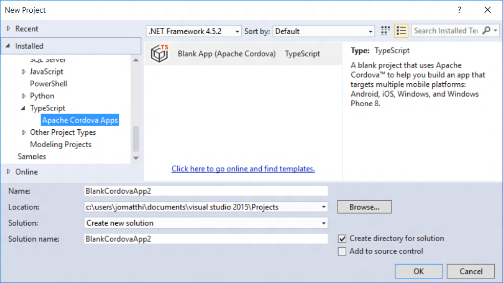
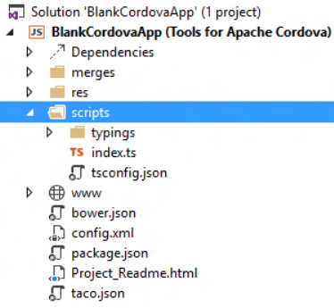
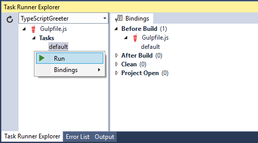

# Use TypeScript in a Cordova project
[TypeScript](http://www.typescriptlang.org) is a programming language that is a superset of JavaScript - offering classes, modules, and interfaces. You can use these features while developing your Cordova app and TypeScript will compile into simple JavaScript that will be deployed as part of your app.

The Visual Studio Tools for Apache Cordova provide templates to help you get started with TypeScript and the TypeScript editor in Visual Studio.

> **Note:** You need to know that for the current version of the Tools for Apache Cordova, you can only work with TypeScript files in the /scripts folder of a project. Ideally, you're free to arrange files into any folder. This is a known issue being worked on for a later update.

##<a name="getStarted"></a>How do I start a TypeScript application?
Visual Studio provides a blank app template using TypeScript, or you can also use one of the [TypeScript Module samples](#samples) as your starting point.

To use the Blank App TypeScript template.

1. In Visual Studio, use the **File** > **New** > **Project** menu.
2. Select the **Templates** > **TypeScript** > **Apache Cordova Apps** category and click on the **Blank App (Apache Cordova)** template.  
   
3.  Enter a name and file location for your project, then click OK.

    Here's what the new project looks like:

    

    In the scripts folder you see typings, index.ts, and tsconfig.json files. These files are used by TypeScript:

    * typings - a collection of [typing definition files](http://www.typescriptlang.org/Handbook#writing-dts-files) that define the APIs for common Cordova plugins.
    * index.ts - a TypeScript file. In this project, index.ts is the default file.
    * tsconfig.json - a configuration file that you can use to customize the TypeScript build options. [Learn more about tsconfig.json](https://github.com/microsoft/typescript/wiki/tsconfig.json) on the TypeScript project site.

If you open the index.ts file, you'll see the TypeScript source with the default behavior for this application.

```typescript
module BlankCordovaApp {
    "use strict";

    export module Application {
        export function initialize() {
            document.addEventListener('deviceready', onDeviceReady, false);
        }

        function onDeviceReady() {
            // Handle the Cordova pause and resume events
            document.addEventListener('pause', onPause, false);
            document.addEventListener('resume', onResume, false);

            // TODO: Cordova has been loaded. Perform any initialization that requires Cordova here.
        }

        function onPause() {
            // TODO: This application has been suspended. Save application state here.
        }

        function onResume() {
            // TODO: This application has been reactivated. Restore application state here.
        }
    }

    window.onload = function () {
        Application.initialize();
    }
}

```
This is the same source as the [JavaScript Blank App template](get-started-first-mobile-app.md), implemented in TypeScript. This code sets up Cordova event handlers for the application.

When you build this project, the TypeScript source will be compiled into a JavaScript file named appBundle.js located in the www/scripts/ folder (this is configured in the tsconfig.json file mentioned earlier). By doing this, you reduce the size of your final packaged application, because the TypeScript files in the /scripts folder will not be included in the application package.

> **Note:** For the current version of the Tools for Apache Cordova, you can only save TypeScript files in the /scripts folder. Ideally, you're free to arrange files into any folder. This is a known issue being worked on for a later update.

##<a name="addToExisting"></a>Can I add TypeScript to my existing JavaScript application?
TypeScript files can be added to any Cordova project using the TypeScript item template. You can find this template by right-clicking on your project and choosing the **Add** > **New TypeScript File** menu.

In the current release, if you want TypeScript files to compile by default you must place these files into a Scripts file at the top level of your project.

##<a name="configTypeScript"></a>How do I customize the TypeScript compiler settings?
To customize the compiler settings for TypeScript in your projects:

1. Add a new tsconfig.json file to the /scripts folder at the top level of your project.

3. Define your settings using the JSON schema documented on the [TypeScript project wiki](https://github.com/microsoft/typescript/wiki/tsconfig.json).

   As you write your tsconfig JSON, IntelliSense will offer suggestions to help make sure your file matches the expected schema.

   

##<a name="buildOutsideVS"></a>I need to build my project outside of Visual Studio, how do I do that?
By default, Visual Studio is building TypeScript files for you using the MSBuild build system behind the scenes. If you want to build your project outside of Visual Studio (in a Terminal on Mac OS X, for example), then we recommend using a JavaScript task runner, such as [Gulp](http://www.gulpjs.com). To learn more, [see our Gulp tutorial](../build-deploy/using-gulp-build-tasks.md).

## Get started with TypeScript modules
When you begin to work on a Cordova app with TypeScript, one of the first decisions to make is how to structure your app. For most apps, you will want to use modules as a way to organize your app components and gain benefits such as easier maintenance. TypeScript supports both *internal* and *external* modules. Internal modules (now called namespaces) are not used as much now that a lot of tools provide TypeScript support. We recommend using external modules, which are EcmaScript 6 compliant. For more info, see the [module section](http://www.typescriptlang.org/Handbook#modules) in the TypeScript Handbook.

When you use external modules, you also need to use a module loader. AMD and CommonJs are two of the main specifications for module loaders (there are others, too, like UMD). To choose a module loader, consider these points:

  * If you’re just trying to make the app work, try AMD first. It is generally easier to set up.

  * If you want or need to use specific build tools, choose the module loader that has the tools you need.

  * If you find performance issues with one of the module loaders, you might want to switch.

With AMD, you can use RequireJS as your module loader. It provides asynchronous loading of modules, which in some apps can speed up your initial load time. AMD allows you to use the .tsconfig file for your compiler without configuring a task runner like Gulp (so setup may be easier).

In a Cordova app that uses CommonJs, you also need a bundling tool like Browserify or Webpack. A bundling tool packages your source code in a single output JavaScript file that can be referenced from your HTML, which is a requirement. Browserify and Webpack make it possible to use CommonJs in a client-side browser-based scenario (like Cordova). We will provide you with an example using Browserify.

<style>
    table, th, td {
        border: 1px solid black;
        border-collapse: collapse;
    }
    th, td {
        padding: 5px;
    }
</style>
<table>

<tbody>
    <tr>
        <th><strong>Feature</strong></th>
        <th><strong>AMD</strong></th>
        <th><strong>CommonJs</strong></th>
    </tr>
    <tr>
        <td>EcmaScript 6 compliant</td>
        <td>No</td>
        <td>Yes</td>
    </tr>
    <tr>
        <td>As-needed asynchronous module loading</td>
        <td>Yes</td>
        <td>No</td>
    </tr>
    <tr>
        <td>Command line or task runner (e.g., Gulp) required</td>
        <td>No</td>
        <td>Yes</td>
    </tr>
    <tr>
        <td>Strong 3rd party tool support (minify, etc.)</td>
        <td>Limited</td>
        <td>Yes</td>
    </tr>
    <tr>
        <td>Supports 1:1 mapping of intput/output files</td>
        <td>Yes</td>
        <td>No</td>
    </tr>
</tbody>
</table>

###<a name="samples"></a>Get the samples

The starter samples extend the [Greeter tutorial](http://www.typescriptlang.org/Tutorial) from the TypeScript handbook and include some basic plugin code that supports Geolocation. The two samples are complete Visual Studio projects.

  * [AMD and RequireJS sample](https://github.com/Microsoft/cordova-samples/tree/master/typescript-amd)
  * [CommonJs and Browserify sample](https://github.com/Microsoft/cordova-samples/tree/master/typescript-commonjs)

###<a name="modules"></a>Create your modules!

Whether you use CommonJs or AMD, you can organize your modules in the same way. To organize the modules, each module goes into its own TypeScript (.ts) file. In both CommonJs and AMD, use the `export=` statement to expose the class or interface to the rest of the app. The following code shows the Student module.

```
class Student {
    fullname: string;
    constructor(public firstname: string, public middleinitial: string, public lastname: string) {
        this.fullname = firstname + " " + middleinitial + " " + lastname;
    }
}

export = Student;
```

The Student module typically resides in the project's Student.ts file.

For any module that needs to use another module, use the `import` keyword include the following code at the beginning of the file.

```
import Student = require('./Student');
```

Now, in the file that imports the module, you can call your module code.

```
function createUser(loc: any) {
    var lastName = "User " + current++;
    let user = new Student("Jane", "M.", lastName, loc);
    showGreeter(user);
}
```

###<a name="amd"></a>Set up your module loader using AMD and RequireJs

When using AMD for your module loader, you will want to use RequireJS for your module loader. You can use Visual Studio to compile the TypeScript. One advantage of using AMD and RequireJS is that you don't need to configure a Gulp task but can use Visual Studio to compile the TypeScript. With AMD, you need to make sure that your settings in the .tsconfig are all correct. Here is the .tsconfig file in the sample app.

```
{
  "compilerOptions": {
    "target": "es5",
    "module": "amd",
    "noImplicitAny": false,
    "removeComments": false,
    "sourceMap": true,
    "inlineSources": true,
    "noEmitOnError": true,
    "outDir": "./www/scripts"
  }
}
```

You must specify **amd** as the module loader. By specifying **outDir**, you can create multiple output .js files and sourceMaps that correspond to the original input files (one .js file per .ts file). See the TypeScript [compiler options](https://github.com/Microsoft/TypeScript/wiki/Compiler-Options) for more info.

To use RequireJS, you will need to reference RequireJS in your main HTML file and specify your main JavaScript entry file in the **data-main** attribute value.

```
<script data-main="scripts/index.js"
        type="text/javascript"
        src="lib/requirejs/require.js"></script>
```

This tells RequireJS what file to load first.

For more info, [try the sample](https://github.com/Microsoft/cordova-samples/tree/master/typescript-amd).

###<a name="commonjs"></a>Set up your module loader using CommonJs and Browserify

When using Browserify, you can make APIs calls with Gulp instead of running Browserify in the command line. The output will be a single combined (bundled) JavaScript file and a single combined sourceMap file. The sourceMap file will map output back to your original .ts file and make it possible for you to debug your source files (the .ts files) when you run the app. As an alternative to Browserify, you can use Webpack in your app but using Gulp with Webpack is generally a little more complicated to set up.

Using Gulp, you also need to choose a method of compiling TypeScript in the Gulp file. Two common methods are [gulp-TypeScript](https://www.npmjs.com/package/gulp-typescript) and [tsify](https://www.npmjs.com/package/tsify), both npm packages. We are using tsify, which is often easier to use with Browserify and will also automatically call your .tsconfig file (see tsify docs for more specific behavior). Here is the main task in the Gulp file.

```
gulp.task('default', function () {
    // set up the browserify instance on a task basis
    var b = browserify({
        entries: './scripts/index.ts',
        extensions: ['.ts'],
        debug: true
    });

    return b.plugin(tsify, { noImplicitAny: true }).bundle()
      .pipe(source('app.js'))
      .pipe(buffer())
      .pipe(sourcemaps.init({ loadMaps: true }))
          // Add transformation tasks to the pipeline here.
      .pipe(sourcemaps.write('./', { includeContent:false, sourceRoot:'../../' }))
      .pipe(gulp.dest('./www/scripts/'));
});
```

In the preceding code, you pass your project's entry file (index.ts) to Browserify and then use tsify to compile the TypeScript and generate sourceMaps. You will use [gulp-sourcemaps](https://www.npmjs.com/package/gulp-sourcemaps) to modify the sourcemaps after they are generated. The **sourceRoot** property points the sourceMaps back to your TypeScript files, which is required for debugging.

Before you can run your app (by pressing F5), You need to run the Gulp task. Instead of running Gulp from the command line, you might want to use the Visual Studio Task Runner. To do this, choose **View**, **Other Windows**, **Task Runner Explorer**. If your Gulp task is set up correctly, you can run it from the Task Runner by right-clicking the task and choosing **Run**.



For more info, [try the sample](https://github.com/Microsoft/cordova-samples/tree/master/typescript-commonjs).

###Troubleshooting

Here are a few issues you may see when working on your own app.

####<a name="breakpoints"></a>Can't hit breakpoints in your .ts files

Most likely, this is caused by a problem in your sourceMaps. When running your app, look for your .ts files under **Script Documents** in Solution Explorer. They should look similar to the illustration below. You can right-click on the .ts file and choose Properties to view the current path used by the sourceMaps. If you are using Gulp, check the Gulp sample in this article to make sure that sourceMap-related properties are set correctly. Make sure that properties like **extensions**, **loadMaps** and **sourceRoot** are using the specified values.


##<a name="learnMore"></a>Where can I learn more about using TypeScript with Cordova?
Here are a few links to help you learn more about working with TypeScript:

* [The TypeScript language website](http://www.typescriptlang.org)
* [Configuring TypeScript compilation using tsconfig.json](https://github.com/microsoft/typescript/wiki/tsconfig.json)

To learn more about using TypeScript with Cordova, see our [sample TODO app, using WinJS](https://github.com/Microsoft/cordova-samples/tree/master/todo-winjs).
