--- 
description: "Use Visual Studio Tools for Apache Cordova to build mobile apps using web technologies (HTML, CSS, JavaScript) that run on Android, iOS, and Windows devices."
title: "Get started with Visual Studio Tools for Apache Cordova | Cordova"
author: "jmatthiesen"
ms.prod: "visual-studio-dev14"
ms.date: "04/13/2016"
ms.author: jomatthi
--- 

# Get started with Visual Studio Tools for Apache Cordova

Use Visual Studio Tools for Apache Cordova to build mobile apps using web technologies (HTML, CSS, JavaScript) that run on Android, iOS, and Windows devices. Since Cordova apps are built using web application code, you'll be able to share the majority of your code across device platforms; [learn more](https://visualstudio.microsoft.com/vs/features/cordova/).

In this guide, we'll show how to build, test and debug a Cordova application using the Visual Studio Tools for Apache Cordova. Along the way, you'll build a simple mobile weather app that looks like this:


The application displays current weather conditions based on the current device location plus enables users to search for weather conditions using a US postal (zip) code. You can find the application's source code [here](https://github.com/Microsoft/cordova-samples/tree/master/weather-app).

> **Note:** Before we begin, make sure you have completed the [Visual Studio Tools for Apache Cordova Installation](installation.md).

## <a id="get-started"></a>First, create a project

1.  Open Visual Studio and create a new project by opening the **File** menu, select **New** then **Project**; you can also use the key combination: **Ctrl**+**Shift**+**N**.
2.  In the **New Project** dialog, open the list of installed templates, and expand the **JavaScript** option. In the list of templates that appears, select **Blank App (Apache Cordova)** as shown in the figure:

    

    > **Note:** If you like coding in TypeScript, there's a template for that under **TypeScript**->**Apache Cordova Apps**.

    After you create the project, your solution should resemble the following:

    

## <a id="tour-project"></a>Quick tour of the project

There's a lot of files in your project. Don't worry too much about understanding them all right away.  Peruse this section to get a sense for what each one does. Over time, you'll naturally incorporate more of these files into your workflow.

### The configuration files of your project

You'll find these files in the root of your project.

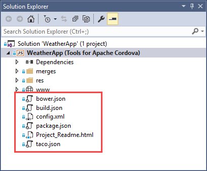

This table gives you the basic idea of how you might use each one.

<table border="1">
<tr>
  <th>
    <p><strong>File</strong></p>
  </th>
  <th>
    <p><strong>Why is it in your project?</strong></p>
  </th>
</tr>
 <tr>
   <td><strong>bower.json</strong></td><td>This file manages the <a href="http://bower.io/">Bower</a> packages dependencies of your app. <br><br>Bower is a package manager. We won&#39;t use it in this guide, but you can learn more about it <a href="/visualstudio/cross-platform/tools-for-cordova/first-steps/using-bower?view=toolsforcordova-2017&preserve-view=true">here</a>.</td>
 </tr>
 <tr>
   <td><strong>build.json</strong></td><td>This file contains parameters that Visual Studio uses to build a signed Android package. <br><br>We won&#39;t create one in this guide, but you can learn more about it <a href="/visualstudio/cross-platform/tools-for-cordova/publishing/publish-to-a-store?view=toolsforcordova-2017&preserve-view=true">here</a>.</td>
 </tr>
 <tr>
   <td><strong>config.xml</strong></td><td>Contains the settings of your app. <br><br>We&#39;ll change these settings later in this guide.</td>
 </tr>
 <tr>
   <td><strong>package.json</strong></td><td>Contains settings used by the node package manager (npm) to install dependencies for the app.</td>
 </tr>
 <tr>
   <td><strong>taco.json</strong></td><td>Defines which version of the <a href="https://cordova.apache.org/docs/en/4.0.0/guide/cli/">Cordova CLI</a> that Visual Studio uses to build the project.</td>
 </tr>
</table>

### The folders of your project

#### www

The project's `www` folder contains the web application content files for the Cordova application, so most of your development will occur inside this folder.  Here you'll find the web application content that is packaged into a native mobile application by the Cordova SDK. The HTML, JavaScript, and CSS files in this folder will render in the Cordova app the same way they will in a mobile browser, so be sure to optimize the content for the smaller and more limited smartphones and tablets.

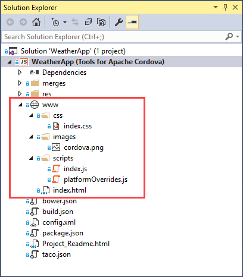

The folder's `index.html` file is the main entry point for the web application, it's loaded by default when the Cordova application launches. The folder contains several subfolders that follow a typical web application folder structure:

+ `css` - Stores the web application's Cascading Style Sheet (CSS) files. The `index.css` shown in the folder is the standard .css file included with the default Cordova application template.
+ `images` - Stores any image files used by the web application. The `cordova.png` file shown in the folder is the Cordova logo that displays in the center of the application screen in the default Cordova application template.
+ `scripts` - Stores JavaScript files used by the web application. The project's `index.js` file contains the bootstrap code that initializes the Cordova application; it registers callback functions for the Cordova `deviceReady` event. The `platformOverrides.js` file works in conjunction with similar files located in the `merges` folder to enable developers to deliver different code per target platform. See [merges Folder](#merges) for additional information.

Cordova developers do most of their work in these folders, creating and updating web application content designed for mobile devices. The application content contained herein is packaged into a native mobile application by Visual Studio for deployment to mobile devices using the Cordova and device platform SDKs.

#### merges

Apache Cordova uses the `merges` folder to provide developers with the ability to deliver different content based on the target mobile platform. As you can see from the figure, there's a subfolder for each target mobile platform (Android, iOS and Windows). Any content in these folders will be copied to the native application project during the Cordova pre-build process (prepare), adding to or replacing content in the web application folder as needed.


For example, any content in the `merges\android` folder is copied to the Android project's web application folder after the base web application is copied. Content in the `merges\ios` folder is copied into the iOS project's web application folder. Finally, content in the `merges\windows` folder is copied to the Windows project's web application folder after the base web application is copied.

To help deliver a consistent web application experience in Cordova apps, the default project created by Visual Studio Tools for Apache Cordova includes `platformOverrides.js` files for Android (in `merges\android\scripts\platformOverrides.js`) and Windows (in `merges\windows\scripts\platformOverrides.js`) along with a platform-specific JavaScript library. On Android, it adds a polyfill for `bind()` on older Android devices, and on Windows it adds Microsoft's safeHTML polyfill library. The `merges\ios` folder doesn't include a `platformOverrides.js` file, so there's no platform-specific override, iOS applications get the generic version of the file located in `www\scripts\platformOverriders.js`.


For additional information on how merges works, see [Using merges to Customize Each Platform](https://cordova.apache.org/docs/en/latest/guide/cli/#using-merges-to-customize-each-platform) in the Cordova documentation.

Use this same approach to merge CSS files, images and any other files in your application.

#### res

Apache Cordova uses the contents of the `res` folder to store non-web application resources used by a native mobile application such as [application icons](https://cordova.apache.org/docs/en/latest/config_ref/images.html), [splash screen](https://cordova.apache.org/docs/en/latest/reference/cordova-plugin-splashscreen/index.html) images, signing certificates, etc.

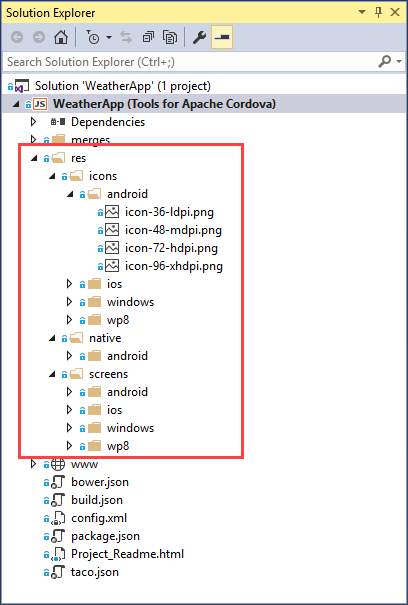

## <a id="run"></a>Run your app

1. On the Standard toolbar, choose the **Ripple – Nexus (Galaxy)** button.

    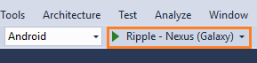

    Visual Studio will build the application, then open a browser window running the application in the Apache Ripple simulator. New projects use the default Cordova template, so, since we've not added any code to the application, it will simply display the Cordova logo and a notification that the device is ready.

    > **NOTE:** There will already be some errors on the JavaScript console, such as failure to load favicon.ico, ripple.js and ajax-loader.gif. But these are not necessary to continue developing in Ripple.

    

    [Apache Ripple](../build-deploy/run-app-ripple-simulator.md) is a free mobile simulator. If you haven’t used it before, try a few things while you have it open. For example, change the device orientation or the platform and see how your app appears. Apache Ripple is probably the easiest way to see the effect of your changes as you develop.

    

2. Stop the app; use the square Stop button in the Standard Toolbar.

    

    You can also run your app in Android, iOS, and Windows device emulators. An emulator gives you a bit more of a realistic device experience.

    To see them all, choose any platform from the platform list on the Standard toolbar.

    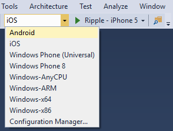

    Then, choose an emulator.

    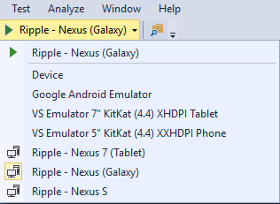

    Run your app in any of these emulators if you want, but don't use any of the iOS emulators yet because you'll need a Macintosh system to use them, and setting up the connection between Visual Studio and the Mac is beyond the scope of this guide.

    If you want to run your app on iOS, you can use the Ripple simulators. After you complete this guide, see [This article](ios-guide.md) for guidance on how to run your app in an iOS emulator or device.

## <a id="settings"></a>Find app settings

To give your app a name, increment the version number, and control other aspects of your app's behavior, modify the global configuration file, `config.xml`.

You can modify it by using a designer, so you don't need to edit the XML directly unless you want to.

To open the designer, double click the `config.xml` file in your project.


## <a id="build-something"></a>Start Small: Build a basic app

Apps can be as complicated or as simple as you want them to be. The goal of this section is to build a very basic single page app that shows the weather conditions of any area in the United States.

### Add packages

The application uses the [**jQuery**](https://jquery.com/) and [**jQuery Mobile**](https://jquerymobile.com/) libraries to help craft the app's UI and simplify the code. jQuery is a JavaScript library that makes certain tasks easier such as changing the properties of a control or handling its events. jQuery Mobile is a touch-optimized HTML5 UI framework, built on jQuery, designed to make responsive web sites and apps that are accessible on all smartphone, tablet and desktop devices. Together, they give us a quick way to style the application without having to do custom CSS work.

Let's add the JQuery and JQuery Mobile NuGet packages to the project.

> **Note:** Before starting the following steps, point your browser of choice to [the jQuery Mobile download site](http://jquerymobile.com/download/) to note which version of the jQuery library is compatible with the current shipping release of jQuery Mobile. At the time of this writing, jQuery Mobile version 1.4.5 is compatible with jQuery version 1.8 through 1.11, and version 2.1. In the steps that follow, be sure you install compatible versions of both frameworks. The NuGet Package Manager should deploy compatible versions of dependent libraries, but it's best to make sure first.

1. Choose **Tools** -> **NuGet Package Manager** -> **Manage NuGet Packages for Solution**, and add the **jQuery** NuGet package to your solution.

    

    >**Note**: Because versions constantly change, the next few images will use `x.x.x` in place of version numbers.

2. Add the **jQuery.Mobile** NuGet package to your solution.

    

     NuGet adds files to the **Scripts** folder of your project, but that's not really where we need them so we'll have to fix that.

3. Drag the newly installed script files from the project's `Scripts` folder to the `www\scripts` folder.

    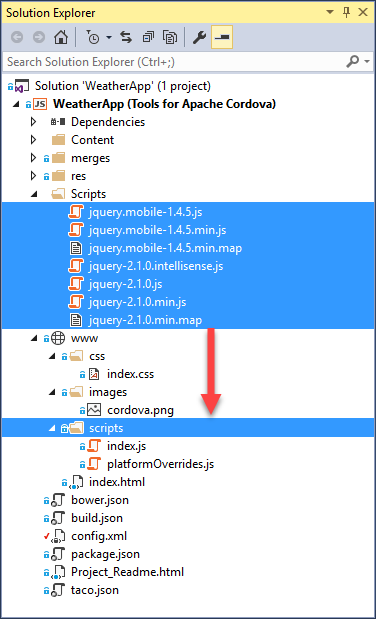

    Now they're in the correct location. But we still have a little work to do here. Nuget also adds CSS files to the `Content` folder so we'll have to fix that too.

4. Drag all of the `.css` files and the `images` folder from the project's `Content` folder to `www\css` folder.

    

3. Add this script reference to the `<body>` tag of your [index.html](#tour-project) file (at the bottom of the body section, where the other JavaScript references are located):

    ```html
    <script src="scripts/jquery-x.x.x.min.js"></script>
    <script src="scripts/jquery.mobile-x.x.x.min.js"></script>
    ```

    Replace the `x.x.x` in these filenames with the versions that you've downloaded. For example, if you downloaded jQuery version `2.2.3`, and jQuery mobile version `1.4.5`, your references would look like this:

    ```html
    <script src="scripts/jquery-2.1.0.min.js"></script>
    <script src="scripts/jquery.mobile-1.4.5.min.js"></script>
    ```

4.  Add this style reference to the `<head>` tag of your [`index.html`](#tour-project) file, above the existing `index.css` reference:

    ```html
    <link rel="stylesheet" href="css/jquery.mobile-x.x.x.min.css" />
    ```

    As you did in the previous example, replace `x.x.x.` with the version of JQuery mobile that you downloaded. If you downloaded jQuery mobile version `1.4.5`, your reference would look like this:

    ```html
    <link rel="stylesheet" href="css/jquery.mobile-1.4.5.min.css" />
    ```

### Design a page

The project's `index.html` is the first page that appears when users run your app. So we'll add our HTML to that file. Of course, this is the default setting and you can change that at any time in the [configuration designer](#settings).

1. Open the `www\css\index.css` file and replace its content with the following css rules:

    ```css
    .not-displayed {
        display: none;
    }

    form {
        border-bottom: 1px solid #ddd;
        padding-bottom: 5px;
    }

    #zip-code-input {
        font-size: 25px;
    }

    #get-weather-btn {
        font-size: 22px;
    }

    #title {
        font-size: 16px;
    }

    #summary {
        font-size: 35px;
    }

    #summary img {
        float: right;
    }

    #error-msg {
        text-align: center;
        margin-top:  50%;
        font-weight: bold;
    }
    ```
1. Open the `www\index.html` file and remove this HTML. It's just a part of the default template that you run out of the box. We won't need it.

    ```html
    <div class="app">
      <h1>Apache Cordova</h1>
      <div id="deviceready" class="blink">
         <p class="event listening">Connecting to Device</p>
         <p class="event received">Device is Ready</p>
      </div>
    </div>
    ```

2. Add this HTML to the `<body>` of the page to give users a way to search for the weather and see the results.

    ```html
    <div data-role="page" id="weather-page">

        <div data-role="header" class="header">
            <h1 id="app-title">Weather App</h1>
            <a href="/" class="ui-btn ui-btn-left ui-btn-corner-all ui-icon-home ui-btn-icon-notext" rel="external">Home</a>
        </div>

        <div role="main" class="ui-content">
            <form>
                <label for="zip-code">Type your zip code:</label>
                <input id="zip-code-input" name="zip-code" placeholder="eg. 98001" required />
                <button id="get-weather-btn" data-role="button" data-icon="search">Find Weather</button>
            </form>

            <ul id="weather-data" data-role="listview" data-inset="true" class="ui-listview ui-listview-inset ui-corner-all ui-shadow not-displayed">
                <li data-role="list-divider" id="title" class="ui-li-divider ui-bar-a"></li>
                <li><span id="summary"><span id="temperature"></span> F </span></li>
                <li>Wind: <span id="wind"></span> knots</li>
                <li>Humidity: <span id="humidity"></span> %</li>
                <li>Visibility: <span id="visibility"></span></li>
                <li>Sunrise: <span id="sunrise"></span></li>
                <li>Sunset: <span id="sunset"></span></li>
            </ul>

            <div id="error-msg" class="not-displayed">
            </div>

        </div>

        <footer data-role="footer" data-position="fixed">
            <h4>Visual Studio Tools for Cordova Demo</h4>
        </footer>

    </div>
    ```

### Handle a button event

1. Open the project's `www\scripts\index.js` file and replace the code in the `onDeviceReady` function with the following code:

    ```javascript

      $('#get-weather-btn').click(getWeatherWithZipCode);

    ```

    This code refers to the ID of the 'Get Weather' button on the HTML page and handles the `click` event by passing in the name of a function (getWeatherWithZipCode).  You'll add that function shortly.

#### A quick look at index.js

This is a good time to quickly look at the `index.js` file. This file loads when the user runs the app.  Why? Because the `index.html` page contains this reference to it:

```javascript
<script src="scripts/index.js"></script>
```

You'll notice a few things about the `index.js` file. First, all the code in that file is enclosed within an *anonymous self-invoking function* (or _Immediately Invoked Function Expression_, or _[IIFE](https://developer.mozilla.org/docs/Glossary/IIFE)_). This is a fancy way of saying that this function executes automatically when the file loads.

```javascript
(function () {
    "use strict";
    // all the stuff is in this function.
})();
```

Enclosed in this function, you'll see an event handler that runs when the Cordova device APIs are fully loaded.

```javascript
function onDeviceReady() {

    // TODO: Cordova has been loaded. Perform any initialization that requires Cordova here.
};
```

So what exactly do we mean by *Cordova device APIs*? These are APIs that you'd use to interact with device capabilities such as the camera or accelerometer. If you want to run any code like this when the app first starts, make sure you add that code or call those functions from inside of this event handler. In fact, later on, we'll do just that.

### Get a free API Key

We'll use the [OpenWeatherMap](http://openweathermap.org/) API to get weather data. To use the free version of this service, get a key [here](https://home.openweathermap.org/).

### Add code to get the weather

Now we'll add the `getWeather` function that we're using to handle button's `click` event. But first, let's add a JavaScript file for that function.

1. In **Solution Explorer**, locate the `www\scripts` folder.

    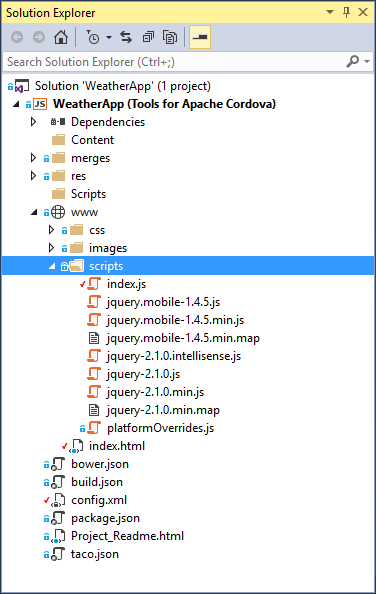

2. Right-click the `scripts` folder, and then choose **Add** -> **New JavaScript file**.

3. Name the file `weather.js`, and then choose the **Add** button.

    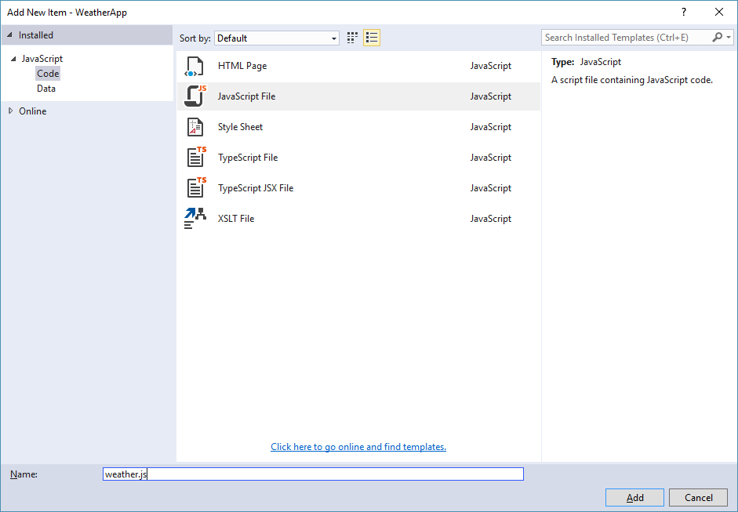

4. Open the `www\scripts\weather.js` file and add the following function. Replace `Your_Key_Here` with the key that you got from [OpenWeatherMap](https://home.openweathermap.org/).

     ```javascript

    var OpenWeatherAppKey = "Your_Key_Here";

    function getWeatherWithZipCode() {

      var zipcode = $('#zip-code-input').val();

      var queryString =
          'http://api.openweathermap.org/data/2.5/weather?zip='
          + zipcode + ',us&appid=' + OpenWeatherAppKey + '&units=imperial';

      $.getJSON(queryString, function (results) {

          showWeatherData(results);

          }).fail(function (jqXHR) {
              $('#error-msg').show();
              $('#error-msg').text("Error retrieving data. " + jqXHR.statusText);
          });

          return false;
    }

    function showWeatherData(results) {

      if (results.weather.length) {

          $('#error-msg').hide();
          $('#weather-data').show();

          $('#title').text(results.name);
          $('#temperature').text(results.main.temp);
          $('#wind').text(results.wind.speed);
          $('#humidity').text(results.main.humidity);
          $('#visibility').text(results.weather[0].main);

          var sunriseDate = new Date(results.sys.sunrise * 1000);
          $('#sunrise').text(sunriseDate.toLocaleTimeString());

          var sunsetDate = new Date(results.sys.sunset * 1000);
          $('#sunset').text(sunsetDate.toLocaleTimeString());

      } else {
          $('#weather-data').hide();
          $('#error-msg').show();
          $('#error-msg').text("Error retrieving data. ");
      }
    }

    ```

    This function gets a zip code from the input box, and uses a free service to get the weather for that zip code. The rest of this code uses JQuery syntax to populate controls on the page with data from the service.

    Now we're still missing a step. We have to refer to this new JavaScript file in our HTML page so let's do that now.

5. Open the `www\index.html` file, and add this reference to the `<body>` of the page (at the bottom of the body section, where the other JavaScript references are located).

    ```html
    <script src="scripts/weather.js"></script>
    ```

    When you're done, your script reference should look something like the following.

    ```html
    <script src="scripts/jquery-2.2.0.min.js"></script>
    <script src="scripts/jquery.mobile-1.4.5.min.js"></script>
    <script src="cordova.js"></script>
    <script src="scripts/platformOverrides.js"></script>
    <script src="scripts/index.js"></script>
    <script src="scripts/weather.js"></script>
    ```

6. Add `http://api.openweathermap.org` to the page's Content Security Policy (CSP). The CSP is just a line of HTML that is located inside of the `<head>`. Use it to declare approved origins of content that browsers should be allowed to load on your website. It looks like this:

    ```html
    <meta http-equiv="Content-Security-Policy" content="default-src 'self' data: gap:
    https://ssl.gstatic.com 'unsafe-eval'; style-src 'self' 'unsafe-inline'; media-src *">
    ```

    Add `http://api.openweathermap.org` just after `https://ssl.gstatic.com` in that line to give this page permission to get content from the weather service and map service. When you're done, your CSP will look like this:

    ```html
    <meta http-equiv="Content-Security-Policy" content="default-src 'self' data: gap:
    http://api.openweathermap.org https://ssl.gstatic.com 'unsafe-eval'; style-src 'self'
    'unsafe-inline'; media-src *">
    ```

    > **Note:** The Content Security Policy (CSP) is a computer security standard introduced to prevent cross-site scripting (XSS), clickjacking and other code injection attacks resulting from execution of malicious content in the trusted web page context. You can read more about it [here](http://content-security-policy.com/).

## Run your app in an Emulator

Let's run the app, but this time let's use an emulator.

1. In the list of Android emulators, choose the one of the **VS Emulator 5** to run your app.

    

   > **Note:** According to your PC configuration some warnings or errors might appear, like firewall alerts or a message that indicating that the emulator must run in elevated mode. If you receive the following error, stop the Android Debug Bridge process (adb.exe):
   >
   > 

2. In the Android emulator, type a valid United States zip code into the edit box (for example: 33101), and then press the **Get Weather** button.

    Weather data for that region appears in the controls.

    

    What's great here is that this app is completely cross platform. If you have a little extra time, run this app in a Windows Phone emulator.

    > **Note:** You should test your app on as many physical devices (running on as many Operating System versions) as you can. Emulators and Simulators can behave different than a real device on certain circumstances and respond at different speeds. For example, an app may work in the simulator without a problem, but it may fail on a real device, or it can run faster on the device compared with an emulator. More information [here](https://cordova.apache.org/docs/en/4.0.0/guide/next/#testing-on-a-simulator-vs.-on-a-real-device).

## <a id="find-fix"></a>Find and fix problems

A big benefit of Visual Studio is its powerful debugger. If you're already familiar with it, you can skip this section. If you're not, let's take a quick tour of some things that you can do.

### Set breakpoints and conditional breakpoints

You can set a breakpoint on any line of executable code (including the JavaScript code). Look at the state of the Apache Cordova application, monitor variable values, and review call stacks.

 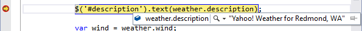

### Use the JavaScript Console

This console appears when your Cordova app starts. If it doesn't, it's easy enough to open. Just choose **Debug** -> **Windows** -> **JavaScript Console**.

You can use the `console.log` method to log messages and then view those messages in the console. You can also use the console to execute any JavaScript function while the application is running. [Learn more about the JavaScript Console](https://developers.google.com/web/tools/javascript/console/).

### Use the Document Object Model (DOM) Explorer

Use the DOM Explorer to find and fix layout issues in your pages. Examine the structure of your pages as they render and then tweak them while the app is running.

To open the DOM Explorer, choose **Debug** -> **Windows** -> **DOM Explorer** while the app is running. [Learn more about the DOM Explorer](https://msdn.microsoft.com/library/dn255008.aspx).

 

## <a id="capability"></a>Access a device capability

Most likely you'll want your app to do more than just show web pages on a mobile device. You might want your app to store files, receive push notifications, or capture images by using the device's camera. This is where a **plugin** becomes handy. Apache Cordova uses plugins to provide access to native device capabilities that aren’t available to simple web apps.

You can find some of the more commonly used plugins in the **Core** page of the app's [configuration designer](#settings).

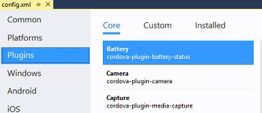

Use the **Custom** page to add plugins that are not one of the [core plugins](../access-device-capabilities/use-cordova-plugins.md). These could be standard Cordova plugins available on npm (Cordova 5.x or greater), or plugins that you or a colleague create for some specific purpose and then save to your local drive or to a GitHub repository.  [This document](../access-device-capabilities/manage-plugins.md) explains how to add a custom plugin.

If you need to use a specific version of a plugin, you can add a plugin by editing the `config.xml` file directly. You can find guidance about how to do that  [here](../access-device-capabilities/manage-plugins.md).

Let's add a plugin that gives us access to the device's geolocation system. That way, we can get the weather of a user's current location.

1. In solution Explorer, double-click on the `config.xml` file to open the [configuration designer](#settings), and then choose the **Plugins** tab.

2. Choose the **Geolocation** plugin, and then choose the **Add** button.

    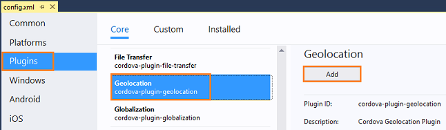

    This adds the plugin to your project but you still have to know how to consume it in your app. To do that, open the `README.md` file. You'll find it in the `plugins\plugin-cordova-geolocation` folder as shown in the following image.

    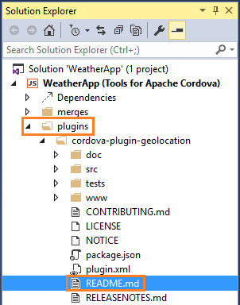

    Let's add some code that consumes this plugin.

3. In the `www\scripts\weather.js` file add the following code right after the `showWeatherData` function

     ```javascript
     function getWeatherWithGeoLocation() {
       navigator.geolocation.getCurrentPosition(onGetLocationSuccess, onGetLocationError, { enableHighAccuracy: true });
      $('#error-msg').show();
      $('#error-msg').text('Determining your current location ...');
      $('#get-weather-btn').prop('disabled', true);
    }

    function onGetLocationSuccess(position) {
      var latitude = position.coords.latitude;
      var longitude = position.coords.longitude;

      var queryString = 'http://api.openweathermap.org/data/2.5/weather?lat='
        + latitude + '&lon=' + longitude + '&appid=' + OpenWeatherAppKey + '&units=imperial';
      $('#get-weather-btn').prop('disabled', false);
      $.getJSON(queryString, function (results) {
        showWeatherData(results);
      }).fail(function (jqXHR) {
         $('#error-msg').show();
         $('#error-msg').text("Error retrieving data. " + jqXHR.statusText);
      });
    }

    function onGetLocationError(error) {
      $('#error-msg').text('Error getting location');
      $('#get-weather-btn').prop('disabled', false);
    }

    ```

    This code uses the device's geolocation capability to get the latitude and longitude of the device's location. It then gets the weather for that location.

4. Open the project's `www\scripts\index.js` file, and add the following code to the `onDeviceReady` function.

   ```javascript

     getWeatherWithGeoLocation();
   ```
   When you're done, the ``onDeviceReady`` function should look like this:

   ```javascript

    function onDeviceReady() {
      $('#get-weather-btn').click(getWeatherWithZipCode);
      getWeatherWithGeoLocation();
   };
    ```

5. Run the app. When the app starts, the label *Determining your current location ...* appears. After a brief period of time, the weather data for your location appears in the app.

   > **Note**: If you use the Apache Ripple emulator, you’ll have to configure it with your location.
   >
   > 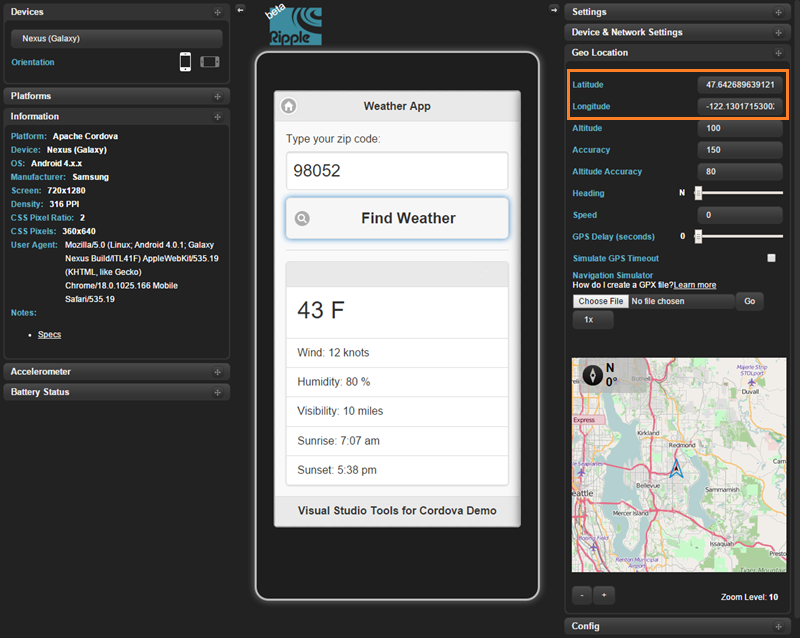

## <a id="tailor"></a>Tailor the app to a platform

The code that you used to get the device's location works pretty well across all platforms, but what if it didn't? What if you had to write extra code to get the location of an iOS device?

This is where the `merges` folder becomes useful. We touched on that folder earlier in this article. Now let's try a few basic things.

### Tailor the behavior of your app

1. In **Solution Explorer**, expand the project's `www` folder, and then the `scripts` folder.

2. Right-click the `weather.js` file, and choose **Copy**.

3. In **Solution Explorer**, expand the `merges\android` folder.

4. Right-click the `merges\android\scripts` folder, and then choose **paste**.

    You now have a copy of the `weather.js` file in the `merges\android` folder.

    

5. In the `merges\android\scripts\weather.js` file, add the following code to the `getWeatherWithGeoLocation` method.

    ```javascript
    $('#app-title').text("Android Weather");
    ```

6. Run your app in the Apache Ripple Simulator.

    The app now has the title **Android Weather** because `merges\android\scripts\weather.js` file replaces `www\scripts\weather.js` file for the Android version of your app.

    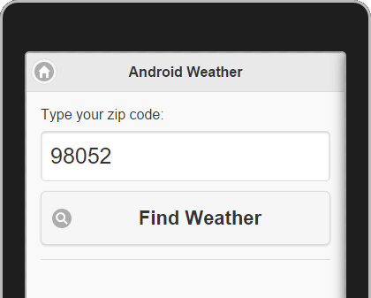

    Making a copy of a file this large to change one line of code is an extreme example, but you can begin to imagine the possibilities, and you can always refactor your code in ways that leverage the `merges` folder more efficiently.

    The readme file of each plugin will tell you what sort of device-specific code you'll have to write.

### Tailor the appearance of your app

In some cases, you'll have to tweak the layout of your pages so that they appear correctly for one type of device or another.

1. In **Solution Explorer** return to the `merges\android` folder .

2. Right-click the `android` folder, choose **Add** -> **New Folder**, and name the folder `css`.

3. Right-click on the new `css` folder, and then choose **Add** -> **New CSS file**.

4. Name the file `index.css`, and then choose the **Add** button.

    You now have a file named `index.css` in both the `\merges\android\css` folder and the `www\css` folders.

    

5. Replace the contents of the new `\merges\android\css\index.css` file with the following code.

    ```css
    .not-displayed {
        display: none;
    }

    form {
        border-bottom: 1px solid #ddd;
        padding-bottom: 5px;
    }

    #zip-code-input {
        font-size: 25px;
    }

    #get-weather-btn {
        font-size: 22px;
    }

    #title {
        font-size: 16px;
    }

    #summary {
        font-size: 35px;
    }

    #summary img {
        float: right;
    }

    #error-msg {
        text-align: center;
        margin-top:  50%;
        font-weight: bold;
    }

    .ui-bar-inherit.ui-header.header {
        background-color: #3388cc;
        border-color: #3388cc;
        color: #ffffff;
        text-shadow: 0 1px 0 #005599;
    }
    ```

    Note that the styles defined in this new CSS file are identical to the `www\css\index.css`, with the exception of these element:

    ````css
    .ui-bar-inherit.ui-header.header {
        background-color: #3388cc;
        border-color: #3388cc;
        color: #ffffff;
        text-shadow: 0 1px 0 #005599;
    }
    ````

    This is a simple example of what you can do by using the `merges` folder. A more effective approach would be to use a separate CSS file for platform-specific styles.

6. Run your app in the Apache Ripple Simulator.

    The app header has a blue background because `merges\android\css\index.css` replaced `www\css\index.css` in the Android version of the app.

    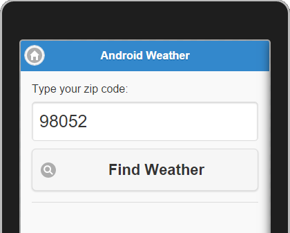


## <a id="next-steps"></a>Next steps

Congratulations on building your first cross-platform mobile app. Although this topic gets you started, there’s so much more to learn.

Here are a few ideas about what you can explore next on your journey to build mobile apps with HTML and JavaScript and Visual Studio.

**Connect to Existing Data**

Want to pull in data from sites like [StackExchange](https://api.stackexchange.com/) or [Github](https://developer.github.com/v3/)? How about your own database?

Just like any browser, your Cordova app supports HTTP requests and Ajax calls. However, Cordova adds additional security to filter which scripts, CSS files, map files and data files can be pulled into your app.

* The [Cordova Whitelist Plugin](https://cordova.apache.org/docs/en/latest/reference/cordova-plugin-whitelist/) (which is automatically added into every project) controls which URLs the WebView itself can be navigated to, can open, or can make network requests from when loading the app.
* A Content Security Policy contained in a tag on index.html <meta http-equiv="Content-Security-Policy" ... /> controls which network requests (images, XHRs, etc) are allowed to be made after your app has loaded, via webview directly.

Additionally, your server--or servers that you pull from--may have additional security that restricts your app from being able to pull resources into your app.

* Cross-origin resource sharing (CORS) policies regulates which resources (e.g. fonts, JavaScript, etc.) from a web page can be requested from another domain outside the domain from which the resource originated. So, often times when your app is pulling data, fonts, images, and scripts from another web service, you need to make it in the form of a CORS request. [See more information](../tips-workarounds/general-tips.md).

**Easy backend set up with Azure**

Get straight to building by hooking your app up to Azure. Azure offers a Mobile App service that utilizes Easy Tables to get your app connected to a SQL database with only a couple lines of javascript. [This helpful guide](https://azure.microsoft.com/documentation/articles/app-service-mobile-cordova-get-started/) takes you through the process of creating a mobile app backend, and ends with the option of creating a quickstart Cordova app, or adding connections to an existing app.

**Explore available Cordova plugins**

search for available Cordova plugins on npm (Cordova 5.x or greater). The naming convention for these plugins is cordova-plugin-pluginname or phonegap-plugin-pluginname.

> **Tip:** If find a plugin that doesn't appear in the **Plugins** tab of configuration designer, you can still use it. [Learn more](../access-device-capabilities/manage-plugins.md).

**Try using Bower to add a package to your project**

see [Add packages by using Bower](using-bower.md).

**Learn about other great ways to leverage the Visual Studio debugger**

see [Debugger Basics](https://msdn.microsoft.com/library/k0k771bt.aspx).

**Explore the many JavaScript frameworks out there**

Search online. They're everywhere! Here's a couple of them: [AngularJS](https://angularjs.org/), and [Ionic](http://ionicframework.com/).

**Get a Mac and then run your app in an iOS emulator, or on an iOS device**

See [Setup guide: Target iOS mobile devices in a Visual Studio Tools for Apache Cordova project](ios-guide.md).

**Tack on an Azure backend - it's free to try**

see [Connect a cloud service](../take-further/add-azure-mobile-app.md).

**Take a look at TypeScript - it's fully supported in your project**

see [Use TypeScript](develop-with-typescript.md).
