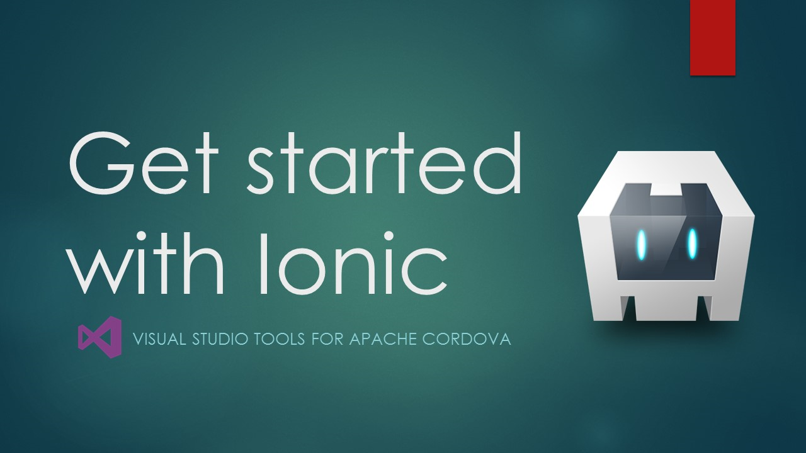
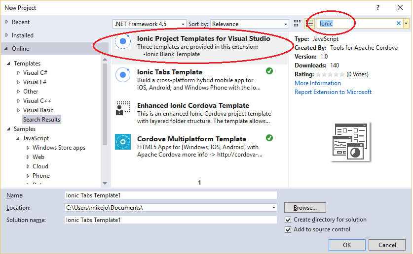
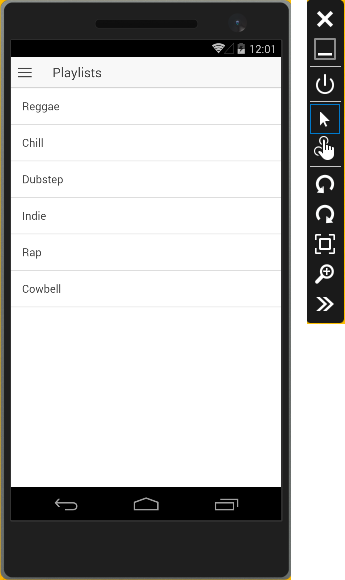

--- 
description: "Ionic is a popular front-end JavaScript framework for developing cross-platform mobile apps using Cordova."
title: "Getting started with Ionic apps | Cordova"
author: "jmatthiesen"
ms.prod: "visual-studio-dev14"
ms.date: "06/15/2016"
ms.author: jomatthi
--- 

# Get started with Ionic apps in Visual Studio <a name="video"></a>
[Ionic](http://www.ionicframework.com) is a popular front-end JavaScript framework for developing cross-platform mobile apps using Cordova. You can use Visual Studio 2015 to easily create and debug cross-platform Ionic apps.

> If you want to use Ionic 2 (still in beta) check out [this blog post](https://blogs.msdn.microsoft.com/rido/2016/05/11/ionic2-and-visual-studio/)

Watch a video showing how to find and run the Ionic templates.

<a href="https://www.youtube.com/watch?v=4fNmTkYGVeU" class="video" title="Get started with Ionic"></a>

## Get the Ionic templates! <a name="getTemplates"></a>

You can install the Ionic starter templates in Visual Studio and use them to start building an app.

1. If you haven't already, [install Visual Studio 2015](https://go.microsoft.com/fwlink/?LinkID=533794).

    When you install Visual Studio, make sure you include the optional components, **HTML/JavaScript (Apache Cordova)** under Cross-Platform Mobile Development.

    > **Note:** Quickly verify that you can load and build the default Blank App template. In Visual Studio, choose **File**, **New**, **Project**, **JavaScript**, **Apache Cordova Apps**, **Blank App** and name the new project "blank", and build it with F5. If you have any issues, see these [troubleshooting steps](../tips-workarounds/general-tips.md).

2. Install the Ionic templates.

     > **Note:** Add it directly to Visual Studio by downloading and double-clicking on the [VS Extension for Ionic](https://visualstudiogallery.msdn.microsoft.com/4e44ba8b-a4c8-4106-b70e-00d63241a54a)

    Or, do it in Visual Studio, by selecting **File**, **New**, then **Project**. In the New Project dialog box, select **Online**. In the search box, type **Ionic**.

    

    Type any name and choose **OK** to install them. When you are asked for permission to install the templates, give your permission.

    >**Note**: You can follow the same steps to install the AzureIonic To-Do List Sample App.

3. Close and re-open Visual Studio. Again, choose **File**, **New**, then **Project**. Now, when you choose **Installed**, then **Templates**, the new starter templates will show up under **JavaScript**, **Apache Cordova Apps**

    

    Choose one of the following starter templates for your new project:

    * Ionic Blank App
    * Ionic SideMenu Template
    * Ionic Tabs Template

4. Choose **OK**.

    Visual Studio creates the Ionic project.

5. Add [IntelliSense for Ionic](https://visualstudiogallery.msdn.microsoft.com/d6279fba-bcff-4857-906d-29faa8a99448/) to your project.

## Get your app running on Android <a name="configAndroid"></a>

1. Add the Android platform by **Android** as a debug target (Solution Platforms list), and then choosing **Build**, then **Build Solution**.

2. Choose **Android** as a debug target (Solution Platforms list), and to get the app running choose a target such as the **VS Emulator 5" KitKat (4.4)** (Hyper-V required) or the Google Android Emulator (slow to load initially).

    

    You can configure a Google Android emulator in [AVD Manager](../build-deploy/run-app-android-emulator.md).

    You can also run on Ripple simulator instead, but you will need to use the workaround described [later in this article](#keyboard).

3. Press F5, and the app should load correctly.

    

### Troubleshooting: Let's fix it

[Keyboard or StatusBar plugin not found?](#keyboard)

[Visual Studio Emulator for Android won't run?](#vsAndroidEmu)

[Error saying that a Content Security Policy is missing?](#csp)

[Other issues?](#other)

## Get your app running on iOS <a name="configiOS"></a>

  You can run initially on the Ripple Emulator after selecting iOS as a debug target, but for detailed info on setting up the remotebuild agent for iOS, see [this topic](ios-guide.md).

  The Ionic starter templates should run correctly on iOS when the remotebuild agent is running on a Mac (or a service like MacInCloud), and when Visual Studio is configured to connect to it. (The complete steps are outside the scope here.)

## Get your app running on Windows <a name="configWin10"></a>

1. If it's not already installed, use the Visual Studio install program to install the **Universal Windows App Development Tools** (it should already be installed).

2. Choose **Build Solution** from the **Build** menu.

3. Open the configuration designer (config.xml) in Visual Studio, choose Windows, and in the **Windows Target Version**, choose  either **Windows 10.0** or **Windows 8.1**, and save changes.

4. Choose **Windows-x64** or **Windows-x86** from the Solution Platforms list.

5. Choose a Windows deployment target, such as **Local Machine** or **Mobile Emulator 10.0.xxxxx.0 WVGA 4 inch 1GB**.

6. Press F5 to run your app.

### Troubleshooting: Let's fix it

[Get a message telling you to install a new app?](#partialpages)

[Certificate error on Windows](#certificate)

[Unhandled exception running on Windows?](#unhandled)

[appxrecipe file missing](#appxrecipe)

[Other issues?](#other)

## Use TypeScript in an Ionic app <a name="useTypeScript"></a>

You can use TypeScript in an Ionic app (even though the starter templates are not currently available in TypeScript). Take the following steps.

1. First, [install the Ionic starter templates](#getTemplates) and create a project using one of them.

    Alternatively, if you are manually importing the project, follow instructions in [Manually import an Ionic project into Visual Studio](#manualImport).

2. Add a folder named source to the root of the project.

3. Add a tsconfig.json file to the root of your project and paste the following content into the file.

    ```
    {
      "compilerOptions": {
        "noImplicitAny": false,
        "noEmitOnError": true,
        "removeComments": false,
        "sourceMap": true,
        "inlineSources": true,
        "out": "www/js/appBundle.js",
        "target": "es5"
      },
      "exclude": [
        "node_modules"
      ],
      "files": [
        "source/app.ts",
        "typings/tsd.d.ts"
      ]
    }
    ```

    Later, you can make modifications to this file as needed. For example, if you want to use TypeScript code in services.js, you can move it from the www/js folder to the source folder, and then include services.ts in the compiler options for the file list (that is, add a "source/services.ts" entry, and so on, under the `files` entry). You can use both TypeScript and JavaScript in the same file if you want to, and the TypeScript compiler will create the correct JavaScript output.

4. In Visual Studio, open the project's package.json file and add a reference for tsd under `dependencies`.

    ```
    "tsd": "^0.6.5"
    ```
    Visual Studio will invoke npm to install tsd node packages to the project.

    If you don't see this happening, first go to the command line and type `npm install tsd -g` to install tsd globally. Then add the tsd reference to package.json.

5. Open a command line and switch to the folder containing your .jsproj file. For example, this might be something like the following.

    ```
    C:\Documents\Ionic_sidemenu\Ionic_sidemenu
    ```

6. In the command line, type this.

    ```
    tsd init
    ```
    This command installs tsd.json, the typings folder, and tsd.d.ts to the project.

7. In the command line, run the following commands to install the correct set of d.ts files for the Ionic app.

    ```
    tsd install cordova --save
    tsd install ionic --save
    tsd install cordova-ionic --save
    ```
    The d.ts files will be added to the typings folder.

8. Open index.html and change the script reference from app.js to appBundle.js.

    This matches the .tsconfig settings that will bundle all your .ts files into a single JavaScript file named appBundle.js.

8. In Visual Studio, move app.js from the www/js folder to the source folder.

9. Rename app.js to app.ts.

    When you build later, the compiler will build app.ts and the output will be `www/js/appBundle.js`. The file will be unchanged by the compiler if you don't add any TypeScript code.

10. When you want to use source control on github, update .gitignore to exclude typings and other VS temporary folders and files.

11. Choose a deployment target like **Android** or **Windows-x86** and see the other sections in this article for possible configuration changes or code changes you might need to make to the app.

    [Get your app running on Android](#configAndroid)

    [Get your app running on iOS](#configiOS)

    [Get your app running on  on Windows 10](#configWin10)

    [Get your app running on Windows 8.1](#configWindows)

12. Press F5 to run the app.

    

## Manually import an Ionic project into Visual Studio <a name="manualImport"></a>

If you have an existing Ionic project or want to run one of the other Ionic sample apps that aren't available in Visual Studio, you can manually import an Ionic project instead of using the Visual Studio Ionic templates.

### Set up your machine for Ionic with VS <a name="getStarted"></a>

1. If you haven't already, [install Visual Studio 2015](https://go.microsoft.com/fwlink/?LinkID=533794).

    When you install Visual Studio, make sure you include the optional components, **HTML/JavaScript (Apache Cordova)** under Cross-Platform Mobile Development.

2. To run a quick test of your setup, verify that you can run the default Blank App template.

    * In Visual Studio, choose **File**, **New**, **Project**, **JavaScript**, **Apache Cordova Apps**, **Blank App** and name the new project "blank".

    * Choose **Windows-x86**, **Local Machine** (requires Windows 8.1 or Windows 10) and press F5 to run the app (make sure the app loads correctly). If any issues occur, see [Other issues?](#other).

3. [Install the Ionic CLI](http://ionicframework.com/docs/cli/install.html).

    ```
    npm install -g ionic
    ```

### Use the Ionic CLI to get the Ionic starter app templates <a name="getTemplates"></a>

1. Make sure you installed the Ionic CLI, then open a command line.
2. Go to the directory where you want to install the Ionic starter app templates, such as the Documents folder.

    ```
    C:\\Users\<username>\Documents>
    ```

3. In the command line, type

    ```
    ionic start ionicMySideMenu sidemenu
    ```

    Ionic creates the project in your current folder.

4. Option: Use this command to install more templates, such as:

    ```
    ionic start ionicMyTabs tabs
    ionic start ionicMyBlank blank
    ```

5. Navigate to the root of your project folder, and type the following command into the command prompt.

    ```
    cordova plugins --save
    ```
    This will help make sure that your config.xml has the correct plugin versions when your import into Visual Studio.

>**Note**: If you are trying to use a Visual Studio 2013 Ionic project in Visual Studio 2015, see this info on [migrating projects](migrate-to-vs2015.md) to Visual Studio 2015, which is strongly recommended.

### Import the project into VS <a name="configTemplates"></a>

For each of the Ionic starter app templates that you installed and want to run, do this:

1. In Visual Studio, choose **File**, **New**, **Project From Existing Code**.
2. In the wizard, choose **Apache Cordova** as the project type that you'd like to create, and then choose **Next**.

    

3. For the **Project file location**, browse to the root folder of the Ionic project and select it.

    

4. Type a name for your new project and select **Finish**.

    Visual Studio adds a few new files to the project. Wait for Bower/NPM updates to the project to finish, if necessary.

### Make a few general code changes

1. If app.js includes the following line of code

    ```
    cordova.plugins.Keyboard.hideKeyboardAccessoryBar(true);
    ```
    replace it with this code:

    ```
    if (cordova.plugins.Keyboard.hideKeyboardAccessoryBar) {
        cordova.plugins.Keyboard.hideKeyboardAccessoryBar(true);
    }
    ```

    `hideKeyboardAccessoryBar` is iOS-only, so this code change will fix that issue.

2. Open www/index.html and add the following `<meta>` element right after the `<head>` block starts.

    ```
    <meta http-equiv="Content-Security-Policy" content="default-src 'self' data: gap: https://ssl.gstatic.com 'unsafe-eval'; style-src 'self' 'unsafe-inline'; media-src *">
    ```

    This will fulfill Apache Cordova 5 [security requirements](../security/whitelists.md).

12. Choose a deployment target like **Android** or **Windows-x86** and see the other sections in this article for possible configuration changes or code changes you might need to make to the app.

    [Get your app running on Android](#configAndroid)

    [Get your app running on iOS](#configiOS)

    [Get your app running on  on Windows 10](#configWin10)

    [Get your app running on Windows 8.1](#configWindows)

### Manually add code to support Windows 8 or 8.1 <a name="configWindows"></a>

If you used one of the Ionic starter templates provided by Visual Studio, you only need to [update config.xml](#configWin10), and then you can skip the steps described in this section.

If you manually imported the Ionic project, you will need to make some changes to the project to support Windows 8.1.

1. Open the folder for the Blank App project created in Visual Studio and copy the merges folder (and its contents) to your Ionic project. Copy the folder under the top level folder (for example, under ionicMySideMenu folder).

    When you complete the next few steps, you will resolve errors loading partial pages by using the winstore-jscompat.js shim.

2. In the Ionic project, create a **scripts** folder under www, and copy platformOverrides.js from the Blank App project's `www/scripts` folder to the new scripts folder.

    

3. In the Ionic project, add the following script reference to index.html, just before the Ionic Framework reference (before the ionic.bundle.js reference):

    ```
    <script src="scripts/platformOverrides.js></script>
    ```

    >**Note**: If you use the js folder instead of scripts, the folder and path will need to be updated in several other files.

4. Select **Windows-x64**, **Windows-x86**, or **Windows Phone (Universal)** as a debug target (Solution Platforms list).

    * For Windows, choose **Local Machine** as the deployment target (if you are running on Windows 8.1).

    * For Windows Phone 8.1, choose one of the Emulator 8.1 options.

5. Press F5 to start debugging.

    >**Note**: If your machine hosting Visual Studio is also running Windows 8.1, you may need to [close DOM Explorer](#wwahost) before navigating pages in the app.

### Troubleshooting: Let's fix it

[TypeScript errors?](#typescript)

[Get a message telling you to install a new app?](#partialpages)

[Certificate error on Windows](#certificate)

[WWAHost runtime error?](#wwahost)

[Unhandled exception running on Windows?](#unhandled)

[Other issues?](#other)

## What's Next?

You can use Visual Studio's build and [debug tools](../build-deploy/debug-using-visual-studio.md), use the configuration manager to easily [add device plugins](../access-device-capabilities/manage-plugins.md) to your app to get up and running quick. To learn more about Ionic, see the Ionic framework docs.


## Troubleshooting: Let's fix it

A few errors are fairly common in the starter templates when debugging in Visual Studio.

### <a id="keyboard"></a> Keyboard or StatusBar plugin not found?

If you're running in Ripple using some of the Ionic starter app templates, you may get an error on Keyboard or StatusBar plugin code running in app.js, such as the following code.

```
if (window.cordova && window.cordova.plugins.Keyboard) {
  ...
}
```

Ripple does not support custom plugins like the Keyboard plugin. We recommend that you run on other devices such as the Visual Studio Emulator for Android or the GenyMotion emulator. However, you can use a workaround to run successfully on Ripple by temporarily removing the Keyboard and StatusBar plugins. To do this, open config.xml from Visual Studio, go to the **Plugins tab**, choose **Installed**, and then remove the two unsupported plugins. You can now run the app on Ripple. When you add them back later, make sure you install the same version that you removed (save the original entries in config.xml).

For more info related to this Ripple issue, see [this post](https://github.com/driftyco/ionic-plugin-keyboard/issues/18).

> **Note**: Some APIs used in the templates for the Keyboard plugin are iOS only, like `hideKeyboardAccessoryBar`.

### <a id="typescript"></a>TypeScript errors?

When using JavaScript in some of the Ionic starter app templates, you may need to remove the TypeScript file, angular-ui-router.d.ts, for the angular-ui-router module, or you may see this error.


> **Note** If you are using TypeScript, see the section on [Using TypeScript](#useTypeScript).

### <a id="wwahost"></a>WWAHost runtime error?

When debugging on a Windows 8.1 dev machine, you may get a WWAHost runtime error when navigating between pages in Ionic apps. You can work around this by:

* Closing DOM Explorer before navigating pages, or

* Upgrading to Windows 10 on your dev machine (the platform issue is fixed in Windows 10).

### <a id="partialpages"></a>Get a message telling you to install a new app?

When you are using the AngularJS routing module (Ionic starter templates often use this module) on Windows, you may need to include a call to `aHrefSanitizationWhitelist`. This will correct errors that occur when loading partial pages.

If you see the dialog box shown here, you have likely run into this issue.


Typically, you include the code fix in app.js or wherever you are calling your module configuration code (inside `angular.module.config`):

```
$compileProvider.aHrefSanitizationWhitelist(/^\s*(https?|ftp|mailto|file|ghttps?|ms-appx|ms-appx-web|x-wmapp0):/);

$compileProvider.imgSrcSanitizationWhitelist(/^\s*(https?|ftp|file|ms-appx|ms-appx-web|x-wmapp0):|data:image\//);
```
If you use the preceding code, then add a reference to $compileProvider in the following line of code.

```
.config(function ($stateProvider, $urlRouterProvider) {
  ```

so that it looks like this:

```
.config(function ($compileProvider, $stateProvider, $urlRouterProvider) {
  ```

### <a id="unhandled"></a>Unhandled exception running on Windows?

If you see the following unhandled exception when targeting Win/WinPhone 8.1, follow the [earlier steps](#configWindows) to call platformOverrides.js to fix this issue.


If you see the same error when targeting Windows 10, make sure you set **Windows 10.0** as the target in the Windows tab of the configuration designer.

### appxrecipe file missing <a id="appxrecipe"></a>

If you see this error when targeting Windows 10, make sure you set **Windows 10.0** as the target in the Windows tab of the configuration designer (config.xml). Then rebuild the project.

### <a id="csp"></a> Error saying that the Content Security Policy is missing?

Visual Studio will use the Cordova Whitelist plugin by default, so you need to update index.html in the Cordova app with the following `<meta>` element:

```html
<meta http-equiv="Content-Security-Policy" content="default-src 'self' data: gap: https://ssl.gstatic.com 'unsafe-eval'; style-src 'self' 'unsafe-inline'; media-src *">
```

### <a id="certificate"></a> Certificate error on Windows?

Make sure your credentials are up to date. Check for any notifications or warning icons in the upper right of Visual Studio.


You may need to re-enter your credentials. If the notifications indicate that you need to update Cordova tooling, please click on the notifications and follow instructions.

### <a id="vsAndroidEmu"></a> Visual Studio Emulator for Android won't run?

The VS Emulator for Android requires Hyper-V and is not supported when running on a VM. For more info, see [this information](https://msdn.microsoft.com/library/mt228282.aspx#NoStart2).

If you have previously run the VS Emulator for Android successfully but now the emulator won't run, try deleting the emulator VM instance in Hyper-V Manager. For more info, see [Troubleshooting](https://msdn.microsoft.com/library/mt228282).

### <a id="other"></a> Other issues?

If you have errors running the Blank App template (rather than just the Ionic starter apps), try these steps.

1. In Visual Studio, go to **Tools**, **Options**, **Tools for Apache Cordova** and run the Dependency Checker.

    If the Dependency Checker finds any issues for a platform that you're targeting, you will need to fix them. If you need to install the Android SDK, use the [Android SDK Manager](/visualstudio/cross-platform/tools-for-cordova/tips-workarounds/configuration-tips?view=toolsforcordova-2017#ThirdParty&preserve-view=true) to install API19 and API22.

2. If you see an error message in the Output window in Visual Studio, use any links provided to try to resolve the issue.

3. If that doesn't resolve issues, follow instructions to [clear the Cordova cache](/visualstudio/cross-platform/tools-for-cordova/tips-workarounds/configuration-tips?view=toolsforcordova-2017#vstac&preserve-view=true). Otherwise or post questions on [StackOverflow](http://stackoverflow.com/questions/tagged/visual-studio-cordova).
