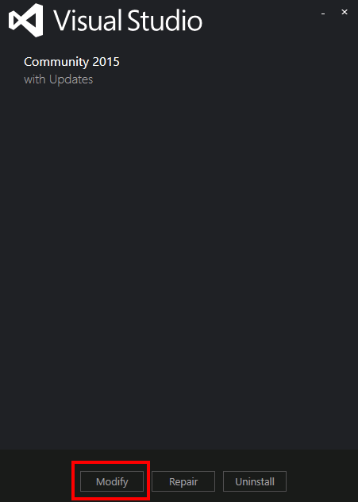

   
# Install Visual Studio Tools for Apache Cordova

Use the Visual Studio Tools for Apache Cordova to build apps that run on iOS, Android, and Windows devices.

To use these tools, choose the Apache Cordova feature when you install Visual Studio. If you've installed Visual Studio already, you can always add the feature later.

You'll need a computer tht runs Windows 8, Windows 8.1, Windows 10, or Windows Server 2012 R2. You can use  Windows 7 if you want, but if you do, you won't be able to target Windows or Windows Phone devices.

## Choose the Apache Cordova feature when you install Visual Studio

1.	In the Visual Studio installer, choose the **Custom** option, and then select the **HTML/JavaScript (Apache Cordova)** feature.

    

    Visual Studio installs all of the third-party components that you need to build your app. To see a list of these components or exclude any of them, see this [section](#choose). For most folks, this isn't necessary.

    After you’ve installed Visual Studio, go straight to our [beginner's guide](get-started-first-mobile-app.md). If have a project already, then [migrate it](migrate-to-vs2015.md).

## Add the Apache Cordova feature after you install Visual Studio
If you've already installed Visual Studio, just modify it to include the tools.

1.	Open **Control Panel** -> **Programs and Features**, choose the **Visual Studio 2015** item, and then choose the **Change** button.

    

2.	In the setup wizard for Visual Studio, choose the **Modify** button.

3. In the list of optional features to install, select the **HTML/JavaScript (Apache Cordova)** checkbox, choose the **Next** button, and then choose the **Update** button.

    

    Visual Studio installs all of the third-party components that you need to build your app. To see a list of these components or exclude any of them, see this [section](#choose). For most folks, this isn't necessary.

    After you’ve installed Visual Studio, go straight to our [beginner's guide](get-started-first-mobile-app.md). If have a project already, then [migrate it](migrate-to-vs2015.md).

## The third-party components that Visual Studio installs for you

Visual Studio installs these third-party components. You'll need them to use Apache Cordova, and to target the Android platform.

<table>

<tbody>
    <tr>
        <th><strong>Component</strong></th>
        <th><strong>Why Visual Studio installs it**</th>
    </tr>
    <tr>
        <td><strong>Apache Ant 1.8.0</strong> (or later)</td>
        <td>To build Android apps.</td>
    </tr>
    <tr>
        <td><strong>32-bit Oracle Java JDK 7</strong></td>
        <td>To build Android apps.</td>
    </tr>
    <tr>
        <td><strong>Android SDK</strong></td>
        <td>To build Android apps and to start the Apache Ripple simulator.</td>
    </tr>
    <tr>
        <td><strong>Joyent Node.js</strong></td>
        <td>To integrate with the Apache Cordova Command Line Interface (CLI) and the Apache Ripple simulator.</td>
    </tr>
    <tr>
        <td><strong>Git CLI</strong></td>
        <td>To enable you to manually add Git URIs for specific Cordova plug-ins.</td>
    </tr>
</tbody>
</table>

You can clear the checkbox of any component that you don't want to install in the **Common Tools and Software Development Kits** group of the Visual Studio installer.

If you prefer to install them manually, see [install the dependencies manually](../tips-workarounds/configuration-tips.md).

## Update Visual Studio Tools for Apache Cordova

1. In Visual Studio, choose **Tools**->**Extensions and Updates**.
2. In the **Updates** tab of the **Extensions and Updates** dialog box, choose **Product Updates**.

   If an update for Visual Studio Tools for Apache appears, select it, and then choose the **Update** button.

   

### Install tools for iOS 

See [Setup guide: Target iOS mobile devices in a Visual Studio Tools for Apache Cordova project](ios-guide.md).

### Did something go wrong with your installation? <a name="AdditionalTasks">

Perhaps you're running Visual Studio behind a proxy or you have multiple versions of a third-party components installed on your computer, and you need to take a closer look at the environment variables to see what path is being used for these components.