# Setup guide: Target iOS mobile devices in a Visual Studio Tools for Apache Cordova project

If you want to build an iOS version of your app, you'll need a Mac to do it. Currently, there is no way to build an iOS app without one. You can use a physical Mac or a cloud-hosted one. Just make sure that it's running Mac OS X Mavericks or later.

In this guide, we'll help you get everything setup right so that you can build, run, and debug your app. We'll stop a few times to check and see if everything is working as expected. If something isn't behaving, we'll propose a few ideas that have worked for others.

Let's help you set things up.

## <a id="install"></a> First, install a few things onto your Mac

1. Install version ```0.12.9``` of [Node.js](http://nodejs.org/).

    This version of node.js is compatible with all versions of Cordova. If you have trouble finding it on the [Node.js](http://nodejs.org/) website, see [Install the most compatible version of Node.js (0.12.x)](../change-cordova-version/change-node-version.md).

    That said, you can use Node.js version ```4x``` or ```5x``` as long as your project uses Cordova CLI version ```5.4.1``` or later.

2. Install [Xcode](https://developer.apple.com/xcode/download/).

3. In the **Launchpad**, open **Xcode**.

    

4. Accept the license agreement and then close Xcode.

    This seems like a strange step, but our tools depend on Xcode and it won't run until you accept this license.

4. Open a Terminal app, and type this command.

    ```Terminal
    xcode-select -–install
    ```

    This installs the Xcode command-line tools.

4. In the Terminal app, type this command.

    ```Terminal
    sudo npm install -g remotebuild
    ```

    This installs the *remote agent*. It's a secure build server that you run on your Mac. You'll connect to it from your Windows computer so that you can build, run, and debug iOS apps in Visual Studio.

## <a id="remoteAgent"></a>Start the remote agent on your Mac

You can start the remote agent in secure mode or without secure mode.

### Option 1: Start the remote agent (secure mode)

This is the safest mode. Visual Studio uses SSL certificates to securely transfer build payloads to the remote agent.

Your build payload is encrypted and that protects your intellectual property from being intercepted. When you start the agent in secure mode, you'll get a security PIN. You can't connect to the remote agent without it. That prevents outsiders from using the open port of your remote agent to run malicious code.

To start the remote agent in secure mode, type this command.

```Terminal
remotebuild
```

The agent installs [Homebrew](http://brew.sh/), and then starts. The host name, port number, and security pin appear in the Terminal app.

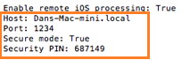

You'll use those pieces of information in the next section. In fact, you'll want to do that part fairly soon because the security pin is active for only 10 minutes.

### Option 2: Start the remote agent (without secure mode)

This is the easiest yet riskiest way to start the remote agent. Visual Studio uses simple HTTP connections to transfer build payloads.

Often times when folks have trouble connecting to their remote agent, they'll start it without secure mode and the connection issue disappears.

Start the remote agent without secure mode only if you are comfortable with the trade-offs between risk and convenience.

For example, if your Mac is publicly accessible over the internet and has access to sensitive materials, you'll probably want to run your remote agent in secure mode. If you don't, anyone could build an app against your remote agent, and that app could run malicious code. That said, if your Mac is accessible to only you, it's easier and less error prone to run your remote agent without secure mode.

To start the remote agent **without** secure mode, type this command

```Terminal
remotebuild --secure false
```

The agent installs [Homebrew](http://brew.sh/), and then starts. The host name, and port number appear in the Terminal app.

You'll use those pieces of information in the next section.

## <a id="getInfo"></a>Connect Visual Studio to the remote agent

1. On your Windows computer, open Visual Studio.

2. On the Visual Studio menu bar, choose **Tools**->**Options**.

4. In the **Options** dialog box, open **Tools for Apache Cordova**, and then choose **iOS Configuration**.

    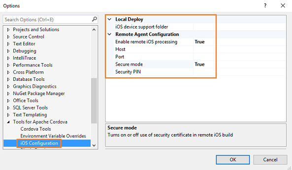

5. Add the host name and port number to the appropriate fields in this dialog box.

6. If you're using secure mode, set the **Secure mode** field to **True**, and then add the security pin.

    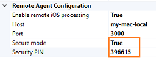

    If you're not using secure mode, set the **Secure mode** field to **False**, and then leave the **Security PIN** field blank.

    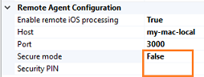

5. Choose the **OK** button to close this dialog box.

    Visual Studio connects to the remote agent. If you don't receive any errors, you've successfully connected.

### Troubleshooting: Let's fix it

[Did you receive an error that relates to your certificate?](#certificate)

[Is the host name of your Mac not resolving?](#hostname)

[Have you been told that your security PIN is invalid or has expired?](#securitypin)

[Are you experiencing a symptom that does not appear in this list?](#stack)

## Run your app in an iOS simulator

1. On the Standard toolbar, choose the **iOS** platform.

    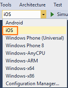

2. Choose **iPhone 5** simulator.

    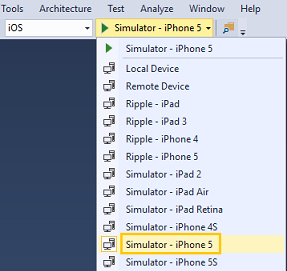

3. Press the F5 key to start the app.

    As your app builds, messages appear in the Terminal app. This means that Visual Studio has connected to the remote agent and is using that agent to build and deploy your app to the Mac.

    When the build is complete, your app will appear in the iPhone 5 simulator on your Mac.

### Troubleshooting: Let's fix it

[Did you receive an error that tells you that a tool requires Xcode?](#install-xcode)

[Did you receive an error that relates to your certificate?](#certificate)

[Is the host name of your Mac not resolving?](#hostname)

[Have you been told that your security PIN invalid or has expired?](#securitypin)

[Did you receive an error indicating that the port is already in use?](#PORT)

[Did you receive an error that like this one: - Command failed with exit code ENOENT?](#ENOENT)

[Did you receive any other type of build error](#cli)

[Are you experiencing a symptom that does not appear in this list?](#stack)

## Create a provisioning profile

You'll need a *provisioning profile* to run your app on a device. Create one by using an Apple Developer account. You can also create one with your free Apple ID but there are limitations. See [Supported Capabilities](https://developer.apple.com/library/prerelease/ios/documentation/IDEs/Conceptual/AppDistributionGuide/SupportedCapabilities/SupportedCapabilities.html#//apple_ref/doc/uid/TP40012582-CH38-SW1).

If your team already has a provisioning profile, see [Option 3: Use your team's provisioning profile](#team-profile).

### <a id="use-developer-account"></a>Option 1: Use an Apple Developer account

This type of provisioning profile gives you the most flexibility. For this option, we'll do these things:

* Enroll in the Apple Developer program

* Request a certificate

* Create an App ID

* Register your device

* Create a provisioning profile

* Download the provisioning profile in Xcode

* Install the provisioning profile onto your device

  Let's go through each step in this process.

**Enroll in the Apple Developer program**

See [Apple Developer Program](https://developer.apple.com/programs/enroll/).

**Request a certificate**

1. Connect your device to your Mac. Make sure that  your device is turned on.

2. Start Xcode.

3. In Xcode, add your Apple ID.

    See [Adding an Apple ID to Your Accounts](https://developer.apple.com/library/ios/recipes/xcode_help-accounts_preferences/articles/add_appleid.html).

4. In the menu bar, choose **Xcode**->**Preferences**.

5. In the **Accounts** page, choose the **View Details** button.

5. In the account details page, choose the **Create** button next to the **iOS Development** signing identity.

    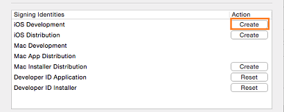

6. Choose the **Done** button to close the account details page.

Need more detail? See [Creating Signing Identities](https://developer.apple.com/library/ios/documentation/IDEs/Conceptual/AppDistributionGuide/MaintainingCertificates/MaintainingCertificates.html#//apple_ref/doc/uid/TP40012582-CH31-SW6).

**Create an App ID**

We'll use a *wildcard App ID* because it's the most flexible. You can use one for multiple apps. You need an explicit App ID (*an App ID that you can use with only one app*) only if you decide to enable certain services in your provisioning profile.

1. On your Mac, open Safari, and log into the Apple Developer [Member Center](https://developer.apple.com/membercenter/index.action).

2. On the [Member Center](https://developer.apple.com/membercenter/index.action) page, choose the [Identifiers](https://developer.apple.com/account/ios/identifiers/bundle/bundleList.action) link.

    Sometimes Xcode generates a wildcard App ID for you. Take a look at the list of App ID's. If any of these have a ```*``` in the **ID** field, then you have a wildcard App ID. If not, proceed to the next step.

3. If you don't have a wildcard App ID, choose the **+** button to create one.

    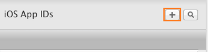

    The [Registering an App ID](https://developer.apple.com/account/ios/identifiers/bundle/bundleCreate.action) page appears.

4. Choose the **Wildcard App ID** option and then place a ```*``` in  the **Bundle ID** field.

    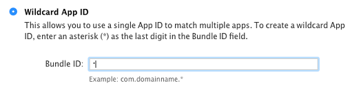

5. Fill in the rest of the fields on that page, and then choose the **Continue** button.

6. In the **Confirm your App ID** page, choose the **Submit** button.

    The **Registration complete** page appears.

Need more detail? see [Registering App IDs](https://developer.apple.com/library/ios/documentation/IDEs/Conceptual/AppDistributionGuide/MaintainingProfiles/MaintainingProfiles.html#//apple_ref/doc/uid/TP40012582-CH30-SW991).

**Register your device**

1. In the **Certificates, Identifiers & Profiles** page, choose the **All** link that is located under the **Devices** heading.

    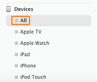

2. Choose the **+** button.

    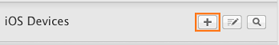

3. In the [Registering a New Device or Multiple Devices](https://developer.apple.com/account/ios/device/deviceCreate.action) page, provide the name and *UDID* of the device, and then choose the **Continue** button.

     *UDID* stands for Unique Device Identifier. It's a 40-character string that uniquely identifies your device. You can find it by using Xcode or ITunes. See [Locating Device ID's](https://developer.apple.com/library/ios/documentation/IDEs/Conceptual/AppDistributionGuide/MaintainingProfiles/MaintainingProfiles.html#//apple_ref/doc/uid/TP40012582-CH30-SW11).

4. In the **Review and register** page, choose the **Register** button.

Need more detail? See [Registering Devices Using Member Center](https://developer.apple.com/library/ios/documentation/IDEs/Conceptual/AppDistributionGuide/MaintainingProfiles/MaintainingProfiles.html#//apple_ref/doc/uid/TP40012582-CH30-SW10)

**Create a provisioning profile**

1. On the [Member Center](https://developer.apple.com/membercenter/index.action) page, choose the [Certificates, Identifiers & Profiles](https://developer.apple.com/account/overview.action) link.

2. In the [Certificates, Identifiers & Profiles](https://developer.apple.com/account/overview.action) page, choose the [Provisioning Profiles](https://developer.apple.com/account/ios/profile/profileLanding.action) link.

3. In the [Provisioning Profiles](https://developer.apple.com/account/ios/profile/profileLanding.action) page, choose the **+** button.

    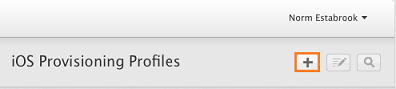

4. In the [What type of provisioning profile do you need?](https://developer.apple.com/account/ios/profile/profileCreate.action) page, choose the **iOS App Development** option, and then choose the **Continue** button.

    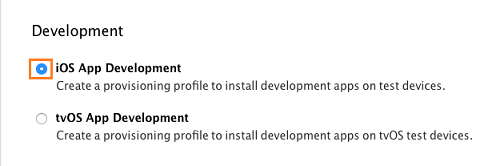

5. In the **Select App ID** page, choose the wildcard App ID that you just created, and then choose the **Continue** button.

    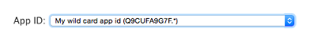

6. In the **Select certificates** page, select the checkbox next to the certificate that you created earlier, and then choose the **Continue** button.

    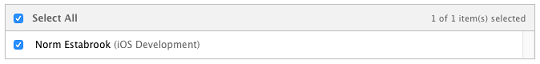

7. In the **Select devices** page, select the checkbox next to the device that you registered earlier, and then choose the **Continue** button.

8. In the **Name this profile and generate** page, name your profile, and then choose the **Generate** button.

9. In the **Your provisioning profile is ready** page, choose the **Download** button.

Need more detail? See [Creating provisioning profiles using Member Center](https://developer.apple.com/library/ios/documentation/IDEs/Conceptual/AppDistributionGuide/MaintainingProfiles/MaintainingProfiles.html#//apple_ref/doc/uid/TP40012582-CH30-SW24)

**Download the provisioning profile in Xcode**

1. Open Xcode.

2. In the menu bar, choose **Xcode**->**Preferences**.

3. In the **Accounts** page, choose the **View Details** button.

4. In the account details page, choose the **Download** button next to your provisioning profile's signing identity.

     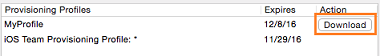

5. Choose the **Done** button to close the account details page.

**Install the provisioning profile to your device**

1. Connect your device to your Mac. Make sure that  your device is turned on.

2. In the menu bar, choose **Window**->**Devices**.

3. In the **Devices** pane, select your device.

    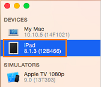

4. At the bottom of the **Devices** pane, choose the settings icon, and then choose the **Show Provisioning Profiles**.

    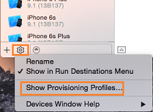

5. In the **Provisioning profiles installed on ..** dialog box, choose the **+** icon.

    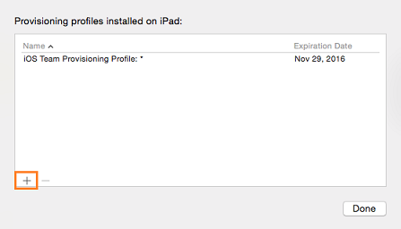

6. Navigate the location where you downloaded your provisioning profile, choose the file, and then choose the **Install** button.

7. In the In the **Provisioning profiles installed on ..** dialog box, choose the **Done** button.

    Proceed to the [Run your app on a device](#run-on-device) section.

### <a id="apple-id"></a>Option 2: Use your free Apple ID

First, take some time to [review the limitations](https://developer.apple.com/library/prerelease/ios/documentation/IDEs/Conceptual/AppDistributionGuide/SupportedCapabilities/SupportedCapabilities.html#//apple_ref/doc/uid/TP40012582-CH38-SW1) of this type of provisioning profile. If you're comfortable with those limitations, let's get started!

1. Start Xcode 7.

2. In Xcode 7, add your Apple ID.

    See [Adding an Apple ID to Your Accounts](https://developer.apple.com/library/ios/recipes/xcode_help-accounts_preferences/articles/add_appleid.html).

3. In Xcode 7, choose **File**->**New**->**Project**.

4. In the **Choose a template for your new project** dialog box, in the **iOS** group, choose the **Application** category, choose any template, and then choose the **Next** button.

    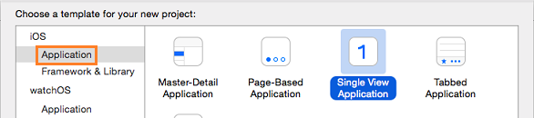

5. Name your product, organization, and identifier anything you want, and then choose the **Next** button.

    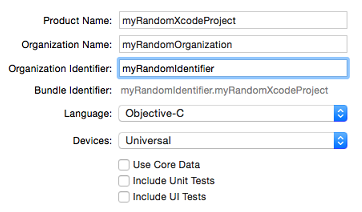

6. Choose a location to save your project, and then choose the **Create** button.

    The **General** page of the project properties appears.

7. In the **Team** pop-up menu, choose your Apple ID.

    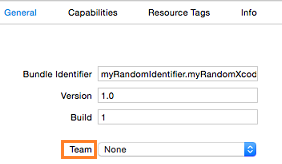

8. Connect your device to your Mac. Make sure that  your device is turned on.

9. In the **Scheme** pop-up menu, choose your device.

    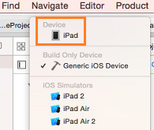

    If the device has the message **version lower than deployment target**, you can either update the operating system of your device or choose a version of iOS from the **Deployment Target** pop-up menu that matches the operating system version of your device.

10. If a **Fix Issue** button appears below the **Team** pop-up menu, choose that button.

    Xcode creates a provisioning profile and the **Fix Issue** button disappears.

11. Choose the **Run** button to run your project.

    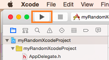

    Running your project, ensures that your provisioning profile works. Xcode installs your blank app to the device and then starts it.

Need more detail? See any of these articles on the Apple Developer website:

* [Creating a project in Xcode 7](https://developer.apple.com/library/ios/documentation/IDEs/Conceptual/AppStoreDistributionTutorial/Setup/Setup.html#//apple_ref/doc/uid/TP40013839-CH41-SW1)

* [Creating a team provisioning profile](https://developer.apple.com/library/ios/documentation/IDEs/Conceptual/AppStoreDistributionTutorial/CreatingYourTeamProvisioningProfile/CreatingYourTeamProvisioningProfile.html#//apple_ref/doc/uid/TP40013839-CH33-SW4)

* [Starting your app on the device](https://developer.apple.com/library/ios/documentation/IDEs/Conceptual/AppStoreDistributionTutorial/LaunchingYourApponDevices/LaunchingYourApponDevices.html#//apple_ref/doc/uid/TP40013839-CH34-SW1).

### <a id="team-profile"></a>Option 3: Use your team's provisioning profile

If your team shares a provisioning profile, all you have to do is register your device with the profile and then download and install that profile onto your device.

**Register the UDID of your device with the provisioning profile**

*UDID* stands for Unique Device Identifier. It's a 40-character string that uniquely identifies your device. You can find it by using Xcode or ITunes. See [Locating Device ID's](https://developer.apple.com/library/ios/documentation/IDEs/Conceptual/AppDistributionGuide/MaintainingProfiles/MaintainingProfiles.html#//apple_ref/doc/uid/TP40012582-CH30-SW11).

Send that information to the person on your team who manages the provisioning profile. For the purpose of this discussion, we'll call that person the *profile administrator*.

If you have administrator access to the Apple Developer Account, you can register the device yourself. Here's the steps:


1. On your Mac, open Safari, and log into the [Apple Developer Member Center](https://idmsa.apple.com/IDMSWebAuth/login?appIdKey=891bd3417a7776362562d2197f89480a8547b108fd934911bcbea0110d07f757&baseURL=https://developer.apple.com/&path=%2Faccount%2F&rv=1).

2. In the [Registering a New Device or Multiple Devices](https://developer.apple.com/account/ios/device/deviceCreate.action) page, provide the name and *UDID* of the device, and then choose the **Continue** button.

3. In the **Review and register** page, choose the **Register** button.

**Download the provisioning profile from the Apple Developer Member Center**

After you've confirmed that your profile administrator has added the UDID of your device to the provisioning profile, log into your shared Apple Developer account, and in the Apple Developer Member Center, locate your shared provisioning profile and download it.

**Download the provisioning profile in Xcode**

1. Open Xcode.

2. In the menu bar, choose **Xcode**->**Preferences**.

3. In the **Accounts** page, choose the **View Details** button.

4. In the account details page, choose the **Download** button next to your provisioning profile's signing identity.

     

5. Choose the **Done** button to close the account details page.

**Install the provisioning profile to your device**

1. Connect your device to your Mac. Make sure that  your device is turned on.

2. In the menu bar, choose **Window**->**Devices**.

3. In the **Devices** pane, select your device.

    

4. At the bottom of the **Devices** pane, choose the settings icon, and then choose the **Show Provisioning Profiles**.

    

5. In the **Provisioning profiles installed on ..** dialog box, choose the **+** icon.

    

6. Navigate the location where you downloaded your provisioning profile, choose the file, and then choose the **Install** button.

7. In the In the **Provisioning profiles installed on ..** dialog box, choose the **Done** button.

    Proceed to the [Run your app on a device](#run-on-device) section.


## <a id="run-on-device"></a>Run your app on a device

### Connect the device to a Mac

#### On your Mac

1. Connect your device.

2. Make sure that your device is turned on.

3. Make sure that the remote agent is running.

    See [Start the remote agent on your mac](#remoteAgent).

#### On your Windows computer

1. In Visual Studio, open the project for your app.

2. On the Standard toolbar, choose the **iOS** platform.

    

3. Choose **Remote Device**.

    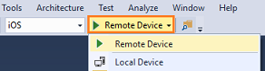

4. Press the F5 key to start your app.

    Visual Studio builds your app by connecting to the remote agent on your Mac. When the build is complete, your app appears on the device that is connected to your Mac.

### Troubleshooting: Let's fix it

[You've been told that we were unable to find the app you're trying to debug](#safari)

[You've been told that no provisioning profiles were found](#no-provision)

[Did you receive an error that relates to your certificate?](#certificate)

[Is the host name of your Mac not resolving?](#hostname)

[Have you been told that your security PIN invalid or has expired?](#securitypin)

[Did you receive an error indicating that the port is already in use?](#PORT)

[Did you receive any other type of build error](#cli)

[Are you experiencing a symptom that does not appear in this list?](#stack)

### <a id="local-deploy">Connect the device to a Windows computer

You can attach an iOS device to your Windows computer, then set breakpoints in your app and debug it. As long as you can connect to your Mac, you don't have be anywhere near it. This makes it easier to build and debug iOS apps on a Windows computer and share a Mac with other developers on your team.

To do this, you'll need a provisioning profile that you create by using an Apple Developer Account. If haven't yet done this, see [Option 1: Use an Apple Developer Account](#use-developer-account). That section of content also shows you how to install the provisioning profile to your device. That is also very important.

> **Note:** To deploy to a device from Windows you will first need to tell Visual Studio where it can find the **iOS device support folder**. We have verified that using a local copy of the files will technically work but we recommend using a file share to ensure you’re always on the latest bits. As a result, we'll go through how to set this up using the file share method.

#### On your Mac

1. Make sure that the remote agent is running.

    See [Start the remote agent on your Mac](#remoteAgent).

2. Share the **Application** folder with Windows computers.

    See [Set up a Mac to share files with Windows users](https://support.apple.com/kb/PH18707).

#### On your Windows computer

1. In a **File Explorer** window, log into the IP address of the mac.

    .

    The first time you attempt to open files on your mac, you'll be prompted for a username and password. Enter the username and password of the account that you turned on Windows File Sharing for.

    This establishes a file sharing connection between your Windows computer and your Mac.

2. Install [Apple iTunes](http://www.apple.com/itunes/).

2. Connect your device.

3. Make sure that your device is turned on.

    Apple iTunes automatically starts.

4. On the Visual Studio menu bar, choose **Tools**->**Options**.

5. In the **Options** dialog box, open **Tools for Apache Cordova**, and then choose **iOS Configuration**.

    

6. In the **iOS device support folder** field, add this path: ```\\<IPAddress>\Applications\Xcode.app\Contents\Developer\Platforms\iPhoneOS.platform\DeviceSupport``` where *IPAddress* is the IP Address of your Mac.

    The following image shows an example:

    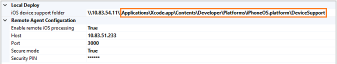

7. Choose the **OK** button to close this dialog box.

8. In Visual Studio, open the project for your app.

9. On the Standard toolbar, choose the **iOS** platform.

    

10. Choose **Local Device**.

    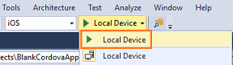

11. Press the F5 key to start your app.

    Visual Studio builds your app by connecting to the remote agent on your mac. When the build is complete, the app appears on your device.


## Stop the remote agent on your Mac

In the Terminal app on your Mac, press Ctrl+C.

## <a id="errors"></a>Troubleshooting: Let's fix it

[You've been told that we were unable to find the app you're trying to debug](#safari)

[Did you receive an error that relates to your certificate?](#certificate)

[Is the host name of your Mac not resolving?](#hostname)

[Have you been told that your security PIN invalid or has expired?](#securitypin)

[Did you receive an error that tells you that a tool requires Xcode?](#install-xcode)

[Did you receive an error indicating that the port is already in use?](#PORT)

[You've been told that no provisioning profiles were found](#no-provision)

[Did you receive any other type of build error](#cli)

[Did you receive an error that like this one: - Command failed with exit code ENOENT?](#ENOENT)

[You try to run your app on a device that is connected to your Windows computer but the project can't find it](#timeout)

[You try to build an app for iOS 10 using XCode 8, but builds are failing](#xcode8)

[Are you experiencing a symptom that does not appear in this list?](#stack)

### <a id="certificate"></a>Did you receive an error that relates to your certificate?

This can happen when Visual Studio has trouble finding your Mac on the network or if host name or IP address of your Mac changed.

**Possible issue 1: Windows has trouble finding your Mac on the network**

On your Windows computer, open a **Command Prompt**, and *ping* the IP address of your Mac. For example, if the IP address of your Mac is 10.83.51.174, you'd type ```ping 10.83.51.174```.

If you don't receive any return messages in the **Command Prompt** window, your Mac and your Windows computer might be connected to different networks.

This can happen sometimes when your company has more than one Wi-Fi network.  When a Mac wakes from a sleep, it connects to the first available Wi-Fi network. That might not be the network of your Windows computer.

This image shows a preferred order of Wi-Fi networks.

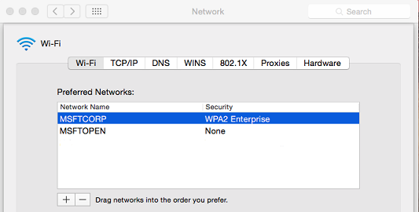

The **MSFTCORP** Wi-Fi network appears first. When this Mac wakes from a sleep, it will use that network.

The network that is used by your Windows Computer should appear first in this list. Otherwise, you'll experience these issues intermittently.

If this doesn't resolve your issue, it's possible that the host name or IP address of your Mac changed.

**Possible issue 2: The host name or IP address of your Mac has changed**

When you first started the remote agent, a certificate was generated. That certificate paired Visual Studio to your Mac's IP address or host name. If the IP address or host name changes, your certificate  becomes invalid.

Try this. Stop the remote agent on your Mac. Then, in a Terminal, run this command:

```
remotebuild certificates reset
```

Then, run this command:

```
remotebuild certificates generate
```

Start the remote agent.

On your Windows computer, in the **Options** dialog box, open **Tools for Apache Cordova**, and then choose **iOS Configuration**.


Add the host name and port number to the appropriate fields in this dialog box.

If you're using secure mode, set the **Secure mode** field to **True**, and then add the security pin.


If you're not using secure mode, set the **Secure mode** field to **False**, and then leave the **Security PIN** field blank.


Choose the **OK** button to close this dialog box.

Visual Studio connects to the remote agent. If you don't receive any errors, you've successfully connected.

Still not working? Reach out to us [here](http://stackoverflow.com/questions/tagged/visual-studio-cordova).

If you've resolved this problem another way, please share it in a comment.

[Go back up](#errors)

### <a id="hostname"></a>Is the host name of your Mac not resolving?

First, make sure that the **Host** name in Visual Studio matches computer name in the in the **Sharing** settings of your Mac.

Alternatively, you can set the **Host** name in Visual Studio to the IP address that appears in the **Network** settings of your Mac.

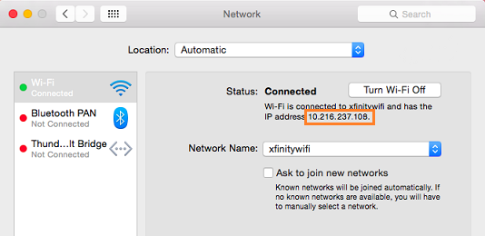

Still not working? Reach out to us [here](http://stackoverflow.com/questions/tagged/visual-studio-cordova).

If you've resolved this problem another way, please share it in a comment.

[Go back up](#errors)

### <a id="securitypin"></a>Have you been told that your security PIN is invalid or has expired?

This can happen the first time you set things up because your security PIN is good for only 10 minutes. then it expires.

This can also happen if your attempting to use the same PIN for multiple Windows computers. More than one Windows computer can use the same remote build service, but each computer must have it's own PIN.

To generate a new PIN:

1. First, stop the remote agent. On your Mac, open a Terminal app, and type CTRL+C to stop it.

2. In the Terminal app, type ```remotebuild certificates generate```.

    Your new security PIN appears in the Terminal app window. Add that PIN to the **Security PIN** field in Visual Studio.

    If this doesn't work, return to your Mac and in the Terminal app, type ```remotebuild certificates reset``` and then type ```remotebuild certificates generate``` to get another PIN number.

Still not working? Reach out to us [here](http://stackoverflow.com/questions/tagged/visual-studio-cordova).

If you've resolved this problem another way, please share it in a comment.

[Go back up](#errors)

### <a id="safari"></a>You've been told that we were unable to find the app you're trying to debug

On your device, open the Safari settings and enable the **Web Inspector** setting.

See [Safari iOS](https://developer.apple.com/library/mac/documentation/AppleApplications/Conceptual/Safari_Developer_Guide/GettingStarted/GettingStarted.html#//apple_ref/doc/uid/TP40007874-CH2-SW8).

If this doesn't work, reset the settings on your iOS device.

Still not working? Reach out to us [here](http://stackoverflow.com/questions/tagged/visual-studio-cordova).

If you've resolved this problem another way, please share it in a comment.

[Go back up](#errors)

### <a id="install-xcode"></a>Did you receive an error that tells you that a tool requires Xcode?

Make sure that [Xcode](https://developer.apple.com/xcode/download/) is installed on your Mac. Then, open Xcode and accept the license agreement. This is important. If you don't accept the license agreement, you'll keep getting build errors.

Still not working? Reach out to us [here](http://stackoverflow.com/questions/tagged/visual-studio-cordova).

If you've resolved this problem another way, please share it in a comment.

[Go back up](#errors)

### <a id="PORT"></a>Did you receive an error indicating that the port is already in use?

Most likely, an instance of remotebuild is already running. Stop the remotebuild agent by typing Ctrl+C in the Terminal App window, and then restart it.

Alternatively, start the remotebuild agent on a different port. (Try using port 3000 first before switching to another port.)

1. Run this command in the Terminal App on your Mac to start the agent.

    ```
    remotebuild --port <portnumber>
    ```

2. Update the port number in Visual Studio (**Tools** > **Options** > **Tools for Apache Cordova** > **iOS Configuration**).

3. Run your app again.


[Go back up](#errors)

### <a id="ENOENT"></a>Did you receive an error that like this one: - Command failed with exit code ENOENT?

This can happen if your project uses a version of the Cordova Command Line Interface (CLI) that is lower than ```4.3```.

To fix this problem, update the [CLI version of your project](https://docs.microsoft.com/visualstudio/cross-platform/tools-for-cordova/change-cordova-version/change-cli-version?view=toolsforcordova-2015#how-to-update-the-cli-version-of-your-project).

Still not working? Reach out to us [here](http://stackoverflow.com/questions/tagged/visual-studio-cordova).

If you've resolved this problem another way, please share it in a comment.

[Go back up](#errors)

### <a id="no-provision"></a>You've been told that no provisioning profiles were found

Most likely, Xcode hasn't yet registered your device or requested your development certificate. You can make these things happen by creating a project in Xcode, and then choosing the **Fix Issue** button in the general settings page of your new project.

For steps, see the [Option 2: Use your free Apple ID](#apple-id) section of this topic.

>**Important**: At step 7, in the team pop-up menu, make sure to choose your team or individual name that is associated with your provisioning profile. Choose your Apple ID only if you chose to use your free Apple ID to create the provisioning profile.

### <a id="cli"></a>Did you receive any other type of build error

Under the covers, Visual Studio Tools for Apache Cordova uses the Cordova SDK to manage interactions with mobile device SDKs and other tools. Therefore, when you see build errors that aren't covered elsewhere in this guide, chances are that the errors are coming from external tools used by Visual Studio. When this happens, general purpose Cordova best practices, tips and tricks apply. Refer to the [Apache Cordova documentation](http://cordova.apache.org/docs/en/latest/) or existing [Apache Cordova](http://stackoverflow.com/questions/tagged/cordova) or [Visual Studio Tolls for Apache Cordova](http://stackoverflow.com/questions/tagged/visual-studio-cordova) questions on Stack Overflow for help from other people who have solved similar issues.

Still not working? Reach out to us [here](http://stackoverflow.com/questions/tagged/visual-studio-cordova).

If you've resolved this problem another way, please share it in a comment.

[Go back up](#errors)

### <a id="timeout"></a>You try to run your app on a device that is connected to your Windows computer but the project can't find it

It's possible that the **ios-webkit-debug-proxy.exe** and **idevicedebugserverproxy.exe** processes were started in a previous attempt to run this project.

On your Windows computer, open the **Task Manager** and then choose the **Proceses** tab. If those processes appear in the list, right-click them, and then click **End Process**.

[Go back up](#errors)

### <a id="xcode8"></a>You try to build an app for iOS 10 using XCode 8, but builds are failing.

This is a known issue with Apache Cordova 6.3.1 and for the Visual Studio tools we've been working on a fix for this. To work around the issue for now, you'll need to perform the following steps:

+ Add a `developmentTeam` property to the `ios` build settings in your project's `build.json` file (an example is shown below).
+ Set the `build.json` file's `codeSignIdentity` property to the static value `iPhone Developer`.
+ Setup a `before_compile` hook in your project to copy the `developmentTeam` property into the project's `platforms/ios/cordova/build.xcconfig` file.

The project's `build.json` file should look something like the following:

```hson
{
  "ios": {
    "debug": {
      "developmentTeam": "DEVELOPMENT_TEAM_NAME"
    },
    "release": {
      "developmentTeam": "DEVELOPMENT_TEAM_NAME",
      "codeSignIdentity": "iPhone Developer"
    }
  }
}
```

To simplify the process, [Darryl Pogue](https://dpogue.ca/articles/cordova-xcode8.html) published a [sample hook](https://gist.github.com/dpogue/186b6c1827363c48d644b0d59e91bc28) that makes the required changes to the project's `build.xconfig` file based on the `build.json` example shown above. To use this hook, copy the sample `xcode8.js` file to your project's `hooks` folder, and then modify the project's `config.xml` to execute it before the compilation step using the following code:

```XML
<platform name="ios">
  <hook type="before_compile" src="hooks/xcode8.js" />
</platform>
```

#### Creating a Distribution Build

At this point, the Cordova build process works, and you can run, test and debug your app. Unfortunately, the app isn't being signed with the correct development certificate needed for distribution. In order to sign them with a distribution certificate, you'll need to create an archive of the app by following the instructions found in: [Uploading Your App to iTunes Connect](https://developer.apple.com/library/content/documentation/IDEs/Conceptual/AppDistributionGuide/UploadingYourApptoiTunesConnect/UploadingYourApptoiTunesConnect.html).

#### If you can't run or debug an iOS 10 app

Developers building Cordova applications for iOS 10 may encounter the following errors:

```
Http 404: Error mounting developer disk image
Http 500: No devices found to debug. Please ensure that a device is connected and awake and retry.
```

This is caused by the Mac development environment needing an update to several modules. To fix the issue, on Mac OS, open a terminal window and issue the following command:

`brew update && brew upgrade libimobiledevice --HEAD && brew upgrade ios-webkit-debug-proxy ideviceinstaller`

[Go back up](#errors)

### <a id="stack"></a>Are you experiencing a symptom that does not appear in this list?

Try these things:

* Review [iOS and OSX Tips and Workarounds](../tips-workarounds/ios-readme.md).

* Review [Known issues: iOS](../known-issues/known-issues-ios.md).

* Reach out to us [here](http://stackoverflow.com/questions/tagged/visual-studio-cordova) or start a discussion at the bottom of this topic.

[Go back up](#errors)
