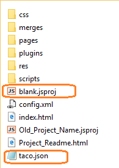

# Migrate a Cordova project to Visual Studio 2015

The project structure in Visual Studio 2015 mirrors the project structure of Apache Cordova apps that you create using the Cordova command-line interface (CLI). This allows you to use any third-party tools or CLIs in Visual Studio that are compatible with Cordova, such as Gulp and the Ionic CLI. If you have a Cordova project that was not created in Visual Studio 2015 (such as a project created in Visual Studio 2013) we recommend migrating to Visual Studio 2015. You can import the project into Visual Studio 2015 (recommended), or you can manually migrate a Visual Studio 2013 project to Visual Studio 2015. 

## Import the project into Visual Studio

For a Cordova project created without Visual Studio 2015, take the following steps.

1. Make a backup of your existing project (obligatory first step :))

2. In Visual Studio 2015, choose **File**, **New**, **Project From Existing Code**.

3. In the wizard, choose **Apache Cordova** as the project type that you'd like to create, and then choose **Next**.

    

    >**Note**: If you don't see **Apache Cordova** as an option, you need to install Visual Studio Tools for Apache Cordova.

4. For the **Project file location**, browse to the root folder of the Cordova project and select it.

    

5. Type a name for your new project and select **Finish**.

    Visual Studio adds a few new files to the project. Wait for Bower/NPM updates to the project to finish, if necessary.

## Manually migrate a Visually Studio 2013 project to Visual Studio 2015

If you want to manually migrate the old project, take the following steps.

### Create a blank project in Visual Studio 2015

1. If you haven't already, [Install Visual Studio 2015](http://go.microsoft.com/fwlink/?LinkID=533794) with Visual Studio Tools for Apache Cordova.

    

2. Make sure your Visual Studio 2015 setup is correct by creating and running the default Blank App template.
     * In Visual Studio, choose **File**, **New**, **Project**, **JavaScript**, **Apache Cordova Apps**, **Blank App** and name the new project "blank".

        > **Note** For TypeScript projects, you can use the TypeScript equivalent of this same project.

     * Choose **Windows**, **Local Machine** and press F5 to run the app (make sure the app loads correctly). If any issues occur, see [Configure the Tools] (configure-vs-tools-apache-cordova.md) or [Read up on additional known issues](../known-issues/known-issues-general.md).

### Update your existing project
1. Make a backup of your existing project (obligatory first step :))

2. In Windows, open the folder where you created the Blank App project (which you named "blank" in the previous steps).

3. Copy `blank.jsproj` and `taco.json` from this folder to your existing project folder.

    

4. Delete the older `.jsproj` file and, optionally, rename `blank.jsproj` to re-use the old name.

5. In your older project, create a new folder named **www** in the same location as the `res` folder and `config.xml`.
6. In your existing project, delete the following folders:
	 * bin
	 * bld
7. Leave the following folders and files where they are in your project:
	 * merges
	 * res
	 * plugins
	 * config.xml
8. Copy all other files and folders, including index.html, into the new `www` folder.

    

    > **Note** If you're using TypeScript, you'll need to add a tsconfig.json to your project folder and define config settings for your project. See the [Configuring TypeScript](../first-steps/develop-with-typescript.md) section for details.
10. Open the `.jsproj` file in Visual Studio 2015.

    Here is what this example project looks like in Solution Explorer.

    

  Now you can build and run your application by pressing F5 with the desired platform and device selected.

  > **Note** If you have errors, you may need to update file references to reflect the new folder structure.

### Update Configl.xml

Next, you need to make sure that your icons and splash screens are picked up correctly in the updated project.

1. In Visual Studio's Solution Explorer, open config.xml.

3. From the config.xml shortcut menu, choose **View Code**.

4. In config.xml, replace the platform section, such as the following:

    ```
  <vs:platformSpecificValues>
  <vs:platformSpecificWidget platformName="windows" id="" version="0.0.0.0">
    <vs:name />
  </vs:platformSpecificWidget>
</vs:platformSpecificValues>
    ```

    with this xml:

     ```
  <platform name="android">
    <icon src="res/icons/android/icon-36-ldpi.png" density="ldpi" />
    <icon src="res/icons/android/icon-48-mdpi.png" density="mdpi" />
    <icon src="res/icons/android/icon-72-hdpi.png" density="hdpi" />
    <icon src="res/icons/android/icon-96-xhdpi.png" density="xhdpi" />
  </platform>
  <platform name="ios">
    <icon src="res/icons/ios/icon-60-3x.png" width="180" height="180" />
    <icon src="res/icons/ios/icon-60.png" width="60" height="60" />
    <icon src="res/icons/ios/icon-60-2x.png" width="120" height="120" />
    <icon src="res/icons/ios/icon-76.png" width="76" height="76" />
    <icon src="res/icons/ios/icon-76-2x.png" width="152" height="152" />
    <icon src="res/icons/ios/icon-40.png" width="40" height="40" />
    <icon src="res/icons/ios/icon-40-2x.png" width="80" height="80" />
    <icon src="res/icons/ios/icon-57.png" width="57" height="57" />
    <icon src="res/icons/ios/icon-57-2x.png" width="114" height="114" />
    <icon src="res/icons/ios/icon-72.png" width="72" height="72" />
    <icon src="res/icons/ios/icon-72-2x.png" width="144" height="144" />
    <icon src="res/icons/ios/icon-small.png" width="29" height="29" />
    <icon src="res/icons/ios/icon-small-2x.png" width="58" height="58" />
    <icon src="res/icons/ios/icon-50.png" width="50" height="50" />
    <icon src="res/icons/ios/icon-50-2x.png" width="100" height="100" />
  </platform>
  <platform name="windows">
    <icon src="res/icons/windows/Square150x150Logo.scale-100.png" width="150" height="150" />
    <icon src="res/icons/windows/Square150x150Logo.scale-240.png" width="360" height="360" />
    <icon src="res/icons/windows/Square30x30Logo.scale-100.png" width="30" height="30" />
    <icon src="res/icons/windows/Square310x310Logo.scale-100.png" width="310" height="310" />
    <icon src="res/icons/windows/Square44x44Logo.scale-240.png" width="106" height="106" />
    <icon src="res/icons/windows/Square70x70Logo.scale-100.png" width="70" height="70" />
    <icon src="res/icons/windows/Square71x71Logo.scale-240.png" width="170" height="170" />
    <icon src="res/icons/windows/StoreLogo.scale-100.png" width="50" height="50" />
    <icon src="res/icons/windows/StoreLogo.scale-240.png" width="120" height="120" />
    <icon src="res/icons/windows/Wide310x150Logo.scale-100.png" width="310" height="150" />
    <icon src="res/icons/windows/Wide310x150Logo.scale-240.png" width="744" height="360" />
  </platform>
  <platform name="wp8">
    <icon src="res/icons/wp8/ApplicationIcon.png" width="62" height="62" />
    <icon src="res/icons/wp8/Background.png" width="173" height="173" />
  </platform>
  <platform name="android">
    <splash src="res/screens/android/screen-hdpi-landscape.png" density="land-hdpi"/>
    <splash src="res/screens/android/screen-ldpi-landscape.png" density="land-ldpi"/>
    <splash src="res/screens/android/screen-mdpi-landscape.png" density="land-mdpi"/>
    <splash src="res/screens/android/screen-xhdpi-landscape.png" density="land-xhdpi"/>
    <splash src="res/screens/android/screen-hdpi-portrait.png" density="port-hdpi"/>
    <splash src="res/screens/android/screen-ldpi-portrait.png" density="port-ldpi"/>
    <splash src="res/screens/android/screen-mdpi-portrait.png" density="port-mdpi"/>
    <splash src="res/screens/android/screen-xhdpi-portrait.png" density="port-xhdpi"/>
  </platform>
  <platform name="ios">
    <splash src="res/screens/ios/screen-iphone-portrait.png" width="320" height="480"/>
    <splash src="res/screens/ios/screen-iphone-portrait-2x.png" width="640" height="960"/>
    <splash src="res/screens/ios/screen-ipad-portrait.png" width="768" height="1024"/>
    <splash src="res/screens/ios/screen-ipad-portrait-2x.png" width="1536" height="2048"/>
    <splash src="res/screens/ios/screen-ipad-landscape.png" width="1024" height="768"/>
    <splash src="res/screens/ios/screen-ipad-landscape-2x.png" width="2048" height="1536"/>
    <splash src="res/screens/ios/screen-iphone-568h-2x.png" width="640" height="1136"/>
    <splash src="res/screens/ios/screen-iphone-portrait-667h.png" width="750" height="1334"/>
    <splash src="res/screens/ios/screen-iphone-portrait-736h.png" width="1242" height="2208"/>
    <splash src="res/screens/ios/screen-iphone-landscape-736h.png" width="2208" height="1242"/>
  </platform>
  <platform name="windows">
    <splash src="res/screens/windows/SplashScreen.scale-100.png" width="620" height="300"/>
    <splash src="res/screens/windows/SplashScreen.scale-240.png" width="1152" height="1920"/>
    <splash src="res/screens/windows/SplashScreenPhone.scale-240.png" width="1152" height="1920"/>
  </platform>
  <platform name="wp8">
    <splash src="res/screens/wp8/SplashScreenImage.jpg" width="480" height="800"/>
  </platform>
     ```

    Now, icons and splash screens should load correctly when you run the app!

<iframe width="560" height="315" src="https://www.youtube.com/embed/n44ynSECDCY" frameborder="0" allowfullscreen></iframe>
