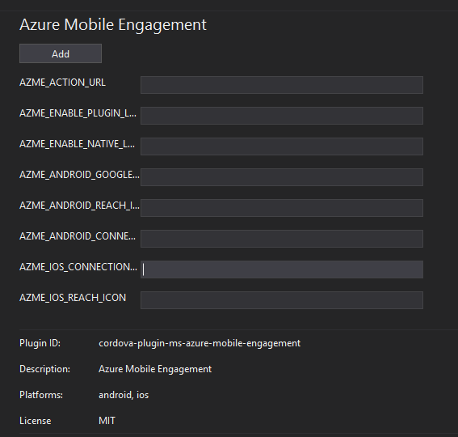
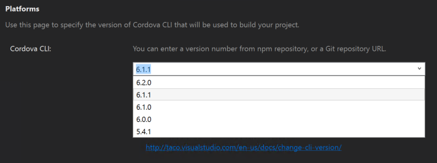

# Update 10 - Visual Studio Tools for Apache Cordova

 *Visual Studio TACO Update 10 corresponds to Visual Studio Tools for Apache Cordova version number 14.0.60527.5.*

## Setup Instructions
You can get this update following this link

[http://go.microsoft.com/fwlink/?LinkId=799777](http://go.microsoft.com/fwlink/?LinkId=799777)

Or wait until you receive a notification in Visual Studio.

## New Features

### Add  plugin with parameters

You can now add plugins with parameters in the config.xml designer.

The parameter values will be stored in the config.xml associated with plugin information.

### New Core Plugins

The core plugin list has been updated to include the following plugins:

- **Intune App SDK**
 This plugin allows a developer to easily build in data protection features into their app. You will find that you can enable SDK features without changing your app’s behavior. Once you've built the plugin into your iOS or Android mobile app, the IT admin will be able to deploy policy via Microsoft Intune supporting a variety of features that enable data protection
- **Azure Mobile Engagement**
 This plugin integrates the Azure Mobile Engagement (AZME) SDK into your Cordova Application. It supports both reporting and push features. 
Please refer to the [Azure Mobile Engagement documentation](https://azure.microsoft.com/documentation/services/mobile-engagement/) for more information about the various AZME concepts.
- **Hockey App**
This plugin provides client-side integration for the [HockeyApp](https://www.hockeyapp.net) service, allowing you to easily add crash reporting, beta distribution and user metrics to your Cordova app(s).
- **CodePush**
This plugin provides client-side integration for the [CodePush](http://microsoft.github.io/code-push) service, allowing you to easily add a dynamic update experience to your Cordova app(s).
- **SQLite storage**
This plugin enable the use of SQLite for local storage (available to cordova 6.0.0 and above)

### Default Cordova version is now 6.1.1

With this update, all new cordova projects will target cordova 6.1.1. However at the time of this writing cordova 6.2.0 has been released, and will be shown in the platforms dropdown list if you want to use it.

>Note: To learn more about what's new in cordova version see the release notes for [6.1.1](https://cordova.apache.org/news/2016/04/04/tools-release.html) and [6.2.0](https://cordova.apache.org/news/2016/05/24/tools-release.html)

### Deprecated support for cordova plugin registry

Cordova versions prior to 5.x used to Cordova Plugin Registry to install plugins, this method has been deprecated and no longer works. If your cordova project targets an old version we show a banner in the plugins dialog.

## Bug Fixes

As usual, we have some bug fixes in this release. Here are the highlights: 

### Win10 store packaging: missing .appxupload file

We commented this issue in [this post](http://microsoft.github.io/vstacoblog/2016/05/06/windows-store-packaging.html) we have reviewd the bug, and now the .appxupload is working as it should

### Some plugins cannot be added by ID

We found that third party plugins were not using the convention to specify a cordova section in package.json, so we process this as if the package was not a real plugin. Now we have updated the detection logic.
