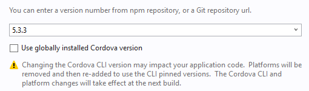

<properties pageTitle="Release Notes for Update 5"
  description="Release notes for Update 5 of Visual Studio 2015 Tools for Apache Cordova"
  services=""
  documentationCenter=""
  authors="rido-min" />
  <tags ms.technology="cordova" ms.prod="visual-studio-dev14"
     ms.service="na"
     ms.devlang="javascript"
     ms.topic="article"
     ms.tgt_pltfrm="mobile-multiple"
     ms.workload="na"
     ms.date="12/14/2015"
     ms.author="rmpablos"/>

#**Update 5 - Visual Studio Tools for Apache Cordova**
Update 5 corresponds to Visual Studio Tools for Apache Cordova version number 14.060106.1. [Read more on our developer blog.](http://microsoft.github.io/vstacoblog/2016/01/13/annoucing-update-5.html)

## Setup Instructions
The most common way to get this update will be the Notification Icon in VS and the Tools & Extensions Updates,
however from this update we are offering also a standalone installer that you can find here:

[Visual Studio Tools for Apache Cordova Update 5 Download](http://go.microsoft.com/fwlink/?LinkId=715516)

Please note that this installer will require you to have already installed a previously version of VS TACO.

## New Features:

The main focus of this release was improving our CLI interop story.  That means operations performed from the command line will be respected by the VS IDE. In the same way, operations you perform using the IDE will be recognized by CLI tools.

> **NOTE:** The default cordova version used by VS projects since this update will be 5.4.1

### Plugin installations from either Visual Studio or the command line will be respected by the other. 

We now use the default  '&lt;plugin /&gt;' element so other command line tools know how to look for plugins. Previously, we were storing plugins added in VS using the '&lt;vs:plugin /&gt;' syntax in the config.xml file. 

Moreover, when plugins are added without updating the config.xml file, VS now reads the plugins folder to mark those plugins as installed. 

### A "global" Cordova version

To addresms.product breaks because of mismatches in NodeJS versioning, we created a global installed version of Cordova, which includes proper Node versioning. 

Additionally, you can directly specify the version of Cordova you want to use from the platform section in the taco.json.

### Improve iOS incremental build file change detection by switching to timestamp comparison

Visual Studio tracks the modified date of each file to incorporate changes made from the CLI when VS is closed.

###Use MSBuild to build from command line

In cases when you want to integrate cordova projects with existing solutions and build systems based on msbuild, we have reviewed the MSBuild properties and set default values. So know you can build cordova project from command line without the need to specify additional properties. This will help to build cordova solutions using TFS 2013 or any other build system.

###iOS build updates
Support was added for the iOS 6s simulator, and the incremental build feature was improved.

##Bugs Solved

### Ripple no longer breaks if you are running Visual Studio as admin.

A security problem arose when Ripple tried to connect to server process when the user was on admin privledges. 
 
### Installing Android_SDK23 now causes it to be marked as installed

When installing Visual Studio Dev14 RTM, you could opt to also install the Android SDK 23, but it would not be marked as installed in Visual Studio.

### System settings JAVA_HOME are now respected by Visual Studio

Previously, JAVA_HOME still shows the VS installed location (ex. C:\Program Files (x86)\Java\jdk1.7.0_55). Now, unchecking "JAVA_HOME" and clicking "Restore Defaults" in Tools > Options > Tools for Apache Cordova > Environment Variable Overrides will restore custom JAVA_HOME.
 
### Fixed scenario when error in plugin installation still yields a success error message.

Previously, some errors thrown in the output window still resulted in users being notified that plugins were successfully installed. (For example, when installing cordova-plugin-whitelist from git on CLI version to 4.3.3.)

### Cordova projects now build successfully with the developer community server edition of MySQL.

Previously, adding MySQL to a Cordova project caused unsuccessful builds.

### Timeout message when debugging remote iOS devices now mentions enabling the web inspector. 

Visual Studio Cordova projects commonly time out when debugging iOS apps on a device although the app works well on the simulator. This is because most users forget to enable the web inspector on their device.

### Building a Cordova project does now trigger the before_build hook

In previous versions, our build uses prepared and compiled instead of calling build, which ended up skipping the before_build hook. Now our code manually triggers that hook.

### Failed plugins do not generate new instances of the same plugin with each install.

Previously, the installed plugins view adds a new instance of the same plugin in the Installed list for every failed attempt to add the plugin.

##Known Issues

### Node.JS 5.0 build fail

There are known issues with Cordova and the latest versions of Node.JS. For example, using Cordova 5.3.3 or below with Node.js 5.0.0 causes a build fail. 

To learn more about what versions of Cordova are compatible with Node.JS, find [more information here.](../known-issues/known-issues-general#strongbuild-not-executing-when-using-cordova-with-nodejs-500-and-cordova-533-and-belowstrong)

### Mismatched plugins warning

A warning banner pops up on Visual Studio when users add the latest version of plugins to a previous version of Cordova. We recommend you always update to the lastest version of Cordova to reduce the risk of build errors. 
