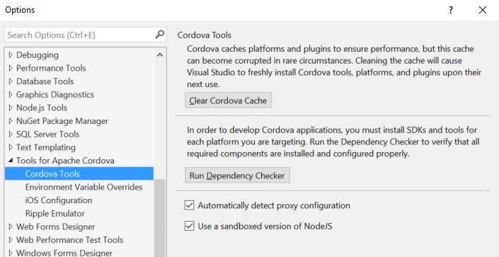

<properties pageTitle="Release Notes for Update 8"
  description="Release notes for Update 8 of Visual Studio 2015 Tools for Apache Cordova"
  services=""
  documentationCenter=""
  authors="rido-min" />
  <tags ms.technology="cordova" ms.prod="visual-studio-dev14"
     ms.service="na"
     ms.devlang="javascript"
     ms.topic="article"
     ms.tgt_pltfrm="mobile-multiple"
     ms.workload="na"
     ms.date="03/08/2016"
     ms.author="rmpablos"/>

#**Update 8 - Visual Studio Tools for Apache Cordova**
Visual Studio TACO Update 8 corresponds to Visual Studio Tools for Apache Cordova version number 14.0.60321.1 and is included with Visual Studio 2015 Update 2.

## Setup Instructions
This update is installed along with Visual Studio 2015 Update 2. You can also install it directly in Visual Studio 2015 Update 1:

[Visual Studio Tools for Apache Cordova Update 8 Download](http://go.microsoft.com/fwlink/?LinkId=761465)

Please note that this installer will require you to have already installed a previously version of VS TACO.

## TACO Update 8.1

Update 8.1 includes a fix to a bug where building a Cordova project results in the error “ENOENT, no such file or directory '' ” in the Output window, and the error “module.js:338” in the Error window. The likely cause is that the current user’s username includes a space

Our solution: In the file c:\users\<currentuser>\appdata\roaming\Microsoft\VisualStudio\MDA\vs-npm\2.14.9\etc\npmrc, we change the value of “prefix” to be c:\users\<currentuser>\appdata\roaming\npm, and save the file. Building should now work.

If you have not updated to 8.1, you can manually make this change for your code to work. 

## New Features:

### Cordova Plugin Registry is now offline

The Cordova Plugin Registry, or CPR, is now offline. This means projects targetting CLI versions before 5.0 will no longer be able to add core plugins through the config designer.

This transition was [announced](http://cordova.apache.org/announcements/2015/04/21/plugins-release-and-move-to-npm.html) a long time ago - almost a year at this point - but was only just recently taken down.

If you are running into this issue, the workarounds are to either [upgrade to a newer CLI version](http://taco.visualstudio.com/en-us/docs/change-cli-version/) or [add a plugin through the custom tab](http://taco.visualstudio.com/en-us/docs/manage-plugins/#Custom).

### Node Sandboxing
We have seen version conflicts with Node over time; to help isolate these issues we’re now shipping a known version of Node, sandboxed with the VS installation. (This was also done for NPM in the previous Update 7 release)

### NPM Proxy
We’ve seen a number of issues come up with customers running our tools behind a network proxy. NPM proxy settings are often an issue and so now, if there is a proxy configured at the system level, we auto-apply that same configuration to NPM when we use it.

### Updated Plugins List
The list of the most commonly used plugins, included on the config.xml designer, has been updated. Along with this update, the `com.microsoft.azure-mobile-services` plugin is replaced with the new `cordova-plugin-ms-azure-mobile-apps` plugin.

Here are the new plugins added to the config.xml designer:

- `cordova-plugin-ms-azure-mobile-apps`
- `cordova-plugin-hockeyapp`
- `cordova-plugin-code-push`
- `cordova-plugin-bluetoothle`
- `cordova-plugin-ms-azure-mobile-engagement`

## Bug Fixes
This release fixes three bugs that will improve the performance of the build process:

### Remote_ios.json gets corrupted when a lot of plugins are installed
Some users reported problems executing remote builds for iOS, that was caused by an incomplete remote_ios.json file, that was affecting users with a lot of plugins. Now we have optimized the remote build configuration and  are no longer using this file.

### Building for Ripple does an extra cordova prepare
We found that in some cases targeting Ripple during build will call Cordova prepare twice, increasing build time. This issue has been fixed in update 8.

###  Deploying for Android emulator using Cordova 6.0.0 does a second build during deploy
Again, in some cases, deploying to the Android emulator sometimes triggered a second build. We have fixed this issue in Update 8.
