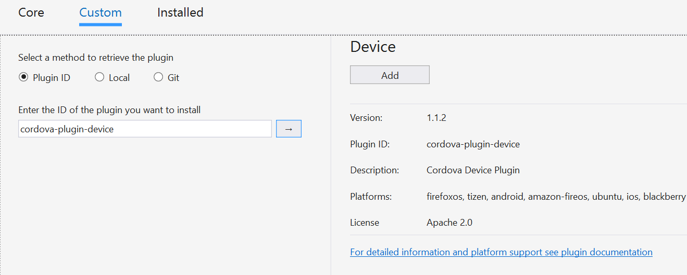
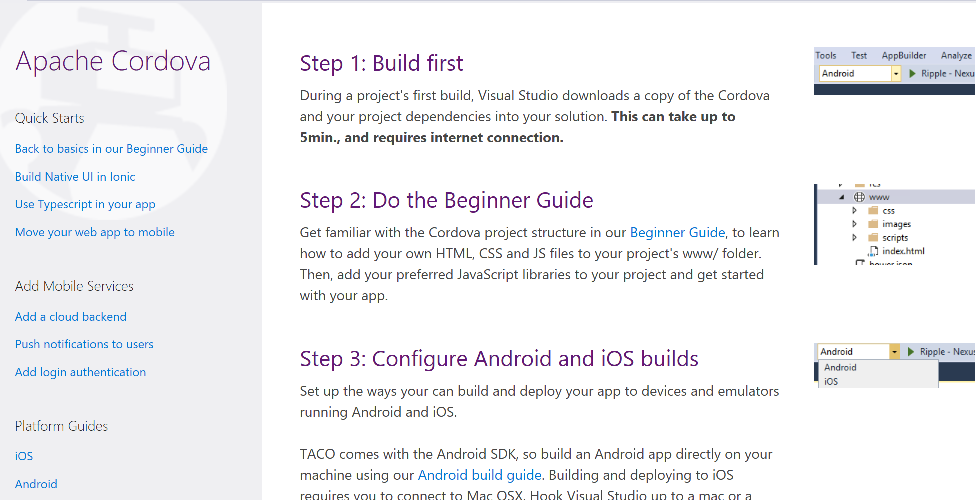

# **Update 9 - Visual Studio Tools for Apache Cordova**
 *Visual Studio TACO Update 9 corresponds to Visual Studio Tools for Apache Cordova version number 14.0.60428.1.*

## Setup Instructions
You can get this update following this link

[http://go.microsoft.com/fwlink/?LinkId=787068](http://go.microsoft.com/fwlink/?LinkId=787068)

Or wait until you  receive a notification in Visual Studio.

## New Features

### Add plugin by ID  

This release, we added a new option in the custom tab of the config designer that allows you to add a plugin by plugin id. Plugin ids are the npm package name of each plugin (e.g. [cordova-plugin-device](https://www.npmjs.com/package/cordova-plugin-device)).

### New start page
We've updated our start page to make it more actionable and useful for devs getting started with our tools.

## Bug Fixes

### Crash in local iOS deploy  
We fixed a crash when deploying to local iOS devices. The crash would happen in cases where iTunes wasn't configured properly.

### Hang opening project  
We had a customer report of a hang opening a very large Cordova project. Upon investigation, we found that 
we were spending a lot of time trying to resolve URLs for intellisense that would never resolve. This has been fixed in Update 9. Big 
thanks to Carey for helping us get to the bottom of this issue!

### Other crashes  
We fixed a number of crashes that were reported to us from our crash reporting system.
