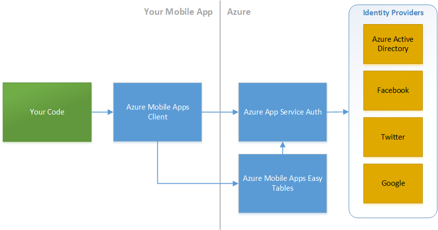

<properties pageTitle="Securely transmit data"
  description="Securely transmit Cordova app data using SSL and certificate pinning. Use the Intune MAM App SDK, Azure Mobile Apps, and the Azure App Service to speed up your workflow."
  services=""
  documentationCenter=""
  authors="clantz" />

#Securely transmit data
Security is a very broad topic that covers a number of different aspects of an app's lifecycle. Securing an app often represents a number of tradeoffs and key decisions. Like the web, Cordova is a very open platform and as a result it does not force you down a specific path that will always guarantee a secure app. Instead provides a set of tools that you can use to lock down your app as appropriate. 

For the most part you should apply the same [best practices to your code as you do for web apps](https://code.google.com/archive/p/browsersec/wikis/Main.wiki). However, given the increased capabilities Cordova apps are afforded, it is important to limit your risk as much as possible. This document will outline some of the security features that exist in Cordova, community plugins, and related Microsoft products for transmitting data securely. 

##SSL and Auth Tokens
General web best practices apply to Cordova based development including an obvious but sometimes skipped recommendation: **Always use SSL**. While this seems obvious for calls you make that contained sensitive data, it is also important for **any service call that is authenticated** since you will need to pass authentication information like access tokens across in your calls. This is even more important for Cordova since native client authentication [bearer tokens](http://self-issued.info/docs/draft-ietf-oauth-v2-bearer-19.html) often last longer than web based ones. The core assumption is that you are persisting these auth tokens in a secure way when using native API generally not available to the web (such as via library like ADAL that does it for you).

A second related recommendation is to authenticate and authorize all calls using a user login driven authentication token rather than user name and password or an app-level token. The challenges with user name and password are obvious as the information must be passed in clear text. App level authentication or secrets can be acceptable some scenarios, but the downside with this approach is that changing the app authentication will require an app update to accomplish. [Azure Key Vault](https://azure.microsoft.com/en-us/services/key-vault/) can help with situations where you must use an app or service level authentication token / secret / certificate by hiding these values behind a service that is itself authenticated. That said, often it is best to keep these types of service calls behind an app specific service layer that is authenticated against a user rather than having an app call them directly.

### Use Azure App Service to streamline service auth
Mobile Backend as a Service (MBaaS) solutions can help you get up and running quickly with an authenticated service that can resolve the above challenges. [Azure App Service](https://azure.microsoft.com/en-us/services/app-service/) is specifically designed for this purpose and you can integrate with it easily using the [Azure Mobile Apps](https://azure.microsoft.com/en-us/services/app-service/mobile/) Cordova plugin. See [the Cordova authentication article](./cordova-security-auth.md) for information on adding the plugin to your app. 

From there, you can then either simply enable Azure Authentication for the entire App Service endpoint via the Azure portal or [add auth into specific services or tables](https://azure.microsoft.com/en-us/documentation/articles/app-service-mobile-cordova-get-started-users/) to lock down access while still using the streamlined client library for features like Easy Tables.



Azure Mobile Apps features can be added to any Azure Web or API app. As a result, you can quickly create a centralized backend that you use as a focal point for user authenticated calls to backend services.


See the next section for information on passing authorization tokens across to custom APIs.

<!--
Note that if you would prefer to use the [Active Directory Authentication Library (ADAL) plugin](https://www.npmjs.com/package/cordova-plugin-ms-adal) to authenticate users in your app with Azure Active Directory or Active Directory Federation Services (ADFS) v3 and up, you can still pass the token you get from ADAL into the Mobile Apps client for interacting with the server.

First, carefully follow all setup steps under **[(Optional) Configure a native client application](https://azure.microsoft.com/en-us/documentation/articles/app-service-mobile-how-to-configure-active-directory-authentication/)** in the Azure App Service AD auth article. You can then login using the auth token from ADAL as follows:

```javascript
var client = new WindowsAzure.MobileServiceClient(appUrl);

client.login("aad", {"access_token": tokenFromADAL})
    .then(function () {
        // Do something with the client!
     }, handleError);

```
-->
See [Azure Mobile Apps](https://azure.microsoft.com/en-us/documentation/articles/app-service-mobile-value-prop/), [Azure App Service Auth](https://azure.microsoft.com/en-us/documentation/articles/app-service-api-authentication/), and [the Cordova authentication article](./cordova-security-auth.md) for additional details.

### Pass auth tokens in request headers when using REST APIs directly
Cordova apps can call JSON and REST based services without client libraries can quite easily thanks to JSON.parse(). When passing auth tokens in XHR calls to REST APIs, most implmentations use a request header rather than something like a query string that can show up in server logs.

For example, calling (custom or built-in) REST APIs deployed in Azure App Service behind Azure App Service Auth requires to you set a **X-ZUMO-AUTH** header with the appropriate authentication token.

Here is an code sample of calling the "/.auth/me" endpoint that can provides basic login information using a token from the Azure Mobile Apps client in the Cordova plugin:

```javascript
var client = new WindowsAzure.MobileServiceClient(appUrl);

function callAuthMe(successCallback, failCallback) {
        var req = new XMLHttpRequest();
        req.open("GET", appUrl + "/.auth/me", true);
        
        // Here's the secret sauce: X-ZUMO-AUTH
        req.setRequestHeader('X-ZUMO-AUTH', client.currentUser.mobileServiceAuthenticationToken);
        
        req.onload = function (e) {
            if (e.target.status >= 200 && e.target.status < 300) {
                successCallback(JSON.parse(e.target.response));
                return;
            }
            failCallback('Data request failed. Status ' + e.target.status + ' ' + e.target.response);
        };
        
        req.onerror = function (e) {
            failCallback('Data request failed: ' + e.error);
        }

        req.send();
}

client.login("aad")
    .then(function () { 
        callAuthMe(function(result) {
                // Log User ID from output
                console.log(result[0]["user_id"]); 
            }, 
            function(msg) {
                console.error(msg);
            });
    }, function (msg) {
        console.error(msg);
    });
```

Note that not all services expect auth tokens to be passed as a X-ZUMO-AUTH header value. The [Azure Active Directory Quick Start](https://azure.microsoft.com/en-us/documentation/articles/active-directory-devquickstarts-cordova/) has code that demonstrates calling the Azure AD Graph REST API directly using an AD token from the [ADAL Cordova plugin](https://www.npmjs.com/package/cordova-plugin-ms-adal) as the auth [bearer token](http://self-issued.info/docs/draft-ietf-oauth-v2-bearer-19.html). 

Here's a simplified code example that runs against the publicly available AD Graph REST API:

```javascript
function get10UsersFromADGraph(adTenantId, adalToken, callback) {
    var req = new XMLHttpRequest();
    req.open("GET", "https://graph.windows.net/" + adTenantId + "/users?api-version=2013-11-08&$top=10", true);
    
    // Pass in the ADAL token in the request 
    req.setRequestHeader("Authorization", "Bearer " + adToken);

    req.onload = function(e) {
        if (e.target.status >= 200 && e.target.status < 300) {
            // Call callback function with resulting object from API
            callback(JSON.parse(e.target.response));
            return;
        } else {
            console.error("Call failed: " + e.target.response);        
        }    
    };
    
    req.onerror = function(e) {
        console.error("Call failed: " + e.error);
    };

    req.send();
}
```

This general approach can be reused for services across Azure and O365 services but there are variations from service to service. See documentation on [Azure JSON based REST APIs](https://msdn.microsoft.com/en-us/library/azure/hh974476.aspx) and [O365](http://dev.office.com/getting-started/office365apis) service documentation for additional details on token passing to downstream services. 

##Certificate Pinning
Another trick used in high security situations is something called [certificate pinning](https://www.owasp.org/index.php/Certificate_and_Public_Key_Pinning). The idea here is you can significantly reduce the chances of a [man-in-the-middle attack](https://en.wikipedia.org/wiki/Man-in-the-middle_attack) by "pinning" the allowed public certificates accepted by your app when making the connection to highly trusted, official certificate authorities (like Verisign, Geotrust, GoDaddy) that you are actually using. The end result is that someone trying to execute a man in the middle attack would need a valid SSL certificate from that specific authority to trick your app into connecting to it.

Cordova and most underlying native webviews unfortunately do not generally support this out-of-box. You can technically approximate certificate pinning as described in the [Cordova Security Guide](https://cordova.apache.org/docs/en/edge/guide/appdev/security/index.html), there are two plugins that can help resolve this problem for you. 

In general, it is best to stick with the base XML HTTP Request implementation when making service calls but these plugin can be useful when you are in a particularly high security situation. Note that Microsoft does not directly support these plugins, so security focused organizations should be sure to run a static and or dynamic code analysis tool on the resulting project code (including these plugins) during any planned security audits. That said one is [maintained by Intel](https://software.intel.com/en-us/app-security-api) while the other has a [fork that been verified by Telerik](http://plugins.telerik.com/cordova/plugin/secure-http).

###com-intel-security-cordova-plugin
One excellent community plugin maintained by Intel with certificate pinning support is **[com-intel-security-cordova-plugin](https://www.npmjs.com/package/com-intel-security-cordova-plugin)**.  It has fantastic documentation and a great **[quick start on certificate pinning](https://software.intel.com/en-us/node/604523)**. Adding the plugin is easy:


1. In Visual Studio, when using Tools for Apache Cordova **Update 9 and up**, double click config.xml to go into config.xml designer, click on the **Plugins** tab, then **Custom**, select **ID** as the method to retrieve the plugin, and enter **com-intel-security-cordova-plugin**. 

    For earlier versions of Tools for Apache Cordova, right click on config.xml, select View Code, and then add one of the following. The plugin will be added on next build.

    ```
    <plugin name="com-intel-security-cordova-plugin" spec="~2.0.0" />
    ```
    
    ...or for Cordova < 5.1.1...
    
    ```
    <vs:plugin name="com-intel-security-cordova-plugin" version="2.0.0" />
    ```
2. When using the command line or Visual Studio Code, you can add the plugin using the Cordova CLI as follows:

    ```
    cordova plugin add com-intel-security-cordova-plugin --save
    ```

###cordova-plugin-http
Another is the **[cordova-plugin-http](https://www.npmjs.com/package/cordova-plugin-http)** community plugin is designed to provide an API compatible XML HTTP Request implementation that adds support for certificate pinning among other features to **iOS and Android**. 

Here's a quick start:

1. Get a DER formatted .cer file for the certificate you want to pin. See [cordova-plugin-http](https://www.npmjs.com/package/cordova-plugin-http) docs for details. 

2. Place the .cer file in **www/certificates** folder in your project.

3. Add [cordova-plugin-http](https://www.npmjs.com/package/cordova-plugin-http) to your project.

    1. In Visual Studio, when using Tools for Apache Cordova **Update 9 and up**, double click config.xml to go into config.xml designer, click on the **Plugins** tab, then **Custom**, select **ID** as the method to retrieve the plugin, and enter **cordova-plugin-http**. 

        For earlier versions of Tools for Apache Cordova, right click on config.xml, select View Code, and then add one of the following. The plugin will be added on next build.
    
        ```
        <plugin name="cordova-plugin-http" spec="~1.0.2" />
        ```
        
        ...or for Cordova < 5.1.1...
        
        ```
        <vs:plugin name="cordova-plugin-http" version="1.0.2" />
        ```
    2. When using the command line or Visual Studio Code, you can add the plugin using the Cordova CLI as follows:
    
        ```
        cordova plugin add cordova-plugin-http --save
        ```

4. Add the following to your "deviceready" event handler:

    ```javascript
    cordovaHTTP.enableSSLPinning(true, 
        function () {  console.log("Cert pinning enabled!"); }, 
        function () {  console.error("Cert pinning setup failed!"); });
    ```

5. You can now easily make web service calls the following to make calls that require a pinned certificate:

    ```javascript
    cordovaHTTP.get("https://mysecuresite.com/", {}, {}, function (response) {
        console.log(JSON.stringify(response));
    }, function (response) {
        console.error(JSON.stringify(response));
    });
    ```

##Consider Resource Access Controls via MDM
When building an internal facing app, Mobile Device Management (MDM) and Mobile Application management (MAM) solutions like [Microsoft Intune](https://www.microsoft.com/en-us/server-cloud/products/microsoft-intune/) can help you restrict access to services and network resources by enforcing data access controls for enrolled devices. Features include:

- Allowing you to require VPN or secure Wifi access to connect to key services by helping you [manage device profiles](https://technet.microsoft.com/en-us/library/dn997277.aspx).
- [Blocking apps from running](https://technet.microsoft.com/en-us/library/mt627829.aspx) on rooted or jailbroken devices.

If you have apps that can access particularly sensitive internal data, you will want to consider using a solution line [Intune](https://www.microsoft.com/en-us/server-cloud/products/microsoft-intune/) or Airwatch to manage your devices.

Note that the Intune MAM features mentioned previously can also force authentication at an app level even if the app itself does not require authentication as a part of Intune's Mobile Application management (MAM) features. This allows administrators to add an additional validation in place before entering an app that may be accessing data.  In addition, products like [Azure Rights Management](https://products.office.com/en-us/business/microsoft-azure-rights-management) particularly in combination with [Azure AD Identity Protection](https://azure.microsoft.com/en-us/documentation/articles/active-directory-identityprotection/) can also be used to ensure that only authorized users can access sensitive data. See the article on [preventing, detecting, and remediating security issues](./cordova-security-detect.md) for more details.

##Additional Security Topics
- [Learn about Cordova platform and app security features](./cordova-security-platform.md)
- [Encrypt your local app data](./cordova-security-data.md)
- [Authenticate users with Azure Mobile Apps or the Active Directory Authentication Library for Cordova](./cordova-security-auth.md)
- [Detect potential security threats](./cordova-security-detect.md)
- [Quickly remediate security issues](./cordova-security-fix.md)
