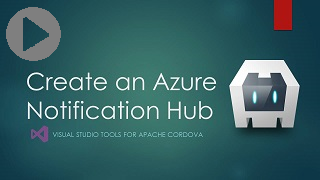
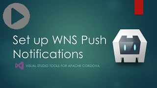
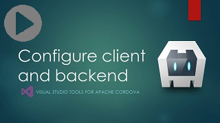
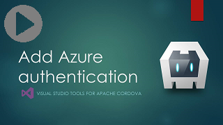

--- 
title: "Add Azure App Service Mobile App | Cordova"
author: "jmatthiesen"
ms.prod: "visual-studio-dev14"
ms.date: "08/21/2016"
ms.author: jomatthi
--- 

# Add Azure data storage, offline sync, and push notifications

## Overview

Azure App Service is a cloud app service that integrates everything you need to quickly and easily build
[web](https://azure.microsoft.com/services/app-service/web/) and [mobile](https://azure.microsoft.com/services/app-service/mobile/)
apps for any platform or device.

With the [Mobile Apps](https://azure.microsoft.com/documentation/learning-paths/appservice-mobileapps/) feature of Azure App Service,
it’s easy to rapidly build engaging Cordova apps. Azure mobile apps helps you to easily authenticate users, access the cloud data, add offline sync capabilities, and send
push notifications. You can create a no-code backend in minutes and extend it to add custom logic C# or Node.js as you would like.

The tasks in this article show you how to create an Azure Mobile App that uses an Azure Easy table for data storage, offline data sync, authentication, and supports push notifications for Android, iOS, and Windows.

## Prerequisites: Get the Azure connected services client app

To get the sample, find the
[Azure connected services sample](https://github.com/Microsoft/cordova-samples/tree/master/azure-connected-services) on GitHub.

Download the sample and open it in Visual Studio.

## Task 1: Create an Azure Mobile App backend

On the Azure portal, create an Azure Mobile App backend. Follow steps in this video to create the Azure Mobile App backend. You will need to create an Azure account if you don't have one.

<a href="https://www.youtube.com/watch?v=oKWEXU8i5oc" class="video" title="Create an Azure Mobile App"></a>

For documentation that shows similar steps, see the [Getting Started Tutorial](https://azure.microsoft.com/documentation/articles/app-service-mobile-cordova-get-started/). You can skip the section on downloading the client app.

>**Note**: You can follow steps described in the [Getting Started Tutorial](https://azure.microsoft.com/documentation/articles/app-service-mobile-cordova-get-started/) to download the Azure sample, but if you use the getting started sample instead of the Azure connected services sample, you must take extra steps to add required plugins, to add offline sync and push notification code, and to update the Cordova version in your app.

## Task 2: Update your Cordova app and your Mobile App backend code

The Azure connected services sample uses an Azure Easy table to store todolist items.

To use the sample, update your Cordova app in Visual Studio:

* Include your Azure Mobile App connected service URL where directed in index.js.
    ```javascript
    client = new WindowsAzure.MobileServiceClient('http://yourmobileapp.azurewebsites.net-fail');
    ```
* Include the same URL in the CSP `<meta>` element in index.html.
    ```html
    <meta http-equiv="Content-Security-Policy" content="default-src 'self' data: gap: http://yourmobileapp.azurewebsites.net; style-src 'self'; media-src *">
    ```

To use offline sync:

* Out of the box, the app will use offline sync for CRUD operations and sync with the Azure table when the app loads. For more information on the offline sync feature provided by the Azure Mobile App plugin, see the [Azure offline sync article](https://azure.microsoft.com/documentation/articles/app-service-mobile-cordova-get-started-offline-data/) and the [README](https://github.com/Azure/azure-mobile-apps-js-client#offline-data-sync-preview) for the Azure Mobile Apps plugin. If you want to disable offline sync, follow instructions in the code comments in index.js.

To use push notifications:

* In Azure, update your server project by following steps in [Update the server project](https://azure.microsoft.com/documentation/articles/app-service-mobile-cordova-get-started-push/#update-the-server-project-to-send-push-notifications).

    The client app uses push notification templates to register devices for push notification service. This allows you to use platform-agnostic backend code in your Azure Mobile App.

    If you are using the Azure connected services sample, you can skip the steps in [Modify your Cordova app](https://azure.microsoft.com/documentation/articles/app-service-mobile-cordova-get-started-push/#add-push-to-app)

* To use push notifications, follow the other tasks in this article to create an Azure notification hub and to configure platform-specific notification services (GCM, APNS, and WNS) for the devices that you are targeting.

To use authentication:

* If you are not using push, comment out the call to the `registerForPushNotifications` function in index.js and then skip to [Task 8: Add authentication](#authentication).

## Task 3: Create an Azure push notification hub

If you want to add support for push notifications to your Azure Mobile App, follow steps in this video.

<a href="https://www.youtube.com/watch?v=ERLF0o60-04" class="video" title="Create an Azure Notification Hub"></a>

To follow the same steps in the tutorial, see [Create a notification hub](https://azure.microsoft.com/documentation/articles/app-service-mobile-cordova-get-started-push/#create-hub).

## Task 4: (Optional) Configure Google Cloud Messaging (GCM)

If you want to send push notifications to Android devices, you must configure GCM and add the GCM credentials to your notification hub. Follow steps in this video.

<a href="https://www.youtube.com/watch?v=OSDKh_5R6vo" class="video" title="Configure GCM"></a>

To follow the same steps in the tutorial, see [Enable Google Cloud Messaging](https://azure.microsoft.com/documentation/articles/app-service-mobile-cordova-get-started-push/#optional-configure-and-run-the-app-on-android).

## Task 5: (Optional) Configure Apple Push Notification Service (APNS)

If you want to send push notifications to iOS devices, you must configure APNS and add the APNS credentials to your notification hub. Follow steps in this video.

<a href="https://www.youtube.com/watch?v=VzJxTcpUXCY" class="video" title="Configure APNS"></a>

To follow the same steps in the tutorial, see [Register the app for push notifications on your Apple Developer portal](https://azure.microsoft.com/documentation/articles/app-service-mobile-cordova-get-started-push/#optional-configure-and-run-on-ios).

>**Note**: The PhoneGap push plugin requires XCode 7.

## Task 6: (Optional) Configure Windows Notification Service (WNS)

If you want to send push notifications to Windows devices, you must configure WNS and add the WNS credentials to your notification hub. Follow steps in this video.

<a href="https://www.youtube.com/watch?v=9pc4GglHNsY" class="video" title="Configure WNS"></a>

To follow the same steps in the tutorial, see [Register your app for push notifications with WNS](https://azure.microsoft.com/documentation/articles/app-service-mobile-cordova-get-started-push/#optional-configure-and-run-on-windows).

## Task 7: Get ready to run your app!

Watch this video to make sure your app is ready to handle push notifications:

<a href="https://www.youtube.com/watch?v=C8L62__8TLg" class="video" title="Configure Cordova client app and backend"></a>

To test push notifications in your Android app:

Follow the steps in [Test push notifications in your Android app](https://azure.microsoft.com/documentation/articles/app-service-mobile-cordova-get-started-push/#optional-configure-and-run-the-app-on-android).

To test push notifications in your iOS app:

1. If you haven't already, go through the steps in the [iOS Setup Guide](https://docs.microsoft.com/visualstudio/cross-platform/tools-for-cordova/first-steps/ios-guide?view=toolsforcordova-2017&preserve-view=true) to install and run the remotebuild agent.

    Make sure you can build the app for iOS. The steps in the setup guide are required to build for iOS from Visual Studio. If you do not have a Mac, you can build for iOS using the remotebuild agent on a service like MacInCloud. For more info, see [Run your iOS app in the cloud](https://docs.microsoft.com/visualstudio/cross-platform/tools-for-cordova/tips-workarounds/host-a-mac-in-the-cloud?view=toolsforcordova-2017&preserve-view=true).

2. Follow the steps in [Test push notifications in your iOS app](https://azure.microsoft.com/documentation/articles/app-service-mobile-cordova-get-started-push/#optional-configure-and-run-on-ios)

To test push notifications in your Windows App:

Follow the steps in [Test push notifications in your Windows app](https://azure.microsoft.com/documentation/articles/app-service-mobile-cordova-get-started-push/#optional-configure-and-run-on-windows)

## Task 8: Add authentication <a id="authentication"></a>

Watch this video to add authentication to the Azure connected services sample. The video shows adding authentication with Twitter, but the steps are similar for other services as well.

<a href="https://www.youtube.com/watch?v=PTrxocL2lQg" class="video" title="Add authentication to your app"></a>

To follow similar steps in the tutorial, see [How to: Authenticate users](https://azure.microsoft.com/documentation/articles/app-service-mobile-cordova-get-started-users/)

Select a device target and press F5 to run your app with authentication.

## Troubleshooting: Let's fix it

* Platform notification service (PNS) credentials won't validate in Azure notification hub?

    At present, detailed error information is not provided. Azure validates credentials for all platform notification services (PNS) that you you've configured (GCM, APNS, WNS), so check to make sure that all PNS credentials are still valid.

    If you need more detailed error messages, you can log in through the Azure Classic portal to enter your PNS credentials.

* Can't register device or device does not receive push notifications?

    Use the Server Explorer in Visual Studio to [make sure your device is getting registered](https://azure.microsoft.com/documentation/articles/notification-hubs-push-notification-fixer/#self-diagnose-tips) with push notification services.

    In Azure, open **Settings** > **Diagnostic logs**, and enable application logging, web server logging (file system), and detailed error messages. Then, while sending push notifications, view your Log stream (**Tools** > **Log stream**).

* The app throws errors only when targeting iOS.

    Make sure you are running XCode 7.

* Can't get push notifications to work on Windows Phone 8.1.

    The PhoneGap push plugin has been validated on Windows 10 only. To target Windows 10, you must set Windows 10 as the target in config.xml.

* Visual Studio Emulator for Android doesn't show push notifications?

    Push notifications are not supported on the VS Emulator for Android. Try to test on an Android device. The Google Android Emulator does support push notifications, but requires [special configuration steps](https://azure.microsoft.com/documentation/articles/app-service-mobile-xamarin-android-get-started-push/#test).

* Other build or deployment errors in your Cordova app?

    [See Cordova troubleshooting tips](../tips-workarounds/general-tips.md)


## Links

Please refer to the following links to learn how to use Azure Mobile App SDK in your Cordova app.

- [How to: Use the SDK](https://azure.microsoft.com/documentation/articles/app-service-mobile-cordova-how-to-use-client-library/) (contains code samples)
- [Concepts: Authentication works in Mobile App](https://azure.microsoft.com/documentation/articles/app-service-mobile-auth/)
- [Concepts: Push Notification Conectps](https://azure.microsoft.com/documentation/articles/notification-hubs-overview/)
