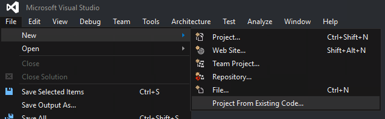
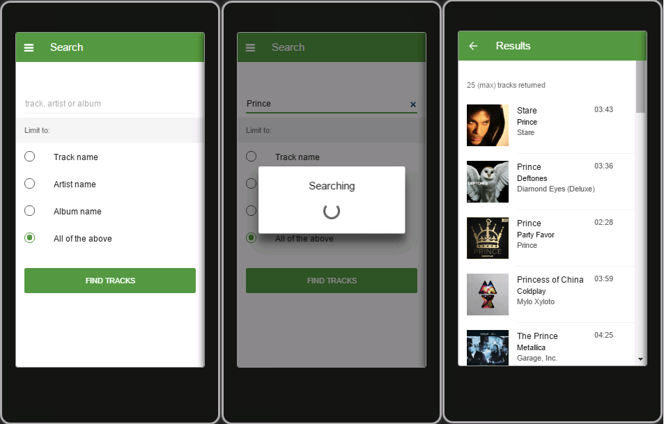

--- 
title: "Samples & Examples"
description: "Apache Cordova Samples we made and examples we like"
ms.prod: "visual-studio-dev15"
ms.devlang: "javascript"
ms.tgt_pltfrm: "mobile-multiple"
ms.workload: "na"
ms.topic: "sample"
ms.date: "05/02/2016"
--- 

# Favorite Samples & Examples

## How to open a Cordova project in VS

The [Examples We Like](#examples-we-like) section featurs projects that were not necessarily created in Visual Studio--we just think they're cool. However, because they weren't developed inside VS, you can't just double-click into the project.

To open a non-VS Cordova project inside VS, go to **File** | **New** | **Project From Existing Code...**, and follow the import wizard.

## Samples We Made
### Cordova Plugins Sampler

The [Cordova Plugins Sampler](https://github.com/ryanjsalva/cordova-simulate-tests) is authored by Cordova expert and longtime Visual Studio engineer Ryan Salva ([@ryansalva](https://twitter.com/ryanjsalva)). Sample this supreme sampling of plugin samples and learn how to use plugins from Battery to Camera to Contacts and more.

Feel free to download the [sample off Ryan's Github](https://github.com/ryanjsalva/cordova-simulate-tests) and play around. Open this project by following the instructions [here](#how-to-open-a-cordova-project-in-vs).

## Examples We Like

### Star Track by Phonegap

Star Track is a Cordova app that allows you to search for songs (tracks), preview a list, and star the tracks in your results. It's built using Framework 7, a jQuery-like JavaScript library. It was created by the Phonegap team and [announced on their developer blog April 2016](http://phonegap.com/blog/2016/04/21/introducing-star-track-by-phonegap/).

Play around with their [sample on Github](https://github.com/phonegap/phonegap-app-star-track). Open this project by following the instructions [here](#how-to-open-a-cordova-project-in-vs).

## Suggest Your Own

Working on something cool, or want to recommend a good find? [Let us know.](mailto:vstacodocs@microsoft.com)
