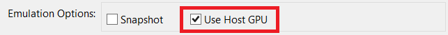

# Deprecation notice
Important: This project is not maintained anymore. The last Crosswalk release was Crosswalk 23. Read more in the announcement on the [project page](http://go.microsoft.com/fwlink/?LinkID=617678).

# Improving Android browser consistency and features with the Crosswalk WebView
An exciting new development in the Cordova Android platform in Cordova 5 and up is the support for what are called "pluggable WebViews." What this feature allows you to do is swap out the built in Android WebView with a completely different WebView implementation. This is a significant improvement because the Android browser and thus the WebView is locked at a specific version without the ability to update unless you update the version of the OS on the device. This has changed in the Android OS as of 5.0, but unlike iOS or Windows where devices can opt to upgrade and developers need only concern themselves with a few major versions of the browser, older Android devices are locked at a particular sub-revision of Android (and thus the browser) with no ability to upgrade the device in many cases. The end result has been a vast array of small differences between Android devices.

[Crosswalk](http://go.microsoft.com/fwlink/?LinkID=617678) is a project that is designed to allow developers to use a very recent and specific version of the Chromium WebView inside their Android app. The Crosswalk WebView can be used in apps running on Android 4.0 and up and brings with it the significant advantage of a consistent WebView implementation across all Android device versions it supports.

There is now a [Cordova Crosswalk plugin](http://go.microsoft.com/fwlink/?LinkID=617679) that takes advantage of the new pluggable WebView features in Cordova 5.0.0+ (and the Cordova Android 4.0.0 platform it uses) and makes it simple to add into your project.

*Note: Because using the Crosswalk plugin does slow down build and deploy times, we recommend developers start out running building apps with the stock Android WebView on a recent device or emulator (Android 4.4+). You can then add the Crosswalk plugin later in your development cycle and make the necessary adjustments.*

Using it is very easy.

## Step 1 - Add the Crosswalk Plugin
To use the Crosswalk WebView plugin from Visual Studio, follow these steps:

1. Double click on config.xml in your project.

2. Click on the **Plugins** tab.

2. Select **Crosswalk WebView Engine** and click **Add**.

    

If you are using VS Code or the command line, you can add the plugin to your project as follows:

```
cordova plugin add cordova-plugin-crosswalk-webview --save
```

The next time you build, your app will be running in the Crosswalk WebView. Note that the first build for Android in particular will take a bit given the plugin does some dynamic acquisition.

## Step 2 - Configure Crosswalk

Usually you won't need to do any additional configuration when using the Crosswalk webview but the plugin supports a number of different configurable options.  Below are a few of interest, but see the [Cordova Crosswalk WebView Engine plugin documentation](https://www.npmjs.com/package/cordova-plugin-crosswalk-webview/) for additional details and options.

### Shared Mode
By default the Crosswalk WebView plugin embeds the webview into your app.  However, one option to consider when using the Crosswalk WebView is what is called [Shared Mode](https://crosswalk-project.org/documentation/shared_mode.html). Shared Mode instead downloads a copy of the Crosswalk WebView on initial startup if it is not already on the device. This method reduces the size of the resulting app by around 20-40MB and Crosswalk is then updated independent of your app. This also significantly speeds up build times which is very useful during development. There are some down-sides with this approach as outlined in the [Crosswalk documentation](https://crosswalk-project.org/documentation/shared_mode.html), but you can switch to Shared Mode by adding the following to config.xml (Right-Click > View Code in VS):

```xml
<preference name="xwalkMode" value="shared" />
```

Note that shared mode **requires that the device have access to the Google Play store** and as a result will not work with the VS emulator or base Google Emulator images.

### Multi-APK Mode
An enhancement the Crosswalk plugin has is something called "multi-apk mode" where a separate x86 and ARM versions of your app are generated to keep the size of the app smaller when running in embedded mode. This is not needed in Shared Mode and complicates the store submission process but fortunately you can disable it by adding the following to config.xml (Right-Click > View Code in VS):

```
<preference name="xwalkMultipleApk" value="false" />
```

### Crosswalk WebView Version Preference
Usually you won't need specify the actual version of the Crosswalk WebView that the Cordova plugin uses. However, if you run into a problem where the Visual Studio **debugger is not attaching** after adding the Crosswalk plugin or are seeing unexpected crashes or issues, you may be encountering an issue with a recent version of Crosswalk.

Crosswalk version 15 is known to work well and you can force this version to be used with a simple preference. Simply add the following to config.xml (Right-Click > View Code in VS):

```xml
<preference name="xwalkVersion" value="org.xwalk:xwalk_core_library:15+" />
```

Note that this preference **disables Shared Mode.** Only set it if the one that the plugin defaults to is not working for you.

### Optional: Java Heap Size
If you encounter a **Could not create the Java Virtual Machine** error, add the following environment variable to your system and restart VS to bump up Java's heap memory to at least 512M:

```
_JAVA_OPTIONS=-Xmx512M
```

## Step 3 - Set up Emulators
The Crosswalk WebView supports WebGL like Chrome and while this is a very exciting capability, it can drive some additional steps in emulator setup.

First, be sure you have up-to-date graphics drivers installed on your system.

Next, if you are using the **Visual Studio Android Emulator** and encounter an **app crash** on startup, you may be experiencing an incompatibility with a specific version of Crosswalk being added to your project by the plugin and the emulator. Crosswalk version 15 is known to work well and you can force this version to be used with a simple preference. See step 2 for details on how to remedtiate.

Finally, if you are using the standard **Google Android Emulator,** and encounter an **app crash** after adding the Crosswalk plugin, be sure to the **Use Host CPU** option is checked for your emulator in the Android AVD Manager.



You may find a menu option to launch the AVD manager in your start menu. If not, it is typically installed in your "Program Files (x86)" folder by default and can be launched using the following command:

```
"C:\Program Files (x86)\Android\android-sdk\tools\android.bat" avd
```
