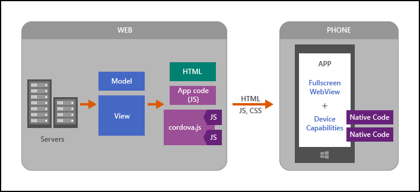
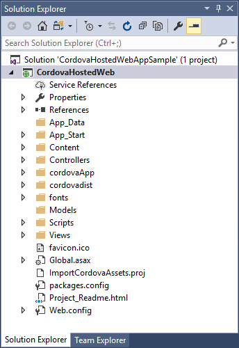
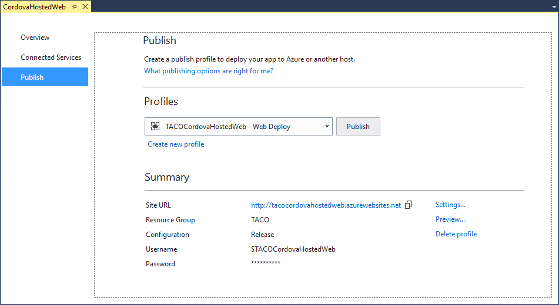
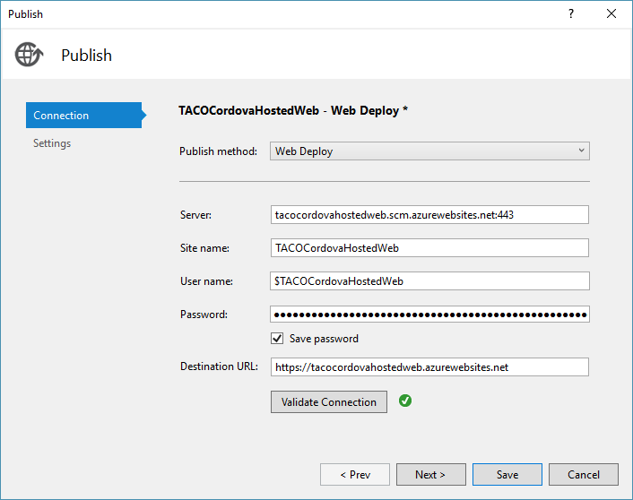
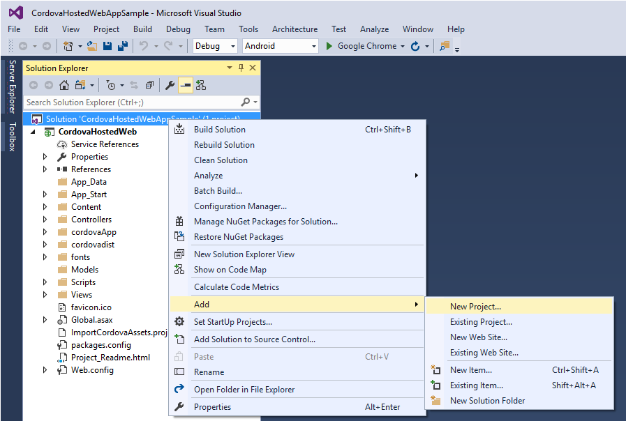
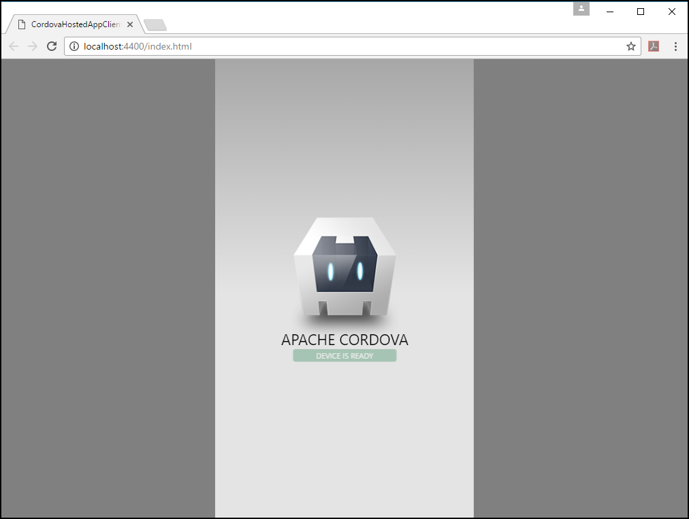
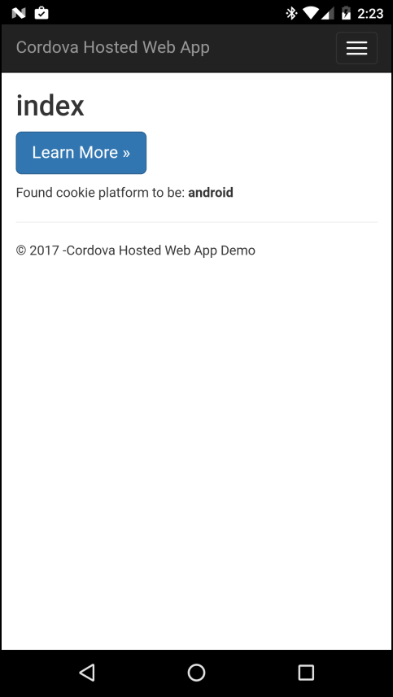
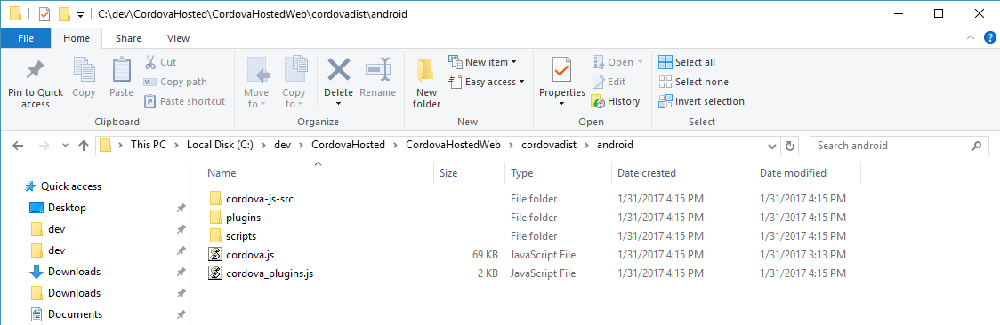
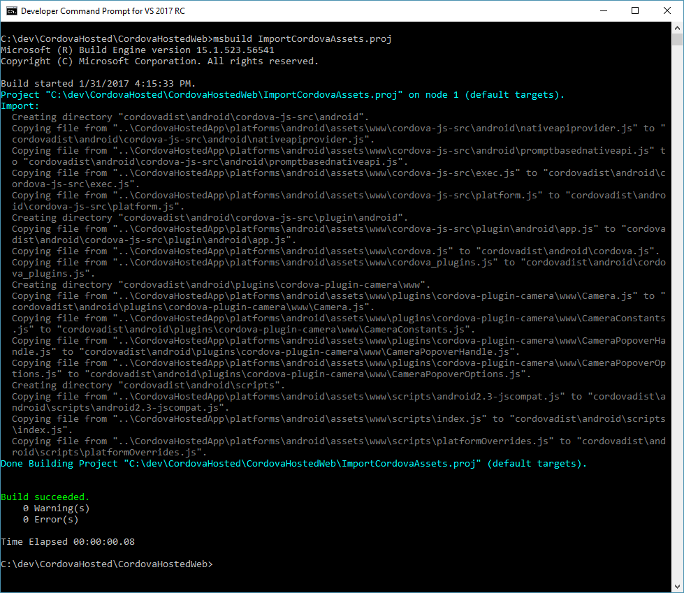

--- 
title: "Run Your Hosted Web App in an Apache Cordova App"
description: " Run Your Hosted Web App in an Apache Cordova App"
services: "na"
author: "mikejo5000"
ms.prod: "visual-studio-dev15"
ms.devlang: "javascript"
ms.tgt_pltfrm: "mobile-multiple"
ms.workload: "na"
ms.topic: "troubleshooting"
ms.date: "01/27/2017"
ms.author: mikejo
--- 

# Run Your Hosted Web App in an Apache Cordova App

[Apache Cordova](http://cordova.io) is popular because it enables developers to build native mobile apps, with native capabilities, using HTML5 (HTML, JavaScript [or TypeScript], and CSS). During the build process, web application content is packaged into a native Cordova application, and executes within that container. The web application accesses native application capabilities (native APIs) through the Cordova app's JavaScript/Native bridge, marrying the web and native capabilities in a seamless way.

When you have an existing server-based web app, and you want it running in a Cordova app, you'll have to migrate it. Migrating your web app to a Cordova app can be accomplished using several approaches, here's two:

+	**Move your front end code (or your View) from your web server to a Cordova app.**

    This can be a good option especially if your web site does *not* implement server-side technologies such as ASP.NET, PHP, and Ruby, server technologies that won't run in a Cordova app. For this option, your front end code must be repackaged in a Cordova-friendly fashion (plain HTML5, CSS, and JavaScript, with JSON for communication with your back-end server) so that it can run in the Cordova client. The actual steps involved are pretty specific to each Web site, so we will not be looking at this option in this article. For more detailed info on these options, see [What's Next?](#next). For a more general tutorial, see the [Beginner's Guide](../first-steps/build-your-first-app.md).

+	**Use a hosted web app.**

    For this scenario, you use a thin Cordova client (think of it as a web browser embedded in a native app) that automatically redirects to your Web site. For sites using ASP.NET and other server-side technologies, this is the fastest way to get up and running, and is a good way to get your app into one of the app stores quickly while learning Cordova. The full app experience will require an Internet connection, but you can also do a few things to handle offline scenarios. One advantage of using a hosted app is that you can make changes to the app on your server, and you only need to republish to the app store if you have changes to your device-specific code like plugins.

This tutorial covers the second option, executing a server-based web application in a Cordova app. For the hosted content, the sample uses an ASP.NET web site running on Azure (the Cordova features in the sample are not dependent on ASP.NET). The Cordova mobile client app works on Android, iOS, and Windows 10.

Here is a quick look at the architecture of a hosted app showing the server on the left and the Cordova client app on the right. In this architecture, you can write server-side code using generic JavaScript plugin interfaces that call native code running on the device.



In this tutorial, you'll work with an existing web application as you create the client-side Cordova application. You'll start by publishing the web application to the Microsoft Azure App Service, then you'll build the Cordova application that interacts with it.

## Requirements

To complete this tutorial, you will need to install the following software components:

+	Visual Studio 2017
+	Visual Studio Tools for Apache Cordova (installed via the Visual Studio installer)
+	Visual Studio Web Development workload (installed via the Visual Studio installer)

You'll also need an active subscription on the [Microsoft Azure App Service](https://azure.microsoft.com/services/app-service/).

## Create the Web Application

1.	Download the starter ASP.NET solution that you will use to create the hosted app. The solution is part of the **Cordova-Samples** repository located at [https://github.com/Microsoft/cordova-samples](https://github.com/Microsoft/cordova-samples). You can download the repository by clicking on the **Clone or download** button shown in the figure:

	

	Once downloaded, unzip the files to a folder of your choice on your local development system.

	If you have a git client installed, clone the repository by opening a command prompt window, navigating to the folder where you want the files located, then executing the following command:

	```
	git clone https://github.com/Microsoft/cordova-samples
	```

	The project's files are located in the repository's `hosted-web-app` folder; you'll find two folders therein: **starter**, and **completed**. The `starter` folder contains a Visual Studio Solution that implements only the web application component. You'll create the associated Cordova application and add it to the project later. The `completed` folder contains both the web application and the finished Cordova application; use this version if you're in a hurry and just want to analyze the completed project.

2.	Open the solution (`CordovaHostedWebAppSample.sln`) in Visual Studio.

	

3.	Run the application to validate that everything loaded properly and to see the web application in all of its glory. To do this, click the **Google Chrome** button in the Visual Studio Standard Toolbar:

	

	A Chrome browser window will open and display the completed web application:

	

## Publish the Web Site to the Microsoft Azure App Service

Now that you have a functional web application, lets publish it to the Microsoft Azure App Service. This will allow you to test your hosted app on any mobile device during this tutorial.

1.	In Visual Studio, open the **Build** menu, then select **Build Solution**.

2.	In Solution Explorer, right-click the ASP.NET project (CordovaHostedWeb) and choose **Publish**.

3.	In the **Publish** dialog, select **Microsoft Azure App Service**.

    

4.	In the **Create App Service** window, populate the dialog with the appropriate settings for your application. Give your app a **Web App Name**, select or create your **Subscription**, **Resource Group** and **App Service Plan** as needed. When you're done, click the **Create** button to create the cloud app.

    

	> [!NOTE]
	> Visual Studio will generate a unique value for the **Web App Name** field, you'll want to change this value to something more easily remembered, or at least something relevant to the application. This value must be unique across all web apps hosted by the Microsoft Azure App Service, so you will have to think carefully of the name you pick. Add your company name or your name to the app name to help ensure uniqueness.

5.	In the **Publish** dialog that appears, you will need to change the **Site URL** from an `http://` to an `https://` connection. This is required for iOS support for the application; which you won't be using test right now, but may be useful later.

	

	To make this change, click the **Settings** link to the right of the **Site URL**. In the dialog that appears, look for the **Destination URL** field, and change the `http://` to `https://`, then click the **Validate Connection** button to make sure your change worked. Click the **Save** button to save your changes and return to the **Publish** page.

	

6.	Back in the Visual Studio Publish page, copy the **Destination URL** to the clipboard and file it away somewhere; you'll need it again soon. Click the **Publish** button to publish the application to the Microsoft Azure App Service.

	When the publish process completes, Visual Studio will open the default browser and connect to the published web site. You should see a page similar to the one shown in the following figure:

	

## Add a Cordova Project to the Solution

Now that you have the web application project opened, published, and you've verified that it works, its time to add the Cordova project to the solution.

1.	In the Visual Studio Solution Explorer, right-click on the solution and select **Add** -> **New Project**. (Make sure you right-click the solution and not the `CordovaHostedWeb` project!)

	

2.	In the **Add New Project** dialog, expand the **JavaScript** option, select **Mobile Apps**, select **Blank App (Apache Cordova)**.

    

	For this tutorial, name the project: `CordovaHostedApp`, then click the **OK** button to create the project.

    Visual Studio will create the Cordova project, add it to the solution, then display it in Solution Explorer:

    

3.	In Solution Explorer, right-click the new Cordova project and choose **Set as StartUp Project**.

4.	Lets see the new app in action. In the Visual Studio Standard Toolbar, select the target platform (Android, iOS, Windows), then select an execution target. For now, lets just run the application in the browser, select one of the **Simulate in Browser** options:

	

5.	Press **F5** to start the app. Visual Studio will build the application and deploy it to a Chrome browser window:

    

    At this point, all you're seeing is the default Cordova application template; a simple page displaying the Cordova logo and an indicator that the Cordova client application is ready. Soon, we'll add code to pull application content from the web application running on a server.

    > [!NOTE]
    > If you get the error "Unable to get launched browser process for your app." when trying to run your cordova app, right click on your **CordovaHostedApp** project, click **Properties**, click **configuration manager** and make sure both **Build** & **Deploy** are both checked for the Android platform.

6.	Press **Shift** + **F5**, or click Visual Studio's **Stop Debugging** button () to stop debugging.

## Update the Cordova Project

In this section, you'll update the Cordova application so it pulls its content from the hosted web application running on the server.

1.	In Solution Explorer, right-click config.xml in the CordovaHostedApp-Client project and choose **View Code**. Visual Studio will open the `config.xml` file in a text editor.

2.	Add the following entry after the first set of `<allow-intent.../>` tags (before the `<platform>` sections).

    ```xml
    <allow-navigation href="https://YOUR-HOSTED-WEB-APP-URL" />
    ```

    This entry instructs the Cordova project's Whitelist plugin to allow the application's WebView to navigate to the hosted site.

    > [!NOTE]
    > Make sure you replace the `YOUR-HOSTED-WEB-APP-URL` in the entry with the web application endpoint you copied earlier when you published the web application.

3.	In Solution Explorer, double-click on the Cordova project's `www\scripts\index.js` file to open it for editing, remove all the code in the file, and replace it with the following:

    ```JavaScript
    var app = {
        // Application Constructor
        initialize: function() {
            this.bindEvents();
        },
        bindEvents: function() {
            document.addEventListener('deviceready', this.onDeviceReady, false);
        },
        onDeviceReady: function() {
            app.receivedEvent('deviceready');

            // Here, we redirect to the web site.
            var targetUrl = "https://YOUR-HOSTED-WEB-APP-URL/";
            var bkpLink = document.getElementById("bkpLink");
            bkpLink.setAttribute("href", targetUrl);
            bkpLink.text = targetUrl;
            window.location.replace(targetUrl);
        },
        // Note: This code is taken from the Cordova CLI template.
        receivedEvent: function(id) {
            var parentElement = document.getElementById(id);
            var listeningElement = parentElement.querySelector('.listening');
            var receivedElement = parentElement.querySelector('.received');

            listeningElement.setAttribute('style', 'display:none;');
            receivedElement.setAttribute('style', 'display:block;');

            console.log('Received Event: ' + id);
        }
    };

    app.initialize();
    ```

	> [!NOTE]
	> Make sure you replace `YOUR-HOSTED-WEB-APP-URL` in the code with your web application endpoint.

	This code sets an event listener for the Cordova [`deviceReady`](https://cordova.apache.org/docs/en/latest/cordova/events/events.html) event. This event fires when the Cordova container finishes initializing and all of the installed plugins are available.  On the event, the code sets the URL of the native WebView window (using `window.location.replace`) to point to our remote web application. This causes the application to pull content from that site and render it in the Cordova application's main page (the WebView).

    We also removed the [`pause` and `resume`](https://cordova.apache.org/docs/en/latest/cordova/events/events.html) event handlers. We will add this code later to the CordovaHostedWeb project so the event handler code executes in the remote web application, not the local Cordova application code.

4.	In Solution Explorer, double-click on the project's `www\index.html` file and replace all of the markup in the `<body>` element with the following:

    ```HTML
    Verifying connectivity..
    <a id="bkpLink" href="https://YOUR-HOSTED-WEB-APP-URL">YOUR-HOSTED-WEB-APP-URL</a>

    <div class="app">
        <h1>Apache Cordova</h1>
        <div id="deviceready" class="blink">
            <p class="event listening">Connecting to Device</p>
            <p class="event received">Device is Ready</p>
        </div>
    </div>
    <script type="text/javascript" src="cordova.js"></script>
    <script type="text/javascript" src="scripts/index.js"></script>
    ```

	> [!NOTE]
	> Make sure you replace `YOUR-HOSTED-WEB-APP-URL` in the code with your web application endpoint.

    The most important thing here is that you create the anchor link that is used in the redirect script you created in the previous step.

5.	In the project's `www\index.html` file's `<head>` section, replace the existing [Content-Security-Policy](https://docs.microsoft.com/visualstudio/cross-platform/tools-for-cordova/?view=toolsforcordova-2017#the-w3c-content-security-policy-csp&preserve-view=true) (CSP) `<meta>` element with the following:

    ```HTML
    <meta http-equiv="Content-Security-Policy" content="default-src 'self' data: gap: https://YOUR-HOSTED-WEB-APP-URL https://ssl.gstatic.com 'unsafe-eval'; style-src 'self' 'unsafe-inline'; media-src *">
    ```

    By adding the remote web app URL to the CSP (`https://YOUR-HOSTED-WEB-APP-URL.azurewebsites.net` in this example), you specify that it is a trusted domain, and content from this site will be allowed in your hosted app.

    > [!NOTE]
    > Make sure you replace `YOUR-HOSTED-WEB-APP-URL` in the code with your web application endpoint.

6.	[Optional] If you want to fix up the styling in the client page that appears before the hosted app loads, copy the completed project's `www\css\index.css` file to the Cordova project's `www\css\index.css` file, replacing the existing file.

7.	Press **F5** to launch the app in the browser. When the page loads, the default Cordova app page will appear, but at the top you'll see the text **Verifying connectivity..** followed by the remote server URL. Once the app connects to the remote server and requests the page, the Cordova app's content disappears, replaced by the remote web application:

    

    If everything looks good, you have your hosted app working! Congratulations! However, you still need to do a few more things to enable support for Cordova plugins in the hosted web application.

### Troubleshooting: Let's fix it

[App hangs on "Verifying Connectivity" message](#errorVerifying)

[App hangs on message saying that the URL is trying to launch another app](#errorUrl)

## Deliver Cordova-specific Content to the App

In order for the web app to leverage the Cordova container's native capabilities (through Cordova plugins), the content running in the Cordova container must have an awareness of those capabilities. Since the application's content comes from a remote server, we'll have to make that code available there. Rather than include code that runs everywhere, but is only needed for the Cordova client, we're going to add some intelligence to the hosted web application that enables it to deliver Cordova-specific content only when it knows the app is running in a Cordova container. When we're done, users running the Cordova app will be able to access device features such as the camera, while visitors using a desktop or mobile browser will get the default home page.

1.	In Visual Studio, double-click on the Cordova project's `www\scripts\index.js` file and update the code's `targetUrl` variable declaration to look like the following:

    ``` JavaScript
    var targetUrl = "https://YOUR-HOSTED-WEB-APP-URL/cordova/setPlatformCookie?platform=" + cordova.platformId;
    ```

    Now, when the Cordova app loads the remote web content, the app executes the `setPlatformCookie` function to tell the web server that a Cordova app is requesting the content. The URL also passes in the the platform identifier (`cordova.platformId`), you'll use this later for redirection.

2.	In the CordovaHostedWeb (ASP.NET) project, right-click the Controllers folder and choose **Add > Existing item**, use Windows Explorer go to the `Controllers` folder, and then add the existing file called `CordovaController.cs` to the project. This file contains the following code:

    ```cs
    using System;
    using System.Collections.Generic;
    using System.Linq;
    using System.Web;
    using System.Web.Mvc;

    namespace CordovaHostedWeb.Controllers
    {
        public class CordovaController : Controller
        {
            const string platformCookieKey = "cdva_platfrm";
            public ActionResult Index()
            {
                var cookie = HttpContext.Request.Cookies[platformCookieKey];
                var platform = "dontknow";
                if (cookie!=null)
                {
                    platform = cookie.Value;
                }
                ViewBag.Platform = platform;
                return View();
            }
            public ActionResult setPlatformCookie(string platform)
            {
                if (!string.IsNullOrWhiteSpace(platform))
                {
                    HttpContext.Response.SetCookie(new HttpCookie(platformCookieKey, platform));
                }
                return RedirectToAction("index");
            }
        }
    }
    ```

    The code redirects the site to the Cordova-specific `Index.cshtml` when the client app passes a querystring that includes the `setPlatformCookie` function call along with the platform ID. You already specified this URL in the client app's redirect script (`www\scripts\index.js`).

5.	In the CordovaHostedWeb (ASP.NET) project, right-click the `Views\Cordova` folder and choose **Add > Existing item**, use Windows Explorer to go to the `Views\Cordova` folder, and then add the file called `Index.cshtml` to the project. This page contains the following code:

    ```html
    @{
        ViewBag.Title = "index";
        var platform = ViewBag.Platform;
    }

    <h2>index</h2>

    @section Metas{
        <meta http-equiv="Content-Security-Policy" content="default-src 'self' data: gap: https://YOUR-HOSTED-WEB-APP-URL/ https://ssl.gstatic.com 'unsafe-eval'; style-src 'self' 'unsafe-inline'; media-src *">
    }

    @if (platform == "android" || platform == "ios" || platform == "windows")
    {
        @Scripts.Render("~/cordovadist/" + platform + "/cordova.js");

        <p><a class="btn btn-primary btn-lg">Learn more &raquo;</a></p>
        

        @Scripts.Render("~/cordovaApp/app.js");
    }
    else
    {
        <p>No valid platform found</p>
    }

    <div>
        Found cookie platform to be: <strong>@platform</strong>
    </div>
    ```

    This page is a mobile-specific page that renders when a Cordova app connects with a valid platform ID (Android, iOS, or Windows). This code includes the same CSP `<meta>` element as the client app, which means the client app can show content from the web site.

    This page also loads a platform-specific version of cordova.js, which enables the use of Cordova plugins for device access. When you finish these steps, your app will be able to access device features (through Cordova plugins) on Android, iOS, and Windows. You will use the Cordova Camera plugin later in this tutorial.

    Finally, this page also loads the `app.js` script. You will use this file later to add the server-side Camera plugin code. This code calls native code that runs on the device.

6.	Build the web application: In Solution Manager, right-click on the `CordovaHostedWeb` project and select **Build**.

7.	Publish the web application: In Solution Manager, right-click on the `CordovaHostedWeb` project and select **Publish**. In the dialog that appears, click the **Publish** button.

8.	Run the updated application by pressing the **F5** key. If you run the web app in the browser, you'll see the same page you saw earlier. Then you run the Cordova application on a device or in an emulator or simulator, you'll see a different page, the one shown in the following figure:

	

## Add Camera Functionality to the Cordova App

Cordova plugins give Cordova applications access to device-side capabilities such as the camera and the local file system APIs. Now that we have a functional hosted app running in a Cordova container, we're going to add support for the camera to the Cordova version of the web app.

1.	In Solution Explorer, double-click on the Cordova project's `config.xml` file, then select the **Plugins** tab.

2.	Scroll through the list of available plugins, then select the **Camera** plugin, then click the **Add** button.

    

    Visual Studio adds the selected plugin to the Cordova project.

3.	For the web application to run plugin code, the platform's `cordova.js` as well as any of the plugin's JavaScript code must be copied from the CordovaHostedApp-Client project's platforms folders (`android` and `ios`) to platform-specific folders in the CordovaHostedWeb project's `cordovadist` folder.

	

	You can find these files in the \platforms folder after building your CordovaHostedApp project for a particular platform like Android. For example, the Android files are in \platforms\android\assets\www.

	The CordovaHostedWeb project uses `ImportCordovaAssets.proj` to automatically copy these files from the CordovaHostedApp project into the CordovaHostedWeb project. To import the Cordova files into the web application project, from the Windows Start menu, open the **Developer Command Prompt for VS 2017** application. Change to the web application project folder, and execute the following command:

	```
	msbuild ImportCordovaAssets.proj
	```

	Visual Studio will copy the Cordova source files to the web application project's `cordovadist` folder:

	

## Configure the Web site to run the Camera plugin code

The starter ASP.NET project (CordovHostedWeb) already has the Camera plugin code included. Now, you can add some code to actually use the Camera capabilities on the device. You will add plugin code to `app.ts` in the CordovaHostedWeb project.

1.	In the CordovaHostedWeb project, open `Views\Cordova\Index.cshtml`.

2.	Find the page's `<a class="btn btn-primary btn-lg">`element and change its content to **Take Picture >>**. When completed, the element should look like this:

    `<p><a class="btn btn-primary btn-lg">Take Picture &raquo;</a></p>`

3.	Still in the CordovaHostedWeb project, double-click on the project's `cordovaApp\app.ts` file, and add a handler for the button's `click` event to the `onDeviceReady` function.

	```TypeScript
	document.getElementsByClassName('btn-lg')[0].addEventListener('click', takePicture);
	```

	The completed function looks like this:

    ```TypeScript
    function onDeviceReady() {
        // Handle the Cordova pause and resume events
        document.addEventListener('pause', onPause, false);
        document.addEventListener('resume', onResume, false);
        document.getElementsByClassName('btn-lg')[0].addEventListener('click', takePicture);
    }
    ```

4.	In the project's `cordovaApp\app.ts` file, add the following function in the same scope as the `onDeviceReady` function (make it one of the Application module exports):

    ```TypeScript
    function takePicture() {
        if (!navigator.camera) {
            alert("Camera API not supported");
            return;
        }

        var options = {
            quality: 20,
            destinationType: Camera.DestinationType.DATA_URL,
            sourceType: 1,
            encodingType: 0
        };

        navigator.camera.getPicture(
            function (imgData) {
                var el : HTMLElement;
                el = <HTMLElement>document.getElementsByClassName('media-object')[0];
                var srcAttr = document.createAttribute("src");
                srcAttr.value = "data:image/jpeg;base64," + imgData;
                el.attributes.setNamedItem(srcAttr);
            },
            function () {
                alert('Error taking picture');
            },
            options);

        return false;
    }
    ```

    This adds the code that's executed by the button's `click` event listener. When a user presses the button, the event listener calls `takePicture` which interacts with the mobile device's Camera application through the Cordova Camera plugin.

    > [!NOTE]
    > the project's `app.ts` file will compile into `app.js` during the build process.

5.	Build the web application: In Solution Manager, right-click on the `CordovaHostedWeb` project and select **Build**.

6.	Publish the web application: In Solution Manager, right-click on the `CordovaHostedWeb` project and select **Publish**. In the dialog that appears, click the **Publish** button.

7.	Now it's time to test the Cordova application. Press **F5** to run the app in the selected target.

8.	When the app loads, tap the **Take Picture >>** button.

    

    The device's default Camera application loads and presents an interface for taking a picture to return to the app. After you take a picture, the Camera app prompts you to use the selected picture (by tapping on the checkmark in the following figure) or retake the photo (by tapping the curved arrow button in the figure):

    

    Congratulations! You are now running native code in a web app loaded from a remote server.

## What's Next? <a id="next" />

You may want to investigate options to find an approach that works best for you. Maybe a Hosted App design will help you get an app into the app store quickly, but you may decide to go another route as well. Here are some options for moving forward.

**Make your Hosted App Better**

+	Add splash screens and icons. Take a look at the Cordova [Splashscreen](https://cordova.apache.org/docs/en/latest/reference/cordova-plugin-splashscreen/) and [Imaging](https://www.npmjs.com/package/cordova-imaging) plugins.
+	Make you Web site more [responsive](http://alistapart.com/article/responsive-web-design). You can build native-like features into your Web UI such as pull-to-refresh using frameworks such as [Ionic](http://ionicframework.com/).
+	Add offline support:
	+	For caching pages, implement a [service worker](https://www.npmjs.com/package/cordova-plugin-service-worker) or use HTML5 [AppCache](http://stackoverflow.com/questions/15870163/html5-android-phonegap-web-app-not-working-offline-with-cache-manifest). With AppCache, it can be a challenge to debug the required manifest.
    +	For [offline data](http://cordova.apache.org/docs/en/latest/cordova/storage/storage.html) in Cordova, use local storage, IndexedDB, or WebSQL (WebSQL is a deprecated standard).
+	Take a look at [Manifold.js](http://manifoldjs.com/). You give it a Web site URL, and it gives you a hosted mobile app.

**Create a Cordova app by refactoring the front end code on your Web site**

+	If your Web site doesn't use dynamically generated HTML, you may be able to take this approach to get up and running fairly quickly.
+	In a Cordova project, use plain HTML5, CSS, and JavaScript for your UI, along with xhr requests and JSON for calling your back-end. You may also choose to improve your app by using a mobile-optimized JavaScript framework such as [Ionic](http://ionicframework.com/) or [bootstrap](http://getbootstrap.com/). Or you can use a framework like JQuery.

**Create a fully packaged app by migrating your Web site to Cordova**

+	Similar to the refactoring option, but you move the site's code into Cordova as a fully packaged app. If you call a web service in your app, use xhr and JSON. Doing this work may or may not be easy depending on whether your site used a lot of server-side technologies.

**Explore other architectures that may be used for hosted apps**

+	The [Application Shell Architecture](https://medium.com/google-developers/instant-loading-web-apps-with-an-application-shell-architecture-7c0c2f10c73#.ogxsvl7wr) may be one way to enable good offline support and high performance in a hosted app.

## Troubleshooting: Let's fix it

If you run into errors getting the hosted web app running, read through the following troubleshooting tips.

### The App Displays an Alert with the Message: `gap_init:2`

When running the application in the browser using Cordova Simulate, the redirect to the hosted web content disconnects the connection to the simulated Camera plugin exposed through Visual Studio. You'll have to run the application on a physical device to test camera capabilities in a redirected scenario.

### The App Fails to Open the Redirect Page or the Hosted Web App

If there is an error connecting to any of the hosted pages, try to open the Web site in a browser.

### <a name="errorVerifying"></a> The App Hangs With a "Verifying Connectivity" Message

If you see the error shown below, you may be trying to target a version of Windows that is unsupported for the hosted apps sample. Open config.xml, then the **Windows** tab, then choose **Windows 10.0**. Run the app.


### <a name="errorUrl"></a> The App Hangs on a Message Saying That the URL is Trying to Launch Another App

You may be trying to target a version of Windows that is unsupported for the hosted apps sample. Open the project's `config.xml` file, then the **Windows** tab, then choose **Windows 10.0**. Try running the app again.
