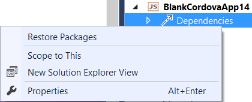
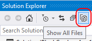

<properties pageTitle="Use gulp to automate tasks in a Cordova project"
  description="Use gulp to automate tasks in a Cordova project"
  services=""
  documentationCenter=""
  authors="clantz" />

#Automate tasks for your Cordova project using gulp
The process of building apps typically involves many repetitive tasks such as compilation, unit testing, UI testing, packaging, deployment, or simply copying files around. By automating as many of these tasks as possible in your development environment, you free yourself and your team to concentrate on more important and creative work while also improving quality through continuous validation. 

The central tool for automation is a flexible *task runner* that be configured to run interdependent tasks sequentially, feeding the results of one task into another, and to run independent tasks in parallel. 
 
[Gulp](http://go.microsoft.com/fwlink/?LinkID=533803) is a popular JavaScript-based task runner with a large number of [useful plugins](http://go.microsoft.com/fwlink/?LinkID=533790) that control a wide range of common tasks. These means you can define (in JavaScript) and automate just about any process you need. Gulp also includes a built-in file system watcher that can automatically run tasks when files change. And because gulp is built on Node.js like the [Apache Cordova Command Line interface](http://go.microsoft.com/fwlink/?LinkID=533773) (CLI), the two are highly complementary. 

In this tutorial we will cover a few ways gulp can be used with Cordova:

- [The basics: invoke a task via gulp as part of a Cordova build](#basics)
- [Use gulp to build and app](#build)
- [Automatically run gulp tasks when you change files in your project](#watch)
- [Use gulp in a team builds/continuous integration environment](#ci) 

## <a name="basics"></a>The basics: invoke a task via gulp as part of a  build

To begin using gulp, you'll first install it globally using the Node Package Manager (npm) so that it's convenient to use from both the command line and Visual Studio. Then you'll create a package.json file in your project to reference gulp and other dependencies like plugins, and the create a gulpfile.js to define the automated process.

In this example we'll start a gulp task in Visual Studio whenever a project is built, which you might use to to minify JavaScript code, compile TypeScript, or run CSS pre-processors such as LESS or SASS. We'll also see how gulp integrates with Visual Studio's Task Runner Explorer.

### Install gulp 

1. To install gulp, open a **Command Prompt** and type this command (-g means "global"):

    ```
    npm install -g gulp
    ```

	> **Note**: the Visual Studio Tools for Apache Cordova automatically install Node.js and npm on your machine. 

2. Create a **[package.json](http://go.microsoft.com/fwlink/?LinkID=533781)** file in your project root if it doesn't exist. In this file, reference the version of gulp you want to use:

	```json
	{
	  "devDependencies": {
	 	"gulp": "^3.9.1"
	   }
	}
	```

### <a Name="install-plugins"></a>Install gulp plugins

Gulp itself doesn't do much without plugins to control individual tasks. For this exercise we'll install the [gulp-uglify](http://go.microsoft.com/fwlink/?LinkID=533793) and gulp-concat plugins. The same steps apply to any others like those for [TypeScript](http://go.microsoft.com/fwlink/?LinkID=533748), [LESS](http://go.microsoft.com/fwlink/?LinkID=533791), and [SASS](http://go.microsoft.com/fwlink/?LinkID=533792).

To add a plugin, first add a reference to package.json (the ~ before a version number means "at least this version"):

```json	
{
  "devDependencies": {
 	"gulp": "^3.9.1",
	"gulp-uglify": "^1.5.1",
	"gulp-concat": "^2.6.0"
   }
}
```

Then install those dependencies from either the command line or Visual Studio:

- Command line: enter ```npm install``` and any missing dependencies are be installed automatically.
- Visual Studio: in Solution Explorer, right-click **Dependencies** and then select **Restore Packages**, which simply runs ```npm install``` under the covers:

    


    > **Note**: npm packages are stored in the **node_modules** folder in your project that is hidden by default in Visual Studio's Solution Explorer. You do not need to add this folder to your version control repository because the packages can always be restored at any time.    
 
### Define a gulp task

With gulp and the necessary plugins installed, we can now define a task to run gulp-uglify on the .js files in the project's www/scripts folder and output them to the min/scripts folder.

1. Create a **gulpfile.js** file in the project root and add a task. Each task is a call to *gulp.task* with a name and a callback that carries out the task: 
    
	```javascript
	var gulp = require("gulp");  // Instruct Node.js to load gulp
	
	gulp.task("combine-and-uglify", function() {
		   // Code to execute for this task
	});
    ```

	> **Note**: do not use spaces in the name of the task, otherwise it won't run and you'll likely be very confused. The reason for this is that each name is passed to gulp as a command-line argument where spaces cause the one name to be interpreted as separate name arguments.

2. For this task we want to get the list of files in www/scripts, combine them, run them through uglify, and save the resulting file in min/scripts. In gulp terminology, the input files are a *stream* that flows through the different steps in the task. The source stream (a set of files) is defined with *gulp.src*, and those files are then *piped* into *concat*, which outputs a stream with a single file. That stream is then piped into *uglify* for processing, the result of which is piped to an output folder defined with *gulp.dest*: 

	```javascript
	var gulp = require("gulp");          // Load gulp
	var uglify = require("gulp-uglify"); // Load gulp-uglify
	var concat = require("gulp-concat"); // Load gulp-concat
	
	gulp.task("combine-and-uglify", function () {
	    return gulp.src('www/scripts/*.js')
	        .pipe(concat('combined.js'))
	        .pipe(uglify())        
	        .pipe(gulp.dest('min/scripts'));
	});
	```

### Run the task in Visual Studio's Task Runner Explorer

1. In Visual Studio, save gulpfile.js and use **View > Other Windows > Task Runner Explorer** to open the Task Runner Explorer where you should see the gulp task listed on the left (if not, click the Refresh button on the far left): 

    

2. To test the task, right click it and select Run; the results from the command line will appear on the right:

	
	

	Check the min/scripts folder in the project and you should see a combined.js file.

	> **Note:** the min and scripts folders will be created if they didn't exist, but Solution Explorer might initially interpret these as build artifacts not show them as part of the project. In this case, Show All Files button in Solution Explorer (shown below), then right-click the min folder and select **Include In Project**.

	> 

### Set the task to run before a build

The Bindings tab in the Task Runner Explorer shows four groups to which you can assign any number of tasks. To set a task to run in the Before Build group, right click that task and select **Bindings > Before Build**:
	


### Use bindings in command-line or continuous integration builds

By default, bindings in the Task Runner Explorer work only inside of Visual Studio. Outside of Visual Studio, we generally recommend that you run Gulp tasks from the command line, such as:

```
gulp combine-and-uglify
```

That said, it is possible to assign bindings in Visual Studio and have them apply to builds  initiated from the command line or in a continuous tntegration environment. This is done with a [Cordova hook](http://go.microsoft.com/fwlink/?LinkID=533744) as described in [this GitHub repo to add a pre-built Cordova hook to your project](https://github.com/Microsoft/cordova-docs/tree/master/articles/tutorial-gulp/hook-task-runner-binding). You can modify this example to meet your needs.


## <a name="build"></a>Use gulp to build an app

Because it can run on Windows or OSX, gulp provides a unified cross-platform build language for automating and testing builds in a team / continuous integration (CI) environment such as Jenkins or Team Foundation Server 2015. You might also prefer to use a gulp-based workflow rather than the Cordova CLI itself.

### Behind the scenes: Use cordova-lib with gulp
For a quick start, we recommend using the [taco-team-build helper module](http://go.microsoft.com/fwlink/?LinkID=533736) described below. In this section we will outline how this node module uses Cordova internally and how you can use Cordova directly from gulp if you would prefer.

The Cordova CLI internally uses a node module called **cordova-lib**, which encapsulates all of the CLI's core functionality in a series of JavaScript APIs. Cordova-lib is simultaneously released with the Cordova CLI as an npm package and can be used directly from a gulp script.

The following **gulpfile.js**, when placed in the root of a Cordova project for **Cordova 5.3.3 and below**, builds a release version of the app for Android:

```javascript
var gulp = require("gulp"),
    cordova = require("cordova-lib").cordova;

gulp.task("default", function (callback) {
	cordova.build({
    	"platforms": ["android"],
    	"options": ["--release","--gradleArg=--no-daemon"]
    }, callback);
});
```

For **Cordova 5.4.0 and up** the syntax is slightly different.

```javascript
var gulp = require("gulp"),
    cordova = require("cordova-lib").cordova;

gulp.task("default", function (callback) {
	cordova.build({
    	"platforms": ["android"],
    	"options": {
            argv: ["--release","--gradleArg=--no-daemon"]
        }
    }, callback);
});
```

The ```--gradleArg=--no-daemon``` argument is important for build automation scenarios because by default, Cordova starts up a daemon process that can cause your build to appear to hang.

Also, Cordova-lib functions are *asynchronous* which is why the gulp *callback* function is passed as an argument to the *cordova.buld* call.

To see this example in action, first ensure that you've installed gulp as described earlier in 
[The basics](#basics), then create or edit package.json in the project's root folder as follows:

```json
{
    "devDependencies": {
        "gulp": "^3.9.1",
        "cordova-lib": "5.3.3"
    }
}
```

Next, run ```npm install``` from the command line to install the dependencies, or right-click **Dependencies** in Visual Studio's Solution Explorer and select **Restore Packages**, as also described in [The basics](#basics).

Finally run ```gulp``` from the command line, or use Visual Studio's Task Runner Explorer to start gulp tasks. 

Note: the **cordova** and **cordova-lib** npm package versions do not match for CLI 3.6.3 or earlier. If you need to target these, reference the **cordova** npm package in your package.json file and edit the require statement in the above gulp script as follows:

```javascript
var gulp = require("gulp"),
    cordova = require("cordova");
```

If you're creating an automated build script, you can find a more complete list of considerations by reviewing [Get started with Continuous Integration](./tutorial-team-build/tutorial-team-build-readme.md).


<a name="tacoteambuild"></a>
### Use the taco-team-build module with gulp

The [taco-team-build helper module](http://go.microsoft.com/fwlink/?LinkID=533736) assists with builds using gulp and alleviates various [common problems](./tutorial-team-build/tutorial-team-build-readme.md) when building a Cordova project from the command line, especially in a team or CI environment. It can be used with any number of build systems including Jake, Grunt, gulp, and even from the command line. It also helps you use gulp to build for multiple platforms, as described in the next section. 

The taco-team-build repository includes sample gulpfile.js and package.json files, along with documentation. To get started, place the contents of the **samples/gulp** folder from the [taco-team-build repository](http://go.microsoft.com/fwlink/?LinkID=533736) in your project root. Alternately, create package.json and gulpfile.js files in your root as follows:   

- **package.json**  
    
    ```json
    {
        "devDependencies": {
            "gulp": "^3.9.1",
            "taco-team-build": "^0.2.2"
        }
    }
    ```

    If you want to be able to modify the taco-team-build module instead of using the Github version, remove the dependency in the file above, copy **taco-team-build.js** and the **lib** folder from GitHub to your project root, and require ```./taco-team-build.js``` in the gulpfile.js below.

- **gulpfile.js**

    ```javascript
    var gulp = require("gulp"),
    cordovaBuild = require("taco-team-build");

    gulp.task("default", function () {
       return cordovaBuild.buildProject("android", ["--release", "--gradleArg=--no-daemon"]);
    });
    ```

When you run this task (either from the command line or Visual Studio's Task Runner Explorer), the taco-team-build script does the following:
 
   1. Checks whether a Cordova version is specified in the **taco.json** file. If not, it checks for a CORDOVA_DEFAULT_VERSION environment variable and uses that, otherwise defaults to the latest version.
   
   2. Locates the Cordova cache by checking for the **CORDOVA\_CACHE** environment variable. If this is not set, the script will try to use the TACO\_HOME location (used by the taco-cli). Otherwise the default locations are ```%APPDATA%\\taco_home\\node_modules``` on Windows and ```~/.taco_home/node_modules``` on OSX. 

      >**Note**: You can also set this location programmatically using the module's *configure* method.

   3. Downloads and installs the correct version of Cordova if a matching version isn't already present in the cache.

   4. Fixes missing execute bits for files in the hooks or platforms folder when running on OSX or Linux.

   5. Adds the [Cordova CI Support Plugin](http://go.microsoft.com/fwlink/?LinkID=533753) to the project if needed.


Within the callback function given to gulp.task function, *cordovaBuild.buildProject* does the asynchronous build step, installing the specified platform ("android" in this case) if necessary. *buildProject* returns a promise to which we then chain other build steps like copying the result of the build.


### Create a gulp script that builds for multiple platforms 

It's very helpful, especially in a CI environment, to automate building your project for all target platforms. The gulpfile.js script below provides this flexibility. It builds Android, Windows, Windows Phone 8 targets when run on a Windows build machine, and builds the iOS target when run on an OS X build machine. A more complete version of this script can be found in the **samples/gulp** folder in the [taco-team-build repository](http://go.microsoft.com/fwlink/?LinkID=533736).

```javascript
var gulp = require("gulp"),
    fs = require("fs"),
    es = require('event-stream'),
    cordovaBuild = require("taco-team-build");

// Setup platforms to build that are supported on current hardware
var winPlatforms = ["android", "windows"],
    linuxPlatforms = ["android"],
    osxPlatforms = ["ios"],
    platformsToBuild = process.platform === "darwin" ? osxPlatforms :                   
                       (process.platform === "linux" ? linuxPlatforms : winPlatforms),   

    // Build config to use for build - Use Pascal case to match paths set by VS
    buildConfig = "Release",

    // Arguments for build by platform. Warning: Omit the 
    // extra "--" when referencing platform specific options 
    // (Ex:"-- --gradleArg" is "--gradleArg").
    buildArgs = {
        android: ["--" + buildConfig.toLocaleLowerCase(),"--device",
                  "--gradleArg=--no-daemon"],                
        ios: ["--" + buildConfig.toLocaleLowerCase(), "--device"],                                             
        windows: ["--" + buildConfig.toLocaleLowerCase(), "--device"]                                          
    },                                                                              

    // Paths used by build
    paths = {
       apk:["./platforms/android/ant-build/*.apk", 
            "./platforms/android/bin/*.apk", 
            "./platforms/android/build/outputs/apk/*.apk"],
       binApk: "./bin/Android/" + buildConfig,
       ipa: ["./platforms/ios/build/device/*.ipa",
             "./platforms/ios/build/device/*.app.dSYM"],
       binIpa: "./bin/iOS/" + buildConfig,
       appx: "./platforms/windows/AppPackages/**/*",
       binAppx: "./bin/Windows/" + buildConfig
    };                                                  

// Set the default to the build task
gulp.task("default", ["build"]);

// Executes taks specified in winPlatforms, linuxPlatforms, or osxPlatforms based on
// the hardware Gulp is running on which are then placed in platformsToBuild
gulp.task("build", function() {
    return cordovaBuild.buildProject(platformsToBuild, buildArgs)
        .then(function() {    
            // ** NOTE: Package not required in recent versions of Cordova
            return cordovaBuild.packageProject(platformsToBuild)
                .then(function() {             
                    return es.concat(
                            gulp.src(paths.apk).pipe(gulp.dest(paths.binApk)),
                            gulp.src(paths.ipa).pipe(gulp.dest(paths.binIpa)),
                            gulp.src(paths.appx).pipe(gulp.dest(paths.binAppx)));            
                });
        });
});
```

### <a name="ts"></a>Build a Typescript project

If you're using TypeScript in your Cordova app project, you can use the [gulp-typescript](http://go.microsoft.com/fwlink/?LinkID=533748) plugin to compile TypeScript as part of an automated build. Refer back to the [Install plugins](#install-plugins) section for the ways to do this; 
```"gulp-typescript": "^2.11.0"``` is the dependency that should be listed in package.json.

The following gulpfile.js loads the plugin and runs a task to compile all Typescript (***.ts**) files found in the project's *scripts* folder, saving the results in a single file **www/scripts/appBundle.js***:

```javascript
var ts = require("gulp-typescript");

gulp.task("scripts", function () {
    gulp.src("scripts/**/*.ts")
    	.pipe(ts({
        	noImplicitAny: false,
            noEmitOnError: true,
            removeComments: false,
        	sourceMap: true,
            out: "appBundle.js",
            target: "es5"
		}))
		.pipe(gulp.dest("www/scripts"));
});
```    

The options given directly to the *ts* call above can alternately be saved in a **tsconfig.json** file (as done in the Visual Studio templates), in which case you can use the following gulpfile.js:

```javascript
var ts = require("gulp-typescript"),
    tsconfigPath = "scripts/tsconfig.json";

gulp.task("scripts", function () {
    gulp.src("scripts/**/*.ts")
        .pipe(ts(ts.createProject(tsconfigPath)))
        .pipe(gulp.dest("www/scripts"));
});
```

To point to multiple locations for TypeScript files in your project, create an array as follows:

```javascript
gulp.src(["scripts/**/*.ts","www/typescript/**/*.ts"])
```

Finally, to compile TypeScript first as part of a build task, add a reference to the scripts task:

```javascript
gulp.task("build", ["scripts"], function () {
...
```

The **samples/gulp** folder in the [taco-team-build repository](http://go.microsoft.com/fwlink/?LinkID=533736) contains sample **gulpfile.js** and **package.json** files that are already configured to include TypeScript.

## <a name="watch"></a>Automatically run gulp tasks when you change files in your project

Gulp's *watch* task is a highly useful feature that listens for changes in the file system for your project and automatically start tasks in response. For example, the following task in gulpfile.js will recompile TypeScript code when changes occur:

```javascript
gulp.task("watch", ["scripts"], function () {
    gulp.watch("scripts/**/*.ts", ["scripts"]);
});
```

You'll need to run this task first to start the watching, so either use ```gulp watch``` from the command line or run the task from Visual Studio in the Task Runner Explorer.


## <a name="ci"></a>Use gulp in a continuous integration (CI) environment

A continuous integration environment means having a dedicated build server that handles requests from everyone in your team, and perhaps also runs builds automatically whenever code is committed to your repository.

The build server must, of course, have all the dependencies installed, such as SDKs, for your target platforms. See the “Installing Dependencies” section of the [Comperhensive CI tutorial](./tutorial-team-build/general.md) for details.

However you arrange your build tasks, though, it's a simple matter to configure to server to use gulp. 

First, follow the instructions on using [taco-team-build](#tacoteambuild) above.

Second, run these two commands at a command prompt:

```
npm install
./node_modules/.bin/gulp
```

Then set the **CORDOVA_CACHE** environment variable to the location on your build server where it should cache multiple versions of Cordova and Cordova platforms. See the [Jenkins tutorial](./tutorial-team-build/jenkins.md) for a specific example. 

Note that when building iOS, you may need to unlock the login keychain before building when using a non-intractive build agent (which is common for Jenkins, for example.)  You'll need to extend your script as follows if you run into this problem:

```
security unlock-keychain -p $KEYCHAIN_PWD $HOME/Library/Keychains/login.keychain 
```

...where KEYCHAIN_PWD is an environment variable with the login keychain password for the user running the build. In almost all cases this is the same as the actual password used to login to the machine so be sure to take advantage of any secure environment variable capabilities your CI system may have. 
