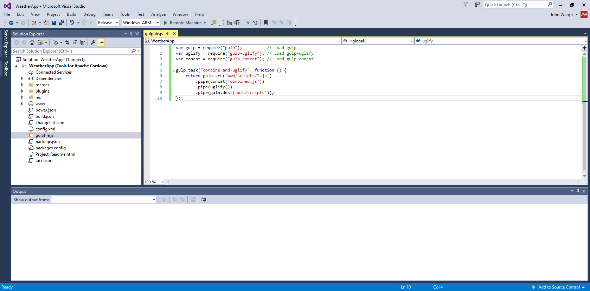
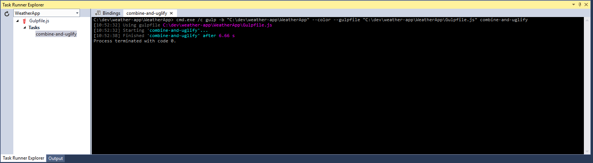
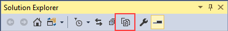
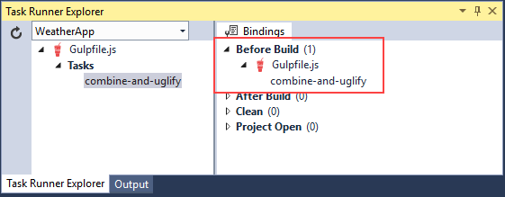

<properties
	pageTitle="Automate Cordova Project Tasks Using Gulp"
 	description="Automate Cordova Project Tasks Using Gulp"
  	services=""
  	documentationCenter=""
  	authors="clantz, johnwargo" />
<tags 
	ms.technology="cordova" 
	ms.prod="visual-studio-dev15"
	ms.service="na"
	ms.devlang="javascript"
	ms.topic="article"
	ms.tgt_pltfrm="mobile-multiple"
	ms.workload="na"
	ms.date="02/12/2017"
	ms.author="johnwargo"/>

# Automate Cordova Project Tasks Using Gulp

The process of building apps typically involves many repetitive tasks such as compilation, unit testing, UI testing, packaging, deployment, or simply copying files around. By automating as many of these tasks as possible in your development environment, you free yourself and your team to concentrate on more important and creative work while also improving quality through continuous validation. 

The central tool for build automation is a flexible **task runner** that be configured to run interdependent tasks sequentially, feeding the results of one task into another, and to run independent tasks in parallel. 
 
[Gulp](http://go.microsoft.com/fwlink/?LinkID=533803) is a popular JavaScript-based task runner with a **large** number of [useful plugins](http://go.microsoft.com/fwlink/?LinkID=533790) that control a wide range of common tasks. These means you can define tasks (using JavaScript) and automate just about any process you need. Gulp also includes a built-in file system watcher that can automatically run tasks when watched files change. And because Gulp is built on NodeJS like the [Apache Cordova Command-line Interface](http://go.microsoft.com/fwlink/?LinkID=533773) (CLI), the two are compatible. 

In this tutorial we will cover a few ways Gulp can be used with Cordova:

+	[The Basics: Invoke a Build Task Via Gulp](#basics)
+	[Use Gulp to Build an App](#build)
+	[Automatically Run Gulp Tasks When You Change Files in Your Project](#watch)
+	[Use Gulp in a Continuous Integration Environment](#ci) 

## <a name="basics"></a> The Basics: Invoke a Build Task Via Gulp

To use Gulp in your projects, you'll:

1.	Install Gulp's command-line interface (CLI) globally using the Node Package Manager (npm). This ensures it's convenient to use from both the command-line and Visual Studio. 
2.	Create a `package.json` file in your project to reference Gulp and other dependencies like plugins.
3.	Install Gulp and any needed Gulp plugins in your Cordova project folder.
4.	Create a `gulpfile.js` to define the automated process you'll use.

In this example we'll start a Gulp task in Visual Studio whenever a project is built, which you might use to to minify JavaScript code, compile TypeScript, or run CSS pre-processors such as LESS or SASS. We'll also see how Gulp integrates with Visual Studio's Task Runner Explorer.

### Install Gulp 

1.	Open a Windows **Command Prompt** and execute the following command:

    ```
    npm install --global gulp-cli
    ```

	> **Note**: the Visual Studio Tools for Apache Cordova (TACO) automatically install Node.js and npm on your machine. 

	This installs the Gulp command-line interface (CLI) which is used by the `gulp` command you'll learn about soon.

2.	If your project already has a [`package.json`](http://go.microsoft.com/fwlink/?LinkID=533781) file in the Cordova project's root folder (the one with the project's `config.xml` file and `www` folder), skip this step.

	In the command prompt, navigate to your Cordova project's root folder, and execute the following command:
	
	```
	npm init
	```	 

	The Node Package Manager (npm) will prompt you to answer some questions about your app, then create a properly formatted `package.json` file in the current folder. For Cordova projects, it really doesn't matter how you answer the questions, only that you have a properly formatted `package.json` file in the folder. 

	When you're done, your `package.json` file will look something like the following (using your responses to the previous prompts, of course):

	```json
	{
  		"name": "taco-weather-app",
  		"version": "1.0.0",
  		"description": "TACO Weather App",
  		"main": "index.js",
  		"dependencies": { },
  		"scripts": {
    		"test": "echo \"Error: no test specified\" && exit 1"
  		},
  		"author": "Microsoft TACO Team",
  		"license": "MIT"
	}
	```

3.	Finally, install Gulp in your project folder by executing the following command:

	```
	npm install --save-dev gulp
	```

	This command installs the Gulp files into your project's `node_modules` folder (it will be created as needed) and adds Gulp as a development dependency for your project. When you're done, your `package.json` file will look something like the following (using your responses to the earlier prompts, of course):

	```json
	{
  		"name": "taco-weather-app",
  		"version": "1.0.0",
  		"description": "TACO Weather App",
  		"main": "index.js",
  		"dependencies": { },
  		"devDependencies": {
    		"gulp": "^3.9.1"
  		},
  		"scripts": {
    		"test": "echo \"Error: no test specified\" && exit 1"
  		},
  		"author": "Microsoft TACO Team",
  		"license": "MIT"
	}
	```

### <a Name="install-plugins"></a> Install Gulp Plugins

Gulp can't do much without plugins to control individual tasks. For this exercise we'll install the [`gulp-uglify`](http://go.microsoft.com/fwlink/?LinkID=533793) and [gulp-concat](https://www.npmjs.com/package/gulp-concat) plugins. The same steps apply to any other Gulp plugins like the [TypeScript](http://go.microsoft.com/fwlink/?LinkID=533748), [LESS](http://go.microsoft.com/fwlink/?LinkID=533791), and [SASS](http://go.microsoft.com/fwlink/?LinkID=533792) plugins.

In a Windows **Command Prompt**, navigate to your Cordova project's root folder (the one with the project's `config.xml` file and `www` folder) and execute the following command:

```
npm install gulp-concat gulp-uglify --save-dev
```

When you're done, the project's `package.json` file will look similar to the following:

```json	
{
  "name": "taco-weather-app",
  "version": "1.0.0",
  "description": "TACO Weather App",
  "main": "index.js",
  "dependencies": {
    "gulp": "^3.9.1"
  },
  "devDependencies": {
    "gulp": "^3.9.1",
    "gulp-concat": "^2.6.1",
    "gulp-uglify": "^2.0.1"
  },
  "scripts": {
    "test": "echo \"Error: no test specified\" && exit 1"
  },
  "author": "Microsoft TACO Team",
  "license": "MIT"
}

```

Notice that npm automatically added development dependencies for `gulp-concat` and `gulp-uglify` for you.

> **Note**: You could ignore the command-line entirely and manually update the project's `package.json` with these development dependencies, then use capabilities of Visual Studio to automatically install the plugins for you. To do this, make the appropriate changes to the `package.json` file, then in Visual Studio's Solution Explorer, right-click on the Cordova project's **Dependencies** folder, and then select **Restore Packages**. This instructs Visual Studio to execute `npm install` on the project folder, using the settings in the `package.json` file to define what's installed.

> The problem with this manual approach is that you have to manage setting the correct version settings for each Node module that you add. npm takes care of this for you automatically, appending the `"^2.6.1"` you see for the `gulp-concat` plugin. To do this manually, you'll have to go to the [npm repository](http://npmjs.org) and search for the plugins, grab the latest version details and add it to the `package.json` file. As you can hopefully see, doing this through the command-line, especially if you're using multiple NodeJS modules, is much easier. 

> 

npm packages are stored in a project's `node_modules folder in your project that is hidden by default in Visual Studio's Solution Explorer. You do not need to add this folder to your version control repository because the packages can always be restored at any time using the instructions just provided.
 
### Define a Gulp Task

With Gulp and the necessary plugins installed, we will define a Gulp task to run `gulp-uglify` on the `.js` files in the project's `www\scripts` folder and output them to the project's `min\scripts` folder.

> **Note**: You'll modify your project's HTML markup to load any JavaScript-based functionality from the unified `min\combined.js` file rather than the individual JavaScript source files. In reality, a more complete example would have you writing your JavaScript source files in a folder outside of the Cordova project's `www` folder structure, then use the Gulp task shown to minify and concatenate the source files into `www\scripts\combined.js`.  Demonstrating that would have added additional complexity to this example, so we simply used the existing Cordova project structure and build the example around it.

1.	Create a new JavaScript file in the project's root folder called `gulpfile.js`. Next, add a Gulp task to the file by adding the following code to the new file: 
    
	```javascript
	var gulp = require("gulp");  // Instruct Node.js to load gulp
	
	gulp.task("combine-and-uglify", function() {
		   // Code to execute for this task
	});
    ```

	In Gulp, each task is defined as a call to `gulp.task` passing in the name of the task and a JavaScript function that executes the task steps. In this example, we're creating a task called `combine-and-uglify` which, when invoked, will execute the anonymous function shown in the example. 

	> **Note**: Do not use spaces in the task name. Each task name is passed to Gulp as a command-line argument where spaces aren't allows in parameters. You could use spaces, but then you'd have to put quotes around the task name on the command-line every time.

2.	For this task we want to get the list of all JavaScript (`.js`) files in the project's `www\scripts\` folder, combining (concatenating) them into a single file, then processing the resulting file using the uglify task which minifies (uglifies) the source code. The resulting ugly file is saved in the project's `min\scripts\` folder. 
	
	In Gulp terminology, the input files are a *stream* that flows through the task steps. The source stream (a set of files) is defined with `gulp.src`, and those files are then *piped* into *concat* (a reference to the `gulp-concact` plugin we added earlier), which outputs a stream into a single file called `combined.js`. That output stream (the single file) is piped into *uglify* (a reference to the `gulp-uglify` plugin we added earlier) for minification, the result of which is piped to an output folder defined through `gulp.dest`: 

	```javascript
	var gulp = require("gulp");          // Load gulp
	var uglify = require("gulp-uglify"); // Load gulp-uglify
	var concat = require("gulp-concat"); // Load gulp-concat
	
	gulp.task("combine-and-uglify", function () {
	    return gulp.src('www/scripts/*.js')
	        .pipe(concat('combined.js'))
	        .pipe(uglify())        
	        .pipe(gulp.dest('min/scripts'));
	});
	```

	

3.	Press **CTRL**-**S** to save your changes to the `gulpfile.js` file.
	
### Run the Task in Visual Studio's Task Runner Explorer

Now lets take a look at how to execute Gulp tasks through Visual Studio. 

1.	In Visual Studio, Open the **View** menu, select **Other Windows**, and finally **Task Runner Explorer**. You should see the new `combine-and-uglify` command listed in the **Tasks** list as shown in the following figure. Click the **Refresh** button on the far left to refresh the view if your task is not listed. 

    

2.	To test the task, right click on the `combine-and-uglify` task, then select **Run**; the results from the command-line will appear on the right:

	

	If you look in Solution Explorer, you should now see a new folder called `min`, and, when when you open the `min\scripts` folder in the project, you should see the new `combined.js` file. Notice how ugly the code is; apparently the uglify tasks did its work well.

	

	> **Note:** the `mi`n and `scripts` folders will be created if they didn't exist, but Solution Explorer might initially interpret these as build artifacts not show them as part of the project. In this case, click the **Show All Files** button in Solution Explorer (shown below), then right-click the `min` folder and select **Include In Project**.

	> 

### Set the Task to Run Before a Build

The Bindings tab in the Task Runner Explorer shows four groups to which you can assign any number of tasks. To set a task to run in the Before Build group, right click that task and select **Bindings** > **Before Build**:


Expanding the **Bindings** window's **Before Build** option, you'll see a reference to your Gulp file and the `combine-and-uglify` task therein.



### Use Bindings in Command-line or Continuous Integration Builds

By default, bindings in the Task Runner Explorer work only inside of Visual Studio. Outside of Visual Studio, we generally recommend that you run Gulp tasks from the command-line, such as:

```
gulp combine-and-uglify
```

That said, it is possible to assign bindings in Visual Studio and have them apply to builds initiated from the command-line or in a continuous integration environment. This is done with a Cordova [hook](http://go.microsoft.com/fwlink/?LinkID=533744) as described in [Add a pre-built Cordova hook to your project](https://github.com/Microsoft/cordova-docs/tree/master/articles/tutorial-gulp/hook-task-runner-binding). Modify this example code to suit your particular project needs.

## <a name="build"></a> Use Gulp to Build an App

Because Gulp runs Linux, macOS, or Windows, it provides a unified cross-platform build language for automating and testing builds in a continuous integration (CI) environment such as Jenkins or Visual Studio Team Services (VSTS). You may even prefer to use a Gulp-based workflow rather than the Cordova CLI for your projects. In this section, you'll learn how to use Gulp to build Cordova apps.

### Behind the Scenes: Use `cordova-lib` With Gulp

The Cordova CLI internally uses a Node module called `cordova-lib`, which encapsulates all of the Cordova CLI's core functionality in a series of JavaScript APIs that can be called by any Node application (like Gulp).

The following `gulpfile.js`, when placed in the root of a Cordova project, builds a release version of the app for Android:

```javascript
var gulp = require("gulp"),
    cordova = require("cordova-lib").cordova;

gulp.task("default", function (callback) {
	cordova.build({
    	"platforms": ["android"],
    	"options": {
            argv: ["--release","--gradleArg=--no-daemon"]
        }
    }, callback);
});
```

The Gulp `default` task, the Gulp function that executes when the `gulp` command is executed without any command-line arguments, executes `cordova.build` and passes in the appropriate arguments required by the API.  

> **Note**: The `--gradleArg=--no-daemon` argument is important for build automation scenarios because by default, Cordova starts up a daemon process that can cause your build to appear to hang.

`cordova-lib` functions are **asynchronous** which is why the Gulp **callback** function is passed as an argument to the `cordova.buld` call.

To see this example in action, first ensure that you've installed Gulp as described earlier in [The Basics](#basics), then create or edit the Cordova project's `package.json` file in the project's root folder to include the following:

```json
{
    "devDependencies": {
        "gulp": "^3.9.1",
        "cordova-lib": "6.#.#"
    }
}
```

> **Note**: Replace the `6.#.#` with the appropriate Cordova version you want to use. 
 
Next, execute `npm install` from the command-line to install the specified dependencies, or right-click **Dependencies** in Visual Studio's Solution Explorer and select **Restore Packages**, as also described in [The Basics](#basics).

Finally run `gulp` from the command-line, or use Visual Studio's Task Runner Explorer to start the Gulp task. 

Note: The **cordova-lib** npm package does not exist for Cordova 3.6.3 or earlier. If you need to target an older version of Cordova, use the `cordova` npm module in your `package.json` file and edit the require statement in the above Gulp script as follows:

```javascript
var gulp = require("gulp"),
    cordova = require("cordova");
```

If you're creating an automated build script, you can find a more complete list of considerations by reviewing [Get started with Continuous Integration](./vs-taco-ci.md).

### <a name="ts"></a> Build a TypeScript Project

If you're using **TypeScript** in your Cordova app project, you can use the Gulp [gulp-typescript](http://go.microsoft.com/fwlink/?LinkID=533748) plugin to compile TypeScript as part of an automated build. Refer back to the [Install plugins](#install-plugins) section for the ways to do this; 
`"gulp-typescript": "^3.1.4"` is the dependency that should be listed in the project's `package.json` file.

The `gulp-typescript` plugin requires the `typescript` module, so to install both and update the project's `package.json` file to include the development dependencies, open a Windows **Command Window**, navigate to your Cordova project's root folder, and execute the following command:   

```
npm install --save-dev typescript gulp-typescript
```

Next, add the following `gulpfile.js` file to your project. It loads the `gulp-typescript` plugin and runs a task to compile all Typescript (`.ts`) files found in the project's `www\scripts` folder, saving the results in a single file `www\scripts\appBundle.js`:

```JavaScript
var ts = require("gulp-typescript");

gulp.task("scripts", function () {
    gulp.src("scripts/**/*.ts")
    	.pipe(ts({
        	noImplicitAny: false,
            noEmitOnError: true,
            removeComments: false,
        	sourceMap: true,
            out: "appBundle.js",
            target: "es5"
		}))
		.pipe(gulp.dest("www/scripts"));
});
```    

The TypeScript options given directly to the `ts` call above can alternately be saved in a `tsconfig.json` file (as done in the Visual Studio templates), in which case you can use the following `gulpfile.js`:

```JavaScript
var ts = require("gulp-typescript"),
    tsconfigPath = "scripts/tsconfig.json";

gulp.task("scripts", function () {
    gulp.src("scripts/**/*.ts")
        .pipe(ts(ts.createProject(tsconfigPath)))
        .pipe(gulp.dest("www/scripts"));
});
```

To point to multiple locations for TypeScript files in your project, create an array of file specifications as follows:

```JavaScript
gulp.src(["scripts/**/*.ts","www/typescript/**/*.ts"])
```

Finally, to compile TypeScript first as part of a build task, add a reference to the scripts task:

```JavaScript
gulp.task("build", ["scripts"], function () {
	...
}
```

## <a name="watch"></a> Automatically Run Gulp Tasks When You Change Files in Your Project

Gulp's `watch` task is a highly useful feature that listens for changes in the file system for your project and automatically start tasks in response. For example, the following task in `gulpfile.js` will recompile TypeScript code when changes occur:

```javascript
gulp.task("watch", ["scripts"], function () {
    gulp.watch("scripts/**/*.ts", ["scripts"]);
});
```

You'll need to run this task first to start the watching, so either execute `gulp watch` from the command-line in the project folder, or run the task from Visual Studio in the Task Runner Explorer as shown earlier.

## <a name="ci"></a> Use Gulp in a Continuous Integration (CI) Environment

A continuous integration environment means having a dedicated build server that handles requests from everyone in your team, and perhaps also runs builds automatically whenever code is committed to your repository.

The build server must, of course, have all the dependencies installed, such as SDKs, for your target platforms. See the “Installing Dependencies” section of the [Continuous Integration for Apache Cordova Apps](./vs-taco-ci-cordova.md) for details.

However you arrange your build tasks, though, it's a simple matter to configure to server to use Gulp. 

> **Note**: When building iOS, you may need to unlock the login keychain before building when using a non-intractive build agent (which is common for Jenkins, for example.)  You'll need to extend your script as follows if you run into this problem:

> ```
> security unlock-keychain -p $KEYCHAIN_PWD $HOME/Library/Keychains/login.keychain 
> ```

> `KEYCHAIN_PWD` is an environment variable with the login keychain password for the user running the build. In almost all cases this is the same as the actual password used to login to the machine so be sure to take advantage of any secure environment variable capabilities your CI system may have. 
