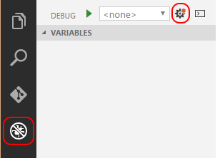

<properties pageTitle="Debugging UI tests"
  description="Debugging UI tests"
  services=""
  documentationCenter=""
  authors="Kraig Brockschmidt" />

# Debugging UI tests

Because the UI tests we’ve seen are written in code, the tests themselves might contain errors that could lead to false test results. Debugging a UI test within the context of Appium can be a bit tricky, however, because we’ve just been running those tests from the command line. Fortunately, there are several options for diagnosing what’s happening in a test.

First, *console.log* will produce output on the command line that effectively becomes part of the report generated by the test framework. For simple cases, this is helpful to examine variables before an assertion and to output state values for UI elements.

To step through the code in a UI test, you’ll need a debugging environment that can work with whatever language and runtime you’re using for your tests. With Node.js as we’ve been working with here, you can use either [Visual Studio Code](https://www.visualstudio.com/products/code-vs), which has built-in Node.js support and runs on Windows, OS X, and Linux, or [Visual Studio with the Node.js Tools extension](https://www.visualstudio.com/en-us/features/node-js-vs.aspx), which runs on Windows (or on OS X inside a Windows VM).

For debugging purposes, change line 10 in [**test07.js**](https://github.com/Microsoft/cordova-samples/blob/master/ui-testing/test07.js) to read *debugging = true*. This makes sure that various timeouts are increased so that you can step through and examine code without having Appium or Mocha time out and stop the app prematurely.

## Debugging in Visual Studio Code

1.	Launch Visual Studio Code and open the folder where your test resides. We’ll be using test07.js from the previous topic in this example.

2.	Click the Debug icon (lower left in the image below), then click the gear icon (upper right), and select Node.js as the debugging environment when prompted.

	 

3.	This creates and opens launch.json with several default configurations. Here’s we’ll create a new configuration specifically for debugging. Just add the code below within the *configurations* array:

	{
	    "name": "Debug Mocha UI Tests",
	    "type": "node",
	    "request": "launch",
	    "program": "C:\\Program Files (x86)\\nodejs\\node_modules\\mocha\\bin\\_mocha",
	    "stopOnEntry": false,
	    "args": [
	        "--no-timeouts",
	        "test07.js"
	    ],
	    "cwd": "${workspaceRoot}/.",
	    "runtimeExecutable": null,
	    "runtimeArgs": [
	        "--nolazy"
	    ],
	    "env": {
	        "NODE_ENV": "development"
	    },
	    "externalConsole": false,
	    "sourceMaps": false,
	    "outDir": null
	}

4.	Modify the path in “program” to the absolute path to the Mocha executable on your machine. What’s shown here for a typical location when installed with *npm install --g mocha*. On OS X, the path will likely be "/Users/myname/myfolder/node_modules/mocha/bin/_mocha". If you install Mocha instead as a dev dependency, you could use “${workspaceroot}\\node_modules\\mocha\\bin\\_mocha” (using /on OS X).

5.	In both cases, be sure to point to **_mocha** (with the underscore) and not just *mocha*. This is essential because _mocha is the process that will actually load and run the test07.js file, and to which we want to attach the debugger. If you try to use *mocha* without the underscore, you’ll attach to its wrapper process and none of the breakpoints will be hit. 

6.	Set breakpoints on the code you want to debug as shown by the red dots on the left in the image blow. Note that because of all the async calls to **wd** using **yiewd**, you won’t be able to simply step through each call as if they were synchronous. You’ll need to set breakpoints on each line that you want to examine.

	 

7.	Check that line 10 of test07.js sets the *debugging* variable to true.

8.	In Visual Studio Code, select your new configuration from the dropdown, then click the green arrow (or press F5) to start debugging. 

	

9.	When you hit breakpoints, you can examine any variables that have been set up to that time, and toggle additional breakpoints as needed. To continue running to the next breakpoint, press F5 or the green arrow again.

Note: if you get a message saying that Node.js can’t continue running, try removing the breakpoint on the current line and clicking the green arrow again.

10.	When running in Visual Studio Code, Mocha’s test reports appear in its console window.

## Debugging with the Node.js Tools for Visual Studio

1.	Follow the steps in Run tests with the Node.js Tools for Visual Studio topic. This creates a project to host your test code.

2.	Check that line 10 of test07.js sets the *debugging* variable to *true*.

3.	Set whatever breakpoints you need in your test code. Note that because of all the async calls to **wd** using **yiewd**, you won’t be able to simply step through each call as if they were synchronous. You’ll need to set individual breakpoints on each line that you want to examine.

4.	Open Test Explorer using **Test > Windows > Test Explorer**.

5.	Right click the desired test and choose **Debug selected tests…**.

6.	When stepping through code, you’ll need to use **Continue** to step over any line that uses yield, and you’ll need a breakpoint on a subsequent line to pause again.
