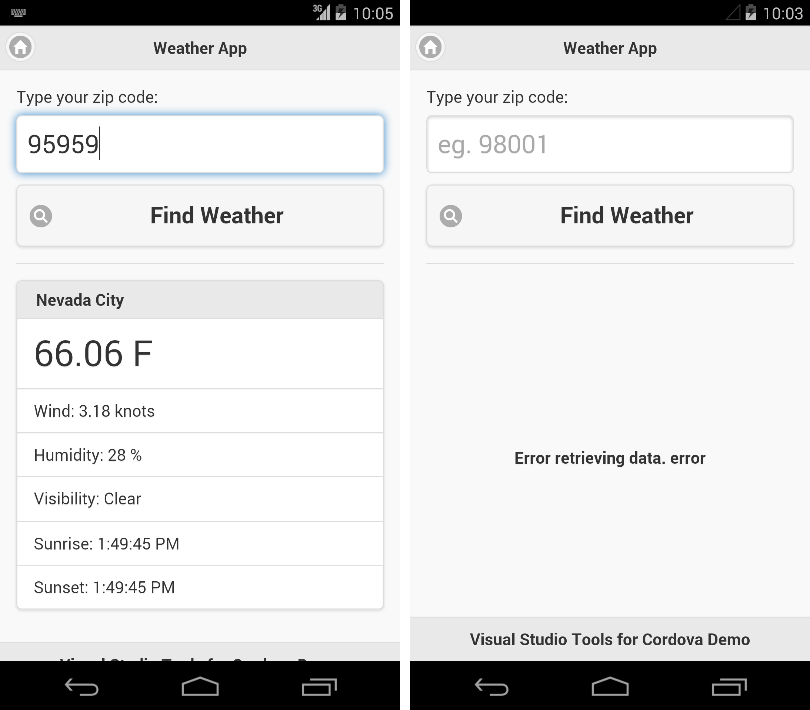

<properties pageTitle="Running UI sequences"
  description="Running UI sequences"
  services=""
  documentationCenter=""
  authors="Kraig Brockschmidt" />

# Running UI sequences

The WeatherApp sample contains a simple UI with an input field for a ZIP code and a button to go retrieve weather data for that location. If successful, the app displays that data, otherwise it shows an error message.

Even with a simple UI on a single page, there are many things to test in the UI: giving it good and bad input, checking error messages under a variety of conditions (like no connectivity), and checking for appropriate output (for example, notice that the sunrise and sunset times shown above are the same, which shouldn’t ever be the case).
 
In this section, though, we’ll focus on the foundational mechanics of writing and running simple *UI sequences* with Appium. The reason for this is simple: a UI sequence is the heart of a test, but it helps to understand how those sequences work independent of formal test structures. That is, the difference between a UI sequence and a test is that a test wraps a UI sequence in the appropriate code for your test framework and includes assertions. We’ll add that part in [Designing and writing UI tests](uitest-05-designing-tests.md).

## Working with the WebDriver API

In our first bit of test code, **[test01.js](https://github.com/Microsoft/cordova-samples/blob/master/ui-testing/test01.js)**, we set the **autoWebview** capability to true. This tells Appium to automatically switch to the Webview context in the app, such that any commands we now send through the WebDriver API (through the *appDriver* variable in our code, using the node.js **wd** client library) are scoped to that Webview. This means we can just jump right in to locating elements and interacting with them through that API.

The **wd** library is found in its entirety on [https://github.com/admc/wd](https://github.com/admc/wd). This also happens to be the best place to find documentation and examples, as well as the source code if you want to dig deeper. The ReadMe on this page shows the primary usage flows. Also, for an example of interacting with an Android Webview, refer to the [Appium android-webview.js code]( https://github.com/appium/sample-code/blob/master/sample-code/examples/node/android-webview.js).

One thing you’ll discover is that **wd** lacks an API reference; you primarily look at the examples as well as the source code in [https://github.com/admc/wd/tree/master/lib]( https://github.com/admc/wd/tree/master/lib) for the details you need. The source code, specifically, has documentation in comments on each function. Here’s a brief rundown of what you’ll find in the different files of that repository; some of the most common methods are in bold:

<table>
<thead>
<tr><td>File</td><td>Description</td><td>Key APIs</td></tr>
</thead>
<tbody>
<tr>
<td>elementCommands.js</td><td>Actions on elements</td><td><strong>getValue</strong>, text, textPresent, <strong>clear</strong>, type, <strong>sendKeys</strong>, <strong>setText</strong>, <strong>click</strong>, tap, doubleClick, getAttribute, getTagName, <strong>isDisplayed**, isSelected, isEnabled, isVisible, element, elements, equals, <strong>sleep</strong></td>
</tr>
<tr>
<td>commands.js</td>
<td>Configuration and session control, element location</td>
<td><strong>elementBy[ClassName, CssSelector, Id, Name, LinkText, TagName, Css**]</strong> etc.; <strong>quit</strong>, waitForElement[s], takeScreenshot, saveScreenshot, rotateDevice, toggleAirplaneModeOnDevice, [un]lockDevice, shakeDevice</td>
</tr>
<tr>
<td>actions.js</td><td>Support to touch gestures (TouchAction and MultiAction objects</td><td>TouchAction: longPress, press, release, tap, wait, perform, cancel
MultiAction: add(touchAction), perform, cancel</td>
</tr>
</tbody>
</table>

Now remember that Appium is a server that responds to HTTP requests. This means that Appium is inherently asynchronous, and thus all the **wd** APIs are also asynchronous. Handling this is fortunately straightforward, and is spelled out in the root readme on the [wd GitHub page](https://github.com/admc/wd). Although you can use the “Pure async” option with lots of nested callbacks if you want, doing so gets really messy for anything but the simplest tests. So let’s explore three other options:

- Chaining methods together (which uses built-in promises that are entirely hidden, referred to as “Q promises + chaining” on the **wd** page).
- Chaining methods together with explicit *.then* promise structures.
- Using the **yiewd** wrapper for **wd** along with the *yield* keyword.
 
As we’ll see, the first method is the most compact but has a few limitations. The second is more flexible but more verbose. The third introduces another dependency, but has the advantage of combining the best of the other two. It’ll really come down to your personal choice.

When running all these tests, take a moment to observe that they do run fairly quickly, especially when using an attached device or an emulator that is already up and running. This is a great characteristic to have, because it means you can frequently run UI tests along with builds to catch regressions early, and also means that you’ll make efficient use of paid device or emulator test clouds such as Sauce Labs.

## Chaining with implicit promises (test02.js)

With this option, tests are written by stringing together a whole series of method calls with dot operators. To enable it, you must first obtain the driver object with *wd.promiseChainRemote* rather than *wd.Remote*:

	var appDriver = wd.promiseChainRemote({
		hostname: 'localhost', 
		port: 4723,
	});

You then make the same call to *init* with your configuration unchanged, and then tack on as many additional method calls as needed. The code example below, which you can find in **[test02.js](https://github.com/Microsoft/cordova-samples/blob/master/ui-testing/test02.js)**, locates the ZIP code entry field (using the id attributes from the HTML), enters a value, taps the Find Weather button, waits five seconds, and then stops the app (as you’d normally do when tests are complete). Included in this are a few *sleep* calls to pause the test when appropriate, such as waiting a few seconds at the beginning to let the Cordova app initialize itself:

	appDriver.init(config.android19Hybrid)
	    .sleep(3000)                         // Wait 3 seconds for the app to fully start
	    .elementById('zip-code-input')       // Locate the text entry field
	    .clear()                             // Clear its contents
	    .sendKeys("95959")                   // Enter a value
	    .elementById('get-weather-btn')      // Locate the Find Weather button
	    .click()                             // Tap it 
	    .sleep(5000)                         // Wait 5 seconds
	    .quit();                             // Stop the app instead of waiting for a timeout  

Run test02.js in node:

	node test02.js

You should see the app start, a pause, then “95959” is entered into the ZIP code field, the button is tapped, and then some results appear in the output. Click on the image below to see a video of what the process looks like:

> **Note**: the five second delay at the end of the test is there so we can visually see the after-test state of the app. When running automated UI tests, there is no need for this pause because we’ll be looking at test reports rather than watching the tests in real time.

At this point we’re not checking any of the output. We’ll come back to that later, but if you want to see an example for a web app, see “Usage > Q promises + chaining” on [https://github.com/admc/wd]( https://github.com/admc/wd).

When you get proficient at writing UI tests, this particular method of chaining operations and test assertions is very efficient. However, it’s very likely that you’ll need to debug tests along the way, by setting breakpoints in Visual Studio (or Visual Studio Code, which is excellent for debugging node.js scripts) and/or getting access to intermediate values for console output. Furthermore, you may need to do some intermediate computations for your test assertions or compare values in multiple elements. In both cases, the implicit chaining structure is more difficult to work with, so it’s helpful to have a more explicit procedural structure as the next two options provide.

More on debugging can be found in the [Debugging UI tests](uitest-06-debugging.md) section.

## Chaining with .then callbacks (test03.js)

To expand the promise chain you can use *.then* chaining on the promises involved, as shown in the **[test03.js](https://github.com/Microsoft/cordova-samples/blob/master/ui-testing/test03.js)** file:

	var txtZip; //Intermediate to use in multiple callbacks

	appDriver.init(config.android19Hybrid)
	    .then(function () {
	        // Wait 3 seconds for the app to fully start
	        return appDriver.sleep(3000);
	    }).then(function () {
	        // Locate the text entry field
	        return appDriver.elementById('zip-code-input');
	    }).then(function (e) {
	        txtZip = e;
	        // Clear contents
	        return txtZip.clear();
	    }).then(function () {
	        // Enter a value
	        return txtZip.sendKeys("95959");
	    }).then(function () {
	        // Locate the Find Weather button
	        return appDriver.elementById('get-weather-btn');
	    }).then(function (btnGetWeather) {
	        // Tap the button
	        return btnGetWeather.click();
	    }).then(function () {
	        // Wait five seconds 
	        return appDriver.sleep(5000);
	    }).fin(function () {  //.fin means "finally" for the end of the chain
	        appDriver.quit()
	    }).done();

This code is functionally equivalent to what’s in test02.js, and again calls *wd.promiseChainRemote* to retrieve *appDriver*. In the chain, each *.then* takes a callback function as an argument, and that function receives an argument appropriate to the return value of the previous callback in the chain, such as an element from *elementById*. To make all this work, ensure that each callback includes *return* on the next call in the sequence. 

This expanded structure is obviously more verbose than implicit chaining, but because you have explicit callbacks for each step you can include any other code you need therein. You can also see that test03.js saves the entry field element in an intermediate variable, *txtZip*, so it can be used in any later callback.

Because both this approach and the implicit chaining approach use *wd.promiseChainRemote*, you can mix-and-match them as you see fit. That is, for tests that don’t need any intermediate work, you can use implicit chaining, and then expand the chain in specific cases. But as we’ll see next, using **yiewd** gives you the advantages of both together. 

## Using yiewd and yield (test04.js)

Yiewd, https://github.com/jlipps/yiewd, is a wrapper for **wd** that takes advantage of the *yield* keyword to write asynchronous test code without all the ceremony of chaining. (The yiewd page on GitHub says that the name is a combination of yield + wd, but it’s perhaps it also comes from a developer with a small child in the house that couldn’t quite say “yield” correctly!)

> **Note**: the *yield* keyword requires a current version of Node.js, like 4.4.3. Older versions that lack this *yield* support and will throw syntax errors on that keyword.

Start by adding **yiewd** to your project with npm:

	npm install yiewd

Then use **yiewd** to create the *wd* instance (instead of calling *wd.remote* or *wd.promiseChainRemote*):

	var yiewd = require("yiewd");

	var appDriver = yiewd.remote({
		hostname: 'localhost',
		port: 4723,
	});

The resulting test code is then very clean, as seen in **[test04.js](https://github.com/Microsoft/cordova-samples/blob/master/ui-testing/test04.js)**, where every call to the **wd** API must be preceded by *yield*:

	appDriver.run(function*() {
	    // 'this' is appDriver
	    var session = yield this.init(config.android19Hybrid);
	    yield this.sleep(3000);
	    
	    var txtZip = yield this.elementById('zip-code-input');
	    yield txtZip.clear();
	    yield txtZip.sendKeys("95959");
	    
	    var btnGetWeather = yield this.elementById('get-weather-btn');
	    yield btnGetWeather.click();
	    
	    yield this.sleep(5000);
	
	    // OK to omit yield on the last call
	    this.quit();
	});

As you can see, using **yiewd** produces test code that’s almost as clean as implicit chaining, yet has discrete method calls and explicit variables that allow for easy debugging and intermediate computations. For this reason, we’ll be using **yiewd** in all the examples that follow.

> Function*: the function* syntax defines a “generator” function that can be exited and later re-entered, as described on the [Mozilla Developer Network function* page]( https://developer.mozilla.org/en-US/docs/Web/JavaScript/Reference/Statements/function*). This works hand-in-hand with *yield* and is essential to make the code above work properly because a bunch of callbacks are still in operation under the covers. Again, if you see syntax errors with function*, be sure to update Node.js.
