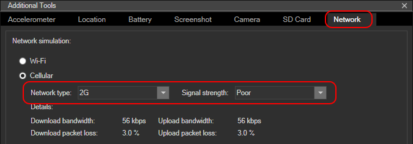

<properties pageTitle="Designing and writing UI tests"
  description="Designing and writing UI tests"
  services=""
  documentationCenter=""
  authors="Kraig Brockschmidt" />

# Designing and writing UI tests

In the previous section we learned the fundamentals of running a UI sequence with Appium. However, the code we wrote did not as yet constitute a test because we didn’t assert anything about the state of the app compared with expected results. That’s what we’re now ready to explore, with the help of test frameworks and test runners.

We’ll do this in two stages. First, we’ll install the tools we need and create a single UI test for the WeatherApp sample to assert that entering a ZIP code and tapping the Find Weather button results in either the display of weather data or the display of an error message. This helps us work through the core mechanics of a test. After that, we’ll talk more deeply about *designing* UI test cases, thinking especially about what, exactly, needs to be tested through the UI that cannot be tested or is better tested on some other level like unit testing or integration testing.

> **Note**: one advantage of using Apache Cordova for mobile apps is that the UI on each platform is generated from the same HTML and CSS, and thus tests that reference those elements can be run on multiple platforms. With native UI, on the other hand, how you reference elements is unique to each platform and thus requires you to write separate tests.

## Test framework and test runner

To write a test, rather than just a UI sequence, we need the same components as with unit testing: a test framework with which to define tests and a test runner that understands the test framework to execute the tests and produce reports.

Unlike unit tests, UI tests don’t call any app code directly—as we’ve seen, the tests are sending HTTP requests to Appium, which then calls into the platform-specific UI automation tools. From the testing side, this means you can freely choose whatever combination of language, test framework, and test runner combination that you prefer regardless of how the app is built. Appium, for its part, provides [client libraries]( https://github.com/appium/sample-code/tree/master/sample-code/examples) for Python, Java, .NET, Ruby, Perl, php, and of course, Node.js.

Because you’re already a JavaScript developer, we’ll stick with JavaScript for the language and Node.js for the runtime. This combination supports a variety of frameworks and test runners, such as Jasmine and Mocha, which you can also use for unit testing. In this tutorial, we’ll write tests that can work with both, depending on your preference.

To install Jasmine:

	npm install –g jasmine

And Mocha:

	npm install –g mocha

Also install the Chai assertion library, which will work with both (Mocha doesn’t have an assertion library built in, like Jasmine does):

	npm install chai    #Install in your test folder

Another option here is to use [Protractor]( http://angular.github.io/protractor/#/), a test runner built on WebDriver and Jasmine that originates with AngularJS, like the Karma test runner. It has certain advantages, especially for apps that use Angular or Ionic, along with a few differences (see sidebar below).

Also note that we aren’t able to use a test runner like Chutzpah that’s integrated with Visual Studio’s Test Explorer because by bringing libraries like **yiewd** and **Chai** we create a dependency on Node.js. That said, you can still run tests using Visual Studio’s Task Runner, and you can use Visual Studio or Visual Studio Code to debug your tests as covered in “Debugging UI tests.”

> **Protractor notes**: With Protractor, you launch it with a separate Karma-like configuration file that specifies the Appium capabilities along with the names of the test files, so you don’t need the capabilities and the *appDriver.init* call in those test files themselves. The [WebDriver API that’s built into Protractor]( http://angular.github.io/protractor/#/api) is also a little different from **wd**—for example, the *elementById* API we’ve been using becomes *element.findElement(By.id(‘<id>’))* in Protractor.
> If you’re using Angular or Ionic, Protractor also provides an API with helper methods for automating a page using locator strategies, along with the ability to drive UI with injected JavaScript. Both are helpful, for example, when you have an element in a template without an ID and need to target that element based on some other heuristic. 

## Create a first test

Let’s expand test04.js from the previous section by adding the Jasmine adornments and assert that pressing the Find Weather button with a suitable ZIP code shows either weather data or an error message. To be specific, after tapping Find Weather, either the *weather-data* element is visible (below left), or the *error-msg* element is visible (below right). 
     

In this test we don’t need to assert visibility of any children of *weather-data* because none of those have distinct visibility apart from the parent (*weather-data* is a *ul* and all the children are *li* elements). Neither do we need to assert values of any of the display elements for two reasons: (a) the values are highly variable, and (b) the reasonableness of those values are better tested through assertions on the data we get from the backend service, rather than testing them in the UI. This is a case for an integration test that we’ll talk about more under “Design your UI test cases” below.

To check the visibility of *weather-data* and *error-msg*, we need only add a little bit to the UI sequence we had before (the *expect().to.equal* methods are from Chai as we’ll see momentarily):

	var elemData = yield this.elementById('weather-data');
	var elemErr = yield this.elementById('error-msg');
	
	var visData = yield elemData.isDisplayed();
	var visErr = yield elemErr.isDisplayed();
	
	var eitherVisible = (visData && !visErr) || (!visData && visErr);
	expect(eitherVisible).toBe(true)

It’s very important here to remember that every interaction with the app through the **wd** API happens asynchronously, hence the many uses of *yield*. In this test code, too, the “element” variables are **wd** objects with async methods, not HTML elements with properties, so to check visibility we call the async *isDisplayed* API rather than looking at an HTML property. (This can be tricky to discover; again, refer to the **wd** sources like [element-commands.js](https://github.com/admc/wd/blob/master/lib/element-commands.js) for documentation on the APIs.)

To complete the test, we need to wrap the UI sequence with the appropriate Mocha/Jasmine framework constructs: a call to *describe* to create the container for the test, followed by an *it* call with the UI sequence and assertions. You can find all this in **[test05.js](https://github.com/Microsoft/cordova-samples/blob/master/ui-testing/test05.js)**, which is shown below—with lengthy comments omitted because we’ll talk about those details after the code:

	var yiewd = require("yiewd");
	
	// [Note 1]
	var chai = require("chai");
	var expect = chai.expect;
	
	// [Note 2]
	var debugging = false;
	 
	var timeouts = {
	  appium: debugging ? 60 : 10,              // Timeout before Appium stops the app
	  framework: 1000 * (debugging ? 600 : 30), // Timeout for completing each test  
	};
	
	// [Note 3]
	// Object to store the names of the frameworks once
	var frameworks = {
	  "mocha" : "mocha",
	  "jasmine" : "jasmine"  
	};
	
	// Set this variable according to the framework you're using
	var framework = frameworks.mocha;
	//var framework = frameworks.jasmine;
	
	// [Note 4]
	var config = {};
	
	config.android19Hybrid = { 
	  automationName: 'Appium',
	  browserName: '',
	  platformName: 'Android',
	  platformVersion: 19,    // API level integer, or a version string like '4.4.2'
	  autoWebview: true,
	  deviceName: 'any value; Appium uses the first device from *adb devices*',  
	  app: "D:\\g\\cordova-samples\\weather-app\\WeatherApp\\bin\\Android\\Debug\\android-debug.apk",
	  newCommandTimeout: timeouts.appium, 
	}; 
	
	var appDriver  = yiewd.remote({
	    hostname: 'localhost',
	    port: 4723,
	  });
	
	// [Note 5]
	describe ("Find weather page", function () {
	  // [Note 2 again]
	  // Set the timeout in the framework
	  switch (framework) {
	    case frameworks.mocha:
	      this.timeout(timeouts.framework)
	      break;
	      
	    case frameworks.jasmine:
	      jasmine.DEFAULT_TIMEOUT_INTERVAL = timeouts.framework;
	      break;
	  }
	
	  // [Notes 6, 7]
	  it ('displays either weather data or an error message', function (done) {
	    appDriver.run(function* () {
	      // 'this' is appDriver     
	      var session = yield this.init(config.android19Hybrid); 
	      yield this.sleep(3000);
	            
	      var txtZip = yield this.elementById('zip-code-input');
	      yield txtZip.clear();
	      yield txtZip.sendKeys("95959");
	            
	      var btnGetWeather = yield this.elementById('get-weather-btn');
	      yield btnGetWeather.click();
	      
	      // [Note 8]
	      yield this.sleep(3000);
	            
	      var elemData = yield this.elementById('weather-data');
	      var elemErr = yield this.elementById('error-msg');
	
	      var visData = yield elemData.isDisplayed();
	      var visErr = yield elemErr.isDisplayed();
	      var eitherVisible = (visData && !visErr) || (!visData && visErr); 
	
	      expect(eitherVisible).to.equal(true);
	      
	      // Tell the framework that we're done with the async series 
	      done(); 
	    });
	        
	  });
	});

Here are the points of interest in this code, as indicated by the notes:

1.	Here we bring in the Chai assertion library and make a variable to use *expect* syntax. You can also use *should* or *assert* syntax, see [http://chaijs.com/](http://chaijs.com/).

2.	Appium's default timeout is 60 seconds, which is appropriate for debugging but somewhat too long when you want to run straight through tests, make changes, and run tests again. For faster iterations, it’s helpful to shorten that timeout and have Appium close the app quickly using the **newCommandTimeout** capability. Be careful to not make this too short, though, or else Appium might close the app while the test is starting up!

	- Mocha’s/Jasmine's default timeouts for tests are 2/5 seconds, respectively, which is much too short for a UI test that starts the app and does any kind of asynchronous work. You'll need to set it to something like 15 or 30 seconds for running tests straight through. When debugging, you'll need to set it to something much longer, like 5 minutes, so you have time to examine variables and such. See [Mocha timeouts]( http://mochajs.org/#timeouts) and Jasmine’s [*DEFAULT_TIMEOUT_INTERVAL* property]( http://jasmine.github.io/2.0/introduction.html#section-Asynchronous_Support).

	- This bit of code with the *debugging* variable makes it convenient to switch between sets of timeouts. The timeouts themselves are set later through the *switch* statement inside *it*.

3. This bit of code to select a framework is just here to keep the string names in one place.

4.	You could put all the configuration in a separate file and add a *require* call to bring it in, which can make it easy to switch between different settings. For examples, see [https://github.com/appium/sample-code/blob/master/sample-code/examples/node]( https://github.com/appium/sample-code/blob/master/sample-code/examples/node) and the helper/appium-servers.js file. Note that the path to the app package here is specific to your development machine.

5.	The *describe* method creates a container for multiple tests. Its first argument is generally the description of what’s being tested (a noun, in other words); the second argument is the callback that does the work.

6.	The *it* method defines one test. Its first argument is the description of the test, typically starting with a verb. In Jasmine’s reports, this text is appended to the string given to *describe*; in this code, the report would read “Find weather page displays either weather data or an error message.”

7.	The second argument to *it* is the callback to perform the test. Because we’re doing asynchronous calls within the test, we must define an argument for this callback named *done* and call that function to inform Jasmine when the test is complete.

8.	The click on the Find Weather button generates an HTTP request, so we want to wait long enough for that request to complete before checking for the UI state change. If you set an explicit timeout for HTTP requests in the app, it'd be appropriate to use that value here. In this case, three seconds is a reasonable number as WeatherApp just uses jQuery’s *ajax* API to make the request, and its timeout depends on the underlying platform.

With all this, we can now run the test using Jasmine or Mocha, both of which launch the app via Appium (as we’ve been doing), and report any test failures. As the test runs, you’ll see UI interactions happening in the emulator or device, with various console output in the Appium window. Reports from the test framework appear in the command window where you start the test.
For Jasmine, start the test as follows:

	jasmine test05.js

If the test passes, you’ll see only a little output (and notice that it took 21 seconds to run the test, which is why we needed to set a longer timeout):

	Started
	.
	
	1 spec, 0 failures
	Finished in 21.087 seconds

If you want to test the error condition, disable networking on the device or emulator and run the test again. It should succeed with the same report as before.

To see a failure report, change the assertion in [**test05.js**](https://github.com/Microsoft/cordova-samples/blob/master/ui-testing/test05.js) to expect visibility of either control to be false:

	expect(eitherVisible).to.equal(false);

Here’s the output in that case:

	Started
	F
	
	Failures:
	1) Find weather page displays either weather data or an error message
	  Message:
	    Expected true to be false.
	    [stack trace omitted]
	
	1 spec, 1 failure
	Finished in 15.012 seconds

Running the test in Mocha is just as simple:

	mocha test05.js

A passing report is a little more verbose than Jasmine (and took a little over 15 seconds in this case):

	Find weather page
	  √ displays either weather data or an error message (15124ms)
	
	1 passing (15s)

A failing report (if we again change the assertion), looks like this:

	Find weather page
	  1) displays either weather data or an error message
	
	0 passing (13s)
	1 failing
	
	1) Find weather page displays either weather data or an error message:
	    Uncaught AssertionError: expected true to equal false
	    + expected - actual
	
	    -true
	    +false
	
	    at [stack trace omitted]

Again, you can choose either framework as you prefer. The tests we’ll write will work with either one.

## Designing UI test cases: checking for state and state changes

Now that we understand the mechanics of writing a single UI test, we’re ready to think through how, exactly, to fully test WeatherApp’s UI. Before jumping into writing test code, however, let’s take a step back (like we did with [test-driven development](unit-test-05-tdd.md) and think about *what* we need to specifically test.

For this it’s helpful to do a side-by-side comparison with unit testing:

<table>
<thead>
<tr>
<td>Characteristic</td><td>Unit Testing</td><td>UI Testing</td>
</tr>
</thead>
<tbody>
<tr>
<td>Action</td><td>Call a unit of code</td><td>Execute a sequence of user actions (including startup)</td>
</tr>
<tr>
<td>Data/Parameters</td><td>Input data for the code</td><td>Ordering of actions and input values for controls</td>
</tr>
<tr>
<td>Results</td><td>A <em>value</em> of some kind (including an object with properties)</td><td>A <em>state change</em> in the UI</td>
</tr>
<tr>
<td>Assertions</td><td>Compare expected values to actual values</td><td>Compare expected state to actual state</td>
</tr>
<tr>
<td>Type of regression</td><td>Functionality of code</td><td>UI layout and behaviors</td>
</tr>
</tbody>
</table>

Put simply, in unit testing we call a unit of code with some *input data* and receive back a *value* of some kind (which could be an object with multiple properties), and then we make an assertion about that value. In UI testing, we execute *user actions* that affect a *state change* in the UI, and then we make an assertion about that *state*, which includes assertions about layout. Just as unit testing catches regressions—unexpected changes—in the *functionality* of code, UI testing catches regressions in *how things look and how they behave*. 

UI testing, in other words, should focus on matters that are *specifically* UI concerns, such as the *visibility* of information, the visual or interactive *status* of certain controls, responsiveness to user actions like panning, and so on. UI tests *don’t* need to concern themselves with the *validity* of displayed information, because such matters should be covered by unit tests or integration tests.

> **Note**: as with unit tests, each UI test should be specific such that if it fails, you immediately know the exact cause. For UI, however, a “single” test for a state change might involve checking the state of many different elements that *as a group* make up that one test especially when those controls always change state together. In such contexts it doesn’t make sense to check each control individually.
 
To use a trivial example of the quintessential calculator app, unit testing should cover whether the functions that perform mathematical operations actually produce the correct results for a variety of inputs, including edge cases. Because of this, UI tests don’t need to test that same range of input values. What they *do* need to test are the *bindings* between UI elements and those operations. This is especially important with actions that don’t have backing operational functions, like clear, memory set/retrieve, changing number bases, and anything else that affects the UI display only.

With this in mind, then, UI tests for the digit buttons would make sure that the “1” button results in a “1” on the display, that a series of “1” “+” “5” “=” displays 6, that the clear button results in a “0”, and so on. (You’d probably also include tests that check for an overload indicator on the display.) This way, if a developer error breaks a button binding at some later time, the UI tests will catch this regression quickly. Leave it to the unit tests to catch regressions in the mathematical operations themselves.

There’s another example in WeatherApp. You might have noticed in previous screenshots that the app shows the same timestamp for both sunrise and sunset. This is clearly a defect (since corrected in the code on GitHub), and it’s tempting to think of it as a UI problem. The truth, though, is that it’s an issue with either the *quality* of data from the service or the *handling logic* for the data in the app, and not a problem with the UI *state change* in the app when it displays data. From a UI point of view, that is, the app correctly displays the appropriate elements and correctly routes values from the data service and app logic code.

A UI test, in other words, is **not** the place to assert whether the data itself actually makes sense. We might want the app, of course, to filter out bad values, in which case we’d insert a filtering function in the processing logic that routes the response data to the UI, and we’d write unit tests for that function. A simple unit test, in fact, would have easily caught the code bug.  

We might also write integration tests to monitor the quality of data from the services we depend upon, so that we can notify the service owners if we see problems (and encourage them to have good unit tests for the service!). Such code-level integration tests are generally easier and cheaper to write than the equivalent UI tests.

An exception to this principle is when UI data-binding code includes declarative converters or formatters that don’t otherwise exist in code that can be unit-tested. In such cases, testing the validity of the output in the UI is the only means to test those converters and formatters.

## WeatherApp UI test cases

To do full UI testing for an app means to think through all the ways we want the app to look and behave. With WeatherApp, which has just a single page with a simple UI, we’ve already tested the primary behavior of entering a zip code and tapping the Find Weather button. But that’s just one UI scenario out of many, and isn’t sufficient to catch regressions in the UI, such as an unexpected change in the visual layout.

Note that having a UI design, and thinking through the interactions with it, is test-driven or behavior-driven development from the UI standpoint. Just as unit tests embody the functional specification for the app’s code, UI tests embody the visual and behavioral specification. It’s entirely possible, in fact, to take a test-driven development approach with UI by starting with a blank UI and a bunch of tests that fail. Then you can incrementally write UI to pass tests.

With WeatherApp, we already have the core UI in place, so we’re not quite starting from scratch. Nevertheless, if we think through all the UI behaviors we want, and then write and run those tests, we’ll certainly find places to improve the code.
Here, then, are other UI behaviors we can test:
 
- When the app starts, before Find Weather is pressed at all, there should be either an appropriate error message (for no connectivity or failed geolocation), or there should be some weather data in place (if geolocation works). This is essentially the same test as we already did with a ZIP code, but we want to run it without entering a ZIP code value directly.
- If geolocation takes a while, an appropriate message should appear. This is really covered by the previous test if the device is set to use a slow network.
- The app should disallow non-numerical input, and accept only five digits. Otherwise there’s a potential risk for injection-type attacks, which could cause a service to block access by our app entirely, which would be very bad for customers.
- The app should disable the Find Weather button when non-valid input exists in the ZIP code field. That is, we shouldn’t rely on the weather service to give us errors for bad input data, because that requires making an API to the service which wastes data bandwidth and battery power.
- An appropriate error message should appear if we lose connectivity while waiting for the weather service to respond, or if there’s a timeout.
 
In short, this list anticipates potential ways that customers might abuse the app, and potential conditions—namely connectivity—that we need to handle gracefully. We’ll add test code for these in the next section.

Here are also some additional areas to think about that aren’t covered in this documentation or don’t apply to WeatherApp, but might be important in your own projects:

- Startup time, an important performance consideration
- Visual layout/exact placement of elements
- Portrait/landscape transitions
- Animations and content transitions
- Suspend/resume behavior
- Terminate/restart behavior
- Push notifications
- Data persistence, both in local storage and cloud storage.
- Proper data-binding behavior, especially if this happens through declarative code that can’t otherwise be unit-tested. In the case of using variable data from a service, it can help to create a mock service that returns known values against which you write assertions.

When writing tests, keep in mind that although some tests could be run together in the same app session, other tests will need a session of their own. That is, each test can start the app from scratch if needed, which means having a separate test file that will launch the app independently from other tests.

## UI tests for WeatherApp

As noted in the previous section, when you create multiple UI tests you need to consider whether each test should run with a new app session or multiple tests can share the same session. The primary factor here is whether one test depends on a state change from a previous test.

When you have multiple tests in the same test file, Mocha and Jasmine will run each test (the it methods) in the order they appear. This way you can do sequential tests. Just make sure that each one calls *done()* at the end, or else Appium will time out and end the session without running any additional tests.

When you have multiple tests in the same file (that is, in the same test group), you might need to refactor common elements of the tests themselves.

This is where “hooks” in the test frameworks come into play, which are specially-named functions in which you can supply any code you want to execute at certain times:

<table>
<thead>
<tr>
<td>Mocha hook</td><td>Jasmine hook</td><td>Description</td>
</tr>
</thead>
<tbody>
<tr>
<td><em>before</em></td><td><em>beforeAll</em></td><td>Code that is run once before any test in the group is started.</td>
</tr>
<tr><td><em>beforeEach</em></td><td><em>beforeEach</em></td><td>Code that is run before each test</td>
</tr>
<tr>
<td><em>afterEach</em></td><td><em>afterEach</em></td><td>Code that is run after each test</td>
</tr>
<tr><td><em>after</em></td><td><em>afterAll</em></td><td>Code that is run once after all the tests in the group are complete.</td>
</tr>
</tbody>
</table>

In our test code with WeatherApp, the *before* hook is a perfect place to all *appDriver.init* to launch the app. Note that in this code we are using the yiewd form of *function**, *appDriver.run*, and *yield*:

	before(function (done) {
	  appDriver.run(function *() {
	    var session = yield this.init(config.android19Hybrid);
	    yield this.sleep(3000);    
	    done();      
	  });
	});
	Similarly, here’s an *after* implementation that shuts the app down after all the tests have finished:
	after(function (done) {
	  appDriver.run(function *() {
	    console.log("entering after");
	    yield appDriver.quit();
	    done();
	  });
	});

To refactor code that you want to use from multiple tests, be sure to use *function** in the declaration and *yield* in the body as before. For example, in WeatherApp we have two tests (startup and entering a valid ZIP code) that need to check mutually-exclusive visibility of the *weather-data* and *error-msg* elements. We can thus pull this code out separately as follows:

	function* checkDataErrVisibility(appSession) {
	    var elemData = yield appSession.elementById('weather-data');
	    var elemErr = yield appSession.elementById('error-msg');
	        
	    // Do an XOR on element visibility. isDisplayed is an API from wd, see
	    // https://github.com/admc/wd/blob/master/lib/element-commands.js. Remember
	    // that even this API is async, so use yield to retrieve the values.
	    var visData = yield elemData.isDisplayed();
	    var visErr = yield elemErr.isDisplayed();
	    var eitherVisible = (visData && !visErr) || (!visData && visErr);
	    return eitherVisible; 
	}

Because this is declared using *function**, we have to use *yield* when calling it. For example, with this and the *before* hook in place, the startup test for element visibility is simple:

	it ('displays either weather data or an error message on startup', function (done) {
	  appDriver.run(function* () {
	    var eitherVisible = yield checkDataErrVisibility(this);
	    expect(eitherVisible).to.equal(true);
	    done();
	  });
	});

These same couple of lines also are in the ZIP code test, of course, which you can find in **[test06.js](https://github.com/Microsoft/cordova-samples/blob/master/ui-testing/test06.js)** and run as follows:

	mocha test06.js

At this point, it’s instructive to change the conditions of the test by disabling the device’s network (either in the emulator or a real device). This will cause error messages to appear, and the tests should still pass.

In the Visual Studio Emulator for Android, you can simulate a slow network by setting it to 2G with poor signal strength:
 

In this case, the 3-second delays we built into the tests will elapse before the network responds, which will mean the error message is visible. The tests will still pass.

Now let’s write the remaining tests that we listed in the previous section, namely those that check for behaviors related to the text entry and Get Weather controls. This code is in **[test07.js](https://github.com/Microsoft/cordova-samples/blob/master/ui-testing/test07.js)**:

	it ('displays either weather data or an error message on startup', function (done) {
	  appDriver.run(function* () {
	    var eitherVisible = yield checkDataErrVisibility(this);
	    expect(eitherVisible).to.equal(true);
	    done();
	  });    
	});
	
	it ('disallows non-numerical characters in ZIP code field', function (done) {
	  appDriver.run(function* () { 
	    var txtZip = yield this.elementById('zip-code-input');
	    yield txtZip.clear();
	    yield txtZip.sendKeys("abced98");
	    var zipText = yield txtZip.text();
	    expect(zipText).to.equal("98");
	    done();
	  });        
	});
	
	it ('disallows more than five characters in ZIP code field', function (done) {
	  appDriver.run(function* () { 
	    var txtZip = yield this.elementById('zip-code-input');
	    yield txtZip.clear();
	    yield txtZip.sendKeys("987654321");
	    var zipText = yield txtZip.text();
	    expect(zipText).to.equal("98765");
	    done();
	  });        
	});
	
	it ('disables the Get Weather button if the ZIP code field contains fewer than five digits', function (done) {
	  appDriver.run(function* () { 
	    var txtZip = yield this.elementById('zip-code-input');
	    yield txtZip.clear();
	    yield txtZip.sendKeys("987");
	    
	    var enabled = yield isGetWeatherEnabled(this);
	    expect(enabled).to.equal(false);
	    
	    done();
	  }); 
	});
	
	it ('enables the Get Weather button if the ZIP code field contains five digits', function (done) {
	  appDriver.run(function* () { 
	    var txtZip = yield this.elementById('zip-code-input');
	    yield txtZip.clear();
	    yield txtZip.sendKeys("98765");
	    
	    var enabled = yield isGetWeatherEnabled(this);
	    expect(enabled).to.equal(true);
	    
	    done();
	  }); 
	});

We expect that the first three of these tests will fail because the app as yet doesn’t prevent non-numerical input nor does it check for longer entry strings. The fourth test will pass, though, because the button is always enabled. Here’s the mocha output (stack traces omitted):

	D:\tests\Appium>mocha test07.js
	
	  Find weather page
	    √ displays either weather data or an error message on startup (967ms)
	    1) disallows non-numerical characters in ZIP code field
	    2) disallows more than five characters in ZIP code field
	    3) disables the Get Weather button if the ZIP code field contains fewer than five digits
	    √ enables the Get Weather button if the ZIP code field contains five digits (1771ms)
	    √ displays either weather data or an error message on Get Weather press with valid ZIp code (5348ms)
	
	
	  3 passing (43s)
	  3 failing
	
	  1) Find weather page disallows non-numerical characters in ZIP code field:
	
	      Uncaught AssertionError: expected '' to equal '98'
	      + expected - actual
	      +98
	
	  2) Find weather page disallows more than five characters in ZIP code field:
	
	      Uncaught AssertionError: expected '' to equal '98765'
	      + expected - actual
	
	      +98765
	
	  3) Find weather page disables the Get Weather button if the ZIP code field contains fewer than five digits:
	
	      Uncaught AssertionError: expected true to equal false
	      + expected - actual
	
	      -true
	      +false

With these results we can take the test-driven development approach and write code in the app to pass one or more additional tests. To limit the ZIP code entry to at most five digits, we add *type=”number”* and *maxlength=”5”* attributes to the *zip-code-input* element in index.html:

	<input id="zip-code-input" name="zip-code" type="number" maxlength="5" placeholder="eg. 98001" required />

However, this doesn’t appear entirely reliable on all platforms. So we can also implement that behavior in a *keypress* handler (index.js):

	//Accept only digits (and special characters)
	$('#zip-code-input').keypress(function (e) {
	    var charCode = (e.which) ? e.which : e.keyCode
	    var isDigit = (charCode >= 48 && charCode <= 57);
	
	    if (charCode > 31 && !isDigit)
	        return false;
	                        
	    if (isDigit) {
	        var text = $('#zip-code-input')[0].value;
	        return (text.length < 5);
	    }
	
	    return true;
	});

To enable/disable the Get Weather button, we need to initially disable the button in HTML:

	<button id="get-weather-btn" data-role="button" data-icon="search" disabled >Find Weather</button>

And then check the length of the ZIP code value in its *change* event:

	//Whenever a key is released, check for enabling/disabling the button
	$('#zip-code-input').keyup(function (e) {
	    var text = $('#zip-code-input')[0].value;
	    $('#get-weather-btn').prop('disabled', !(text.length == 5));
	});

Running *mocha test07.js* again shows that we now pass those tests.

## Run tests with the Node.js Tools for Visual Studio

The [Node.js Tools for Visual Studio](https://www.visualstudio.com/en-us/features/node-js-vs.aspx) can be used as a test runner for Mocha, with direct integration into Visual Studio’s Test Explorer:

1.	Install any edition of Visual Studio 2015 (Community, Professional, or Enterprise) along with the [Node.js tools]( https://www.visualstudio.com/en-us/features/node-js-vs.aspx). You can install the latter using **Tools > Extensions and Updates**, then click **Online** on the left, search for Node.js, and install the tools (you’ll be prompted to restart Visual Studio in the process):

	 

2.	Create a stub host project using **File > New Project**, search on “Node.js,” and select “Blank Node.js Console Application (JavaScript).” You won’t actually be running this application itself. We’re simply using it as a shell in which to run tests using Mocha and see the results in Test Explorer. The real app is, of course, identified by the app package we specify in the Appium configuration and has a separate project of its own.

3.	To run Mocha tests, it’s necessary to have Mocha installed locally (see [Test Explorer in the Node.js tools documentation](https://github.com/Microsoft/nodejstools/wiki/Test-Explorer)). This is easily accomplished by adding Mocha and the other packages we need to the *devdependencies* section of package.json as below, then running *npm install* in the project folder.

	"devDependencies": {
	  "wd": "^0.4.0",
	  "mocha": "^2.5.3",    
	  "chai": "^3.5.0",
	  "expect.js": "^0.3.1",
	  "yiewd": "^0.6.0"
	}

4.	Select **Project > Add Existing Item…** and navigate to your test file, such as [**test07.js**](https://github.com/Microsoft/cordova-samples/blob/master/ui-testing/test07.js) that we used in the previous section.

5.	Click the test file in Solution Explorer and set the **Test Framework** in the **Properties** pane to Mocha:

	 

6.	Open the Test Explorer window using **Test > Windows > Test Explorer**, and you should see all the tests that Visual Studio finds in the test file. If you don’t see the tests automatically, select **Build > Build Solution**.

	 

7.	Assuming that the Appium server is running in a command windows, click **Run All** in Test Explorer to run the tests, or select and run an individual test. The results then appear in Test Explorer directly:

	 

> **Note**: The Node.js tools at present will reload the test file for each test it runs. In the example of [**test07.js**](https://github.com/Microsoft/cordova-samples/blob/master/ui-testing/test07.js), this means that all the setup code to initialize Appium and launch the app will be run for each test, and the app will shut down after each one as well. This is of little consequence if you need to relaunch the app for certain tests to begin with, but can make running other groups of tests slower.

> **Note**: When you reopen the project, the Node.js tools will rescan files for tests, including files contained in *node_modules*. If you’ve installed other packages locally, as we’ve done in this example, the scan will take some time and show many additional tests in Test Explorer. To isolate your UI tests, locate and select them in the list, the right-click and select **Group By > Project**. This will put them into a list of their own with perhaps just a couple of other tests. To run them specifically, then, select them, right-click, and select **Run Selected Tests**.
