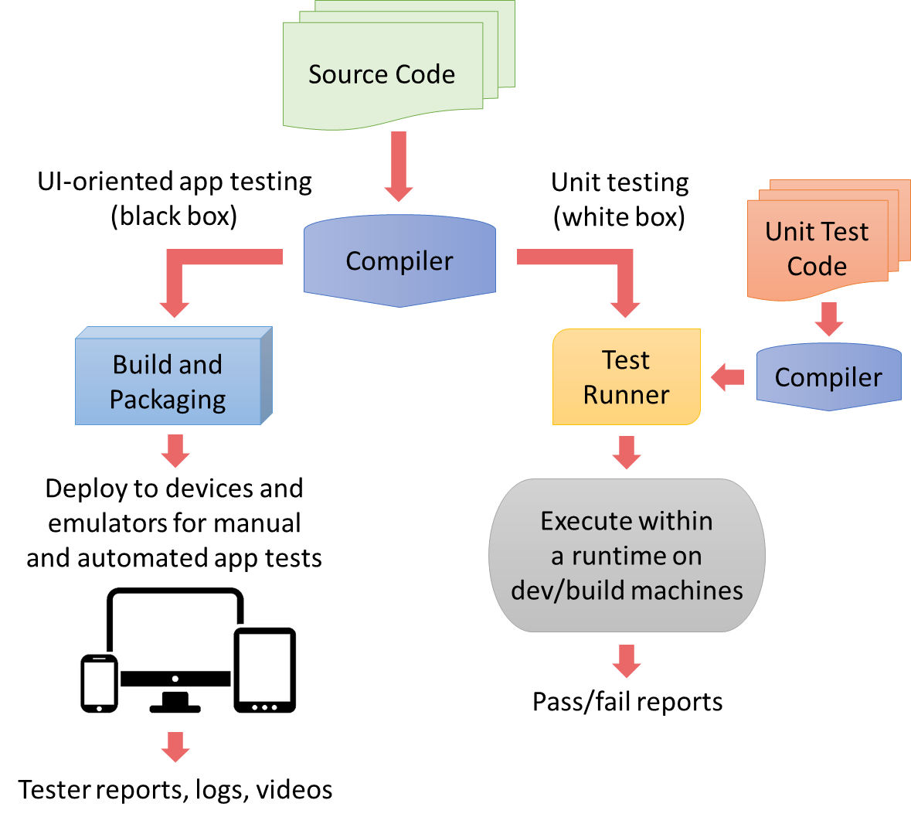

<properties pageTitle="Primer on unit testing and continuous integration"
  description="Primer on unit testing and continuous integration"
  services=""
  documentationCenter=""
  authors="Kraig Brockschmidt" />

#A primer on unit testing and continuous integration
Great apps—like great artists, actors, and athletes—are great performers. To validate and continually improve their performances, human beings undergo extensive training, practice, rehearsals, and after-the-fact reviews. In software development we achieve the same ends through many levels of rigorous testing across the entire application lifecycle.

Chances are you’ve heard about unit testing, but you might not be clear on what it is, exactly. This primer, then, provides a background understanding of the nature of unit testing and the terminology often used in its context.

##Difference between unit testing and other types of testing

Most forms of testing, such as functional testing, UI/acceptance testing, performance profiling, integration testing, security testing, usability testing, and so forth, all work with an app that’s been built and deployed to emulators or test devices. Testing then happens through the app’s user interface, which can be done manually or through scripts and other automation tools. Such testing, which has no knowledge of the app’s code, is referred to as “black box” testing.

Unit testing, on the other hand, works directly against the app’s code, not its user interface. Unit tests validate the behaviors of *units* of code, namely your classes, methods, properties, and functions; as such, unit tests are fully aware about how the code under test works, and is an example of "white box" testing. Each unit test is itself a piece of code and although you typically write them in the same language as the app code, this is not technically required. 

Unit testing also occurs earliest in the application lifecycle: you can write tests alongside the app code, or even before any code is written (the approach of *test-driven development*). Unit testing is also unique in that it happens on development and/or build machines outside the context of mobile platforms, emulators, and app packages. Instead, a *test runner* feeds the code being tested along with the unit test code into a standalone runtime. For apps written using Apache Cordova, this means working with an independent JavaScript runtime.

The following figure illustrates how app testing (left) is different from unit testing (right).



>**Be mindful!** The diagram above shows how unit tests are run in an environment that’s different from the actual mobile platform. This means two things. First, there are be small behavioral differences between the runtimes. Second, platform APIs will not be available in the test environment. How, then, do you effectively test code that calls those platform APIs? See the topic, [Using mocks for platform APIs, plugins, and other external dependencies](unit-test-07-mocks.md).

Consider a simple calculator app. To test its adding function, a *UI test script* effectively presses the *2*, *+*, *3*, and *=* buttons in the app’s UI, then checks that the output control in the UI displays the number *5* as illustrated below:


Somewhere under the covers, of course, the app will have some kind of addition function, as shown below, that’s being invoked through this kind of UI interaction:

```javascript
	function doAdditionOperation(a, b) {
	    return a + b;
	}
```

>**Note:** you wouldn't likely have such a trivial addition function in a real app, of course, because the + operator has been thoroughly tested by the authors of the runtime and wouldn’t need to be unit-tested further. Later on we’ll use a more realistic example; for now, this function suffices to explain the fundamentals.

A unit test, then, is a *separate* piece of code that makes a direct call to this function, passing values like 2 and 3 as parameters and checking that the return value is 5. A typical unit test might look like this, where it has a name and a description of what’s being tested, which is essential for reporting:

```javascript
	[Test name="doAdditionOperation test 1"
    description="Adding 2 + 3 expecting 5"]
    {
	    var expected = 5;
        var actual = doAdditionOperation(2, 3);
        assert_equal(actual, expected);
	}
```

The unit test knows how the *doAdditionOperation* function *should* behave, so it’s written to validate that behavior for a specific case. You’d also write other unit tests for this same function to make sure you adequately cover boundary conditions and special cases. (UI tests, of course, typically exercise boundary cases as well.) As a whole, your collection of unit tests for any given unit should fully exercise every unique *code path* in that unit to achieve 100% *code coverage*. And it should be obvious that if the unit is modified to allow more code paths, you’ll want to write addition tests to cover them.

>**Unit tests for a library belong with the library**: In your projects, invest in unit tests for your own app code, but not for libraries. Those libraries should already have their own unit tests within their own repository alongside the library source code. If a library lacks such tests, work with the author or contribute to the open-source project to add them. This way everyone benefits from your contribution, and app developers can use the library with full confidence.

##Using unit tests and continuous integration to minimize the cost of bugs

Because unit tests are just pieces of code calling other pieces of code, they can (and should) run very quickly; a whole suite of unit tests typically runs in a matter of seconds. This characteristic makes it easy for a developer to run a test suite against their work-in-progress to quickly detect any unintended changes in behavior—called *regressions*—prior to committing code to their team’s version control repository.

Unit tests are also often run as part of an automated build process as a way to validate committed code. This practice, known as *continuous integration (CI)*, validates that the newly committed code both builds properly and did not introduce any regressions. (Team Foundation Server also offers *gated check-in* where code is built and tested before being committed.)

Continuous integration helps to catch bugs very early on in the development cycle and minimize the cost of fixing them. Because each unit test is (ideally) written to test a single case, any given test failure identifies exactly what parameters caused a failure in which unit of code. This means the developer can go immediately to that code unit, review the change history, and find the regression. There’s no guesswork about where to look, and because unit testing happens very near in time to changes in the code, the developer doesn’t spend much time getting familiar with that code again.

In contrast, such an error *might* be revealed during UI testing, if the UI tests are themselves complete. The error could also manifest in any number of ways: bad output, incorrect data being sent to a backend (causing a failure there), or an app crash for example. The developer assigned to the bug report then has to spend quite a bit of time tracing the problem back to the offending piece of code, and the bug might even pass through the hands of multiple developers before it finally reaches the right person. Even then, the error might have been checked in days or weeks ago, so the developer has to shift his or her attention away from current tasks to investigate and fix the bug.

Put graphically in the image below, the cost of fixing bugs increases the farther along you are in the app lifecycle, and goes up dramatically once the app becomes available publicly. The cost of a bug is shown taking a big jump at public release because at that point the cost may include public relations, ratings and reviews, customer retention, potential legal liability, and having to prioritize critical fixes in near-term updates over feature and/or performance improvements that would gain new customers. Put another way, handling bugs in released versions of an app is often an exercise in damage control, which is expensive!


