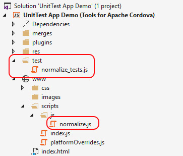
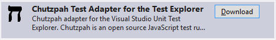

<properties pageTitle="Using the Chutzpah test runner"
  description="Using the Chutzpah test runner"
  services=""
  documentationCenter=""
  authors="Kraig Brockschmidt" />


#Using the Chutzpah test runner with a Cordova App project

> The sample for this and the next topic is [chutzpah-jasmine-vs](https://github.com/Microsoft/cordova-samples/tree/master/unit-testing/chutzpah-jasmine-VS) in the cordova-samples repository on GitHub. 
 
For this section you’ll need to have the Visual Studio Tools for Apache Cordova installed. If necessary, restart Visual Studio’s installer, press **Modify**, check the box for **Cross-Platform Mobile Development > HTML/JavaScript (Apache Cordova)**, and press **Update**.

Now create a new project and pull in the unit and unit test code from the [Basic Testing topic](unit-test-03-basic-testing.md):

1.	Create a new app project through **File > New Project**, selecting **JavaScript > Apache Cordova Apps > Blank App**.
2.	Create a folder named ```test``` in the project (right click > Add > New folder) and import ```normalize_tests.js``` file (right click on test > Add > Existing Item).
3.	Import ```normalize.js``` into the project’s ```www/scripts``` folder.

The project should look something like this:
 


At this point, Visual Studio isn’t aware that there are any unit tests in the project at all, because we need a test runner that also has a Visual Studio tests adapter such that its reports integrate directly with Visual Studio’s Test Explorer.

Chutzpah is one such test runner with an adapter. To install it, go to **Tools > Extensions and Updates…** in Visual Studio, select **Online**, then search for and install the “Chutzpah Test Adapter” (you’ll also be prompted to restart Visual Studio):
 


The last bit is to tell Chutzpah about the files it should work with. Create a ```chutzpah.json``` file in the project’s root folder with the following contents:

```javascript
{
  "References": [
    { "Path": "www/scripts/js/normalize.js" }
  ],

  "Tests": [
      { "Path": "test/normalize_tests.js" }
  ]
}
```

The “References” section clearly identifies the code to test and the “Tests” section identifies the unit test files. You’d obviously list more code and test files as you add them to a project.

Now select **Test > Windows > Test Explorer** and you’ll see the available tests listed there. Click **Run All** to build the project, run the tests, and see the results.
 


This verifies that you have the mechanics of using Chutzpah working within Visual Studio. You can now do much more extensive unit testing as described in the next topic, [Improve the unit test: an introduction to test-driven development](unit-test-05-tdd.md).

>**Is the app itself running?** Although Visual Studio builds the Cordova app project prior to running unit tests through Chutzpah, the app isn’t actually part of running the tests. Chutzpah invisibly loads JavaScript files from their locations in the project folder into PhantomJS and executes them there. Any app package that’s being built isn’t involved in the process.
