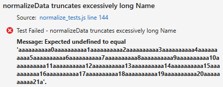

<properties pageTitle="Improving tests/test-driven development"
  description="Improving tests/test-driven development"
  services=""
  documentationCenter=""
  authors="Kraig Brockschmidt" />

#Improving the unit tests: an introduction to test-driven development

> The full sample for this topic is [chutzpah-jasmine-vs](https://github.com/Microsoft/cordova-samples/tree/master/unit-testing/chutzpah-jasmine-VS) in the cordova-samples repository on GitHub.
 
The previous topics in this section verified the mechanics of identifying and running a single test. It should be obvious, however, that the ```normalizeData``` function and the one test we’ve written are woefully inadequate:

- ```normalizeData``` will fail if we give it bad JSON (such that ```JSON.parse``` fails) or any number of variations that don’t contain both ```Name``` and ```PersonalIdentifier``` properties (such that dereferencing either property fails).

- The one unit test we’ve written tests only the “golden path” with ideal data. Real-world data seldom follows that path, so we must have many more tests for different variations of invalid and valid JSON, with both expected and unexpected properties in the latter.

Clearly we have more work to do. In fact, let’s go back to having no tests and only the definition of an otherwise empty ```normalizeData``` function:

```javascript
/** @description Converts JSON data that may contain Name and PersonalIdentifier 
 *    properties to an object with the properties name (string) and id (positive 
 *    integer up to 9999999999.
 * @param {string} jsonIn The JSON data to normalize.
 * @return {object} An object with name (string) and id (integer) properties,
 *    defaulting to "default" and 0, or null if the JSON is null or invalid.
 */
function normalizeData(jsonIn) {
}
```

The question is, what should we work on first? Write the code for ```normalizeData```, or write tests?

##Test-driven development

Developers who narrowly define their role as “writing code” will probably jump right into ```normalizeData``` and make it handle different kinds of data that might get thrown at it. After a time, they’ll likely write a few tests. In the process, they’ll see that some of those tests still fail because there are certain code cases that ```normalizeData``` doesn’t handle properly. So they’ll improve ```normalizeData``` to handle those cases, then write a few more tests, which might reveal additional issues in the unit code. This puts one into a pattern of bouncing back and forth between thinking about coding and thinking about data for test cases, which can result in missed test cases and faulty code.

More experienced developers who understand, on the other hand, that their job is really about “efficient production of robust software,” understand testing is just as important as coding, if not more so. Development, in short, is about a whole lot more than just coding! They will have learned, in fact, that thinking through variations of good and bad *data* is a different mental process than thinking about how to handle those variations *in code*. Thinking about test cases means asking, “How do I challenge the unit under test to fail?” whereas the process of coding asks “How do I write this code unit to work properly?”

As a result, experienced developers find that it can be much more efficient and productive to *start* by thinking through test cases/input variations by themselves, including boundary and edge cases, because as you identify each set of inputs it’s quite easy to additional variations. Once all those input cases clearly identified, it’s then very easy to turn a list of inputs into unit tests. Once that work is done, you can shift your focus entirely to writing the code without having to wonder (or worry!) whether you’re really handling all the possible inputs.

With the unit tests in hand, in fact, you can run them against an empty implementation of a function like ```normalizeData```. Many if not all of the unit tests will fail, of course, but that means that the list of failed tests becomes your to-do list for coding. If you’ve written each test with a single set of inputs, the list of failed tests maps *exactly *to the list of input cases that the function doesn’t yet handle properly. As you write the code, then, you are simply making improvements to to pass each test one by one. And when the function passes all the tests, you can be completely confident that it can handle all the possibilities it should. 

This is precisely the process that’s called *test-driven development*: write the tests first against an initially empty function, and then write the code to pass the test. Although it seems counter-intuitive to write tests first, test-driven development is an effective way of defining, through tests, the exact behavior that’s expected of the code. 

The big advantage of test-driven development is that it cleanly separates the task of coming up with input cases from the task of writing the code to handle those cases. Ultimately, if you’re going to do a really good job testing your code, you’ll have to separate these tasks one way or another. Test-driven development acknowledges this up front. It makes it easier to generate a comprehensive set of tests early on, which means you write more robust code earlier in the process and thus reduce the overall cost of development.

##Thinking through the inputs

Let’s apply the process of test-driven development to our example and begin by thinking through the input variations for ```normalizeData```. We already have an input case for the golden path JSON:

```json
'{"Name": "Maria", "PersonalIdentifier": 2111858}'
```

Now we ask, “How can we challenge ```normalizeData``` to fail?” We know that because ```normalizeData``` takes JSON input that it will necessarily call ```JSON.parse```. So let’s challenge ```JSON.parse``` to fail with some bad strings, and include a few strings for common attack vectors:

```json
null
''
'blahblahblah'
'{{}'
'{{[]}}}'
'document.location="malware.site.com"'
'drop database users'
```

Next, if the input data passes through the ```JSON.parse``` gate, then we should challenge any assumptions that ```normalizeData``` makes about the structure of valid JSON. For starters, we can omit expected fields or use different casing:

```json
'{"Name": "Maria"}'
'{"PersonalIdentifier": 2111858}'
'{}'
'{"name": "Maria", "personalIdentifier": 2111858}'
'{"nm": "Maria", "pid": 2111858}'
```

We can then try adding some extra fields:

```json
'{"Name": "Maria", "PersonalIdentifier": 2111858, "Other1": 123, "Other2": "foobar"}'
```

And then add variations on the data types by using a integers, strings, objects, and arrays:

```json
'{"Name": "Maria", "PersonalIdentifier": "2111858"}'
'{"Name": "Maria", "PersonalIdentifier": "AA2111858"}'
'{"Name": "Maria", "PersonalIdentifier": -1}'
'{"Name": "Maria", "PersonalIdentifier": 123456789123456789123456789123456789}'
'{"Name": "Maria", "PersonalIdentifier": 9999999999}'
'{"Name": "Maria", "PersonalIdentifier": 10000000000}'
'{"Name": <long generated string>, "PersonalIdentifier": 2111858}'
'{"Name": 12345, "PersonalIdentifier": 2111858}'
'{"Name": {"First": "Maria"}, "PersonalIdentifier": 2111858}'
'{"Name": "Maria", "PersonalIdentifier": {"id": 2111858}}'
'{"Name": {"First": "Maria"}, "PersonalIdentifier": {"id": 2111858}}'
'{"Name": ["Maria"], "PersonalIdentifier": 2111858}'
'{"Name": "Maria", "PersonalIdentifier": [2111858]}'
'{"Name": ["Maria"], "PersonalIdentifier": [2111858]}'
```

Finally, we’ll throw in a string and an integer with leading zeros for the identifier:

```json
'{"Name": "Maria", "PersonalIdentifier": "002111858"}'
'{"Name": "Maria", "PersonalIdentifier": 002111858}'
```

Once you get going on thinking through the variations, it’s quite easy to identify many possibilities. For example, once you identify that one test case should use an object instead of a string as the data type for ```Name```, then you know that you also need a similar variation for ```PersonalIdentifier```, and then a variation with an object in both properties. And having identified using objects in the JSON, you’ll easily identify testing arrays. This happens naturally because you’re thinking only about data at this point, and not bothering your mind with details about how you’d check for these cases in code.

In writing this example, in fact, I probably spent a total of 15 minutes thinking about these variations, and experienced testers will probably have a fully-developed list of JSON test strings already in hand (including many more values with embedded HTML, JavaScript, SQL, and forms used in security attacks). The point is that once you get going on thinking about input cases, it’s pretty easy to just write them out, and you create a resource you can use in other similar unit tests.

##Converting inputs cases to tests

Having identified the inputs, we next map each case to expected outputs in the form of a test, and give each test a name at the same time. Using a simple template that we can paste into ```normalize_tests.js``` for each of the thirty tests cases, we can then copy-paste the inputs into the tests and add tests for the expected outputs.

Some of the tests are below (using Jasmine for the framework, so all of these would be inside a ```describe``` method). For the full suite, see the [chutzpah-jasmine-vs](https://github.com/Microsoft/cordova-samples/tree/master/unit-testing/chutzpah-jasmine-VS) sample on GitHub.

```javascript
it("accepts golden path data", function () {
    var json = '{"Name": "Maria", "PersonalIdentifier": 2111858}';
    var norm = normalizeData(json);
    expect(norm.name).toEqual("Maria");
    expect(norm.id).toEqual(2111858);
});

it('rejects non-JSON string', function () {
    var json = 'blahblahblah';
    var norm = normalizeData(json);
    expect(norm).toEqual(null);
});

it('accepts PersonalIdentifier only, name defaults', function () {
    var json = '{"PersonalIdentifier": 2111858}';
    var norm = normalizeData(json);
    expect(norm.name).toEqual("default"); //Default
    expect(norm.id).toEqual(2111858);
});

it('ignores extra fields', function () {
    var json = '{"Name": "Maria", "PersonalIdentifier": 2111858, "Other1": 123, "Other2": "foobar"}';
    var norm = normalizeData(json);
    expect(norm.name).toEqual("Maria");
    expect(norm.id).toEqual(2111858);
});

it('truncates excessively long Name', function () {
    //Create a string longer than 255 characters
    var name = "";
    for (var i = 0; i < 30; i++) {
        name += "aaaaaaaaaa" + i;
    }

    var json = '{"Name": "' + name + '", "PersonalIdentifier": 2111858}';
    var norm = normalizeData(json);
    expect(norm.Name).toEqual(name.substring(0, 255));
    expect(norm.Name.length).toEqual(255);
    expect(norm.id).toEqual(2111858);
});

it('rejects object Name and PersonalIdentifier', function () {
    var json = '{"Name": {"First": "Maria"}, "PersonalIdentifier": {"id": 2111858}}';
    var norm = normalizeData(json);
    expect(norm).toEqual(null);
});
```

Note that the names are what appear in UI like Test Explorer, so they should always identify what’s being testing and the basic nature of the test (e.g. “reject” or “accept”).

You’ll also discover in this process that groups of tests follow a similar pattern. A number of the tests for ```normalizeData``` expect a ```null``` return and thus contain an ```equal(norm, null);``` check. Another group expects a valid object and uses two assertions to check both expected properties. Having written one test for any given group, it’s easy to just make copies of that test and change the name, the input, and the expected outputs. As a result, each test might take only 10-20 seconds to create from your list of inputs; writing all the tests for this example took about 15 minutes. This demonstrates that even through you’ll typically write many tests for any given function, the process doesn’t need to take a lot of time.

By the way, one of the unit tests show above is buggy. Do you see which one? We’ll encounter this later on in Debugging unit tests.

##Running the tests against an empty unit

Having written out all the tests, we can now run them against a still-empty ```normalizeData``` function and see the results in Test Explorer:


 
As expected, all the tests fail because there's no code in ```normalizeData``` that could possibly pass a test. Our job now is to add code to pass at least one test at a time, until we get to the point where *all* tests pass. Then we can call the implementation good. 

Notice also how Test Explorer shows the names you assigned to each individual test. This output shows exactly why you want to keep each test specific according to its description, because as failed tests appear in this list you can quickly and easily identify the exact inputs that are causing the unit code to fail.

>**Note**: With the runtime we're using here, an empty function returns ```undefined``` by default. Other runtimes might instead return ```null``` by default in which case a number of our tests will initially pass. However, as we add code to ```normalizeData``` those tests would eventually fail until we had the correct implementation for those specific cases.

##Adding code to the unit to handle test cases

Having run all our tests against and empty implementation, we now have a to-do list for coding work. Let’s start by addressing the first failed test and handle the “golden path”:

```javascript
function normalizeData(jsonIn) {
    data = JSON.parse(jsonIn);
    return {
        name: data.Name,
        id: 0 + data.PersonalIdentifier  // Convert to integer
    };
}
```

If we re-run all the tests, we’ll now find that five passs:


 
Clearly the implementation is pretty poor, so let’s dispense with it and do some real coding work.

First, we’ll check for bad input (```null``` or anything that causes ```JSON.parse``` to throw an exception), which should let us pass those cases while still passing the previously-passing tests that use good data:

```javascript
function normalizeData(jsonIn) {
    if (jsonIn == null) {
        return null;
    }
    
    var data = null;

    // Return null for any invalid JSON
    try {
        data = JSON.parse(jsonIn);
    }
    catch (err) {
        return null;
    }

    var name = data.Name;
    var id = 0 + data.PersonalIdentifier  // Make sure this is an integer

    return {
        name: name, 
        id: id
    };
}
```


Near the top of failed list now are five tests that for defaults when the JSON is valid but incomplete. Our next step is to assign defaults to the ```name``` and ```id``` variables and modify them based on the data types in object returned from ```JSON.parse```. We’ll check for ```undefined``` properties in the process and return ```null``` in those cases, which should pick up a most of the “rejects” tests:

```javascript
function normalizeData(jsonIn) {
        return null;
    }
    
    var data = null;

    // Return null for any invalid JSON
    try {
        data = JSON.parse(jsonIn);
    }
    catch (err) {
        return null;
    }
    
    // Assign defaults
    var name = "default";
    var id = 0;

    switch (typeof data.Name) {
        case 'undefined':
            // Use default
            break;

        case 'string':
            name = data.Name;
            break;

        default:
            // rejects integer or any other data type
            return null;
    }    

    switch (typeof data.PersonalIdentifier) {
        case 'undefined':
            // Use default
            break;

        case 'string':
            id = Number(data.PersonalIdentifier);

            if (isNaN(id)) {
                return null;
            }

            break;

        case 'number':
            id = data.PersonalIdentifier;
            break;

        default:
            return null;
    }    
  

    return {
        name: name,
        id: id 
    };
}
```

Indeed, after this change we have only a few failing tests:


 
This demonstrates that as you implement the unit code, you’ll probably find some tests passing that you didn’t specific address in your latest code edits. When this happens, it’s a good idea to think through how you would have written code to handle those cases, and check if the code you wrote is handling those code paths in that way. For example, the change we made above passed all the tests that reject object and array properties because those types fall through to the default cases in the ```switch``` statements. Upon examination, we can see that we’d default in that way for any data type that we don’t accept (not just objects and arrays), so the code is valid for those tests.

Handling negative and large ```PersonalIdentifier``` values is easy enough with added checks in the number case for that property:

```javascript
        case 'number':
            if (data.PersonalIdentifier < 0 || data.PersonalIdentifier > 9999999999) {
                return null;
            }

            id = data.PersonalIdentifier;
            break;
```

and truncating long strings is just a small change to the string case for Name:

```javascript 
        case 'string':
            name = data.Name.substring(0, 255);
            break;
```

But wait a minute, the test for truncating a long Name is still failing:
 


Why is that? Click on that test in the list and the bottom pane of Test Explorer shows the reason:



This says that the actual value is ```undefined```. Hmmm. How did that happen? We know that ```data.Name``` was good from prior test runs, thus ```.substring(0, 255)``` should be valid. What’s going on?

If you find yourself asking these questions, the right answer is to step through that unit test in the debugger, as described in [Debugging unit tests](unit-test-06-debug.md). 
