<properties
   pageTitle="Getting Started with Visual Studio Tools for Apache Cordova | Cordova"
   description="Getting Started with Visual Studio Tools for Apache Cordova"
   services="na"
   documentationCenter=""
   authors="normesta, johnwargo"
   tags=""/>
<tags ms.technology="cordova" ms.prod="visual-studio-dev15"
   ms.service="na"
   ms.devlang="javascript"
   ms.topic="article"
   ms.tgt_pltfrm="mobile-multiple"
   ms.workload="na"
   ms.date="04/13/2016"
   ms.author="johnwargo"/>

# Getting Started With Visual Studio Tools For Apache Cordova

Use Visual Studio Tools for Apache Cordova to build mobile apps using web technologies (HTML, CSS, JavaScript) that run on Android, iOS, and Windows devices. Since Cordova apps are built using web application code, you'll be able to share the majority of your code across device platforms; [learn more](https://www.visualstudio.com/explore/cordova-vs).

In this guide, we'll show how to build, test and debug a Cordova application using the Visual Studio Tools for Apache Cordova. Along the way, you'll build a simple mobile weather app that looks like this:


The application displays current weather conditions based on the current device location plus enables users to search for weather conditions using a US postal (zip) code. You can find the application's source code [here](https://github.com/Microsoft/cordova-samples/tree/master/weather-app).

> **Note:** Before we begin, make sure you have completed the [Visual Studio Tools for Apache Cordova Installation](vs-taco-2017-install.md).

## <a id="create-project"></a>Create An Apache Cordova Project

1.	Open Visual Studio and create a new project by opening the **File** menu, select **New** then **Project**; you can also use the key combination: **Ctrl**+**Shift**+**N**.
2.	In the **New Project** dialog, open the list of installed templates, and expand the **JavaScript** option. In the list of templates that appears there, select **Blank App (Apache Cordova)** as shown in the figure:
	
	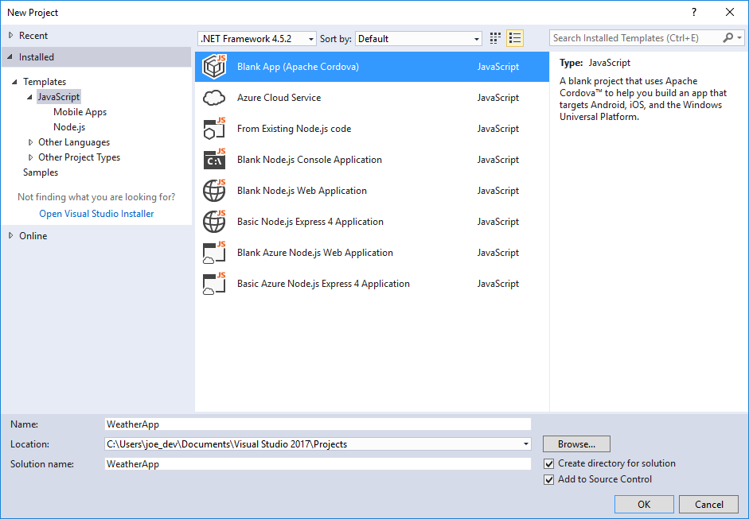

	> **Note:** If you prefer to use TypeScript instead of JavaScript for this app, expand **Other Languages** in the **Installed** list, select **TypeScript**, and then select **Blank App (ApacheCordova)** as shown in the following figure:
    
	> 

3.	Name the project **WeatherApp**, specify a target folder, and then click the **OK** button to create the project. 

	During the project creation process, Visual Studio creates a **Solution** for the project then uses the Cordova command line interface (CLI) and other tools to create the Cordova application project folder structure, add platforms to the project (Android, iOS, and Windows), and populates the project's web application with default content from the template.

At this point, you've created a complete Apache Cordova project and you're ready to start coding.

## <a id="tour-project"></a>A Quick Cordova Project Tour

Before we start coding the application, lets take a look at the project structure created by Visual Studio Tools for Apache Cordova.

The following figure shows the project folder structure and files for the newly created Apache Cordova project. The sections that follow will describe the folders and files included in the project.


### <a id="www"></a>www Folder

The project's `www` folder contains the web application content files for the Cordova application, so most of your development will occur inside this folder.  Here you'll find the web application content that is packaged into a native mobile application by the Cordova SDK. The HTML, JavaScript, and CSS files in this folder will render in the Cordova app the same way they will in a mobile browser, so be sure to optimize the content for the smaller and more limited smartphones and tablets. The folder's `index.html` file is the main entry point for the web application, it's loaded by default when the Cordova application launches. The folder contains several subfolders that follow a typical web application folder structure:

+ `css` - Stores the web application's Cascading Style Sheet (CSS) files. The `index.css` shown in the folder is the standard .css file included with the default Cordova application template. 
+ `images` - Stores any image files used by the web application. The `cordova.png` file shown in the folder is the Cordova logo that displays in the center of the application screen in the default Cordova application template.
+ `scripts` - Stores JavaScript files used by the web application. The project's `index.js` file contains the bootstrap code that initializes the Cordova application; it registers callback functions for the Cordova `deviceReady`, `onPause` and `onResume` events. The `platformOverrides.js` file works in conjunction with similar files located in the `merges` folder to enable developers to deliver different code per target platform. See [merges Folder](#merges) for additional information.

Cordova developers do most of their work in these folders, creating and updating web application content designed for mobile devices. The application content contained herein is packaged into a native mobile application by Visual Studio for deployment to mobile devices using the Cordova and device platform SDKs.

### <a id="merges"></a>merges Folder

Apache Cordova uses the `merges` folder to provide developers with the ability to deliver different content based on the target mobile platform. As you can see from the figure, there's a subfolder for each target mobile platform (Android, iOS and Windows). Any content in these folders will be copied to the native application project during the Cordova pre-build process (prepare), adding to or replacing content in the web application folder as needed.

For example, any content in the `merges\android` folder is copied to the Android project's web application folder after the base web application is copied. Content in the `merges\ios` folder is copied into the iOS project's web application folder. Finally, content in the `merges\windows` folder is copied to the Windows project's web application folder after the base web application is copied.

To help deliver a consistent web application experience in Cordova apps, the default project created by Visual Studio Tools for Apache Cordova includes `platformOverrides.js` files for Android (in `merges\android\scripts\platformOverrides.js`) and Windows (in `merges\windows\scripts\platformOverrides.js`) along with a platform-specific JavaScript library. On Android, it adds a polyfill for `bind()` on older Android devices, and on Windows it adds Microsoft's safeHTML polyfill library. The `merges/ios` folder doesn't include a `platformOverrides.js` file, so there's no platform-specific override, iOS applications get the generic version of the file located in `www/scripts/platformOverriders.js`.

 

For additional information on how merges works, see [Using merges to Customize Each Platform](https://cordova.apache.org/docs/en/latest/guide/cli/#using-merges-to-customize-each-platform) in the Cordova documentation.

### <a id="res"></a>res Folder

Apache Cordova uses the contents of the `res` folder to store non-web application resources used by a native mobile application such as [application icons](https://cordova.apache.org/docs/en/latest/config_ref/images.html), [splash screen](https://cordova.apache.org/docs/en/latest/reference/cordova-plugin-splashscreen/index.html) images, signing certificates, etc.
 
### Configuration Files

The project includes several configuration files:

+ `bower.json` - Configuration file for the [Bower Package Manager](http://bower.io). Developers use Bower to install packages and libraries in a web application; [learn more about it here](https://taco.visualstudio.com/en-us/docs/tutorial-using-bower).
+ `build.json` - Configuration file for the Android and iOS build process. **Do not delete this file**, as the Cordova SDK uses it to build signed mobile app packages; [learn more about it here](https://taco.visualstudio.com/en-us/docs/tutorial-package-publish-readme). 
+ `config.xml` - Cordova project configuration file, it contains settings that define options for the Cordova native mobile application including application name, plugin configuration, security settings, and more. **Do not delete this file**, the Cordova SDK will not be able to build and deploy applications without it. Visual Studio Tools for Apache Cordova includes a special editor for this file, abstracting away the file's XML into a simple interface to the file's settings. 
+ `package.json` - Configuration file for the Node Package Manager (npm). This file isn't used by Cordova projects today, but will eventually become more important when it replaces the `config.xml` as a Cordova project's primary configuration file in a future version of Apache Cordova.

## <a id="run"></a>Run The App Using Cordova Simulate

The default Cordova project includes a simple application user interface and logic, enabling you to immediately run a simple sample application to validate that everything is working. In this section, we'll launch the application in order to highlight some of the capabilities of Visual Studio Tools for Apache Cordova; later, we'll add our own web content to complete the project. 

1.	On the Visual Studio Standard toolbar, click the **Simulate In Browser - Nexus 7 (Tablet)** button.
	
	> **Note:** Cordova Simulate requires the Google Chrome browser; make sure you have the browser installed before running the application.
	
	
  
	Visual Studio will launch [Cordova Simulate](vs-taco-2017-cordova-simulate.md), a browser-based Cordova application simulator. Cordova Simulate displays the Cordova application's content in a browser window sized for the target mobile device. Here you can interact with the application, using your mouse to simulate finger taps and touches. What you see in the figure is the default Cordova app, included with every Cordova project. It doesn't expose any application functionality you can interact with - it simply lets you know the app initialized correctly.

	

2.	Visual Studio exposes a set of panels you can use to manipulate options within the simulator. Switch back to Visual Studio and you'll see that it opened the **DOM Explorer** for you. Use the DOM explorer like you would other web development tools, navigating through the DOM hierarchy looking for specific elements, changing attributes, and poking and prodding at the app as it runs. 

	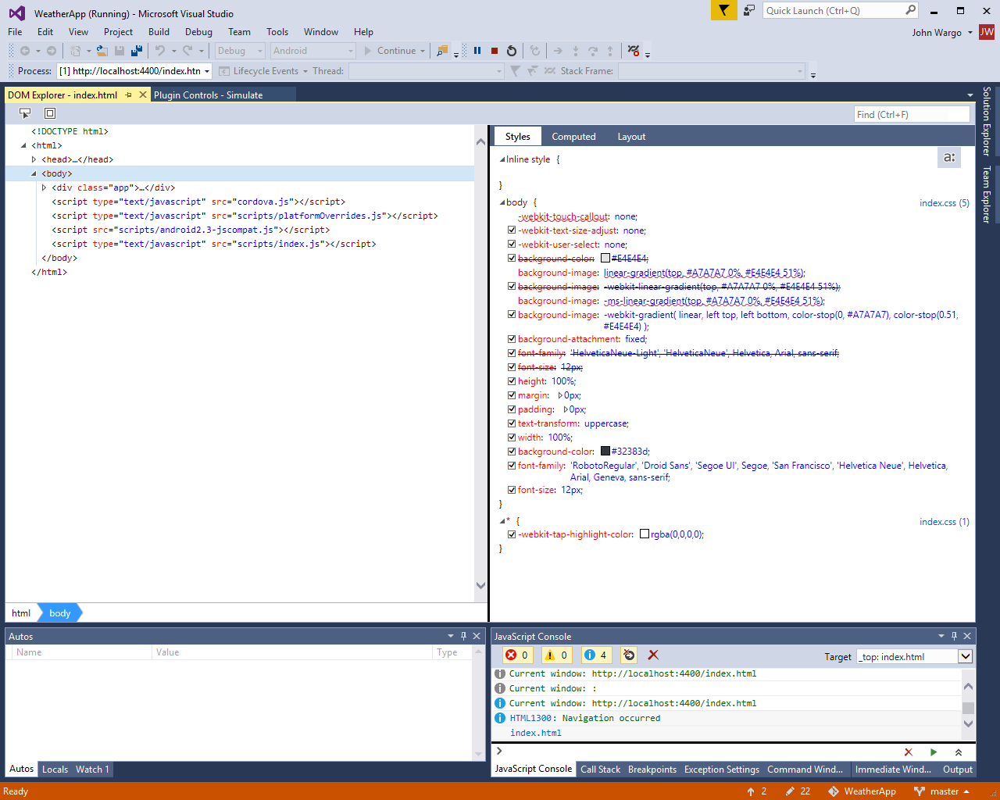

	Use the Plugin Controls window to simulate settings in the Cordova plugins added to the project. By default Visual Studio shows settings for the Geolocation and Device plugins, plus provides an interface you can use to fire certain events as the application runs. As you add additional Cordova plugins to your project, additional panes will appear in the Plugin Controls page for you to use.

	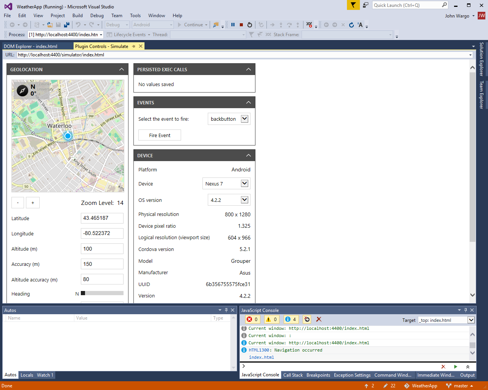 

3. Stop the Cordova Simulate debug session by clicking the **Stop** button in the Standard Toolbar.

	
    
4.	You can also run your app on emulators and simulators for Android, iOS, and Windows devices.  First, choose a target mobile device platform from the platform list on the Standard toolbar. 
	
	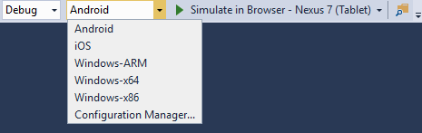

	> **Note:** Deploying to iOS simulators or devices requires access to a Apple Mac configured with Xcode and the Visual Studio remotebuild module. Refer to [Visual Studio Tools for Apache Cordova: iOS Guide](vs-taco-2017-ios-guide.md) for guidance on how to configure your development environment for iOS.   
	
	Next, click the drop-down arrow on the deployment target in the Standard toolbar to see a list of available targets. Choose a deployment target from the list and Visual Studio will build the app and deploy it to the selected device, emulator or simulator.

	
   
	If a particular emulator or simulator family is missing from the list of available options, click the **Install** item in the list to add them to your system's configuration. Visual Studio Tools for Apache Cordova doesn't install all available targets by default, but provides this simple mechanism for adding targets to an existing system. 

## <a id="settings"></a>Configure The Cordova Native Application

The configuration settings for the Cordova native application are maintained in the project's `config.xml` file. Rather than force you to manually edit the file's XML content, Visual Studio Tools for Apache Cordova includes a custom editor that abstracts away the complexities of XML and enables you to set the file's properties using standard Windows input fields. 

To edit the project's `config.xml`, double-click on the file in the Visual Studio Solution Explorer; Visual Studio will open the custom editor for the file shown in the following figure:

 

The editor exposes the following options:

+ **Toolset** - Used to configure the target Cordova platform and tools version for the application; you can learn more about this feature [here](vs-taco-2017-toolsets.md).
+ **Common** - Used to define Cordova application settings that apply to all target platforms (such as display name, start page, application version, and more).
+ **Plugins** - Used to add and remove Cordova plugins to/from the project. 
+ **Windows** - Used to define settings for the Windows Store version of the application.
+ **Android** - Used to define settings for the Android version of the application (such as minimum and maximum API versions and other properties for the application).
+ **iOS** - Used to define settings for the iOS version of the application (such as target device and target OS version, and other properties for the application).

If you want, give the app a more appropriate **Display Name**, modify the **application version**, and adjust other aspects of the app's behavior using the editor.

> **Note:** To edit the `config.xml` file directly, without using the special editor Visual Studio provides, you can right-click on the file in Solution Explorer and select **View code** or highlight the file in Solution Explorer then press the **F7** key.

## <a id="build-something"></a>Creating The Sample Application

Now that you have a functional Cordova application project, lets remove the boilerplate web application content included in the default Cordova application project and replace it with the weather app code. 

### Add jQuery Packages to the Project

The application uses the [**jQuery**](https://jquery.com/) and [**jQuery Mobile**](https://jquerymobile.com/) libraries to help craft the app's UI and simplify the code. jQuery is a JavaScript library that makes certain tasks easier such as changing the properties of a control or handling its events. jQuery Mobile is a touch-optimized HTML5 UI framework, built on jQuery, designed to make responsive web sites and apps that are accessible on all smartphone, tablet and desktop devices. Together, they give us a quick way to style the application without having to do custom CSS work.

Let's add the JQuery and JQuery Mobile NuGet packages to the project. 

> **Note:** Before starting the following steps, point your browser of choice to [the jQuery Mobile download site](http://jquerymobile.com/download/) to note which version of the jQuery library is compatible with the current shipping release of jQuery Mobile. At the time of this writing, jQuery Mobile version 1.4.5 is compatible with jQuery version 1.8 through 1.11. In the steps that follow, be sure you install compatible versions of both frameworks. The NuGet Package Manager should deploy compatible versions of dependent libraries, but it's best to make sure first.

1.	In Visual Studio, open **Tools** -> **NuGet Package Manager** -> **Manage NuGet Packages for Solution**, and add the **jQuery.Mobile** NuGet package to your solution.     

	

	When you click the **Install** button, the NuGet Package Manager will display a confirmation dialog highlighting the components being installed. Notice that it's installing jQuery version 1.8 rather than the latest version for compatibility reasons.

     

2.	NuGet adds files to the Visual Studio project's `Scripts` folder, but they really belong in the Cordova project's `www\scripts folder`. Drag all of the **.js** files from the `Scripts` folder to the `www/scripts` folder as shown in the figure.

    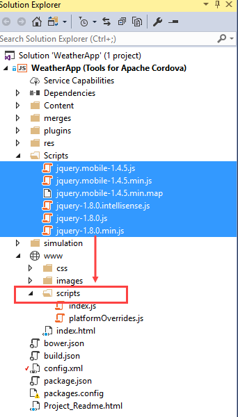  

3.	NuGet also installs the frameworks' CSS files to the Visual Studio project's `Content` folder, but they really belong in the Cordova project's `www\css` folder. Drag the **images** folder plus all of the **.css** files from the project's `Content` folder to the `www\css` folder as shown in the figure.

    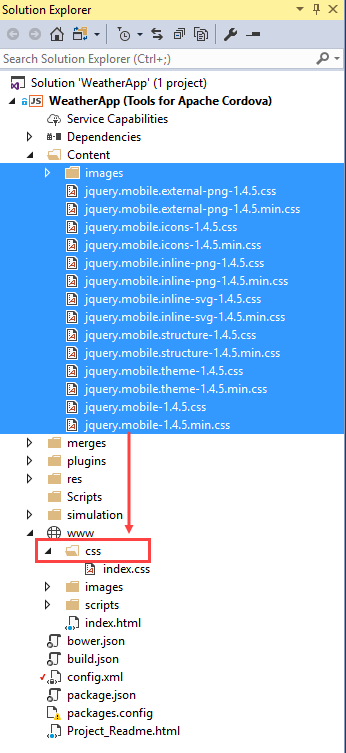    

4.	Add this script reference to the `<body>` tag of your project's [index.html](#tour-project) file. Place the content at the bottom of the body section, where the other JavaScript references are located:

    ```html
    <script src="scripts/jquery-x.x.x.min.js"></script>
    <script src="scripts/jquery.mobile-x.x.x.min.js"></script>
    ```

    Replace the `x.x.x` in the statements with the jQuery and jQuery Mobile versions you recently installed into the project. For the example versions described earlier, the statements look like this:

    ```html
    <script src="scripts/jquery-1.8.0.min.js"></script>
    <script src="scripts/jquery.mobile-1.4.5.min.js"></script>
    ```

5.	Add the following style reference to the `<head>` tag of your project's [index.html](#tour-project) file. Place the content above the existing `index.css` reference:

    ```html
    <link rel="stylesheet" href="css/jquery.mobile-x.x.x.min.css" />
    ```

    As you did in the previous step, replace the `x.x.x.` in the statement with the jQuery Mobile version you recently installed into your project. For the example versions described earlier, the statement look like this:

    ```html
    <link rel="stylesheet" href="css/jquery.mobile-1.4.5.min.css" />
    ```

6.	Save your changes to the project's `index.html` file by pressing **Ctrl**-**S** or by opening the **File** menu and selecting **Save**.

### Building The Application's UI

The Cordova project's `index.html` is the default page for the application; the Cordova native application loads the page as the app's main screen when a Cordova application launches. To create the application's UI, we'll add content to this file.

> **Note:** You can change the default page by populating the **Start Page** property in the project's `config.xml` file using the [Configuration Editor](#settings).   

1.	Open the project's `www\css\index.css` file and replace its content with the following:

    ```css
    .not-displayed {
        display: none;
    }

    form {
        border-bottom: 1px solid #ddd;
        padding-bottom: 5px;
    }

    #zip-code-input {
        font-size: 25px;
    }

    #get-weather-btn {
        font-size: 22px;
    }

    #title {
        font-size: 16px;
    }

    #summary {
        font-size: 35px;
    }

    #summary img {
        float: right;
    }

    #error-msg {
        text-align: center;
        margin-top:  50%;
        font-weight: bold;    
    }
    ```
2.	Open the project's `www\index.html` file, and remove the following markup:

    ```html
	<div class="app">
    	<h1>Apache Cordova</h1>
        <div id="deviceready" class="blink">
        	<p class="event listening">Connecting to Device</p>
            <p class="event received">Device is Ready</p>
        </div>
    </div>    
    ```
	The markup is just part of the default Cordova web application template that we won't be using.

3.	Add the following markup to the `<body>` section of the page:

    ```html
    <div data-role="page" id="weather-page">

        <div data-role="header" class="header">
            <h1 id="app-title">Weather App</h1>
            <a href="/" class="ui-btn ui-btn-left ui-btn-corner-all ui-icon-home ui-btn-icon-notext" rel="external">Home</a>
        </div>

        <div role="main" class="ui-content">
            <form>
                <label for="zip-code">Type your zip code:</label>
                <input id="zip-code-input" name="zip-code" placeholder="eg. 98001" required />
                <button id="get-weather-btn" data-role="button" data-icon="search">Find Weather</button>
            </form>

            <ul id="weather-data" data-role="listview" data-inset="true" class="ui-listview ui-listview-inset ui-corner-all ui-shadow not-displayed">
                <li data-role="list-divider" id="title" class="ui-li-divider ui-bar-a"></li>
                <li><span id="summary"><span id="temperature"></span> F </span></li>
                <li>Wind: <span id="wind"></span> knots</li>
                <li>Humidity: <span id="humidity"></span> %</li>
                <li>Visibility: <span id="visibility"></span></li>
                <li>Sunrise: <span id="sunrise"></span></li>
                <li>Sunset: <span id="sunset"></span></li>
            </ul>

            <div id="error-msg" class="not-displayed">
            </div>

        </div>

        <footer data-role="footer" data-position="fixed">
            <h4>Visual Studio Tools for Cordova Demo</h4>
        </footer>

    </div>
    ```
 
	This code creates the application's main UI. It adds an input form to the page with a single search input field and button. It also adds a jQuery Mobile ListView to render the weather forecast for the selected location. 

### Add The Find Weather Button Click Listener

Next we'll add code that reacts to the user tapping the **Find Weather** button.

1.	Open the project's `www\scripts\index.js` file, and remove the following code from the file's `onDeviceReady` function.

    ```javascript    
    var parentElement = document.getElementById('deviceready');
    var listeningElement = parentElement.querySelector('.listening');
    var receivedElement = parentElement.querySelector('.received');
    listeningElement.setAttribute('style', 'display:none;');
    receivedElement.setAttribute('style', 'display:block;');
    ```

	This code updates the main page to indicate that the Cordova container finished initializing; we've already replaced the HTML markup that this code refers to, so it's no longer needed.
 
2.	Next, add the following line of code to `www\scripts\index.js` file's `onDeviceReady` function.

    ```javascript
    $('#get-weather-btn').click(getWeatherWithZipCode);
    ```

    This code adds a click listener to the **Find Weather** button, executing the `getWeatherWithZipCode` function every time the button is tapped. The `getWeatherWithZipCode` function doesn't exist yet, but we'll add it soon. 

#### A Quick Look At index.js

This is a good time to take a quick look at the project's `index.js` file. This file loads when the user runs the app because the `index.html` page contains this reference to it:

```javascript       
<script src="scripts/index.js"></script>
```

You'll notice a few things about the `index.js` file. First, all the code in that file is enclosed within an *anonymous self-invoking function* (or *Immediately Invoked Function Expression*, or [*IIFE*](https://developer.mozilla.org/docs/Glossary/IIFE)). This is a fancy way of saying that this function executes automatically when the file loads.

```javascript      
(function () {
    "use strict";

	//Add a listener for the Cordova 'deviceready' event
	document.addEventListener( 'deviceready', onDeviceReady.bind( this ), false );

    // other stuff the function does...

})();
```

The function adds an event handler for the Cordova `deviceready` event; the event fires after the Cordova native application container finishes initializing.

Cordova plugins extend the capabilities available to a Cordova application. In general, they expose native application functionality to the web application running in the Cordova container. Cordova publishes plugins for standard native capabilities like **Camera**, **Device Motion** (accelerometer), **Device Orientation** (compass), and so on. Third-party developers also produce Cordova plugins you can use in your Cordova apps. These plugins expose APIs through a JavaScript interface in the application, and Cordova applications cannot make calls to any Cordova plugin APIs until after the native container has initialized.   

```javascript      
function onDeviceReady() {
    // Cordova initialized, the app can call any Cordova APIs now

};
```

The `onDeviceReady` function is used to kick off any application processes that leverage any Cordova APIs, or at least set a flag that indicates to the application that it can use the Cordova APIs. As you'll see later, we'll use this function to populate the current weather conditions for the device's current location on application startup. 

### Get an OpenWeatherMap API Key

The app we're creating uses the free [OpenWeatherMap](http://openweathermap.org/) service to retrieve weather conditions for a location. Before you can use the service, you must setup an account and request an API key for their Current Conditions API. Point your browser to [OpenWeatherMap](https://home.openweathermap.org/) and setup an account. Once you have a valid login, go to the service's [API page](http://openweathermap.org/api) and subscribe to the **Current Weather data** service, and then generate an API key.

> **Note:** Make note of the API key as you'll need it later in the app's JavaScript code. 

### Add Code To Get Current Weather Conditions

Now we'll add the function that responds to the **Find Weather** button's `click` event. But first, let's create a JavaScript file to keep that functionality separate.

1.	In **Solution Explorer**, expand the project's **www** folder, right-click on the **scripts** folder, and then choose **Add** -> **New JavaScript file**. Name the file **weather.js**, and then click the **Add** button.

    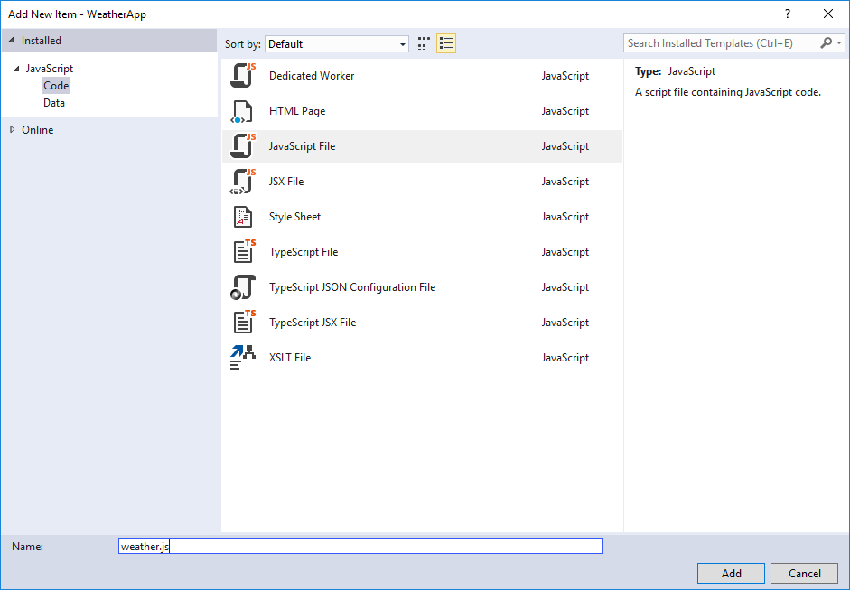

2.	Visual Studio will open the newly created `weather.js` file for editing. Paste the following code into the file:
		
	 ```javascript       
    var OpenWeatherAppKey = "Your_Key_Here";

    function getWeatherWithZipCode() {
      var zipcode = $('#zip-code-input').val();
      var queryString =
          'http://api.openweathermap.org/data/2.5/weather?zip='
          + zipcode + ',us&appid=' + OpenWeatherAppKey + '&units=imperial';
      $.getJSON(queryString, function (results) {
          showWeatherData(results);
          }).fail(function (jqXHR) {
              $('#error-msg').show();
              $('#error-msg').text("Error retrieving data. " + jqXHR.statusText);
          });
          return false;
    }

    function showWeatherData(results) {

      if (results.weather.length) {
          $('#error-msg').hide();
          $('#weather-data').show();

          $('#title').text(results.name);
          $('#temperature').text(results.main.temp);
          $('#wind').text(results.wind.speed);
          $('#humidity').text(results.main.humidity);
          $('#visibility').text(results.weather[0].main);

          var sunriseDate = new Date(results.sys.sunrise * 1000);
          $('#sunrise').text(sunriseDate.toLocaleTimeString());

          var sunsetDate = new Date(results.sys.sunset * 1000);
          $('#sunset').text(sunsetDate.toLocaleTimeString());

      } else {
          $('#weather-data').hide();
          $('#error-msg').show();
          $('#error-msg').text("Error retrieving data. ");
      }
    }

	```

	In the `OpenWeatherAppKey` variable, replace `Your_Key_Here` with the API key you generated on [OpenWeatherMap](https://home.openweathermap.org/).

    The `getWeatherWithZipCode` function retrieves the zip code from the input field, and calls the OpenWeatherMap service to get the weather for the specified location. The `showWeatherData` function updates the page with the current weather conditions retrieved from the service.

	If you ran the code now, nothing interesting would happen. We still have to tell the application to use the code in the `weather.js` file.
    
3.	Open the project's `www\index.html` page, and add the following `script` tag to the `<body>` of the page (at the bottom of the body section, where the other JavaScript references are located).

	```html   
    <script src="scripts/weather.js"></script>
	```

    When you're done, the list of scripts loaded by the `index.html` should look like the following:

	```html   
    <script src="scripts/jquery-1.8.0.min.js"></script>
    <script src="scripts/jquery.mobile-1.4.5.min.js"></script>
    <script src="cordova.js"></script>
    <script src="scripts/platformOverrides.js"></script>
    <script src="scripts/index.js"></script>
    <script src="scripts/weather.js"></script>
	```

4.	To enable the web app to connect to the OpenWeatherMap services, we need to add the weather service API endpoint (`http://api.openweathermap.org`) to the page's Content Security Policy (CSP). The CSP is an HTML meta tag located inside the page's `<head>` section; it's used to define approved content origins browsers are allowed to load in the page. It currently looks like this:

    ```html
    <meta http-equiv="Content-Security-Policy" content="default-src 'self' data: gap:
    https://ssl.gstatic.com 'unsafe-eval'; style-src 'self' 'unsafe-inline'; media-src *">
    ```

    Add ```http://api.openweathermap.org``` just after ```https://ssl.gstatic.com``` in that line to give this page permission to get content from the weather service. When you're done, your CSP will look like this:

    ```html
    <meta http-equiv="Content-Security-Policy" content="default-src 'self' data: gap:
    http://api.openweathermap.org https://ssl.gstatic.com 'unsafe-eval'; style-src 'self'
    'unsafe-inline'; media-src *">           
    ```

    > **Note:** Content Security Policy (CSP) is a computer security standard introduced to prevent cross-site scripting (XSS), clickjacking and other code injection attacks resulting from execution of malicious content in the trusted web page context. You can read more about at [content-security-policy.com](http://content-security-policy.com/).

5.	The [Cordova Whitelist plugin](https://cordova.apache.org/docs/en/latest/guide/appdev/whitelist/) is added automatically to every Cordova project. It adds an extra layer of security to the Cordova native application by enabling developers to define, at the native application layer, which endpoint domains the application can access. By default, the whitelist is setup so the application can access **any endpoint** through the inclusion of `*` in the Domain Access field in the project's `config.xml` as shown in the following figure:

    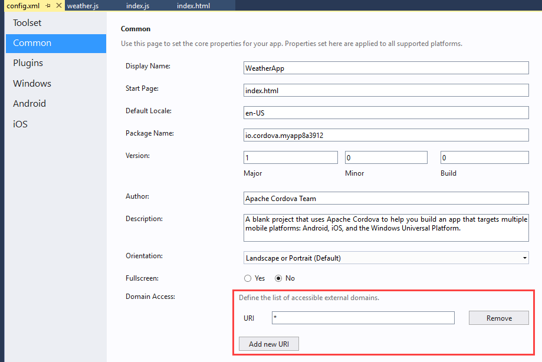

	This approach is fine during development, but before you put an application into production, you should restrict access to only the domains that you know the app needs to access.

	To fix this, open the Cordova Configuration Editor then access the **Common** tab. Click the **Add new URI** button then populate the input field with **http://api.openweathermap.org**. Next, click the **Remove** button next to the `*` entry. The end result should look like the following:	

    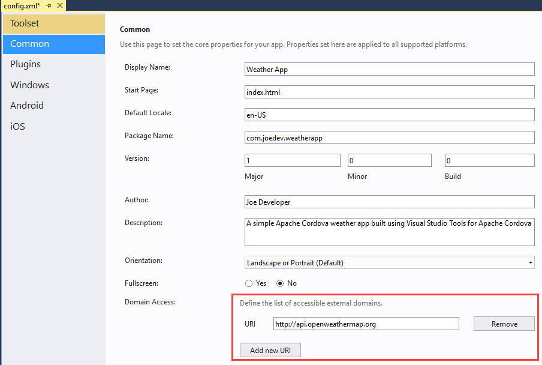	

## Run The App In An Android Emulator

Now that the app has the code it needs to retrieve weather conditions, let's run it, but this time use a device emulator.

1.	In the list of Android emulators, choose the one of the **Google Emulator** options (Phone or Tablet). Visual Studio will build the mobile app, launch the selected emulator, then deploy the app in the emulator.

	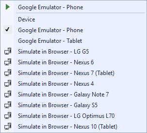

    > **Note:** Depending on your PC configuration some warnings or errors might appear, like firewall alerts or a message that indicating that the emulator must run in elevated mode. If you receive the following error, stop the Android Debug Bridge process (adb.exe) and retry launching the emulator:

    > 

2.	In the Android emulator, type a valid United States zip code into the edit box (for example: 44313), and then press the **Find Weather** button. Current weather data for target zip code will appear on the page.

    

    The app we've built is completely cross platform, it should run anywhere. If you have a little extra time, run this app in a Windows Phone emulator.

    > **Note:** You should test your app on as many physical devices (running on as many Operating System versions) as you can. Emulators and Simulators often behave different than a real device on certain circumstances and respond at different speeds. For example, an app may work in the simulator without a problem, but it may fail on a real device, or it can run faster on the device compared with an emulator. More information [here](https://cordova.apache.org/docs/en/latest/guide/next/index.html).

## <a id="find-fix"></a>Find and Fix problems

A big benefit of Visual Studio is its powerful debugger. If you're already familiar with it, you can skip this section. If you're not, let's take a quick tour of some things that you can do.

### Set Breakpoints and Conditional Breakpoints

You can set a breakpoint on any line of executable code (including the JavaScript code) within the application, view the state of the Cordova application, monitor variable values, review call stacks, and more. In the following figure, you can see that a breakpoint has been set on the line of code that calls the weather service to retrieve data. Visual Studio highlights the entire scope of the selected line; when running the app from within the IDE (on an emulator, simulator or physical device) Visual Studio will stop execution when it reaches that line and open the debugger to enable you to interact with the code. 


### Use the JavaScript Console

The JavaScript console displays messages generated by the application's JavaScript code. This console appears when your Cordova app starts. If it doesn't, it's easy enough to open. Just choose **Debug** -> **Windows** -> **JavaScript Console**.

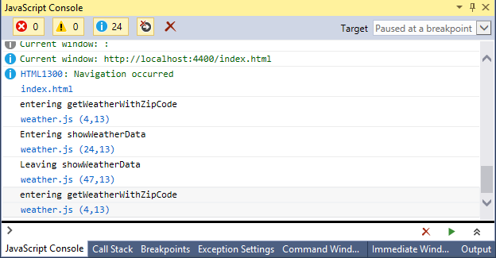

You can use the `console.log` method to log messages and then view those messages in the console. You can also use the console to execute any JavaScript function while the application is running. [Learn more about the JavaScript Console](https://developers.google.com/web/tools/chrome-devtools/console/). As an example, to generate the output highlighted output in the figure, the following code was added to the beginning of the `getWeatherWithZipCode` function: 

```console.log('entering getWeatherWithZipCode');```

### Use the Document Object Model (DOM) Explorer

Use the DOM Explorer to find and fix layout issues in your pages. Examine the structure of your pages as they render and then tweak them while the app is running. To open the DOM Explorer, choose **Debug** -> **Windows** -> **DOM Explorer** while the app is running. [Learn more about the DOM Explorer](https://msdn.microsoft.com/library/dn255008.aspx).


## <a id="capability"></a>Access Device Capabilities Through Plugins

Most likely you'll want your app to do more than just show web pages on a mobile device. You might want your app to store files, receive push notifications, or capture images by using the device's camera. This is where **Cordova plugins** becomes handy. Apache Cordova uses plugins to deliver access to native device capabilities that aren’t typically available to web applications. 

The Visual Studio [Configuration Editor](#settings) Plugin tab provides an interface that enables you to add and remove plugins from a Cordova application project. The **Core** tab lists the core Cordova plugins, plugins published and maintained by the Cordova development team. The green checkboxes shown in the figure indicate installed plugins. The **Installed** tab lists only the plugins that are installed in the application.

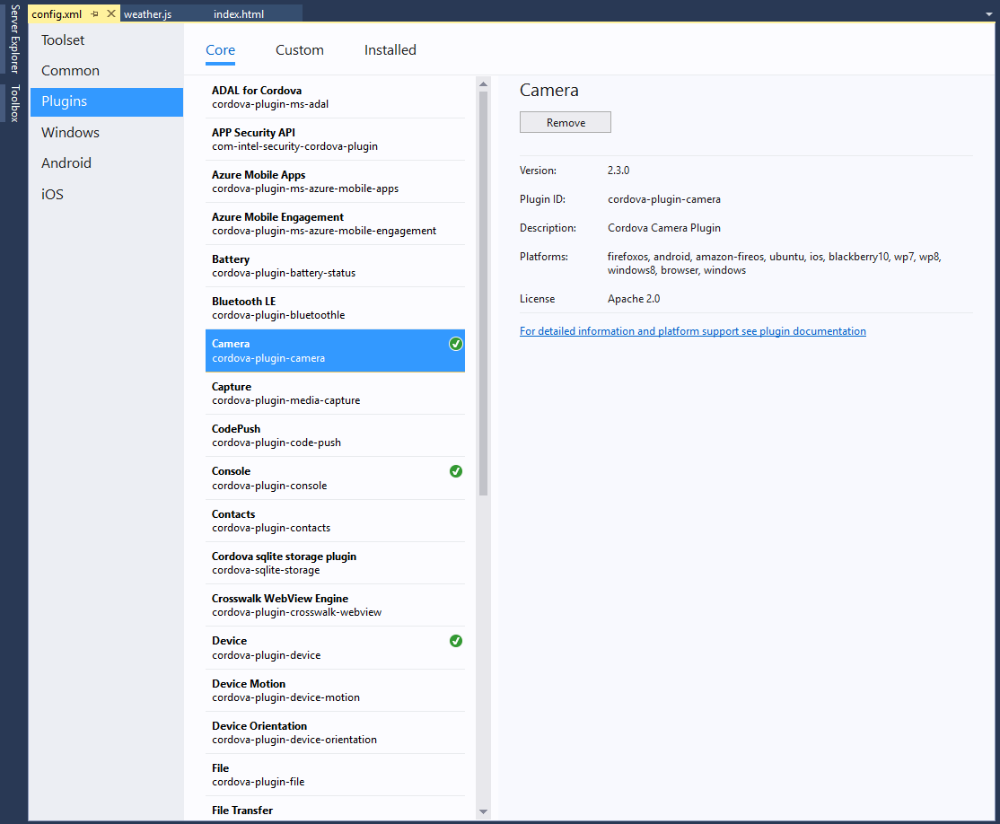

Use the **Custom** page to add plugins that are not one of the Cordova [core plugins](../develop-apps/use-cordova-plugins.md). Usually these are plugins created by you or a third-party. [This document](../develop-apps/manage-plugins.md#Custom) explains how to add a custom plugin to your project.

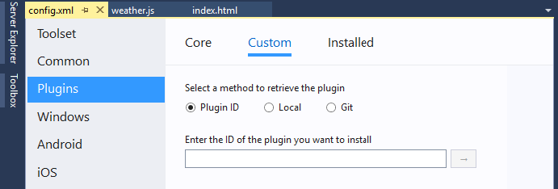

If you need to use a specific version of a plugin, you can add a plugin by editing the `config.xml` file directly. You can find guidance about how to do that  [here](../develop-apps/manage-plugins.md#AddOther).

Let's add a plug-in that gives us access to the device's geolocation capabilities; this this in place, we'll adjust the app so it retrieves weather conditions for the device's current location when the application launches.

1.	Open the Cordova [Configuration Editor](#settings), and choose the **Plugins** tab.

2.	On the **Core** tab, scroll down to the **Geolocation** plugin, select the plugin, then click the **Add** button to add the plugin to your project.

    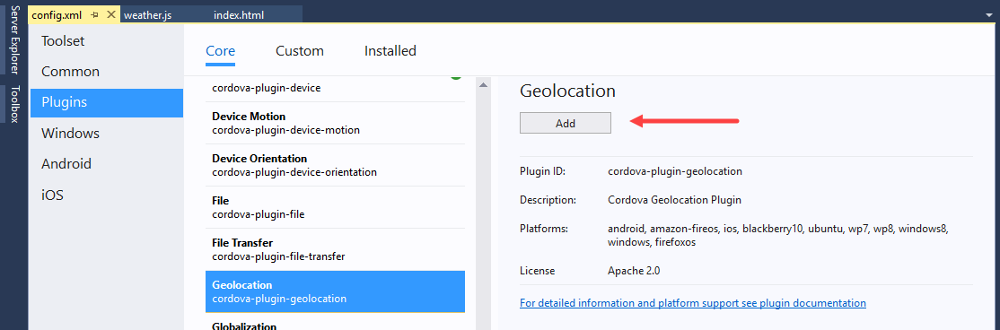

	The Cordova CLI adds plugins to the project's `plugins` folder, with a separate folder for each plugin. To learn how to use the plugin in your application, open the **Readme.md** file in the plugin's folder as shown in the following figure:

    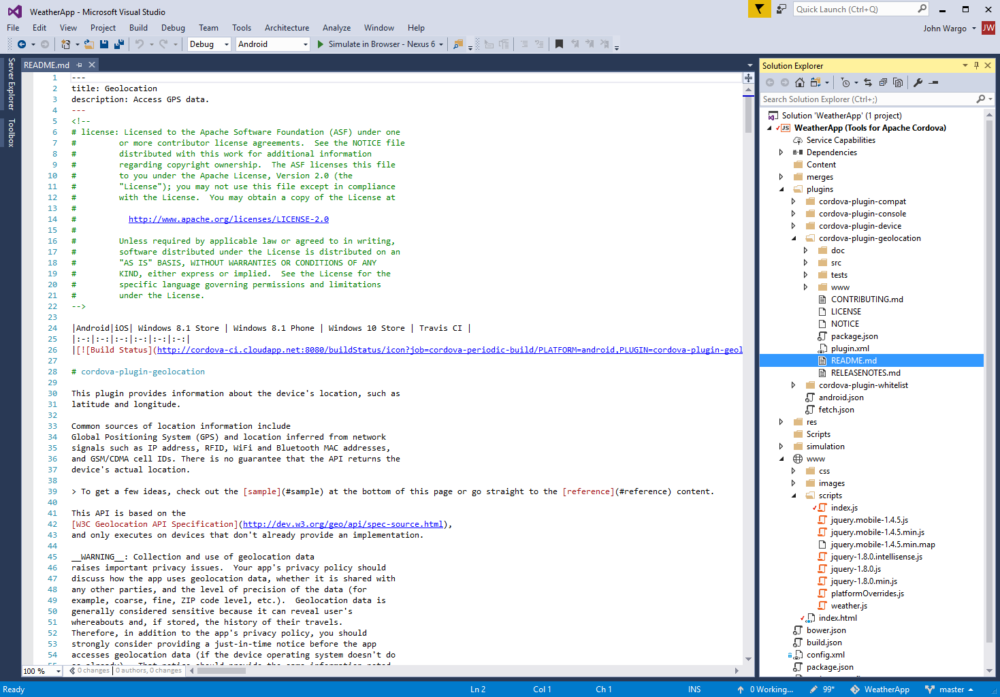

    Let's add some code that consumes this plugin.

3.	In the project's `www\scripts\weather.js` file add the following code right after the `getWeatherWithZipCode` function

	```javascript       
	function getWeatherWithGeoLocation() {
	 	//Call the Cordova Geolocation API
	    navigator.geolocation.getCurrentPosition(onGetLocationSuccess, onGetLocationError,
	    	{ enableHighAccuracy: true });    
		$('#error-msg').show();
	    $('#error-msg').text('Determining your current location ...');
	    $('#get-weather-btn').prop('disabled', true);
	}
	
	function onGetLocationSuccess(position) {
		//Retrieve the location information from the position object
		var latitude = position.coords.latitude;
	    var longitude = position.coords.longitude;
	
	    var queryString = 'http://api.openweathermap.org/data/2.5/weather?lat='
	        + latitude + '&lon=' + longitude + '&appid=' + OpenWeatherAppKey + '&units=imperial';
	
	    $('#get-weather-btn').prop('disabled', false);
	
	    $.getJSON(queryString, function (results) {
	        showWeatherData(results);
	    }).fail(function (jqXHR) {
	        $('#error-msg').show();
	        $('#error-msg').text("Error retrieving data. " + jqXHR.statusText);
	    });
	}
	
	function onGetLocationError(error) {
	    $('#error-msg').text('Error getting location');
	    $('#get-weather-btn').prop('disabled', false);
	}  

	```

    This code uses the device's geolocation capability to get the latitude and longitude of the device's location. It then uses that information to query the weather service for current conditions for the current location.

4.	Open the project's `www\scripts\index.js` file, and add the following code to the `onDeviceReady` function:

    ```javascript
	getWeatherWithGeoLocation();
    ```
    This code executes the `getWeatherWithGeoLocation` function when the `deviceready` event fires; updating the page with the weather conditions for the current location. The resulting `onDeviceReady` function should look like this:

    ```javascript
	function onDeviceReady() {
		// Handle the Cordova pause and resume events
		document.addEventListener( 'pause', onPause.bind( this ), false );
		document.addEventListener('resume', onResume.bind(this), false);
		$('#get-weather-btn').click(getWeatherWithZipCode);                       
	
		//Populate the page with the current location's weather conditions
		getWeatherWithGeoLocation();
	};
     ```

5.	Run the app using Cordova Simulate or one of the Android emulators. When the app starts, the page will display *Determining your current location ...* as it queries the Cordova Geolocation API for the current location. After a short pause, weather conditions for the current location displays on the page.
   
	To adjust the simulated device location in Cordova Simulate, switch to the Visual Studio **Plugin Controls** window (it opens automatically when you launch Cordova Simulate) and enter latitude and longitude values for the location then reload the app in the Cordova Simulate browser. Cordova Simulate automatically refreshes web content when you change it in Visual Studio, but since the app checks the current location on application start up, you'll need to restart the Cordova Simulate session in Visual Studio to see the location change within the app. 

	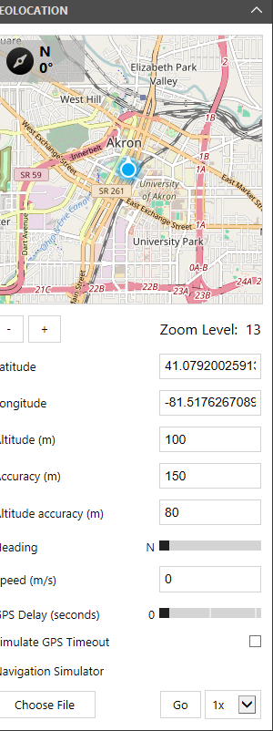

	To adjust the Android emulator location, press the **More** button in the panel to the right of the emulator window (the **More** button is the one with the three horizontal dots). In the **Extended Controls** window that appears, specify latitude and longitude values for the location you want to set, then press the **Send** button to send the location to the emulator.

	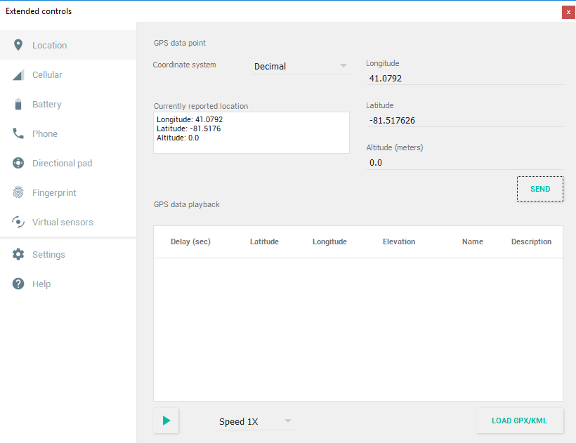

## <a id="tailor"></a>Tailor The App To A Platform

The code that you used to get the device's location works pretty well across all platforms, but what if it didn't? What if you had to write extra code to get the location of an iOS device? This is where the **merges** folder becomes useful. We touched on that folder earlier in this article. Now let's try a few basic things.

### Tailor The Behavior of Your App

1.	In **Solution Explorer**, expand the `www` folder, and then the `scripts` folder.

2.	Right-click the `weather.js` file, and choose **Copy**.

3.	In **Solution Explorer**, expand the `merges` folder, then the `android` folder.

4.	Right-click on the `scripts` folder, and then choose **paste**. You'll now have a copy of `weather.js` in `merges\android\scripts` folder.
    
	

5.	In the `weather.js` file (located in the `merges\android\scripts` folder), add the following code to the `showWeatherData` function.

	```javascript
    $('#app-title').text("Android Weather");
	```

6.	Run your app using an Android target in Cordova Simulate. The app will display **Android Weather** in the title bar because the `weather.js` file in the `merges\android\scripts` folder replaced the `weather.js` file in the `www\scripts` folder for the Android version of the application.

    

    Making a copy of a file this large to change one line of code is an extreme example, but you can begin to imagine the possibilities, and you can always refactor your code in ways that leverage the `merges` folder more efficiently.
    
### Tailor The Appearance of Your App

In some cases, you'll want to tweak the layout of your pages so that they appear correctly for one type of device or another.

1.	In **Solution Explorer** navigate to the project's `merges\android` folder.

2.	Right-click the `android` folder, choose **Add** -> **New Folder**, and name the folder **css**.

3.	Right-click the new `css` folder, and then select **Add** -> **New CSS file**.

4.	Name the file **index.css**, and then click the **Add** button.

    You'll now have a file named `index.css` in both the `merges\android\css` and `www\css` folders.

    

5.	Replace the contents of the new `merges\android\css\index.css` file with the following code.

	```css
    .not-displayed {
        display: none;
    }

    form {
        border-bottom: 1px solid #ddd;
        padding-bottom: 5px;
    }

    #zip-code-input {
        font-size: 25px;
    }

    #get-weather-btn {
        font-size: 22px;
    }

    #title {
        font-size: 16px;
    }

    #summary {
        font-size: 35px;
    }

    #summary img {
        float: right;
    }

    #error-msg {
        text-align: center;
        margin-top:  50%;
        font-weight: bold;    
    }

    .ui-bar-inherit.ui-header.header {
        background-color: #3388cc;
        border-color: #3388cc;
        color: #ffffff;
        text-shadow: 0 1px 0 #005599;
    }
	```

    Note that the styles defined are identical to the **www** version of the _index.css_ file, with the exception of this element:

    ````css
    .ui-bar-inherit.ui-header.header {
        background-color: #3388cc;
        border-color: #3388cc;
        color: #ffffff;
        text-shadow: 0 1px 0 #005599;
    }
    ````

    This is a simple example of what you can do using the Cordova project's `merges` folder. A more effective approach would be to use a separate CSS file for platform-specific styles.

6.	Run your app in Cordova Simulate.

    The app header has a blue background because the `index.css` file in `merges\android\css` folder replaced the `index.css` file in the `www\css` folder for the Android version of your app.
    
	

## <a id="next-steps"></a>Next steps

Congratulations on building your first cross-platform mobile app using Apache Cordova and Visual Studio Tools for Apache Cordova. Although this article just gets you started, there’s so much more to learn. Here are a few ideas about what you can explore next on your journey to build mobile apps with HTML and JavaScript and Visual Studio.

**Connecting to Existing Data**

Want to pull in data from sites like [StackExchange](https://api.stackexchange.com/) or [Github](https://developer.github.com/v3/)? How about your own database? 

Just like any browser, your Cordova app supports HTTP requests and Ajax calls. However, Cordova adds additional security to filter which scripts, CSS files, map files and data files can be pulled into your app:

* The [Cordova Whitelist Plugin](https://cordova.apache.org/docs/en/latest/reference/cordova-plugin-whitelist/) (which is automatically added into every project) controls which domains the native application can access. 
* A Content Security Policy meta tag in an `index.html` (`<meta http-equiv="Content-Security-Policy" ... />`) controls which network requests (images, XHRs, etc) are authorized after your app has loaded.

Additionally, the server or servers that you request data from may have additional security that restricts your app from being able to pull resources into your app:

* Cross-origin resource sharing (CORS) policies regulates which resources (e.g. fonts, JavaScript, etc.) from a web page can be requested from another domain outside the domain from which the resource originated. So, often times when your app is pulling data, fonts, images, and scripts from another web service, you need to make it in the form of a CORS request. [See more information](../tips-and-workarounds/general/tips-and-workarounds-general-readme.md#connection).

**Easy Backend Set Up with Microsoft Azure**

Get straight to building by hooking your app up to Azure. Azure offers a Mobile App service that utilizes Easy Tables to get your app connected to a SQL database with only a couple lines of JavaScript. [This helpful guide](https://azure.microsoft.com/en-us/documentation/articles/app-service-mobile-cordova-get-started/) takes you through the process of creating a mobile app backend, and ends with the option of creating a quickstart Cordova app, or adding connections to an existing app. 

**Explore Available Cordova plugins**

Search for available Cordova plugins on [npm](http://npmjs.org). The naming convention for these plugins is `cordova-plugin-plugin_name` or `phonegap-plugin-plugin_name`.

> **Tip:** If find a plugin that doesn't appear in the **Plugins** tab of configuration designer, you can still use it. [Learn more](../develop-apps/manage-plugins.md#Custom).

**Try Using Bower to Add a Package to Your Project**

See [Add packages by using Bower](../getting-started/tutorial-using-bower.md).

**Learn About Other Great Ways to Leverage the Visual Studio Debugger**

See [Debugger Basics](https://msdn.microsoft.com/library/k0k771bt.aspx).

**Explore the Many JavaScript Frameworks Out There**

Search online. They're everywhere! Here's a couple of them: [AngularJS](https://angularjs.org/), and [Ionic](http://ionicframework.com/).

**Get a Mac, and Then Run Your App in an iOS Simulator, or an iOS Device**

See [Visual Studio Tools for Apache Cordova: iOS Guide](vs-taco-2017-ios-guide.md).

**Tack on an Azure backend - it's free to try**

See [Connect a cloud service](../develop-apps/add-connected-services.md).

**Take a Look at TypeScript - It's Fully Supported in Visual Studio**

See [Use TypeScript](../getting-started/tutorial-typescript.md).
