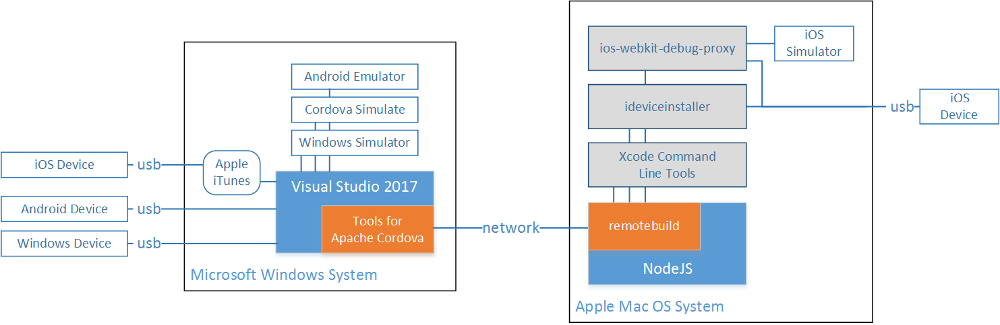
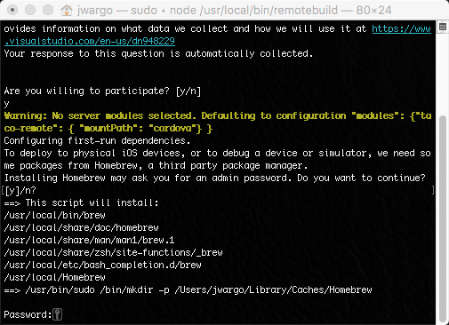
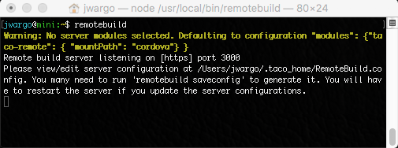
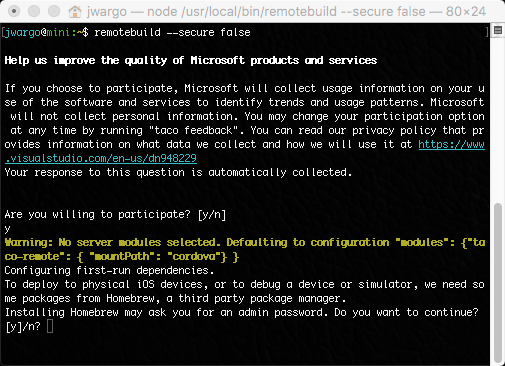
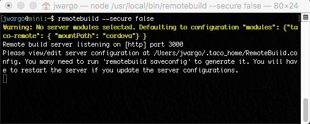
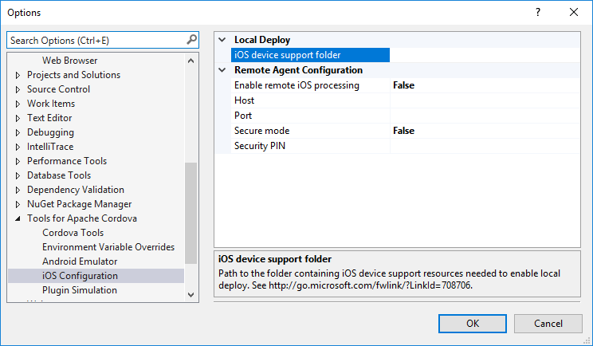
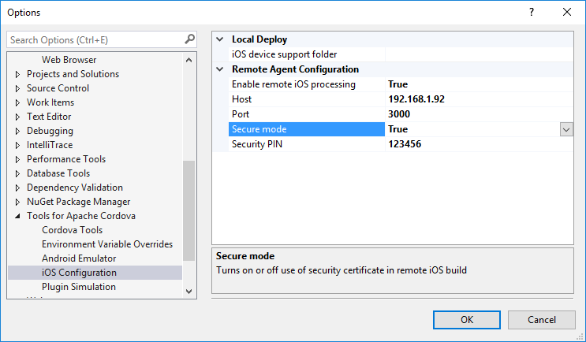
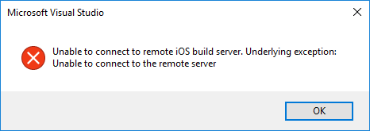
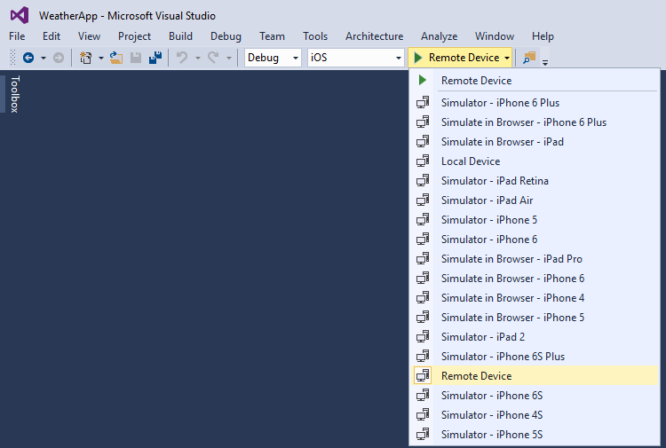
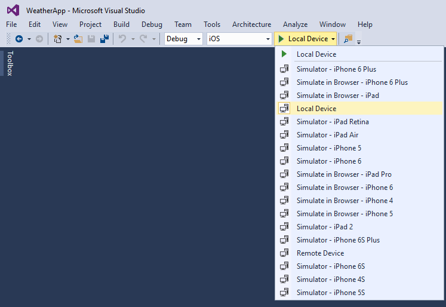

<properties
   pageTitle="Visual Studio Tools for Apache Cordova: iOS Guide | Cordova"
   description="Visual Studio Tools for Apache Cordova: iOS guide"
   services="na"
   documentationCenter=""
   authors="normesta, johnwargo"
   tags=""/>
<tags ms.technology="cordova" ms.prod="visual-studio-dev15"
   ms.service="na"
   ms.devlang="javascript"
   ms.topic="article"
   ms.tgt_pltfrm="mobile-multiple"
   ms.workload="na"
   ms.date="11/10/2016"
   ms.author="johnwargo"/>

# Visual Studio Tools for Apache Cordova: iOS Guide

Visual Studio Tools for Apache Cordova (TACO) enables Visual Studio developers to easily build, test and debug Apache Cordova applications on Android, iOS and Windows devices. Visual Studio's ability to work with iOS devices and applications relies upon some special tools running on a Mac computer system. In this guide, you'll learn how to install and manage those tools plus run Cordova apps on iOS devices and device simulators.

> **Note:** Due to restrictions in the Apple iOS development process, Visual Studio Tools for Apache Cordova must have live, network access to an Apple Mac computer running a current version of Apple's Xcode IDE and associated command-line tools. 

## <a id="overview"></a> Overview

Visual Studio Tools for Apache Cordova is workload for Visual Studio that delivers the ability to create, code, build, test and deploy Apache Cordova applications. Developers install **Visual Studio** and the **Mobile Development With JavaScript** workload on a system running Microsoft Windows. Within Visual Studio, developers can manage all aspects of a Cordova project including testing and debugging applications on a wide variety of devices, emulators, and simulators. On the Windows system, developers can execute Cordova applications on Android emulators, the Cordova Simulate browser and Windows simulators. If physical devices are available, Visual Studio can directly execute Cordova applications on Android and Windows devices through a USB connection.



When you add a Mac system to the environment and install some additional tools, Visual Studio gains the ability to execute Cordova applications on iOS simulators running on the Mac as well as physical iOS devices connected to Mac or Windows systems via a USB cable. 

In the figure, the remotebuild node module manages all of the interactions between Visual Studio and the software and devices running on or connected to the Mac computer system. On the Mac, the ideviceinstaller application is used to deploy Cordova applications on iOS device. You can even use iTunes running on Windows and the capabilities exposed through the Mac to execute Cordova applications on iOS devices connected to the Windows system.

Visual Studio enables live debugging of the Cordova web app (HTML, CSS and JavaScript code) on all of the target platforms. The ios-webkit-debug-proxy application connects to iOS devices and simulators and exposes a chrome-like interface that Visual Studio and the Chrome DevTools use to manage debug sessions on iOS. 

This guide illustrates how to install, configure, and use the capabilities exposed to Visual Studio by the remotebuild process running on a Mac computer system. 

## <a id="mac-install"></a> Mac OS Installation

We'll start by installing some required components on the Mac; later you'll configure Visual Studio to connect and use the tools running on the Mac.

1.	The iOS build process needs tools and libraries provided by [**Xcode 8**](https://developer.apple.com/xcode/); point your browser of choice to [https://developer.apple.com/xcode/download](https://developer.apple.com/xcode/download), then download and **install the latest version**.

2.	Once the installation completes, **open Xcode**, accept the **license agreement**, and then **close Xcode**. This may seem strange, but the Visual Studio Tools for Apache Cordova invokes Xcode functionality through its command-line tools, and you cannot execute them until you've accepted the license agreement.

3.	Install the **Xcode command-line tools**. Open Mac OS Terminal app, and execute the following command:

    ```
     xcode-select -–install
    ```   

4.	Install the latest Long Term Support (LTS) version of **Node.js** from [nodejs.org](http://nodejs.org/). 
	
	> **Note:** Microsoft recommends that you match the node version on the Mac to the node version in the Visual Studio Tools for Apache Cordova **Toolset** you're using in your Cordova application project. This may not be practical if you're regularly building Cordova applications using different toolsets, so try the LTS version first, and if you have node-related issues, investigate aligning node versions across the the Windows and Mac systems as part of the troubleshooting process.   

5.	Open a new terminal window and execute the following command:

    ```
	npm install -g remotebuild	
    ```

    This installs the TACO *remote agent*, a secure build server that runs on the Mac and processes commands from Visual Studio. You'll connect to it from your Windows computer so that you can build, run, and debug iOS apps from within Visual Studio.
	
	> **Note:** Many developers are used to seeing instructions for installing node modules that include executing the `npm` under control of the `sudo` command (e.g. `sudo npm install -g some_module`). That's not needed, and actually creates a huge security risk on your Mac. You should be able to install the 
	>  module with the command listed; if you can't, and see an `EACCESS` error in the terminal's output when the installation fails, see [*Fixing npm Permissions*](https://docs.npmjs.com/getting-started/fixing-npm-permissions) for instructions on how to fix the issue, then try again. 

At this point, you're probably asking yourself why you haven't installed Apache Cordova. That's because you don't need to; Cordova and its dependencies are automatically acquired and installed as needed during the build process. 

## <a id="running-remotebuild"></a>Running the remotebuild Server on a Mac

You'll need to keep remotebuild running on your Mac any time you'll be testing iOS applications from Visual Studio. You can either switch to your Mac and invoke the module any time you know you'll be working in Visual Studio, or you can configure the Mac to automatically start the module when the Mac boots.

The TACO remote agent can execute in two modes: secure mode or non-secure mode. The sections that follow show how to start remotebuild in either mode.

### <a id="secure-mode"></a> Option 1: Start the remotebuild Server in Secure Mode

By default, remotebuild executes in a mode where all traffic between Visual Studio and remotebuild is encrypted using a SSL certificate generated by remotebuild. With secure mode, build payloads are encrypted during transmission; this protects your intellectual property from being intercepted and prevents outsiders from using the open port of your remote agent to run malicious code. You should use secure mode when you're connecting to a Mac across a public network or your remote Mac is running in a cloud environment. 

To start the remotebuild in secure mode, open a terminal window and execute the following command:

```
 remotebuild
```

When you run remotebuild for the first time, the module steps you through a setup process that installs some additional components it needs to operate. The first time you run remotebuild in secure mode, the module generates a set of SSL certificates, then displays a PIN you'll need to enter into the Visual Studio TACO configuration to enable the connection between Visual Studio and remotebuild.

Let's take a look at the process.

When the server loads the first time, it prompts you to allow Microsoft to collect usage information in order to help improve the quality of Microsoft's products: 


Next, it prompts you to approve installation of some dependencies it needs to do its work:



Specifically, the module installs installs the [Homebrew](http://brew.sh/) package manager, and then some dependent Mac OS applications:

+ `ideviceinstaller`
+ `ios-webkit-debug-proxy`
+ `libimobiledevice`

> **Note:** If you choose not to install these applications, you will have a significantly degraded iOS development experience in Visual Studio. Without these applications, Visual Studio can still build applications for iOS devices and the simulators, and you'll still be able to launch apps in the iOS simulator. Visual Studio will **not** be able to debug iOS applications or launch apps on connected iOS devices. We recommend you answer 'Y' to the prompt shown in the figure.

Finally, the server process will launch and display the host name, port, and security PIN. You'll need those values to configure Visual Studio so it can connect to the server. **The PIN is only valid for 10 minutes**, so you'll want to complete the Visual Studio configuration right away; refer to [*Connect Visual Studio to the remotebuild Agent*](#visual-studio-configuration) for details.


After you complete the initial setup, subsequent launches of remotebuild will launch the server process and display a simple status message. At this point the server is ready to accept requests from Visual Studio. 



### <a id="insecure-mode"></a> Option 2: Start the remotebuild Server in Non-Secure Mode

If you're not concerned about security or you'll only be using a local network connection to the Mac running remotebuild, you can launch the server in non-secure mode. This is the easiest, and yet riskiest way to start the server; in this mode, Visual Studio uses simple HTTP connections to transfer build payloads to the server.

Start the server in non-secure mode only if you are comfortable with the trade-offs between risk and convenience. For example, if your Mac is publicly accessible over the internet and has access to sensitive materials, you'll probably want to run your remote agent in secure mode. If you don't, anyone could build an app against your remote agent, and that app could run malicious code. If your Mac is accessible only by you, it's easier and less error prone to run your remote agent in non-secure mode.  
 
> **Note:** Non-secure mode is most useful when troubleshooting connection issues between Visual Studio and the Mac running remotebuild. Developers start in non-secure mode, then switch to secure mode after confirming non-secure mode works.

To start remotebuild in **non-secure mode**, open a terminal window and execute the following command:

```
 remotebuild --secure false
```

When the server loads the first time, it prompts you to allow Microsoft to collect usage information in order to help improve the quality of Microsoft's products: 


Next, it prompts you to approve installation of some dependencies it needs to do its work:



Specifically, the module installs installs the [Homebrew](http://brew.sh/) package manager, and then some dependent Mac OS applications:

+ `ideviceinstaller`
+ `ios-webkit-debug-proxy`
+ `libimobiledevice`

> **Note:** If you choose not to install these applications, you will have a significantly degraded iOS development experience in Visual Studio. Without these applications, Visual Studio can still build applications for iOS devices and the simulators, and you'll still be able to launch apps in the iOS simulator. Visual Studio will **not** be able to debug iOS applications or launch apps on connected iOS devices. We recommend you answer 'Y' to the prompt shown in the figure.

Finally, the server process will launch and display the server listening port. You'll need the host name (or host address) and the port to configure Visual Studio so it can connect to the server. Refer to [*Connect Visual Studio to the remotebuild Agent*](#visual-studio-configuration) for details on how to configure Visual Studio.


After you complete the initial setup, subsequent launches of `remotebuild --secure false` will launch the server process and display a simple status message. At this point the server is ready to accept requests from Visual Studio. 



## <a id="stop-remote-build"></a> Stopping the remotebuild Server

In the remotebuild terminal window, press **Ctrl**+**C** key combination to stop the server process.

## <a id="visual-studio-configuration"></a>Configure Visual Studio for iOS Development

### Local Deploy

When developing an app using Visual Studio Tools for Apache Cordova today, you have several options for emulating and deploying your app on iOS. In many development environments, a developer running Visual Studio is not physically near the Mac machine hosting the remotebuild server. This makes it hard to interact with a physical iOS device and debug the app. Through the **Local Deploy** feature in Visual Tools for Apache Cordova, you can connect an iOS device to the Windows system running Visual Studio and deploy the application on the device (through the remotebuild server process).

1.	On your Windows computer, open Visual Studio. Open the **Tools** menu, then select **Options**.

2.	In the **Options** dialog box, open **Tools for Apache Cordova**, and then choose **iOS Configuration**.
   
	

3.	Populate the **iOS device support folder** field with the following path: 

	```
	\\<IP_ADDRESS>\Applications\Xcode.app\Contents\Developer\Platforms\iPhoneOS.platform\DeviceSupport
	```

	Replacing `IP_ADDRESS` with the IP Address of Mac running remotebuild. So, if the Mac running the remotebuild server has an IP address of 192.168.1.23, you would populate the field with:

	```
	\\192.168.1.23\Applications\Xcode.app\Contents\Developer\Platforms\iPhoneOS.platform\DeviceSupport
	```

4.	Click the **OK** button to close the Options dialog.

### Remote Agent Configuration

1.	On your Windows computer, open Visual Studio. Open the **Tools** menu, then select **Options**.

2.	In the **Options** dialog box, open **Tools for Apache Cordova**, and then choose **iOS Configuration**.
   
	

3.	Set **Enable remote iOS processing** to true to enable Visual Studio's connection to the remote server process. 

4.	Populate the **Host** and **Port** fields with the appropriate values for your configuration.

5.	If the server was started in secure mode, set the value in the **Secure mode** field to **True**. Next, populate the **Security PIN** field with the PIN displayed by the server on first launch.
    
	

	> **Note:** Remember, the security PIN is only valid for 10 minutes. If you do not complete this configuration within the alloted time, you'll have to [generate a new PIN](#securitypin) on the server, and try again.  

    If the server is not running in secure mode, set the value in the **Secure mode** field to **False**, and leave the **Security PIN** field blank.
    	
	

6.	Click the **OK** button to close the Options dialog.

	At this point, Visual Studio connects to the remote agent to validate the configuration; if you don't receive any errors, you've successfully connected to the server.

	If Visual Studio cannot connect to the `remotebuld` server using the settings you provided, you'll see an error similar to the following: 

	

	Verify the connectivity settings for the server, update the values in the dialog and try again until it works.

### <a id="troubleshooting-1"></a> Troubleshooting: Let's fix it

[Did you receive an error that relates to your certificate?](#certificate)

[Is the host name of your Mac not resolving?](#hostname)

[Have you been told that your security PIN is invalid or has expired?](#securitypin)

[Are you experiencing a symptom that does not appear in this list?](#stack)

## <a id="run-on-simulator"></a>Run Your App On An iOS Simulator

1.	In Visual Studio, on the **Standard toolbar**, select the **iOS** platform.
    
	 

2.	Next, select one of the **iOS simulators** from the target list.
    
	

3.	Click the **Run** button or press the **F5** key to start the app.

	

    At this point, Visual Studio prepares your app, then sends instructions to the remotebuild server running on the Mac to create a local Cordova project, populate the app with the content from the Visual Studio project, builds the app, then deploys the app in the selected simulator. As the process progresses, the server will update the console with status messages.

	

In Visual Studio, the DOM explorer and other debugging tool windows open, enabling a live debugging session with the running application.

### <a id="troubleshooting-2"></a> Troubleshooting: Let's fix it

[Did you receive an error that tells you that a tool requires Xcode?](#install-xcode)

[Did you receive an error that relates to your certificate?](#certificate)

[Is the host name of your Mac not resolving?](#hostname)

[Have you been told that your security PIN invalid or has expired?](#securitypin)

[Did you receive an error indicating that the port is already in use?](#PORT)

[Did you receive any other type of build error](#cli)

[Are you experiencing a symptom that does not appear in this list?](#stack)

## <a id="run-on-device"></a>Run Your App On An iOS Device

You'll need an Apple [**Provisioning Profile**](https://developer.apple.com/library/content/documentation/IDEs/Conceptual/AppDistributionGuide/MaintainingProfiles/MaintainingProfiles.html) to run your app on a device. Create one by using an Apple Developer account. You can also create one with your free Apple ID but there are limitations; see [Supported Capabilities](https://developer.apple.com/library/prerelease/ios/documentation/IDEs/Conceptual/AppDistributionGuide/SupportedCapabilities/SupportedCapabilities.html#//apple_ref/doc/uid/TP40012582-CH38-SW1).

### <a id="ios-on-mac"></a> iOS Device Connected to a Mac

#### On Your Mac

1.	If it's not already running, start the remotebuild server. See [Start the remote agent on your Mac](#running-remotebuild) for instructions on how to start the server process.

2.	Connect the iOS device to your Mac using the appropriate cable.

3.	Power on the iOS device.

#### On Your Windows Computer

1.	In Visual Studio, open the Cordova app project.

2.	On the Standard toolbar, choose the **iOS** platform.
    
	

3.	Next, select **Remote Device** from the target list.

	

4.	Click the **Run** button or press the **F5** key to start the app.

	

     At this point, Visual Studio prepares your app, then sends instructions to the remotebuild server running on the Mac to create a local Cordova project, populate the app with the content from the Visual Studio project, builds the app, then deploys the app in the connected device. As the process progresses, the server will update the console with status messages.
 
	

In Visual Studio, the DOM explorer and other debugging tool windows open, enabling a live debugging session with the running application.

#### <a id="troubleshooting-3"></a> Troubleshooting: Let's fix it

[You've been told that we were unable to find the app you're trying to debug](#safari)

[You've been told that no provisioning profiles were found](#no-provision)

[Did you receive an error that relates to your certificate?](#certificate)

[Is the host name of your Mac not resolving?](#hostname)

[Have you been told that your security PIN invalid or has expired?](#securitypin)

[Did you receive an error indicating that the port is already in use?](#PORT)

[Did you receive any other type of build error](#cli)

[Are you experiencing a symptom that does not appear in this list?](#stack)

### <a id="ios-on-windows"></a>iOS Device Connected To A Windows Computer

You can attach an iOS device to your Windows computer, then set breakpoints in your app and debug it. As long as you can connect to your Mac, you don't have be anywhere near it. This makes it easier to build and debug iOS apps on a Windows computer and share a Mac with other developers on your team.

To do this, you'll need a provisioning profile that you create by using an Apple Developer Account. 

> **Note:** To deploy to a device from Windows you will first need to tell Visual Studio where it can find the **iOS device support folder**. We have verified that using a local copy of the files will technically work but we recommend using a file share to ensure you’re always on the latest bits. As a result, we'll go through how to set this up using the file share method.

#### On Your Mac

1.	If it's not already running, start the remotebuild server. See [Start the remote agent on your Mac](#running-remotebuild) for instructions on how to start the server process.

2.	Share the system's **Applications** folder with Windows computers. See [Set up a Mac to share files with Windows users](https://support.apple.com/kb/PH25346) for information on how to setup sharing.

#### On Your Windows Computer

1.	In the Windows **File Explorer** application, connect to the Mac. To do this, type the **IP address** or **hostname** for the Mac into the address bar in File Explorer. 
   
	

    The first time you attempt to open files on your mac, you'll be prompted for a username and password. Enter the username and password of the account that you turned on Windows File Sharing for. This establishes a file sharing connection between your Windows computer and your Mac.

2.	Install [Apple iTunes](http://www.apple.com/itunes/) on the Windows system.

3.	Connect the iOS device to the Windows system.

4.	Power on the iOS device. Apple iTunes should launch automatically when the device connects to the system.

5.	In Visual Studio, open the **Tools** menu, then select **Options**.

6.	In the **Options** dialog, open **Tools for Apache Cordova**, and then choose **iOS Configuration**.
   
	

7.	Populate the **iOS device support folder** field with the following path: 

	```
	\\<IP_ADDRESS>\Applications\Xcode.app\Contents\Developer\Platforms\iPhoneOS.platform\DeviceSupport
	```

	Replacing `IP_ADDRESS` with the IP Address of Mac running remotebuild. So, if the Mac running the remotebuild server has an IP address of 192.168.1.23, you would populate the field with:

	```
	\\192.168.1.23\Applications\Xcode.app\Contents\Developer\Platforms\iPhoneOS.platform\DeviceSupport
	```

8.	Click the **OK** button to close the Options dialog.

9.	In Visual Studio, open the Cordova application project.

10.	On the Standard toolbar, choose the **iOS** platform.

    	

11.	Choose **Local Device**.
    
	

12.	Click the **Run** button or press the **F5** key to start the app.

	

     At this point, Visual Studio prepares your app, then sends instructions to the remotebuild server running on the Mac to create a local Cordova project, populate the app with the content from the Visual Studio project, builds the app, then deploys the app in the connected device. As the process progresses, the server will update the console with status messages.
 
	

## <a id="errors"></a> Troubleshooting: Let's fix it

[You've been told that we were unable to find the app you're trying to debug](#safari)

[Did you receive an error that relates to your certificate?](#certificate)

[Is the host name of your Mac not resolving?](#hostname)

[Have you been told that your security PIN invalid or has expired?](#securitypin)

[Did you receive an error that tells you that a tool requires Xcode?](#install-xcode)

[Did you receive an error indicating that the port is already in use?](#PORT)

[You've been told that no provisioning profiles were found](#no-provision)

[Did you receive any other type of build error](#cli)

[You try to run your app on a device that is connected to your Windows computer but the project can't find it](#timeout)

[You try to build an app for iOS 10 using XCode 8, but builds are failing.](#xcode8)

[Are you experiencing a symptom that does not appear in this list?](#stack)

### <a id="certificate"></a>Did you receive an error that relates to your certificate?

This happens when Visual Studio has trouble finding your Mac on the network or if host name or IP address of your Mac changed since remotebuild generated the SSL certificate Visual Studio uses.

**Possible issue 1: Windows has trouble finding your Mac on the network**

On your Windows computer, open a **Command Prompt**, and *ping* the IP address of your Mac. For example, if the IP address of your Mac is 10.83.51.174, type the following command:

```
ping 10.83.51.174
```

You should see a message similar to:

```
Pinging 10.83.51.174 with 32 bytes of data:
```

followed by a series of messages like the following:

```
Reply from 10.83.51.174: time<1ms
```

This indicates that the Windows system is able to successfully connect to the Mac. 

If, however, you see something like the following:

```
Reply from 192.168.1.51: Destination host unreachable.
```

This means that the Windows system cannot connect to the Mac. There might be some other connectivity issue or your Mac and your Windows computers might be connected to different networks. This can happen sometimes when your company has more than one Wi-Fi network.  When a Mac wakes from a sleep, it connects to the first available Wi-Fi network. That might not be the same network your Windows computer is using.

On the Mac, open the **Settings** application then the **Network** option. You'll see a list of preferred Wi-Fi networks:


The **MSFTCORP** Wi-Fi network appears first. When this Mac wakes from a sleep, it will try to use that network before connecting to any other. The network used by your Windows Computer should appear first in this list. Otherwise, you'll experience these issues intermittently.

If this doesn't resolve your issue, it's possible that the host name or IP address of your Mac changed.

**Possible issue 2: The host name or IP address of your Mac has changed**

When you first started the remote agent, a certificate was generated. That certificate paired Visual Studio to your Mac's IP address or host name. If the IP address or host name changes, your certificate  becomes invalid.

Try this. Stop the remote agent on your Mac. Then, in a Terminal, execute the following command:

```
remotebuild certificates reset
```

Then, run this command:

```
remotebuild certificates generate
```

Start the remote agent.

On your Windows computer, in the **Options** dialog box, open **Tools for Apache Cordova**, and then choose **iOS Configuration**.


Add the host name and port number to the appropriate fields in this dialog box.

If you're using secure mode, set the **Secure mode** field to **True**, and then add the security pin.


If you're not using secure mode, set the **Secure mode** field to **False**, and then leave the **Security PIN** field blank.


Choose the **OK** button to close this dialog box.

Visual Studio connects to the remote agent. If you don't receive any errors, you've successfully connected.

Still not working? Reach out to us [here](http://stackoverflow.com/questions/tagged/visual-studio-cordova).

If you've resolved this problem another way, please share it in a comment.

[Go back up](#errors)

### <a id="hostname"></a>Is the host name of your Mac not resolving?

First, make sure that the **Host** value in the Visual Studio iOS configuration matches computer name in the in the **Sharing** settings of your Mac.

Alternatively, you can set the **Host** name in Visual Studio to the IP address that appears in the **Network** settings of your Mac.


Still not working? Reach out to us [here](http://stackoverflow.com/questions/tagged/visual-studio-cordova).

If you've resolved this problem another way, please share it in a comment.

[Go back up](#errors)

### <a id="securitypin"></a>Have you been told that your security PIN is invalid or has expired?

This can happen the first time you set things up because your security PIN is good for only 10 minutes, then it expires.

This can also happen if your attempting to use the same PIN for multiple Windows computers. More than one Windows computer can use the same remote build service, but each computer must have it's own PIN.

To generate a new PIN:

1.	First, stop the remote agent. On your Mac, open the Terminal app, and type **CTRL**+**C** to stop the server process.

2.	In the Terminal app, type the following command:
	
	```
	remotebuild certificates generate
	```

    Your new security PIN appears in the Terminal app window. Add that PIN to the **Security PIN** field in Visual Studio.

    If this doesn't work, return to your Mac and in the Terminal app, execute:

	```
	remotebuild certificates reset
	``` 

	and then execute 

	```
	remotebuild certificates generate
	``` 

	to generate another PIN.

Still not working? Reach out to us [here](http://stackoverflow.com/questions/tagged/visual-studio-cordova).

If you've resolved this problem another way, please share it in a comment.

[Go back up](#errors)

### <a id="safari"></a>You've been told that we were unable to find the app you're trying to debug

On your iOS device or simulator, open the **Settings** app, select **Safari**, then **Advanced**, and enable the **Web Inspector**.

See [Safari iOS](https://developer.apple.com/library/mac/documentation/AppleApplications/Conceptual/Safari_Developer_Guide/GettingStarted/GettingStarted.html#//apple_ref/doc/uid/TP40007874-CH2-SW8).

If this doesn't work, reset the settings on your iOS device.

Still not working? Reach out to us [here](http://stackoverflow.com/questions/tagged/visual-studio-cordova).

If you've resolved this problem another way, please share it in a comment.

[Go back up](#errors)

### <a id="install-xcode"></a>Did you receive an error that tells you that a tool requires Xcode?

Make sure that [Xcode](https://developer.apple.com/xcode/download/) is installed on your Mac. Then, open Xcode and accept the license agreement. This is important; if you don't accept the license agreement, you'll keep getting build errors.  

Still not working? Reach out to us [here](http://stackoverflow.com/questions/tagged/visual-studio-cordova).

If you've resolved this problem another way, please share it in a comment.

[Go back up](#errors)

### <a id="PORT"></a>Did you receive an error indicating that the port is already in use?

Most likely, an instance of remotebuild is already running. Stop the remotebuild server by typing **Ctrl**+**C** in the Terminal App window, and then restart it.

Alternatively, start the remotebuild server on a different port. (Try using port 3000 first before switching to another port.)

1.	Run this command in the Terminal App on your Mac to start the agent.

    ```
    remotebuild --port <portnumber>
    ```

2.	Update the port number in Visual Studio (**Tools** > **Options** > **Tools for Apache Cordova** > **iOS Configuration**).

3.	Run your app again.

[Go back up](#errors)

### <a id="no-provision"></a>You've been told that no provisioning profiles were found

Most likely, Xcode hasn't yet registered your device or requested your development certificate. You can make these things happen by creating a project in Xcode, and then choosing the **Fix Issue** button in the general settings page of your new project.

>**Important**: In the team pop-up menu, make sure to choose your team or individual name that is associated with your provisioning profile. Choose your Apple ID only if you chose to use your free Apple ID to create the provisioning profile.

### <a id="cli"></a>Did you receive any other type of build error?

Under the covers, Visual Studio Tools for Apache Cordova uses the Cordova SDK to manage interactions with mobile device SDKs and other tools. Therefore, when you see build errors that aren't covered elsewhere in this guide, chances are that the errors are coming from external tools used by Visual Studio. When this happens, general purpose Cordova best practices, tips and tricks apply. Refer to the [Apache Cordova documentation](http://cordova.apache.org/docs/en/latest/) or existing [Apache Cordova](http://stackoverflow.com/questions/tagged/cordova) or [Visual Studio Tolls for Apache Cordova](http://stackoverflow.com/questions/tagged/visual-studio-cordova) questions on Stack Overflow for help from other people who have solved similar issues.  

Still not working? Reach out to us [here](http://stackoverflow.com/questions/tagged/visual-studio-cordova).

If you've resolved this problem another way, please share it in a comment.

[Go back up](#errors)

### <a id="timeout"></a>You try to run your app on a device that is connected to your Windows computer but the project can't find it

It's possible that the Windows **ios-webkit-debug-proxy.exe** and **idevicedebugserverproxy.exe** processes were started in a previous attempt to run this project and they need to be closed.

On your Windows computer, open the **Task Manager** and then choose the **Processes** tab. If those processes appear in the list, right-click on each application, and then click **End Process**.

[Go back up](#errors)

### <a id="xcode8"></a>You try to build an app for iOS 10 using XCode 8, but builds are failing.

This is a known issue with Apache Cordova 6.3.1 and for the Visual Studio tools we've been working on a fix for this. To work around the issue for now, you'll need to perform the following steps:

+ Add a `developmentTeam` property to the `ios` build settings in your project's `build.json` file (an example is shown below).
+ Set the `build.json` file's `codeSignIdentity` property to the static value `iPhone Developer`.
+ Setup a `before_compile` hook in your project to copy the `developmentTeam` property into the project's `platforms/ios/cordova/build.xcconfig` file.  

The project's `build.json` file should look something like the following:

```
{
  "ios": {
    "debug": {
      "developmentTeam": "DEVELOPMENT_TEAM_NAME"
    },
    "release": {
      "developmentTeam": "DEVELOPMENT_TEAM_NAME",
      "codeSignIdentity": "iPhone Developer"
    }
  }
}
```

To simplify the process, [Darryl Pogue](https://dpogue.ca/articles/cordova-xcode8.html) published a [sample hook](https://gist.github.com/dpogue/186b6c1827363c48d644b0d59e91bc28) that makes the required changes to the project's `build.xconfig` file based on the `build.json` example shown above. To use this hook, copy the sample `xcode8.js` file to your project's `hooks` folder, and then modify the project's `config.xml` to execute it before the compilation step using the following code:

```<platform name="ios">
  <hook type="before_compile" src="hooks/xcode8.js" />
</platform>```

#### Creating a Distribution Build

At this point, the Cordova build process works, and you can run, test and debug your app. Unfortunately, the app isn't being signed with the correct development certificate needed for distribution. In order to sign them with a distribution certificate, you'll need to create an archive of the app by following the instructions found in: [Uploading Your App to iTunes Connect](https://developer.apple.com/library/content/documentation/IDEs/Conceptual/AppDistributionGuide/UploadingYourApptoiTunesConnect/UploadingYourApptoiTunesConnect.html).

#### If you can't run or debug an iOS 10 app

Developers building Cordova applications for iOS 10 may encounter the following errors:

```
Http 404: Error mounting developer disk image
Http 500: No devices found to debug. Please ensure that a device is connected and awake and retry.
```

This is caused by the Mac development environment needing an update to several modules. To fix the issue, on Mac OS, open a terminal window and issue the following command:

```
brew update && brew upgrade libimobiledevice --HEAD && brew upgrade ios-webkit-debug-proxy ideviceinstaller
```

[Go back up](#errors)

### <a id="stack"></a>Are you experiencing a symptom that does not appear in this list?

Try these things:

* Review [iOS and OSX Tips and Workarounds](../tips-and-workarounds/ios/tips-and-workarounds-ios-readme.md).

* Review [Known issues: iOS](../known-issues/known-issues-ios.md).

* Reach out to us [here](http://stackoverflow.com/questions/tagged/visual-studio-cordova) or start a discussion at the bottom of this topic.

[Go back up](#errors)