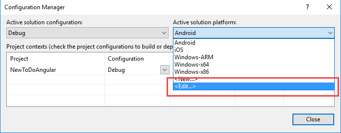
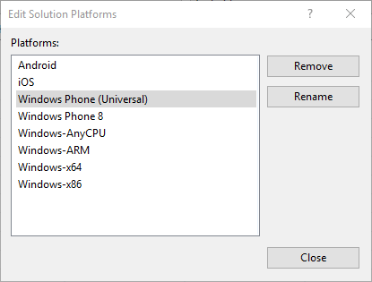

<properties
   pageTitle="Migrate a Cordova project to Visual Studio 2017 | Cordova"
   description="Migrate a Cordova project to Visual Studio 2017"
   services="na"
   documentationCenter=""
   authors="johnwargo"
   tags=""/>
<tags ms.technology="cordova" ms.prod="visual-studio-dev15"
   ms.service="na"
   ms.devlang="javascript"
   ms.topic="article"
   ms.tgt_pltfrm="mobile-multiple"
   ms.workload="na"
   ms.date="11/10/2016"
   ms.author="johnwargo"/>

# Migrate a Cordova project to Visual Studio 2017

The Cordova project structure in Visual Studio 2017 mirrors the project structure of Apache Cordova apps that you create using the Cordova command-line interface (CLI). This allows you to use any third-party tools or CLIs in Visual Studio that are compatible with Cordova, such as Gulp and the Ionic CLI.

> **Note:** Before we begin, make sure you have completed the [Visual Studio Tools for Apache Cordova installation](vs-taco-2017-install.md).

If you have a Cordova project created with an earlier version of Visual Studio (such as a project created in Visual Studio 2015), when you open the project for the first time in Visual Studio 2017, Visual Studio will automatically migrate the project for you; it will happen so fast you'll hardly notice it. Unfortunately, after the migration, you will **not be able to open the migrated project** in older versions of Visual Studio. For that reason, be sure to **backup your Cordova application project** before opening the project in Visual Studio 2017.

Once the migration is complete, you'll need to clean up some legacy configuration settings from the original project:

1.	In the target platform list, select **Configuration Manager...**.

	

2.	In the **Configuration Manager** dialog, select the **Active solution platform** drop-down, then choose **<Edit...>**.
	
	

3.	Finally, in the **Edit Solution Platforms** dialog, remove the following legacy **Windows** options that appear in the list:

	+ Windows Phone (Universal)
	+ Windows Phone 8
	+ Windows-AnyCPU 
	
	To do this, for each target, select the item in the list, then click the **Remove** button.
	
	

4.	Click the **Close** button (twice) when finished.
	
## Selecting a Cordova Toolset for the Migrated Project

In previous versions of Visual Studio Tools for Apache Cordova, Visual Studio used the project's `taco.json` to define the target Cordova SDK version for the project. In Visual Studio 2017, the target Cordova SDK version is maintained in the project's `config.xml` file's **Toolset** setting. 

The Apache Cordova development toolchain consists of a variety of tools, the Cordova CLI, NodeJS, Node Package Manager (npm), and the mobile platform native SDKs. In order to simplify management of Visual Studio's Cordova development environment, Visual Studio Tools for Apache Cordova packages the required tool versions for each Cordova platform version into Toolsets. See [Visual Studio Tools for Apache Cordova: Toolsets](vs-taco-2017-toolsets.md) for more information.

To avoid creating an incompatibility between Visual Studio's default Cordova toolchain and the original project's Cordova development environment, when you migrate a Cordova project in Visual Studio, the migrated project's toolset is set to use a externally installed (not part of the Visual Studio installation) Cordova toolchain. If you don't have an installation of the Cordova SDK on the system or if you want to use a different toolset, you'll need to update the project's configuration. In Visual Studio, open the new project's `config.xml` file by double-clicking on the file Solution Explorer. Open the Toolset tab and select the appropriate Toolset for the project. 

In the following example, the project was recently migrated and is therefore set to use the system's global Cordova SDK.


Click the drop-down arrow on the **Toolset Name** field and select one of the installed toolsets as shown in the following figure. 


Press **Ctrl**-**S** to save your changes, then close the configuration editor and you're ready to go.

## Troubleshooting

If you try to launch the migrated application in Visual Studio, and receive the following error: 

```
Path to Node.js executable could not be determined. Please check that Node.js has been installed.
```

This means that the migrated project is configured to use a globally installed Cordova SDK, but NodeJS and Cordova are not installed on the system. Either switch to an installed Toolset, or install [NodeJS](http://nodejs.org) and [Apache Cordova](http://cordova.apache.org/docs/en/latest/guide/cli/index.html) then try again.

If you receive the following error:

```
Building using global Cordova version but Cordova is not installed globally.  Install Cordova globally or choose a toolset in the config.xml editor.
```

This indicates that the Visual Studio Tools for Apache Cordova cannot locate the Cordova SDK. Either switch to an installed Toolset, or install [Apache Cordova](http://cordova.apache.org/docs/en/latest/guide/cli/index.html) then try again.