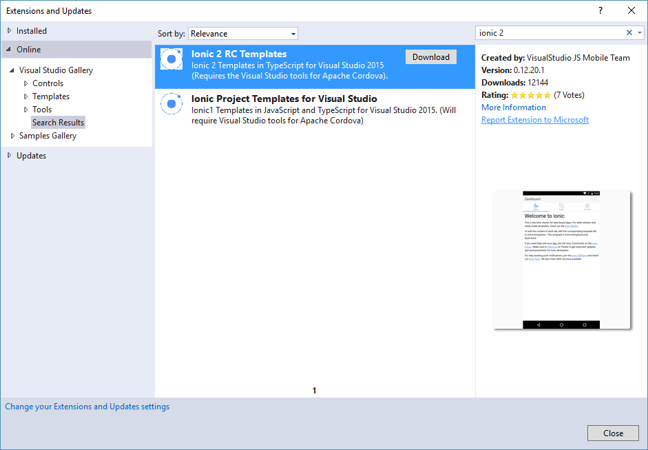
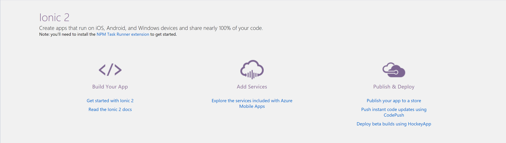
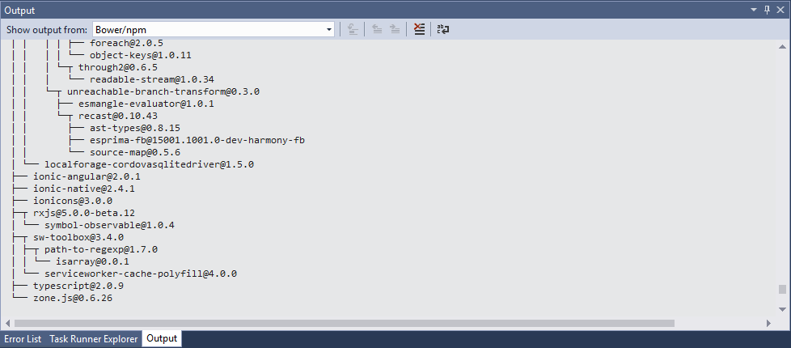
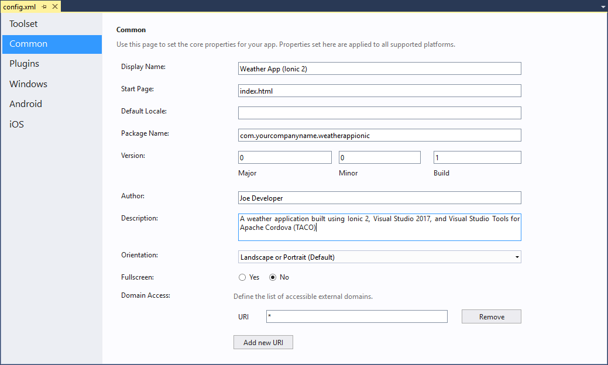
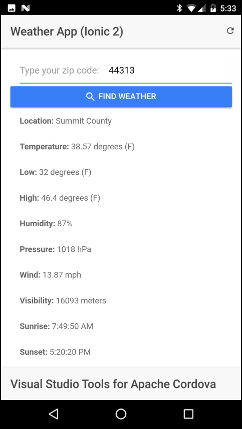
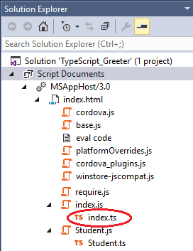

<properties 
	pageTitle="Getting started with Ionic 2 apps in Visual Studio 2017"
  	description="Getting started with Ionic 2 apps in Visual Studio 2017"
  	services=""
  	documentationCenter=""
  	authors="mikejo5000, johnwargo" />
<tags 
	ms.technology="cordova" 
	ms.prod="visual-studio-dev15"
    ms.service="na"
    ms.devlang="javascript"
    ms.topic="article"
    ms.tgt_pltfrm="mobile-multiple"
    ms.workload="na"
    ms.date="02/16/2017"
    ms.author="johnwargo"/>

# Getting started with Ionic 2 apps in Visual Studio 2017 

[Ionic](http://www.ionicframework.com) is a popular front-end JavaScript framework for developing cross-platform mobile apps using [Apache Cordova](http://cordova.io). The Ionic Framework gives Cordova applications a native look and feel, and automatically adjusts that look across platforms. You can use Visual Studio 2017 and Visual Studio Tools for Apache Cordova (TACO) to easily create and debug cross-platform Ionic apps. The [Getting Started With Visual Studio Tools For Apache Cordova](first-app-vs-tools-apache-cordova.md) guide showed how to create a simple Weather app using jQuery and jQuery Mobile. In this article, you'll learn how to configure a Visual Studio 2017 development environment for Ionic 2, and create the Ionic 2 version of the Weather App shown below:  


## Requirements

To manage, code, run and debug Ionic 2 applications using Visual Studio, you must install the following:

+	[Visual Studio 2017](http://go.microsoft.com/fwlink/?LinkID=533794)
+	[Visual Studio Tools For Apache Cordova](http://taco.visualstudio.com/en-us/docs/install-vs-tools-apache-cordova/)
+	Visual Studio Ionic 2 Templates (described below)
+	Ionic Template dependencies (described below)

## <a name="getTemplates"></a> Installing the Ionic 2 templates

1. If you haven't already, [install Visual Studio 2017](http://taco.visualstudio.com/en-us/docs/vs-taco-2017-install/) and TACO.

    Under the covers, Ionic apps are Apache Cordova apps, you'll need a functional Cordova development environment before you can develop apps using Ionic. 

	Verify that you can create and run the default **Cordova Blank App**. In Visual Studio, open the **File** menu, select **New**, then **Project**. In the new project dialog, expand the **JavaScript** templates section, select **Mobile Apps**, then pick the **Blank App (Apache Cordova)** template. Give the new project a **Name** and **Location** then click the **OK** button. Press **F5** to build and run the new project using the new **Simulate in Browser** option. The Chrome browser should open and render the app's content. If you have any issues running the application, see these [troubleshooting steps](../tips-and-workarounds/general/tips-and-workarounds-general-readme.md).

2.	Install the Ionic template in Visual Studio by selecting the **Tools** menu, then **Extensions and Updates...**. In the Extensions and Updates dialog box, select **Online**. In the search box located in the upper-right corner of the dialog, type **Ionic 2**. Select the **Ionic 2 Templates** option in the list. Click the **Download** button to start the installation.
	
	**REPLACE THIS FIGURE**

	

	The template files will download, then Visual Studio will automatically launch the installation process. When prompted, click the **Install** button to begin the installation.

	**REPLACE THIS FIGURE**

	
   
> **Note:** The Ionic templates may not appear in Visual Studio until it's restarted. Close, then re-open Visual Studio before continuing.

## Creating an Ionic Project in Visual Studio

1.	Create a new Ionic project. Open the **File** menu, select **New**, then **Project**. In the new project dialog, expand the **TypeScript** templates section, and then select **Apache Cordova Apps**. Ionic offers three app styles by default (other templates are available online): **Blank**, **Sidemenu**, and **Tabs**; this is a simple project, so select the **Blank** template. 

	Give the new project a **Name** and **Location**, and then click the **OK** button. This app will later become our Weather App project, so you should probably call it **Weather App** or **Weather App Ionic 2** to save work later.

	

2.	Check the new Ionic project's readme file for any additional tools that must be installed to use the template. 
	
	 

	At the time of this writing, you'll only need to install the **NPM Task Runner** extension.
		
	The requirements may change as updates are made to the templates. To install the required extensions, open the **Tools** menu, and select **Extensions and Updates**. Use search to locate and install the required extension(s).

3.	Ionic is a heavy framework, it requires a lot of tools and libraries to operate. Once Visual Studio creates the new project, it kicks off a process to download and install the required components using the Node Package Manager (npm). Wait a few minutes as Ionic's npm packages are installed.

    > **Note** This process will take several minutes depending on your system and internet connection speeds.

    To check progress, open **Solution Explorer** and look for the **Dependencies** node. You should see **Restoring...**, if you don't, expand the Dependencies node in Solution Manager then right-click on the npm folder and select **Restore Packages**.

	

    > **Note:** After Visual Studio finishes installing dependencies, the Dependencies node may show **not installed**. This is a known issue; the Ionic project should be OK at this point.
     
    > 

	You can monitor the package installation process through Visual Studio's Output window. Open the **View** menu, then select **Output** or use the keyboard shortcut **Ctrl-W** + **O**:
    
	

4.	At this point, you have a complete Ionic application project ready to go. To test and debug the application in Visual Studio, select a **target platform** in the Standard Toolbar, select a **target device**, then pres **F5** to run the application on the selected target. Developing iOS applications requires some extra configuration; refer to the [Visual Studio Tools for Apache Cordova: iOS Guide](./vs-taco-2017-ios-guide.md) for additional information.
	
	

## Creating the Weather App

Now, lets do something with this app you created. You'll take the blank application project and turn it into the Weather App shown earlier. In the following sections, you'll start by adding a **Current Conditions** page, then wire in a **Search Box**, and finally add an area to display **Forecast** data. Lets get started.

The app uses the free [OpenWeatherMap](http://openweathermap.org/) service to retrieve weather conditions for a location. Before you can use the service, you must setup an account and request an API key for their Current Conditions API. Point your browser to [OpenWeatherMap](https://home.openweathermap.org/) and setup an account. Once you have a valid login, go to the service's [API page](http://openweathermap.org/api) and subscribe to the **Current Weather data** service, and then generate an API key.

> **Note:** Make note of the API key as you'll need it later in the app's TypeScript code. 

### Configuring the Application Project

1.	Start by setting some configuration options for the application. In Visual Studio Solution Explorer, double-click the project's `config.xml` file. Visual Studio will open a custom editor like the one shown in the following figure:

	

	At a minimum, set the project's **Display Name** and **Package Name** values; you may want to update the **Author** and **Description** fields as well. 

2.	By default, the application displays weather data based on the device's current location, so we'll need to use the [Cordova Geolocation](https://cordova.apache.org/docs/en/latest/reference/cordova-plugin-geolocation/) plugin to add that capability to our application. You could use the browser's built-in geolocation capabilities, but Cordova and Ionic both provide special capabilities that make using geolocation in an Ionic app a little easier.
	 
	Switch to the editor's **Plugins** tab  and select the **Geolocation** plugin in the list. Click the **Add** button to add the plugin to the project.

	
 
	Press the keyboard's **Ctrl**+**S** key to save your changes, then close the editor file.

3.	Open the project's `src\index.html` file and change the application's Title. This isn't a required step, but if you're later testing the app in the browser, the app title will be correct.

	```html
	<title>Weather App Ionic</title>
	```

### Generating a Weather Provider

Now, lets start working on the application's code. By convention, Ionic applications segregate data sources from other types of application code using a special **Providers** component type. Since the weather data is coming from an external source, and we don't want the application code to call the service directly, we'll make a **Weather** provider and put all of the application's weather access code there.

1.	In Solution Explorer, right-click on the project's `src` folder and select **Add** -> **New Folder**. Name the folder `providers` and press the **Enter** key. This creates a folder for all of the providers the application will use (we'll only have one, but many Ionic apps will have several). 
		
2.	Right-click on the new `providers` folder and select **Add** -> **New Item**. In the dialog that appears, select **Ionic 2 Provider**, and in the **Name** field type `Weather`.   

	

	The Ionic CLI will create the provider in `src\providers\Weather.ts`
 
2.	Now that you have the `Weather` provider, you have to tell Ionic about it. Open the project's `src\app\app.module.ts` file and add the following line to the imports section at the top of the file:

	```typescript
	import { WeatherProvider } from '../providers/weather';
	```

3.	Next, add a reference to the Weather provider in the file's `providers` array:

	```typescript
	providers: [WeatherProvider, {provide: ErrorHandler, useClass: IonicErrorHandler}]
	``` 

	Save your changes before continuing.

### Coding the Weather Provider

In this section, we'll add code the Weather Provider to connect with the external weather API and deliver data to the application. 

1.	Open the newly created `src\providers\Weather.ts` file, and modify the `@angular/http` import at the top of the file so it looks like the following:

	```typescript
	import { Http, Response } from '@angular/http';
	```
	
	The **HTTP** component is loaded by default in any provider, what you're doing here is adding the **Response** component we'll use in the provider's code later.

2.	Still at the top of the file, add an import that loads the `toPromise` module: 

	```typescript
	import 'rxjs/add/operator/toPromise';
	``` 

	When you're done, the imports section at the top of the file will look like this:

	```typescript
	import { Injectable } from '@angular/core';
	import { Http, Response } from '@angular/http';
	import 'rxjs/add/operator/map';
	import 'rxjs/add/operator/toPromise';
	```

3.	At the top of the `Weather` class, add the following variable declarations:

	```typescript
	private weatherEndpoint = 'http://api.openweathermap.org/data/2.5/';
	private weatherKey = '';
	```
	
	Populate the `weatherKey` variable with the API key you obtained from the weather service earlier.

4.	After the `weather`class constructor, add the following code:
	
	```typescript
	getCurrent(loc: any): Promise<any> {
  	  let url: string = this.makeDataURL(loc, 'weather');
	  return this.http.get(url)
	    .toPromise()
	    .then(this.extractData)
	    .catch(this.handleError);
	}

	private makeDataURL(loc: any, command: string): string {
      //Build a weather service URL using the command string and
	  //location data that we have.
	  let uri = this.weatherEndpoint + command;

  	  //Do we have a location?
	  if (loc.long) {
	    //then use the 'grographical coordinates' version of the API
	    uri += '?lat=' + loc.lat + '&lon=' + loc.long;
	  } else {
	    //Otherwise, use the zip code
	    uri += '?zip=' + loc.zip;
  	  }

  	  //Configure output for imperial (English) measurements
  	  uri += '&units=imperial';
  	  //Use the following instead for metric
  	  //uri += '&units=metric';

  	  //Append the API Key to the end of the URI
  	  uri += '&APPID=' + this.weatherKey;
  	  //Return the value
  	  return uri;
	}

	//'Borrowed' from //https://angular.io/docs/ts/latest/guide/server-communication.html
	private extractData(res: Response) {
	  //Convert the response to JSON format  
	  let body = res.json();
	  //Return the data (or nothing)
	  return body || {};
	}

	//'Borrowed' from //https://angular.io/docs/ts/latest/guide/server-communication.html
	private handleError(res: Response | any) {
	  console.error('Entering handleError');
	  console.dir(res);
	  return Promise.reject(res.message || res);
	}
	```

	On start up, the application passes the current location (longitude and latitude) to the `getCurrent` function. When searching for a location using a US Zip Code, the Zip Code is passed instead. `getCurrent` calls the appropriate API to get the current weather data, but uses `makeDataURL` to format the request URL correctly depending on whether it has a location or a Zip Code value.

	The `extractData` function formats the data returned by the API call as JSON. This code could easily be included directly into the `getCurrent` method, but as you'll see later, this code is used more than once by the application, so it made sense to move it a separate function. 

### Building the Current Conditions Page

1.	Open the project's `src\pages\home\home.html` file, and replace the file's contents with the following:

	```html
	<ion-header>
	  <ion-toolbar>
	    <ion-buttons right>
	      <button ion-button (click)="refreshPage()">
	        <ion-icon name="refresh"></ion-icon>
	      </button>
	    </ion-buttons>
	    <ion-title>
	      Weather App (Ionic 2)
	    </ion-title>
	  </ion-toolbar>
	</ion-header>
	
	<ion-content padding> 
	  <ion-list no-lines>
	    <!--show this if there are no items in the list-->
	    <ion-item [hidden]="c_items.length > 0">
	      <p><strong>Weather data is not available</strong></p>
	    </ion-item>
	    <!--Display the current conditions data we have -->
	    <ion-item *ngFor="let c_item of c_items">
	      <p><strong>{{c_item.name}}:</strong> {{c_item.value}}</p>
	    </ion-item>
	  </ion-list>
	</ion-content>
	
	<ion-footer>
	  <ion-toolbar>
	    <ion-title>Visual Studio Tools for Apache Cordova</ion-title>
	  </ion-toolbar>
	</ion-footer>
	``` 

	What you see in the file is references to ionic components as well as some Angular code as well. This markup is a subset of the page's HTML, the rest of it is found in the project's `src\index.html` and `src\app\app.html` files. At start up, the Ionic framework replaces the contents of the project's `src\index.html` file's `<ion-app></ion-app>` tag with the `src\app\app.html` file's `<ion-nav [root]="rootPage"></ion-nav>` then subsequently passes HTML content in and out of that tag as the user uses the application. In this case, when the app starts up, the content of the `src\pages\home\home.html` page is parsed and rendered.

	The header contains a toolbar displaying the application title and a refresh button the user can tap to refresh the weather data displayed on the page.
	
	The `ion-content` tag defines the part of the content that comprises the dynamic content of the page. In this example, it displays an `<ion-list>` of items; basically a listview. In this case, it renders the contents of the `c_items` array as a list using an Angular directive: `*ngFor="let c_item of c_items"` which loops through each element in the array. As the code loops, it assigns each array element to `c_item`, then the template code that follows displays the `name` and `value` properties of the `c_item` object. You'll see how the `c_items` array is populated soon.    

2.	Open the project's `src\pages\home\home.ts` file. At the top of the file, add imports for the Geolocation plugin and the Weather provider:

	```typescript
	import { Geolocation, Keyboard } from 'ionic-native';
	import { WeatherProvider } from '../../providers/weather';
	```

3.	Also at the top of the file, modify the `ionic-angular` import so it looks like this: 

	```typescript
	import { AlertController, LoadingController, NavController, Platform } from 'ionic-angular';
	```

	This loads some additional components used by the page's code:

	+ `AlertController` manages the display of alert dialogs.
	+ `LoadingController` manages the display of a loading spinner.
	+ `NavController` manages navigation between pages.
	+ `Platform` provides platform-related utilities.

4.	Inside the `HomePage` class, add the following variable declarations:

	```typescript
	degreeStr: string = ' degrees (F)';
	//an empty object (for now) to store our location data passed to the API
	currentLoc: any = {};
	//current weather items array
	c_items: Array<any> = [];
	```

5.	Add the following parameters to the `HomePage` class constructor:

	```typescript
	public alertController: AlertController,
	public loadingCtrl: LoadingController,
	public platform: Platform,
	public weather: WeatherProvider,
	```

	When you're done, it should look like this:

	```typescript
	constructor(
	  public alertController: AlertController,
	  public loadingCtrl: LoadingController,
	  public nav: NavController,
	  public platform: Platform,
	  public weather: WeatherProvider
	) {

	}
	```

6.	Replace the `openLink` function in the body of the `HomePage` class with the following (the `openLink` function is part of the Ionic blank template and is not used by the Weather App):

	```typescript
	ionViewDidLoad() {
	  //Once the main view loads
	  //and after the platform is ready...
	  this.platform.ready().then(() => {
    	//Setup a resume event listener
	    document.addEventListener('resume', () => {
	      //Get the local weather when the app resumes
	      this.getLocalWeather();
	    });
	    //Populate the form with the current location data
	    this.getLocalWeather();
  	  });
	}

	refreshPage() {  
	  this.showCurrent();	  
	}

	getLocalWeather() {
	  let locOptions = { 'maximumAge': 3000, 'timeout': 5000, 'enableHighAccuracy': true };
	  Geolocation.getCurrentPosition(locOptions).then(pos => {
	    //Store our location object for later use
	    this.currentLoc = { 'lat': pos.coords.latitude, 'long': pos.coords.longitude };
	    //and ask for the weather for the current location
	    this.showCurrent();
	  }).catch(e => {
	    console.error('Unable to determine current location');
	    if (e) {
	      console.log('%s: %s', e.code, e.message);
	      console.dir(e);
	    }
	  })
	}

	showCurrent() {
	  //clear out the previous array contents
	  this.c_items = [];
	  //Create the loading indicator
	  let loader = this.loadingCtrl.create({
	    content: "Retrieving current conditions..."
	  });
	  //Show the loading indicator
	  loader.present();
	  this.weather.getCurrent(this.currentLoc).then(
	    data => {
	      //Hide the loading indicator
	      loader.dismiss();
	      //Now, populate the array with data from the weather service
	      if (data) {
	        //We have data, so lets do something with it
	        this.c_items = this.formatWeatherData(data);
	      } else {
	        //This really should never happen
	        console.error('Error retrieving weather data: Data object is empty');
	      }
	    },
	    error => {
	      //Hide the loading indicator
	      loader.dismiss();
	      console.error('Error retrieving weather data');
	      console.dir(error);
	      this.showAlert(error);
	    }
	  );
	}

	private formatWeatherData(data): any {
	  //create a blank array to hold our results
	  let tmpArray = [];
	  //Add the weather data values to the array
	  if (data.name) {
	    //Location name will only be available for current conditions
	    tmpArray.push({ 'name': 'Location', 'value': data.name });
	  }
	  tmpArray.push({ 'name': 'Temperature', 'value': data.main.temp + this.degreeStr });
	  tmpArray.push({ 'name': 'Low', 'value': data.main.temp_min + this.degreeStr });
	  tmpArray.push({ 'name': 'High', 'value': data.main.temp_max + this.degreeStr });
	  tmpArray.push({ 'name': 'Humidity', 'value': data.main.humidity + '%' });
	  tmpArray.push({ 'name': 'Pressure', 'value': data.main.pressure + ' hPa' });
	  tmpArray.push({ 'name': 'Wind', 'value': data.wind.speed + ' mph' });
	  //Do we have visibility data?
	  if (data.visibility) {
	    tmpArray.push({ 'name': 'Visibility', 'value': data.visibility + ' meters' });
	  }
	  //do we have sunrise/sunset data?
	  if (data.sys.sunrise) {
	    var sunriseDate = new Date(data.sys.sunrise * 1000);
	    tmpArray.push({ 'name': 'Sunrise', 'value': sunriseDate.toLocaleTimeString() });
	  }
	  if (data.sys.sunset) {
	    var sunsetDate = new Date(data.sys.sunset * 1000);
	    tmpArray.push({ 'name': 'Sunset', 'value': sunsetDate.toLocaleTimeString() });
	  }
	  //Do we have a coordinates object? only if we passed it in on startup
	  if (data.coord) {
	    //Then grab long and lat
	    tmpArray.push({ 'name': 'Latitude', 'value': data.coord.lat });
	    tmpArray.push({ 'name': 'Longitude', 'value': data.coord.lon });
	  }
	  //Return the new array to the calling function
	  return tmpArray;
	}

	showAlert(message: string) {
	  let alert = this.alertController.create({
	    title: 'Error',
	    subTitle: 'Source: Weather Service',
	    message: message,
	    buttons: [{ text: 'Sorry' }]
	  });
	  alert.present();
	}
	```

	There's a lot of code there; take a few minutes and study it. Here's what it does:

	+ `ionViewDidLoad` - Handles an event that fires when the page completes loading. In this case, the function calls the `getLocalWeather` function to start the process of getting weather data for the device's current location. It uses capabilities of the **Platform** component to make sure it doesn't do anything until it's certain that the native application container and the Ionic framework have completed initialization.
	+ `refreshPage` - Executes when the application user taps the **Refresh** button in the toolbar. Here, it refreshes the current weather data on the page. This function gets more responsibilities later. 
	+ `getLocalWeather` - Determines the device's current location (using the Cordova Geolocation plugin), then calls `showCurrent` to get the current weather data.
	+ `showCurrent` - Displays the loading indicator, then calls the Weather provider to get weather data for the specified location (either a geolocation, or, later, a Zip Code).
	+ `formatWeatherData` - The results the application gets from the Weather API differ depending on whether the application asks for current conditions or the forecast. We're not asking for forecast data (yet) but, but will later. This function builds a weather data object from the results and has special code that builds the appropriate object based on whether it's current conditions or a forecast.  
	+ `showAlert` - Displays an error dialog if anything breaks.

Run the application in browser, an emulator, simulator or on a physical device connected to the computer. If you run the app in the browser, using the Cordova Simulate capabilities of Visual Studio 2017, you can tweak the simulated device's coordinates using the Geolocation panel; refer to the [Cordova Simulate](./vs-taco-cordova-simulate.md) for details. When the application loads, you'll be prompted to authorize the application's access to the device's current location as shown below:  


When you allow access (don't tap **deny**, as you won't be able to do much with the app if you do), you should see the current weather data for the current location as shown in the figure below:


It's not the complete app UI, but at least you can see the weather results. In the next section, we'll add the Zip Code Search box so you can get weather data for a specific location.

> **Note:** If you get a blank screen when the app starts, make sure you've added the Cordova Geolocation plugin to the project. 

### Adding Zip Code Search

It's useful to have weather data for the current location, but what if you're traveling somewhere and want to know what the weather will be like when you get there? In this section, you'll add a search box users can employ to get weather data for a specific US Zip Code. 

> **Note:** Using Zip Code as search criteria won't work outside of the US; if you would like to use **City Name** instead, you can make minor tweaks to the weather API call to change how the API searches. Take a look at the [API docs](https://openweathermap.org/current) for more information.

1.	Open the project's `src\pages\home\home.html` file. Inside the beginning of the `<ion-content>` section, right before the `<ion-list>` tag, add the following markup:

	```html
	 <form (ngSubmit)="setZipCode()">
	    <ion-item>
	      <ion-label>Type your zip code:</ion-label>
	      <ion-input type="text" [(ngModel)]="searchInput" name="ZipCode"></ion-input>
	    </ion-item>
	      <button ion-button icon-left block>
	        <ion-icon name="search"></ion-icon>
	        Find Weather
	      </button>
	  </form>
	```
	
	This adds the search field at the top of the page, and directs that the `setZipCode` function is executed when the user taps the **Find Weather** button. The reference to **ngModel** tells Ionic (actually Angular) to map the value in the search field to the application's `searchInput` variable which you will see in a second.

2.	Open the project's `src\pages\home\home.ts` file and add the following variable declaration to the top of the `HomePage` class (before the `constructor`): 

	```typescript
	//Mapped to the search field
	searchInput: string = '';
	```

	This defines the variable that will be populated automatically with whatever string the user adds to the search field.

3.	Finally, still in the project's `src\pages\home\home.ts` file, add the following function to the `HomePage` class:

	```typescript
	setZipCode() {
	  //whenever the user enters a zip code, replace the current location
	  //with the entered value, then show current weather for the selected
	  //location.
	  //Hide the keyboard if it's open, just in case
	  Keyboard.close();
	  //Populate the currentLoc variable with the city name
	  this.currentLoc = { 'zip': this.searchInput };
	  //Clear the Zip Code input field
	  this.searchInput = '';
	  //get the weather for the specified city
	  this.showCurrent();
	}
	```

	This function responds to the user tapping the **Find Weather** button and creates a location object then calls the `showCurrent` function to retrieve weather data for the specified Zip Code. The `Keyboard.close()` code uses the **Ionic Keyboard plugin** to hide the keyboard before initiating the search. If the code didn't do this, it's possible that the keyboard would stay open, blocking part of the page, as the page updates with the new weather data.

When you run the application, you should now see a search field at the top of the page. Enter a US Zip Code and tap the button to get weather data for the specified location.   



### Adding a Weather Forecast Page

The weather API the app uses has an API for retrieving forecast data, so lets display that in the application as well. You can add another page to the app, then use a menu or another navigation method to switch between views, but the search field complicates that approach. Instead, we'll use an [Ionic Segment](https://ionicframework.com/docs/v2/api/components/segment/Segment/) component to split the existing page into two parts: one for current conditions, and another for the forecast.

1.	Start by updating the Weather provider to support getting the forecast from the weather service. Open the project's `src\providers\weather.ts` file and add the following code to the `Weather` class.

	```typescript
	getForecast(loc: any): Promise<any> {
	  let url: string = this.makeDataURL(loc, 'forecast');
	  return this.http.get(url)
	    .toPromise()
	    .then(this.extractData)
	    .catch(this.handleError);
	}
	```

	To get the forecast, all the provider has to do is replace `weather` with `forecast` in the API URL, otherwise the code is exactly the same.

2.	Next, open the project's `src\pages\home\home.html` file. Remove the current `<ion-list>` implementation:

	```html
	<ion-list no-lines>
	  <!--show this if there are no items in the list-->
	  <ion-item [hidden]="c_items.length > 0">
	    <p><strong>Weather data is not available</strong></p>
	  </ion-item>
	  <!--Display the current conditions data we have -->
	  <ion-item *ngFor="let c_item of c_items">
	     <p><strong>{{c_item.name}}:</strong> {{c_item.value}}</p>
	  </ion-item>
	</ion-list>
	```

	and replace it with the following:

	```html
	<ion-segment [(ngModel)]="displayMode">
	  <ion-segment-button value="current" (ionSelect)="showCurrent()">
	    Current
	  </ion-segment-button>
	  <ion-segment-button value="forecast" (ionSelect)="showForecast()">
	    Forecast
	  </ion-segment-button>
	</ion-segment>
  	<div [ngSwitch]="displayMode">
	  <ion-list no-lines *ngSwitchCase="'current'">
	    <!--show this if there are no items in the list-->
	    <ion-item [hidden]="c_items.length > 0">
	      <p><strong>Weather data is not available</strong></p>
	    </ion-item>
	    <!--Display the current conditions data we have -->
	    <ion-item *ngFor="let c_item of c_items">
	      <p><strong>{{c_item.name}}:</strong> {{c_item.value}}</p>
	    </ion-item>
	  </ion-list>
	  <ion-list inset *ngSwitchCase="'forecast'">
	    <ion-item text-wrap>
	      {{ f_items.length ? 'Tap an item to view the forecast for the selected period.': 'Forecast data is not available at this time.' }}    
	    </ion-item>            
	    <button detail-push ion-item *ngFor="let item of f_items" (click)="viewForecast(item)">
	      <ion-icon name="time" item-left></ion-icon>
	        {{item.period}}
	    </button>
	  </ion-list>
	</div>
	```

	This adds a segment to the page using the `<ion-segment>` component, and defines two segments: `current` and `forecast`. The `<div>` with the `[ngSwitch]="displayMode"` attribute swaps in separate `<ion-list>` components based on the value assigned to the page's `displayMode` variable. 

3.	Now we'll add the TypeScript code that make all of this work. Open the project's `src\pages\home\home.ts` file and add the following variable declarations to the top of the `HomePage` class. 

	```typescript
	//This is used to set the Ionic Segment to the first segment
	currentMode: string = 'current'; 
	// used to control which segment is displayed
	displayMode: string = this.currentMode;
	//holds forecast data, a separate row for each period
	f_items: Array<any> = [];
	//array of day strings used when displaying forecast data
	days: Array<string> = ['Sunday', 'Monday', 'Tuesday', 'Wednesday', 'Thursday', 'Friday', 'Saturday'];
	```

4.	When the page loads, we want the app to default to displaying the current conditions, so add the following code to the `onViewDidLoad` function:

	```typescript
	//Switch to the Current segment
	this.displayMode = this.currentMode
	```

	This sets `this.displayMode` to `current`. Add the code to the `resume` event listener, the resulting code should look like this:

	```typescript
	document.addEventListener('resume', () => {
	  //Get the local weather when the app resumes
	  //Switch to the Current segment
	  this.displayMode = this.currentMode
	  //then update it with local weather conditions
	  this.getLocalWeather();
	});
	```

5.	Now that the page displays two segments, the `refreshPage` function needs to know which part of the page to refresh. Replace the current `refreshPage` function with the following code:

	```typescript
	refreshPage() {
	  //Which page are we looking at now?
	  if (this.displayMode === this.currentMode) {
	    this.showCurrent();
  	  } else {
	    this.showForecast();
	  }
	}
	```

6.	The `setZipCode` function defaults to loading current conditions when a Zip Code is entered, so it must switch to the Current tab before getting results. Add the following lines to the function before the call to `this.showCurrent()`:

	```typescript
	//Switch to the 'current' tab
	this.displayMode = this.currentMode;
	```
	
	The complete function should look like this:

	```typescript
	setZipCode() {
	  //whenever the user enters a zip code, replace the current location
	  //with the entered value, then show current weather for the selected
	  //location.
	  //Hide the keyboard if it's open, just in case
	  Keyboard.close();
	  //Populate the currentLoc variable with the city name
	  this.currentLoc = { 'zip': this.searchInput };
	  //Clear the Zip Code input field
	  this.searchInput = '';
	  //Switch to the 'current' tab
	  this.displayMode = this.currentMode;
	  //get the weather for the specified city
	  this.showCurrent();
	}
	```
	
7.	Finally, add the `showForecast` function to the `HomePage` class:

	```typescript
	showForecast() {
	  //clear out the previous array contents
	  this.f_items = [];
	  //Create the loading indicator
	  let loader = this.loadingCtrl.create({
    	content: "Retrieving forecast..."
	  });
	  //Show the loading indicator
	  loader.present();
	  this.weather.getForecast(this.currentLoc).then(
	    data => {
	      //Hide the loading indicator
	      loader.dismiss();
	      //Now, populate the array with data from the weather service
	      //Do we have some data?
	      if (data) {
	        //Then lets build the results array we need
	        //Process each forecast period in the array
	        for (let period of data.list) {
	          //Create a 'record' consisting of a time period's results
	          let weatherValues: any = this.formatWeatherData(period);
	          //Append this, along with the time period information, into the forecast
	          //items array.          
	          //Get the forecast date as a date object                     
	          let d = new Date(period.dt_txt);
	          //Determe the day of the week
	          let day = this.days[d.getDay()];
	          //And the time
	          let tm = d.toLocaleTimeString();
	          //Create a new object in the results array for this period          
	          this.f_items.push({ 'period': day + ' at ' + tm, 'values': weatherValues });
	        }
	      } else {
	        //This really should never happen
	        console.error('Error displaying weather data: Data object is empty');
	      }
    	},
	    error => {
	      //Hide the loading indicator
	      loader.dismiss();
	      console.error("Error retrieving weather data");
	      console.dir(error);
	      this.showAlert(error);
    	}
	  );
	}   
	```

	This function gets the forecast data, then formats it for display on two pages. First, it builds an array of time periods that represent the different forecast periods. Then, for each period, it appends an object containing the forecast data for that period. The page's forecast segment displays the list of forecast periods, then, when you tap on an entry, the application will eventually (you'll see how in the next section) open a separate page to display the details.

At this point, if you run the application, you should see the following:


Tap the forecast tab, and you'll see the list of forecast periods shown in the following figure:


When you tap on a forecast item, nothing happens (for now); that's because we need a page to display the data, and you haven't added one yet. 

### Adding a Weather Details Page

1.	To add a new page to the application, in Solution Explorer, right-click on the `src\pages` folder, select **Add** -> **New Item...**. In the list of options that appears, select **Ionic 2 Page**, give it a **Name** of `WeatherDetail`, and click the **Add** button.
	
	

	Visual Studio will create a new folder called `WeatherDetail` in `src\pages\` and populates it with the source files for the new page: `weather-detail.ts`, `weather-detail.html`, and `weather-detail.scss`.

	 

2.	As when you added a provider to the application, when you add a page, you need to update the app's configuration to use it. Open the project's `src\app\app.module.ts` file, and add the following `import` statement to the top of the file:

	```typescript
	import { WeatherDetailPage } from '../pages/weatherdetail/weatherdetail';
	```
3.	Next, add a reference to the `WeatherDetailPage` component to the `declarations` and `entryComponents` arrays as shown below:

	```typescript
	@NgModule({
	  declarations: [
	    MyApp,
	    HomePage,
	    WeatherDetailPage
	  ],
	  imports: [
	    IonicModule.forRoot(MyApp)
	  ],
	  bootstrap: [IonicApp],
	  entryComponents: [
	    MyApp,
	    HomePage,
	    WeatherDetailPage    
	  ],
	  providers: [Weather, { provide: ErrorHandler, useClass: IonicErrorHandler }]
	})
	export class AppModule { }
	```

4.	Open the project's `src\pages\weatherdetail\weatherdetail.html` and replace its contents with the following markup:

	```html
	<ion-header>
	  <ion-navbar>
	    <ion-title>Forecast</ion-title>
	  </ion-navbar>
	</ion-header>

	<ion-content padding>
	  <ion-list>
	    <!--show this if there are no items in the list-->
	    <ion-item [hidden]="forecast.values.length > 0">
	      <p><strong>Weather data is not available</strong></p>
	    </ion-item>
	    <ion-item [hidden]="forecast.values.length < 1">
	      Period: {{forecast.period}}
	    </ion-item>
	    <ion-item *ngFor="let item of forecast.values">
	      <p><strong>{{item.name}}:</strong> {{item.value}}</p>
	    </ion-item>
	  </ion-list>
	</ion-content>

	<ion-footer>
	  <ion-toolbar>
	    <ion-title>Visual Studio Tools for Apache Cordova</ion-title>
	  </ion-toolbar>
	</ion-footer>
	```

	This creates a page that displays the selected forcast item as a list of `name` and `value` values.

5.	Open the project's `src\pages\weatherdetail\weatherdetail.ts` file and replace its contents with the following code:

	```typescript
	import { Component } from '@angular/core';
	import { NavController, NavParams } from 'ionic-angular';

	@Component({
	  selector: 'page-weather-detail',
	  templateUrl: 'weatherdetail.html'
	})
	export class WeatherDetailPage {

	  forecast: any;

	  constructor(public navCtrl: NavController, public navParams: NavParams) {
	    //Pull the selected forecast off of navParams
	    this.forecast = this.navParams.get('forecast');
	  }

	  ionViewDidLoad() {
	    console.log('Weather Detail page loaded');
	  }
	}
	```

	Notice that there's no real code in the page, that's because the HTML template takes care of rendering the data and Ionic takes care of page navigation automatically. The three important changes are:

	+ The addition of a `NavParams` component to the page, it's responsible for passing data between pages. 

	+ The addition of a `forecast` variable:

		```typescript
		forecast: any;
		```

		This variable is storage for the forecast object passed to the page when it opens. It holds data for the current forcast period. The HTML page references this variable as the source for the data it renders on the page. 

	+ The addition of a single line of code to the `constructor`:

		```typescript
		this.forecast = this.navParams.get('forecast');
		```

		This assigns the local `this.forecast` object to the data passed in the `forecast` object sent through the `NavParams` component

6.	Now we need to tell the `forecast` segment how to open the forecast details page when the user taps on an item in the list. Open the project's `src\pages\home\home.ts` and add the following `import` statement to the top of the file:
	
	```typescript
	import { WeatherDetailPage } from '../weatherdetail/weatherdetail';
	```
7.	Still in `src\pages\home\home.ts`, add the `viewForecast` function to the class: 

	```typescript
	viewForecast(item) {
	  //When the user selects one of the Forecast periods,
	  //open up the details page for the selected period.
	  this.nav.push(WeatherDetailPage, { 'forecast': item });
	}
	```

	The page's HTML already has a reference to this function:

	```html
	<button detail-push ion-item *ngFor="let item of f_items" (click)="viewForecast(item)">
	  <ion-icon name="time" item-left></ion-icon>
	  {{item.period}}
	</button>
	```

When you run the application now, you should be able to open the forecast by tapping on one of the forecast periods in the list:


Page navigation is handled by Ionic and Angular, they take care of adding the back arrow in the left corner of the toolbar and closing the page when it's tapped. 
 
That's it! You've completed the Ionic Weather App. 

## Troubleshooting: Let's fix it

A few errors are fairly common in the starter templates when debugging in Visual Studio.

[I installed the Ionic templates, but they don't appear as an option in Visual Studio](#no-templates)

[Did you receive an error message that says: 'Promise is not defined'?](#node)

[Did you receive an error message indicating that some node modules won't restore?](#node_modules)

[Did you receive a WWAHost runtime error?](#wwahost)

[Did you receive an error message asking you to install a new app?](#partialpages)

[Did you receive an 'Unhandled exception' running on Windows?](#unhandled)

[Did you receive an error messaging indicating that the `appxrecipe` file is missing?](#appxrecipe)

[Did you receive an error message saying that the Content Security Policy is missing?](#scp)

[Did you receive a certificate error on Windows?](#certificate)

[Visual Studio Emulator for Android won't run?](#vsAndroidEmu)

[Having trouble hitting breakpoints in your .ts files?](#breakpoints)

[Other issues?](#other)

---

### <a id="no-templates"></a>I installed the Ionic templates, but they don't appear as an option in Visual Studio

Did you close, then restart Visual Studio? After the installation, the templates aren't available until Visual Studio restarts. 

### <a id="node"></a> Did you receive an error message indicating that some node modules won't restore?

The installed version of Node.js may not support Promises. To fix this, you must install the latest Visual Studio 2015 update (Update 3 or later) and Microsoft ASP.NET and Web Tools. Check for any notifications or warning icons in the upper-right corner of the Visual Studio IDE and install these components, if instructed.


 
If you are unable to install the Web Tools:

1.	[Download the latest version of the Web Tools here](https://visualstudiogallery.msdn.microsoft.com/c94a02e9-f2e9-4bad-a952-a63a967e3935).

2.	Run the following command from the folder containing the download:

    ```
    DotNetCore.1.0.0-VS2015Tools.Preview2.exe SKIP_VSU_CHECK=1
    ```

3.	Create a new Ionic 2 project from the templates that you downloaded previously.

### <a id="node_modules"></a> Did you receive an error message indicating that some node modules won't restore?

If you can't restore some of the Node.js modules, such as ionic-angular, make sure that you have installed the Update 3 or later of Visual Studio and Microsoft ASP.NET and Web Tools (for more instructions, see the [previous issue](#node)).

If that doesn't resolve the issue, open a command line and go to the project folder, then run this command:

```
npm install
```

and then this command:

```
npm rebuild node-sass
```

Then create a new Ionic 2 project from the templates you downloaded previously.

### <a id="wwahost"></a> Did you receive a WWAHost runtime error?

When debugging on a Windows 8.1 dev machine, you may get a WWAHost runtime error when navigating between pages in Ionic apps. You can work around this by:

+ Closing DOM Explorer before navigating pages, or

+ Upgrading to Windows 10 on your dev machine (the platform issue is fixed in Windows 10).

### <a id="partialpages"></a> Did you receive an error message asking you to install a new app?

When you are using the AngularJS routing module (Ionic templates use this module) on Windows, you may need to include a call to `aHrefSanitizationWhitelist`. This will correct errors that occur when loading partial pages.

If you see the dialog box shown here, you have likely run into this issue.


Typically, you include the code fix in app.js or wherever you are calling your module configuration code (inside `angular.module.config`):

```
$compileProvider.aHrefSanitizationWhitelist(/^\s*(https?|ftp|mailto|file|ghttps?|ms-appx|ms-appx-web|x-wmapp0):/);

$compileProvider.imgSrcSanitizationWhitelist(/^\s*(https?|ftp|file|ms-appx|ms-appx-web|x-wmapp0):|data:image\//);
```

If you use the preceding code, then add a reference to $compileProvider in the following line of code.

```
.config(function ($stateProvider, $urlRouterProvider) {
```

so that it looks like this:

```
.config(function ($compileProvider, $stateProvider, $urlRouterProvider) {
```

### <a id="unhandled"></a> Did you receive an 'Unhandled exception' running on Windows?

If you see the following unhandled exception when targeting Win/WinPhone 8.1, follow the [earlier steps](#configWindows) to call platformOverrides.js to fix this issue.


If you see the same error when targeting Windows 10, make sure you set **Windows 10.0** as the target in the Windows tab of the configuration designer.

### <a id="appxrecipe"></a> Did you receive an error messaging indicating that the `appxrecipe` file is missing?

If you see this error when targeting Windows 10, make sure you set **Windows 10.0** as the target in the Windows tab of the configuration editor (config.xml). Then delete the platforms\windows folder and rebuild the project.

### <a id="csp"></a> Did you receive an error message saying that the Content Security Policy is missing?

Cordova projects automatically add the Whitelist plugin to every project, so you must add the following `meta` element to the project's `index.html` file:

```
<meta http-equiv="Content-Security-Policy" content="default-src 'self' data: gap: https://ssl.gstatic.com 'unsafe-eval'; style-src 'self' 'unsafe-inline'; media-src *">
```

### <a id="certificate"></a> Did you receive a certificate error on Windows?

Make sure your user credentials in Visual Studio are up to date. Check for any notifications or warning icons in the upper-right corner of the Visual Studio IDE:


You may need to re-enter your credentials. If the notifications indicate that you need to update Cordova tooling, please click on the notifications and follow the provided instructions.

### <a id="vsAndroidEmu"></a> Visual Studio Emulator for Android won't run?

The VS Emulator for Android requires Hyper-V and is not supported when running on a VM. For more info, see [this information](https://msdn.microsoft.com/en-us/library/mt228282.aspx#NoStart2).

If you have previously run the VS Emulator for Android successfully but now the emulator won't run, try deleting the emulator VM instance in the Hyper-V Manager. For more info, see [Troubleshooting] (https://msdn.microsoft.com/en-us/library/mt228282).

### <a name="breakpoints"></a> Having trouble hitting breakpoints in your .ts files?

There is a known issue debugging Ionic 2 in VSCode. Otherwise, this indicates a problem with your sourcemaps. When running your app, look for your .ts files under **Script Documents** in Solution Explorer. They should look similar to the illustration below. You can right-click on the .ts file and choose Properties to view the current path used by the sourceMaps.


