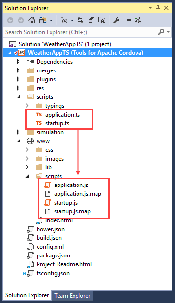

<properties
   pageTitle="Using TypeScript in a Cordova Project | Cordova"
   description="Using TypeScript in a Cordova Project"
   services="na"
   documentationCenter=""
   authors="jmatthiesen, johnwargo"
   tags=""/>
<tags ms.technology="cordova" ms.prod="visual-studio-dev15"
   ms.service="na"
   ms.devlang="typescript"
   ms.topic="article"
   ms.tgt_pltfrm="mobile-multiple"
   ms.workload="na"
   ms.date="11/15/2016"
   ms.author="johnwargo"/>

# Using TypeScript in a Cordova project

[**TypeScript**](http://www.typescriptlang.org) is an open source programming language created and maintained by Microsoft. TypeScript offers support for the latest and evolving JavaScript features, including those from ECMAScript 2015 like classes and modules. It also supports future language proposals, like async functions and decorators, to help build robust components. These features are available at development time for high-confidence app development, but are compiled into simple JavaScript that targets current mobile devices and browsers.

TypeScript editing capabilities are built in to Visual Studio, and Visual Studio Tools for Apache Cordova includes special templates you can use to create Cordova applications using TypeScript. During the build process, Visual Studio automatically compiles your application's TypeScript code into JavaScript before packaging the application's files into the Apache Cordova native application container. In this guide, you'll learn how to use TypeScript for your Apache Cordova applications using Visual Studio Tools for Apache Cordova (TACO). 

##<a name="getStarted"></a>Creating a Cordova TypeScript Application Project

Visual Studio provides a Cordova application template using TypeScript; if you'd prefer to start with a complete project, take a look at the [TypeScript Module samples](#samples). To create a new Cordova application using the TACO TypeScript template, complete the following steps:

1.	Open **Visual Studio**, then open the **File** menu, select **New**, then **Project**.
2.	Expand the list of **Installed** templates, then expand **Templates** and **TypeScript**, and finally select the **Mobile Apps** category. In the list of templates, select the **Blank App (Apache Cordova)** template.  

	

3.	Enter a **Name**, **Location**, and **Solution Name** for the new project, then click the **OK** button. Visual Studio will whir and click for a few seconds then open the new TypeScript project in the Solution Explorer. 

At this point, you have a complete Apache Cordova project configured for coding in TypeScript. Everything you know about building, testing and debugging Cordova application projects remains the same. The only difference is that there are a few additional files added to the project, and you'll code the application's logic in TypeScript instead of JavaScript.

> **Note:** Even though this is a TypeScript project, you can still use JavaScript files in the application. Visual Studio doesn't care; it will compile TypeScript files to JavaScript during the build process, but leave the JavaScript files as-is.

In the next section, you'll learn about the differences between a typical Cordova JavaScript application and the project you just created. For a refresher on the anatomy of a Cordova application project, see [Getting Started With Visual Studio Tools For Apache Cordova](first-app-vs-tools-apache-cordova.md).

##<a id="explore"></a>Exploring The Cordova TypeScript Project

A Cordova application project in Visual Studio mimics the project folder structure of a typical Cordova application. The Cordova web application files are found in the project's `www` folder, where you'll find the project's `index.html` file and folders for the project's JavaScript files (`scripts`), CSS files (`css`) and images (`images`).    
  


TypeScript supports modules, so when you start to work on a Cordova app with TypeScript, one of the first decisions to make is how to structure your app's code using modules. There's a variety of module managers available for web applications, the choice of which is a source of much emotional discussion within the developer community. We're not going to address that topic here; for detailed information on modules and module loaders, see the [modules page](http://www.typescriptlang.org/docs/handbook/modules.html) in the TypeScript Handbook. 

The default TypeScript template in TACO uses the popular [RequireJS](http://requirejs.org/) module manager. So, when you look at the TypeScript project's `index.html` file, you'll see the same file you'll find in the standard Cordova project, with the addition of the following lines:

```HTML
<!-- The 'async' attribute is needed for RequireJS to work in a Windows app -->
<script type="text/javascript" data-main="scripts/startup" src="lib/require.2.1.8.js" async></script>
```

The `script` tag loads RequireJS and uses the tag's `data-main` attribute to tell RequireJS which JavaScript file to load at start up. In this case, it's loading `scripts/startup.js`. The project doesn't have a `scripts/startup.js` file right now, so don't go looking for it; it will magically appear when you build the application (we'll explain in a minute).

> **Note:** If you want to use another module manager, simply remove the script tag and replace it with one that loads your module manager of choice.

The project's `www\lib` folder stores the RequireJS JavaScript library used by the application and is added automatically by Visual Studio.

If you look in the project's `www\scripts` folder, you won't find any JavaScript files. That's because the default project doesn't come with any. Instead, there's a `scripts` folder hanging off the root of the project folder structure, and all of the project's TypeScript files go there. During the build process, Visual Studio compiles the TypeScript files into JavaScript and places the resulting JavaScript files in `www/scripts`.

Looking in the project's `scripts` folder, you should see the following folder and files:

+ `typings` (folder) - Contains a collection of [typing definition files](http://www.typescriptlang.org/Handbook#writing-dts-files) that describe API interfaces for common Cordova plugins.
+ `startup.ts` - The application's main TypeScript file. 
+ `application.ts` - A TypeScript file loaded by `startup.ts`.

Let's take a look at the project's TypeScript files.

The project's `scripts\startup.ts` file is a TypeScript file that bootstraps the Cordova application's code. It's loaded at start up by the module manager and loads any `platformOverrides.js` files from the project and target platform's `merges` folder, then executes the `initialize` function from `application.ts`. 

```TypeScript
import * as Application from './application';

declare var require: (modules: string[], ready: Function, errback: Function) => void;

// Try and load platform-specific code from the /merges folder.
// More info at http://taco.visualstudio.com/en-us/docs/configure-app/#Content.
require(["./platformOverrides"],
    () => Application.initialize(),
    () => Application.initialize());
```

The `application.ts` file contains the standard, boilerplate bootstrap code found in the default Cordova application project. The only difference is that the file is a TypeScript file and exports the `initialize` function as a module, rather than executing it as an *anonymous self-invoking function* (or *Immediately Invoked Function Expression*, or *[IIFE](https://developer.mozilla.org/docs/Glossary/IIFE)*). When Visual Studio compiles the code into JavaScript files, the `initialize` export will ultimately end up as an IIFE there. 

```typescript
// For an introduction to the Blank template, see the following documentation:
// http://go.microsoft.com/fwlink/?LinkID=397705
// To debug code on page load in cordova-simulate or on Android devices/emulators: launch your app, set breakpoints, 
// and then run "window.location.reload()" in the JavaScript Console.
"use strict";

export function initialize(): void {
    document.addEventListener('deviceready', onDeviceReady, false);
}

function onDeviceReady(): void {
    document.addEventListener('pause', onPause, false);
    document.addEventListener('resume', onResume, false);

    // TODO: Cordova has been loaded. Perform any initialization that requires Cordova here.
    var parentElement = document.getElementById('deviceready');
    var listeningElement = parentElement.querySelector('.listening');
    var receivedElement = parentElement.querySelector('.received');
    listeningElement.setAttribute('style', 'display:none;');
    receivedElement.setAttribute('style', 'display:block;');
}

function onPause(): void {
    // TODO: This application has been suspended. Save application state here.
}

function onResume(): void {
    // TODO: This application has been reactivated. Restore application state here.
}

```

When you build this project, to run the application in the browser, an emulator, simulator or physical device, the project's TypeScript source code is compiled into a JavaScript and JavaScript Source Map files  in the `www\scripts` folder. The project's `application.ts` and `startup.ts` files are compiled into corresponding `application.js` and `startup.js` files. To facilitate JavaScript debugging, JavaScript Source Map files `application.js.map` and `startup.js.map` are created during compilation as well.



All of the files in the project's `www` folder are included in the Cordova application, so now the application has everything it needs to run.

The last file unique to a TypeScript project is `tsconfig.json`, it's the configuration file used to customize the TypeScript compiler. [Learn more about tsconfig.json](http://www.typescriptlang.org/docs/handbook/tsconfig-json.html) on the TypeScript project site. The file configures how the TypeScript compiler will work when you build your app. By default, the compiler outputs JavaScript files to `www\scripts` and targets ECMAScript 5 (`target:"es5"`). Change the values in this file to change compiler behavior. 

```json
{
  "compileOnSave": true,
  "compilerOptions": {
    "noImplicitAny": false,
    "noEmitOnError": true,
    "removeComments": false,
    "sourceMap": true,
    "inlineSources": true,
    "outDir": "www/scripts",
    "module": "amd",
    "target": "es5"
  },
  "exclude": ["platforms", "node_modules", "bower_components", "plugins", "merges", "res", "bin", "bld"]
}
```

##<a name="addToExisting"></a>Adding TypeScript to an Existing JavaScript Application

TypeScript files can be added to any Cordova project using the TypeScript item template. Right-click on your project's `scripts` folder, then select **Add** -> **New JavaScript File**. In the list of templates, select **TypeScript File**, give the file a name, and then click the **Add** button to create the file.


##<a name="samples"></a>Get the Sample Applications

The starter samples extend the [Greeter tutorial](http://www.typescriptlang.org/Tutorial) from the TypeScript handbook and include some basic plugin code that supports Geolocation. The two samples are complete Visual Studio projects.

  * [AMD and RequireJS sample](https://github.com/Microsoft/cordova-samples/tree/master/typescript-amd)
  * [CommonJs and Browserify sample](https://github.com/Microsoft/cordova-samples/tree/master/typescript-commonjs)

##<a name="learnMore"></a>Learn More About Using TypeScript with Cordova

Here are a few links to help you learn more about working with TypeScript:

* [The TypeScript language website](http://www.typescriptlang.org)
* [Configuring TypeScript compilation using tsconfig.json](https://github.com/microsoft/typescript/wiki/tsconfig.json)

To learn more about using TypeScript with Cordova, see our [sample TODO app, using WinJS](https://github.com/Microsoft/cordova-samples/tree/master/todo-winjs).