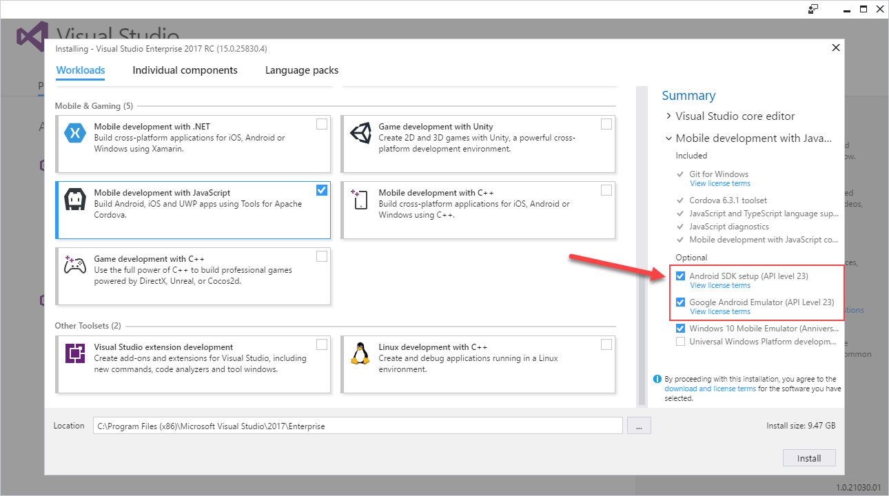
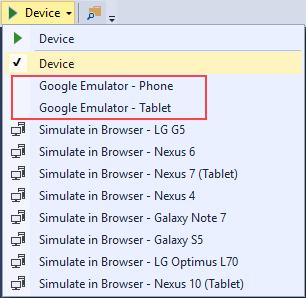
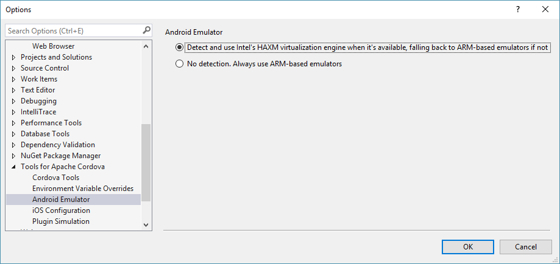
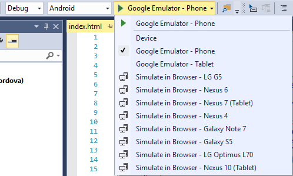

<properties
   pageTitle="Run Your Apache Cordova App on Android"
   description="description"
   services="na"
   documentationCenter=""
   authors="Mikejo5000, johnwargo"
   tags=""/>
<tags ms.technology="cordova" ms.prod="visual-studio-dev15"
   ms.service="na"
   ms.devlang="javascript"
   ms.topic="article"
   ms.tgt_pltfrm="mobile-multiple"
   ms.workload="na"
   ms.date="01/27/2017"
   ms.author="johnwargo"/>

# Run Your Apache Cordova App on Android

You've created an Apache Cordova application project using Visual Studio and Visual Studio Tools for Apache Cordova (TACO), and now you're ready to test it. Fortunately, you have several options for running your Cordova apps on Android using Visual Studio:

+ Android device - [jump to details](#android-device)
+ [Cordova Simulate](../first-steps/simulate-in-browser) (simulate in browser) - [jump to external article](../first-steps/simulate-in-browser)
+ Google [Android Emulator](https://developer.android.com/studio/run/emulator.html) - [jump to details](#google-android-emulator)
+ [Genymotion Emulator](https://www.genymotion.com/) - [jump to details](#genymotion-emulator)

In this article, you'll learn how to use these options to run your Android apps in Visual Studio. 

Throughout the steps outlined below, if you have trouble deploying to Android devices or emulators, be sure to check out [*Resolve Android build and deployment errors*](../tips-and-workaroundsandroid-tips.md).

To deploy a Release or Distribution configuration of your app, you must sign your app first. For more information, see [Package your App](publish-to-a-store.md).

## <a id="android-device"></a> Run on an Android Device

To run your Android app on an Android device in Visual Studio, complete the following steps:

1.	Connect the Android device to your development system using the appropriate **USB cable** for your device (most Android devices use a **Micro-USB cable**, but newer devices may use the newer **USB-C type connector**).

	You should hear Windows beep to indicate that it recognizes a new connected device. Any required device drivers should load automatically.

2.	Check to see that USB debugging is enabled on the device. Pull down from the top of the home page to view the list of notifications, you should see an indicator that USB debugging is enabled as shown in the following figure:

	

	If USB debugging is disabled, open **Settings** and look for **Developer options** as shown below:

	

	> **Note**: You may have to execute some convoluted process to enable developer options, for this particlular device, for example, developers have to open **Settings**, select **About phone**, then **tap Build number** repeatedly until the OS enables developer mode.

	Open **Developer options** and scroll down until you find **Debugging** options as shown in the figure. Enable **USB debugging** as shown in the figure and any other settings you think might help the debugging process. 

	

3.	Make sure that the **Android Debug Bridge** ([ADB](https://developer.android.com/studio/command-line/adb.html)) sees the device. To do this, open a Command Prompt and execute the following command:
   
    ```
    path-to-android-sdk\platform-tools\adb.exe devices
    ```

	By default, Visual Studio TACO installs the Android SDK in `C:\Program Files (x86)\Android\android-sdk`, so for the standard installation, you would execute:

	```
	"C:\Program Files (x86)\Android\android-sdk\platform-tools\adb.exe" devices
	```	
    
	> **Note**: we added quotes around the executable filepath because there are spaces in the path.
	  
	ADB will report any connected devices as shown in the following example:

	```
	List of devices attached
	00a23d16cc83d0ab        device
	```

	If ADB doesn't see any devices, then you must resolve the issue before continuing. Double-check to make sure Windows Device Manager sees the device, try a different cable, try a different USB port, ect.

4.	In the Visual Studio **Standard** toolbar, set the release type to **Debug**, the target OS to **Android**, and the execution target to **Device** as shown in the following figure. Click the **Device** button, or press **F5** to build and launch the application, and then begin a debugging session with the application.

	

	Visual Studio will build the Android version of the Cordova application (using the Cordova CLI and Android SDK), then deploy the app to the connected device and launch it. Next, Visual Studio opens the DOM Explorer to enable you to interact with the application as it runs.  

	

## <a id="google-android-emulator"></a> Run on the Google Android Emulator

The Google Android Emulators deliver a software-only solution for testing your Android applications. These emulators deliver most of the functionality available in a physical device except that sensors and other hardware components may not work or will work in a simulated manner. In this section, you'll learn how to use Google's Android emulators to run your Apache Cordova application. 

When you installed TACO, you had an option to install the Google Android Emulators as shown in the following figure:



If you did not enable the highlighted options, close Visual Studio, launch the **Visual Studio Installer** and modify the installation to include these options. You can tell whether the emulators are installed or not by opening Visual Studio's Standard toolbar execution target list, if you see **Install Android build tools...** in the list, instead of some Android emulators, then you need to complete the installation. 


Select the installation option in the drop-down, then click the button (shown below) to begin the installation.


Android emulators are defined using the Android Virtual Device (AVD) Manager, you can learn how to create and manage Android virtual devices [here](https://developer.android.com/studio/run/managing-avds.html). The Visual Studio TACO installation process creates several virtual devices for you automatically during installation; you can confirm this using the Android SDK's **AVD Manager** application:


As you can see, Visual Studio creates two phone and two tablet emulator configurations. The difference is in the processor architecture selected for the emulator. The **Intel emulators** launch fairly quickly and perform better than the **ARM emulators**. Unfortunately, the Intel emulators require a specific hardware configuration that we'll discuss in a minute. For that reason, you'll see these emulators represented in Visual Studio through the following menu:



When you select one of these emulator options, Visual Studio will launch the right emulator configuration based on your system's hardware configuration. If your system supports the Intel emulators, those emulators will be used by default. If not, Visual Studio will automatically fallback to using the ARM emulators instead.

You can configure Visual Studio's behavior here. In Visual Studio, select **Tools** -> **Options**. Expand the **Tools for Apache Cordova** option and select **Android Emulator**. The **detection** option will be selected by default, to disable detection and use the ARM emulators by default every time, select the **No detection** option.



To run your Apache Cordova application on an Android Emulator: in the Visual Studio **Standard** toolbar, set the release type to **Debug**, the target OS to **Android**, and the execution target to one of the **Google Emulator** options as shown in the following figure. Click the **Google Emulator** button, or press **F5** to build and launch the application, and then begin a debugging session with the application.



### <a id="intel-configuration"></a> Configuring Your System to Use the Intel Emulators

The Intel emulators require a system running an Intel processor that supports Intel's VT-x technology; to learn if your processor is supported, check out [*Determine If Your Processor Supports Intel Virtualization Technology*](http://www.intel.com/content/www/us/en/support/processors/000005486.html).  

The Intel emulators are incompatible with Microsoft's Hyper-V technology, so to use them, you'll need to disable Hyper-V. You can disable Hyper-V through the Windows Control Panel or using the Windows command-line using the instructions in the following sections.

> **Note**: Disabling Hyper-V will prevent you from using the Windows Phone emulator. However, you can still deploy to a Windows Phone device while Hyper-V is disabled.

### To disable Hyper-V in Control Panel

1. In the **Control Panel**, choose **Programs and Features**, and then choose **Turn Windows features on or off**.

2. Clear the check box for Hyper-V.

    

3. Reboot your PC. 

   Alternatively, you can configure Windows to start with Hyper-V automatically enabled or disabled using the command line.

### To disable Hyper-V using the command line

1. Open an elevated command prompt (with administrative credentials), and type:

    ```
    bcdedit /set hypervisorlaunchtype off
    ```

    >**WARNING**: The `bcdedit` commands can prevent your system from booting if not executed correctly; be careful when using these commands.
    
2. Reboot your PC. If you want to re-enable Hyper-V later, use the following command, and then reboot your PC:

    ```
    bcdedit /set hypervisorlaunchtype auto
    ```

    If you’re using the Genymotion emulator, you can skip this procedure. For more information, see [Genymotion emulator](#genymotion-emulator).

## <a id="genymotion-emulator"></a> Run on the Genymotion Emulator

The [Genymotion emulator](http://www.genymotion.com/) is a commercial offering and a popular alternative to the Google Android emulator. Follow Genymotion's instructions to install the emulator. Here are a few tips for getting started with the emulator:

+	If you have trouble starting the emulator from a remote connection, try starting it locally, and then reconnect remotely if needed. The emulator requires OpenGL for rendering, and this may result in a conflict when starting the emulator.
+	You need a video card and video card drivers that support OpenGL. You may receive messages that indicate this. (If you connect to your PC remotely, you may also see this message. Try again after connecting locally).
+	You may receive a message to check your VirtualBox network configuration when you try to start the emulator. Follow the link and instructions to modify or remove the **Host-only Network Adapter** from VirtualBox. (VirtualBox is included with the installation of the emulator).
+	For high-performance emulation using Genymotion, disable Hyper-V before starting the emulator, as described earlier in [Configurig Your System to Use the Intel Emulators](#intel-configuration). Android developer tools see Genymotion as a physical device. When you use Visual Studio to run the app, you instruct Visual Studio to deploy to an Android device.

To run your app on the Genymotion emulator, complete the following steps:

1.	Start the Genymotion emulator.

2.	The emulator looks like a physical device to the Android SDK (and therefore Visual Studio). Make sure that the **Android Debug Bridge** ([ADB](https://developer.android.com/studio/command-line/adb.html)) sees the Genymotion emulator as a device. To do this, open a Command Prompt and execute the following command:
   
    ```
    path-to-android-sdk\platform-tools\adb.exe devices
    ```

	By default, Visual Studio TACO installs the Android SDK in `C:\Program Files (x86)\Android\android-sdk`, so for the standard installation, you would execute:

	```
	"C:\Program Files (x86)\Android\android-sdk\platform-tools\adb.exe" devices
	```	
    
	> **Note**: we added quotes around the executable filepath because there are spaces in the path.
	  
	ADB will report all connected devices, and the Genymotion emulator should be listed.

3.	In the Visual Studio **Standard** toolbar, set the release type to **Debug**, the target OS to **Android**, and the execution target to **Device** as shown in the following figure. Click the **Device** button, or press **F5** to build and launch the application, and then begin a debugging session with the application.

	

***

 [Get the Visual Studio Tools for Apache Cordova](http://aka.ms/mchm38) or [learn more](https://www.visualstudio.com/cordova-vs.aspx)

## See Also

[Install Visual Studio Tools for Apache Cordova](../first-steps/installation.md)  
[Debug Your App Built with Visual Studio Tools for Apache Cordova](../debug-and-test/debug-using-visual-studio.md)  
[Package Your App Built with Visual Studio Tools for Apache Cordova](../debug-and-test/package-app-built-with-visual-studio.md)  
