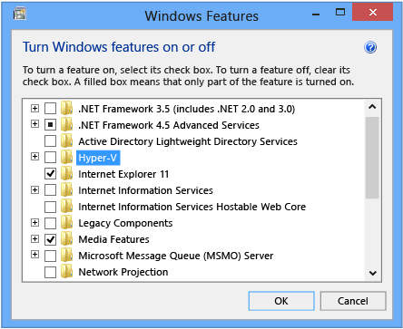
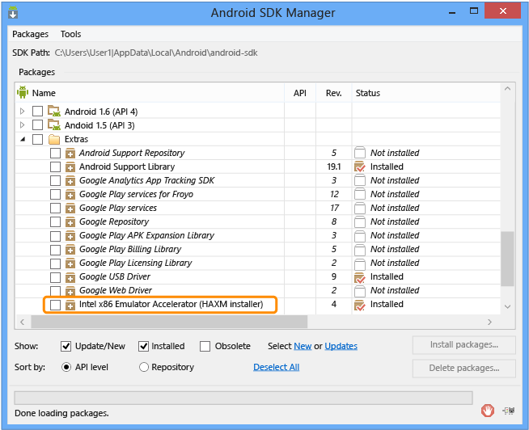

<properties
   pageTitle="Run Your Apache Cordova App on Android | Cordova"
   description="description"
   services="na"
   documentationCenter=""
   authors="Mikejo5000"
   tags=""/>
<tags ms.technology="cordova" ms.prod="visual-studio-dev14"
   ms.service="na"
   ms.devlang="javascript"
   ms.topic="article"
   ms.tgt_pltfrm="mobile-multiple"
   ms.workload="na"
   ms.date="08/21/2016"
   ms.author="mikejo"/>
# Run your Apache Cordova app on Android

There are many options for running your apps built using Visual Studio Tools for Apache Cordova on Android. From Visual Studio, you can run and debug Android apps on the emulators and devices including the [Apache Ripple simulator](run-app-ripple-simulator.md) (discussed in a separate article) and the Visual Studio Emulator for Android.

## Visual Studio Emulator for Android

Here’s how to run your app on the [Visual Studio Emulator for Android](https://www.visualstudio.com/msft-android-emulator-vs.aspx). For system requirements, see [System Requirements for the Visual Studio Emulator for Android](https://msdn.microsoft.com/en-us/library/mt228280.aspx).

>**Important**: The Visual Studio Emulator for Android is only available in Visual Studio 2015.

### To run your app on the emulator

1. Make sure that Hyper-V is enabled on your PC. Your PC must meet the [system requirements](https://msdn.microsoft.com/en-us/library/mt228280.aspx) for the Visual Studio Emulator for Android.

    >**Important**: The emulator is not supported in a virtualized environment.

2. With your app open in Visual Studio, choose **Android** from the Solution Platforms list.

    If you don’t see this list, choose Solution Platforms from the Add/Remove Buttons list to display it.

3. Choose one of the emulators, such as **VS Emulator 5” KitKat (4.4) XHDPI Phone**.

4. Press F5 to start the app. Visual Studio starts the emulator and runs the app.

### Troubleshooting? Let's fix it

If you have trouble deploying to Android emulators or devices, see [Resolve Android build and deployment errors](../tips-and-workarounds/android/tips-and-workarounds-android-readme.md).

## Google Android Emulator <a name="google"></a>

Before you run your app on the Google Android emulator in Visual Studio, use the Android Virtual Device (AVD) Manager to create an emulator configuration, and then start the emulator from the AVD Manager. The following steps show how to do this. For more information, see the [AVD Manager documentation](http://developer.android.com/tools/devices/managing-avds.html).

### To create an instance of the emulator

1. Open the AVD Manager. To do this from a command line, go the location of the SDK and type `android avd`. On Windows, the AVD Manager.exe is installed by default in the following location: C:\Program Files (x86)\Android\android-sdk.

2. In the AVD Manager, choose **Create**.

    

3. Configure the properties for the new emulator. The required properties are **AVD Name**, **Device**, **Target**, **CPU/ABI**, and **Skin**. **Target** represents an installed version of the Android SDK version (API set). Set this property to a value such as API Level 22.

    >**Tip**: You may need to install more Android images using the Android SDK Manager. If you have trouble installing components, run the SDK Manager as an Administrator.

    

    If you already installed the high-performance HAXM driver described in the [next section](#HAXM) and chose an Intel CPU, select the **Use Host GPU** check box in Emulation Options (not shown for ARM).

    >**Important**: To use the high-performance emulator, you must also choose an Intel processor in the CPU/ABI section of the AVD dialog box.

3. Choose **OK** to close the configuration dialog box, and then choose **OK** again in the dialog box that shows all the emulator settings.

4. In the AVD Manager, select the new emulator, and then choose **Start**.

### To run the app on the emulator

1. With your app open in Visual Studio, choose **Android** from the Solution Platforms list. (If you don’t see this option, first choose **Solution Platforms** from the **Add/Remove Buttons** list.)

2. In the device list, choose **Google Android Emulator**.

    

3. Press F5 to start the app, or Shift+F5 to start the app without debugging.

    Android 4.4 is required to attach the debugger. Otherwise, the app will run without debugging.

    >**Tip**: If you get an error that indicates you need to install a new version of the Android SDK, use the Android SDK Manager to install it. On Windows, you can open SDK Manager by typing the following command on a command line: android sdk.

    Visual Studio deploys the app to the Android emulator that is currently running. If no emulator is running, Visual Studio starts the last emulator that was created using the AVD Manager, and then deploys the app.

  If you want to debug your app against Android versions 4.1.2-4.3, see the information about the jsHybugger plugin in the article [Debug Your App Built with Visual Studio Tools for Apache Cordova](../debug-and-test/debug-using-visual.md).

### Troubleshooting? Let's fix it

If you have trouble deploying to Android emulators or devices, see [Resolve Android build and deployment errors](../tips-and-workarounds/android/tips-and-workarounds-android-readme.md).

### Configure a high-performance Google x86 emulator <a name="HAXM"></a>

If you have a PC with an Intel processor, you can improve the performance of the Google Android emulator. To configure a high-performance emulator:

1. Disable Hyper-V. You can do this from Control Panel or from a command line, as described in the following procedures.

    >**Caution**: Disabling Hyper-V will prevent you from using the Visual Studio Emulator for Android and the Windows Phone emulator. However, you can still deploy to a Windows Phone device while Hyper-V is disabled.

2. Install the high-performance Intel Hardware Accelerated Execution Manager (HAXM) driver, if it isn’t already installed. (More information about the [HAXM driver](https://software.intel.com/android/articles/installation-instructions-for-intel-hardware-accelerated-execution-manager-windows))

3. Configure the Google Android emulator to use hardware acceleration.

### To disable Hyper-V in Control Panel

1. In the **Control Panel**, choose **Programs and Features**, and then choose **Turn Windows features on or off**.

2. Clear the check box for Hyper-V.

    

3. Reboot your PC. Now you can install the HAXM driver.

   Alternatively, you can configure Windows to start with Hyper-V automatically enabled or disabled using the command line.

### To disable Hyper-V using the command line

1. Open an elevated command prompt (with administrative credentials), and type:

    ```
    bcdedit /set hypervisorlaunchtype off
    ```

    >**Caution**: The bcdedit commands can prevent your system from booting if not executed correctly; be careful when using these commands.

    If you’re adding this command to a shell script, use the following instead:

    ```
    bcdedit /set hypervisorlaunchtype off
    shutdown /r
    ```

2. Reboot your PC. If you want to re-enable Hyper-V later, use the following command, and then reboot your PC:

    ```
    bcdedit /set hypervisorlaunchtype auto
    ```

    If you’re using the Genymotion emulator, you can skip this procedure. For more information, see Genymotion emulator.

### To install the high-performance HAXM driver (Google Android emulator only)

1. After disabling Hyper-V and rebooting, open the [Android SDK Manager](http://developer.android.com/tools/help/sdk-manager.html). To do this from a command line, go to the location of the SDK and type android. On Windows, the Android SDK Manager.exe is installed in the following location: C:\Program Files (x86)\Android\android-sdk or C:\Users\yourusername\AppData\Local\Android\android-sdk.

2. In the Android SDK Manager, look under the **Extras** folder for the **Intel x86 Emulator Accelerator (HAXM Installer)**. If the status column shows that it isn’t installed, select its check box, and then choose **Install Packages**.

    

    This downloads the HAXM driver.

3. Install the driver by going to sdk-path\extras\intel\Hardware_Accelerated_Execution_Manager and running **intelhaxm-android.exe**.

    >**Tip**: If the “intel” portion of the path isn’t present, the driver was not downloaded.

   Now you can configure an emulator to use the driver. When you create or edit an emulator, you must use an Intel CPU and select the **Use Host GPU** option. For more information, see the [preceding section](#google).

### Troubleshooting? Let's fix it

If you have errors installing or using the HAXM driver, see [Resolving issues with the HAXM driver](http://taco.visualstudio.com/en-us/docs/tips-and-workarounds-android-readme/).

## Genymotion emulator

The [Genymotion emulator](http://www.genymotion.com/) is a popular alternative to the Android emulator that is included with the Android SDK. Follow Genymotion's instructions to install the emulator. Here are a few tips for getting started with the emulator:

* If you have trouble starting the emulator from a remote connection, try starting it locally, and then reconnect remotely if needed. The emulator requires OpenGL for rendering, and this may result in a conflict when starting the emulator.

* You need a video card and video card drivers that support OpenGL. You may receive messages that indicate this. (If you connect to your PC remotely, you may also see this message. Try again after connecting locally.)

* You may receive a message to check your VirtualBox network configuration when you try to start the emulator. Follow the link and instructions to modify or remove the **Host-only Network Adapter** from VirtualBox. (VirtualBox is included with the installation of the emulator.)\

* For high-performance emulation using Genymotion, disable Hyper-V before starting the emulator, as described earlier in [Configure a high-performance emulator](#HAXM). Android developer tools see Genymotion as a physical device. When you use Visual Studio to run the app, you instruct Visual Studio to deploy to an Android device.

### To run your app on the Genymotion emulator

1. Start the Genymotion emulator.

2. With your app open in Visual Studio, choose Android from the Solution Platforms list. If you don’t see this option, choose Solution Platforms from the Add/Remove Buttons list.

3. In the device list, choose Device.

    

4. Press F5 to start the app, or Shift+F5 to start the app without debugging.

### Troubleshooting? Let's fix it

If you have trouble deploying to Android emulators or devices, see [Resolve Android build and deployment errors](../tips-and-workarounds/android/tips-and-workarounds-android-readme.md).

## Android devices

Before you can use Visual Studio to run your app on a connected Android device, you must install the required driver:

* [Device-specific OEM driver](http://developer.android.com/tools/extras/oem-usb.html), or

* For Google Nexus devices, [Google USB driver](http://developer.android.com/sdk/win-usb.html#top) You must also make sure that your device is in developer mode. For instructions, see “Enabling On-device Developer Options” and “Setting up a Device for Development” in the [Using Hardware Devices](http://developer.android.com/tools/device.html) page on the Android website. To deploy a Release or Distribution configuration of your app, you must sign your app first. For more information, see [Package your App](./package-and-publish/package-app-built-with-visual-studio.md#android).

### To run your app on an Android device

1. Make sure that you have installed the required OEM or Google USB driver.

2. Make sure that your Android device is in developer mode (see [Using Hardware Devices](http://developer.android.com/tools/device.html) on the Android website).

3. Make sure that adb (Android Debug Bridge) sees the device using adb.exe.

    1. Open a VisualStudio developer prompt in admin mode.

    2. Type the following command:

      ```
      "%ADT_HOME%\platform-tools\adb.exe" devices
      ```

      You should see your device in the list as shown here.

    

3. With your app open in Visual Studio, choose **Android** from the Solution Platforms list. (If you don’t see this option, choose Solution Platforms from the **Add/Remove Buttons** list.)

4. In the device list, choose **Device**.

    

5. Press F5 to start the app, or Shift+F5 to start the app without debugging.

6. When prompted, choose **Allow USB Debugging**.

 [Get the Visual Studio Tools for Apache Cordova](http://aka.ms/mchm38) or [learn more](https://www.visualstudio.com/cordova-vs.aspx)

## See Also

[Install Visual Studio Tools for Apache Cordova](./getting-started/install-vs-tools-apache-cordova.md)  
[Debug Your App Built with Visual Studio Tools for Apache Cordova](./debug-and-test/debug-using-visual-studio.md)  
[Package Your App Built with Visual Studio Tools for Apache Cordova](./debug-and-test/package-app-built-with-visual-studio.md)  
