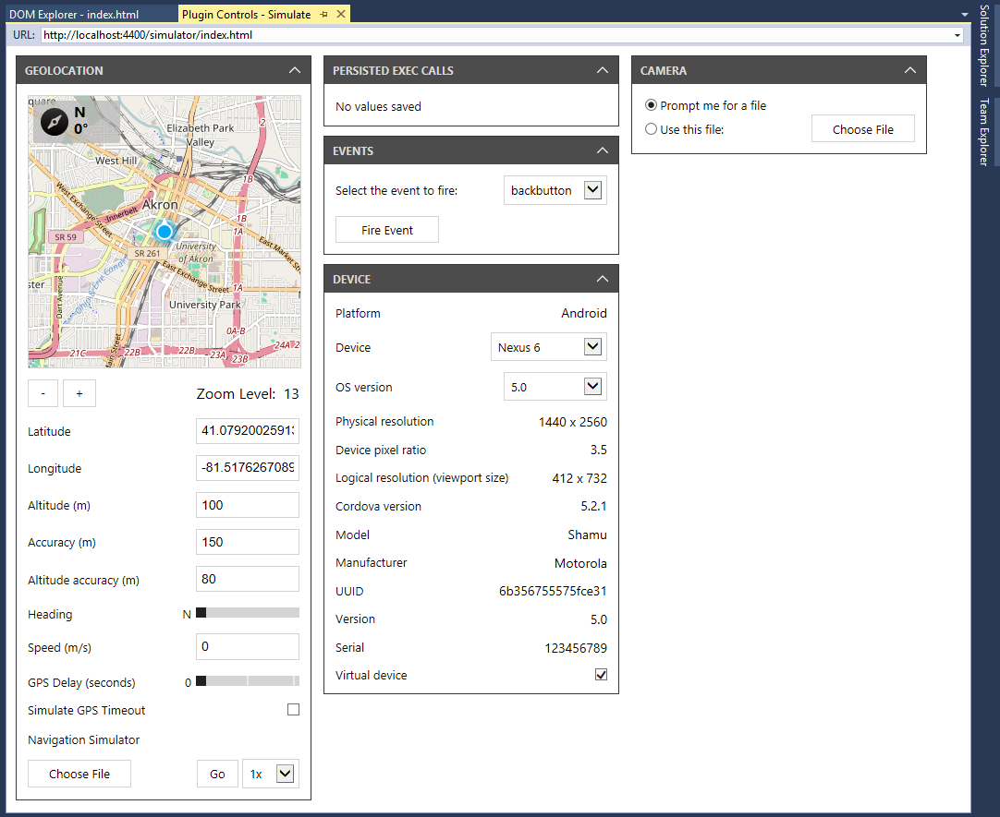
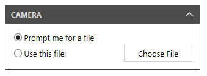
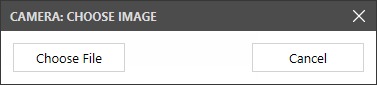
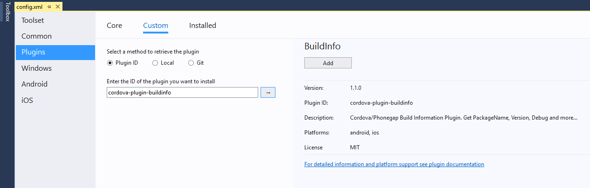
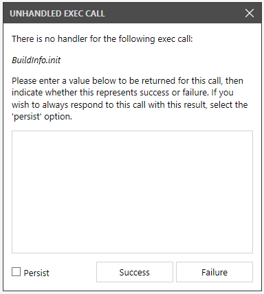

<properties
   pageTitle="Run Your App Using Cordova Simulate | Cordova"
   description="Using Cordova Simulate in Visual Studio Tools for Apache Cordova"
   services="na"
   documentationCenter=""
   authors="johnwargo"
   tags=""/>
<tags ms.technology="cordova" ms.prod="visual-studio-dev15"
   ms.service="na"
   ms.devlang="javascript"
   ms.topic="article"
   ms.tgt_pltfrm="mobile-multiple"
   ms.workload="na"
   ms.date="11/04/2016"
   ms.author="johnwargo"/>

# Run Your App Using Cordova Simulate 

To make it easier for developers to quickly test a Cordova application's web content without launching a mobile device emulator or simulator, or connecting to a physical device, Visual Studio Tools for Apache Cordova includes a new browser-based simulator. Beginning with Visual Studio 2017, Microsoft replaced the open source Ripple emulator with the open source [**Cordova Simulate**](https://github.com/Microsoft/cordova-simulate). Cordova Simulate enables developers to test a Cordova web application in the browser, and control plugin properties in Visual Studio while the application runs.

Cordova Simulate doesn't replace testing your app on physical devices, it merely simplifies iterative testing of your app's UI and JavaScript-based logic.

> **Note:** Cordova Simulate requires the **Google Chrome** browser to render the Cordova web app; make sure you have a recent build of the browser installed before launching Cordova Simulate. It also requires **Internet Explorer 11**; Cordova Simulate uses it to render its UI within Visual Studio. This means you'll have to be running Windows 8.1 and above, or Windows 7 SP1 (Internet Explorer 11 is not available on Windows 8).

## For the Impatient Developer

1. To launch Cordova Simulate, in the Visual Studio Standard toolbar, select a **target OS** from the list of available options; only Android and iOS are supported today. Next, in the Target list, select one of the available '**Simulate in...**' options. Visual Studio will prepare the app for deployment, and launch the **Chrome Browser**. Chrome renders the Cordova app's web application content while Visual Studio opens several debug panes (**DOM Explorer** and **Plugin Controls**) to help you test and validate your code.

2. Use the **Device** Plugin Control to change the target device on the fly. Cordova Simulate changes the device profile then reloads the Cordova app in the browser. This enables you to quickly iterate through multiple target device models as you work.

3. As you tweak your app's code, **live reload** automatically updates the web application files in Cordova Simulate behind the scenes. Changes to the app's HTML and JavaScript code triggers a reload of the app in the browser. Changes to the app's non-executable code (images, CSS files and so on) are made available to the app running in Cordova Simulate immediately after the change is detected, but the web application isn't reloaded in the browser.

4. For apps running in Cordova Simulate, Visual Studio's **Plugin Controls** window enables developers to tweak the status and operation of most of the Cordova core plugins, enabling developers to quickly test all facets of the app's code that calls plugin APIs. Developers of custom or third-party plugins can easily enhance their plugins to support this feature. For non-supported plugins, Visual Studio exposes an interface developers use to provide responses to API calls for unknown plugins; developers can either provide responses for every call, or persist responses so they're sent for subsequent calls to the same API.

## Features

Cordova Simulate delivers the following features:
 
+ Implements **live-reload** of application content. Visual Studio will reload the simulated app content as the user makes changes to source files. Changes to files such as images, stylesheets, and other resources are propagated to the running app without a full page reload. Other changes, such as those to JavaScript and HTML files, trigger a full page reload.
+ Launches the application in a **separate browser window** instead of rendering the content in a managed iframe with extra UI and controls. This simplifies debugging by removing any nonessential content from the browser's DOM during debugging so that all you see is the code from your app.
+ Sets the browser's viewport based on the device's **CSS pixel ratio**. For example, if the device's screen resolution is 640 x 960 pixels, and the CSS pixel ratio is 2, Cordova Simulate will set the viewport to 320 x 480.
+ Sets the browser's **User-Agent** string based on the **current device** and the **OS version**. This effects any code in your web application uses the User-Agent string to decide how and/or what content to render within your application.    
+ Enables a built-in proxy to help the app **avoid Cross-Site Scripting (XSS) issues**.
+ Control plugin simulation options through the **Plugin Controls** UI in Visual Studio.
+ For non-supported plugins, enables developers to define a **plugin response** and persist responses between debug sessions.
+ Add **custom plugin control UI** for your plugins. See [Adding simulation support to plugins](https://github.com/Microsoft/cordova-simulate#adding-simulation-support-to-plugins) for details.

## <a id="supported-plugins"></a>Supported Plugins

Cordova Simulate supports the following Cordova plugins:

+ [cordova-plugin-battery-status](https://github.com/apache/cordova-plugin-battery-status)
+ [cordova-plugin-camera](https://github.com/apache/cordova-plugin-camera)
+ [cordova-plugin-console](https://github.com/apache/cordova-plugin-console)
+ [cordova-plugin-contacts](https://github.com/apache/cordova-plugin-contacts)
+ [cordova-plugin-device](https://github.com/apache/cordova-plugin-device)
+ [cordova-plugin-device-motion](https://github.com/apache/cordova-plugin-device-motion)
+ [cordova-plugin-device-orientation](https://github.com/apache/cordova-plugin-device-orientation)
+ [cordova-plugin-dialogs](https://github.com/apache/cordova-plugin-dialogs)
+ [cordova-plugin-file](https://github.com/apache/cordova-plugin-file)
+ [cordova-plugin-geolocation](https://github.com/apache/cordova-plugin-geolocation)
+ [cordova-plugin-globalization](https://github.com/apache/cordova-plugin-globalization)
+ [cordova-plugin-inappbrowser](https://github.com/apache/cordova-plugin-inappbrowser)
+ [cordova-plugin-media](https://github.com/apache/cordova-plugin-media)
+ [cordova-plugin-network-information](https://github.com/apache/cordova-plugin-network-information)
+ [cordova-plugin-vibration](https://github.com/apache/cordova-plugin-vibration)

Don't worry if your favorite plugins aren't listed, Cordova Simulate provides an interface you can use to work with most any Cordova plugin. Refer to [Dealing With Non-supported Plugins](#non-supported-plugins) for more information.  

## <a id="using"></a>Using Cordova Simulate

In Visual Studio Tools for Apache Cordova, Cordova Simulate appears as an execution target labeled **Simulate in Browser**. When you create a new Cordova project in Visual Studio, the project's execution profile defaults to **Simulate in Browser - Nexus 7 (Tablet)** which, when selected, will launch Cordova Simulate with the **Nexus 7** profile.   
 


Visual Studio Tools for Apache Cordova supports a variety of Cordova Simulate profiles for Android and iOS devices. To see the available options, select an **Android** or **iOS** target platform, then click the drop-down arrow on the execution target to view the complete list of **Simulate in Browser** options. 


When you select one of the Cordova Simulate options, Visual Studio executes the Cordova CLI `prepare` command to assemble the web application for the selected target platform, then launch the web application in the Chrome browser. At this point, you interact with the web application like you would on a device. Using the mouse to simulate your finger as you test different aspects of the application.


As this point, all you're doing is interacting with the project's web application. One of the benefits of Apache Cordova is the plugin interface it provides that enables a web application to consume native APIs on the device. Through Visual Studio, Cordova Simulate provides an interface you'll use to interact with many of the core Cordova plugins as you test your app. This interface is described in the next section. 

## <a id="plugin-controller"></a>Plugin Controller

When you launch a Cordova application using Cordova Simulate, Visual Studio opens the **Plugins Controls - Simulate** window shown below. The window provides an interface you'll use to interact with the simulated device and simulate settings in many of the Cordova plugins you've added to the project. The Cordova Simulate Plugins Controls interface supports most of the core Cordova plugins. You can also create a simulator interface for your own custom plugins; see [Adding simulation support to plugins](https://github.com/Microsoft/cordova-simulate#adding-simulation-support-to-plugins) for details.

The following figure shows the Plugin Controls panel for a Cordova project with no plugins added. By default, the Plugin Controls window always displays the following simulator options:

+ **Device** - Simulates the capabilities of the [Cordova Device plugin](https://github.com/apache/cordova-plugin-device); included by default, even if the Cordova Device plugin has not been added to the project, so developers can change simulator options (Device and OS version) on the fly (causing the browser window to reload) plus view detailed information about the selected device. 
+ **Events** - The Cordova native container exposes a variety of events a Cordova web app can listen for; some are implemented in the Cordova native app container, while others require plugins. To simplify the interface, all events are exposed by default in the Plugin Controllers window.
+ **Geolocation** - Most modern browsers (including Chrome) support the [W3C Geolocation API](https://www.w3.org/TR/geolocation-API/), so regardless of whether the Cordova Geolocation plugin has been added to a project, the geolocation APIs should still work.  
+ **Persisted Exec Calls** - Enables developers to interact in a generic way with plugins that Cordova Simulate does not support directly.
 


When you add compatible plugins to the project, additional panes will appear in the window. For example, the following figure shows the Plugin Controls window after adding the Cordova Camera plugin to the project.  



The sections that follow describe the function of each Plugin Controls pane. 

### <a id="accelerometer"></a>Accelerometer

The Accelerometer plugin control enables developers to adjust the orientation of the simulated device in a three-dimensional space. The values for `x`, `y`, and `z`, representing the accelerometer values on the x, y, and z axis respectively, are passed to the [**Cordova Device Motion**](https://github.com/apache/cordova-plugin-device-motion) plugin in the application. Changes made in this pane are immediately passed to the corresponding plugin API. 


> **Note:** The values: *alpha*, *beta*, and *gamma* represent the rotation of the device. They are not supported by the Cordova Device Motion plugin API, but are used to calculate acceleration values.

To change the device orientation, position your mouse over the device image in the pane, hold down the primary mouse button, then move the mouse around to adjust the device's orientation. The image of the device will update to reflect its current orientation.


The simulator includes recorded data representing a simple shake gesture; press the **Play** button to trigger the gesture on the simulated device. 

> **Note:** The **Recorded Data** field is a drop-down list, but only contains a single value, **Shake**, at this time.

### <a id="battery"></a>Battery Status

The Battery Status plugin control passes data to the [**Cordova Battery Status**](https://github.com/apache/cordova-plugin-battery-status) plugin. Through this interface, developers have control over simulated battery level and whether or not the simulated device is connected to a power source. 


To change the simulated device's battery level, position your mouse over the battery level graph, then click on the graph to set the current level. You can also click and drag the mouse to slide the setting to the appropriate value.

The **Device Connected to Power** checkbox indicates whether the simulated device is connected to a power source. With the checkbox checked, the Battery Status plugin API will report that the device is charging. When unchecked, the Battery Status plugin API will report that the device is unplugged.

### <a id="camera"></a>Camera

The Camera plugin control enables developers to specify the image file passed to the [**Cordova Camera plugin**](https://github.com/apache/cordova-plugin-camera) API whenever a picture is taken by the application running on the simulated device. The default option is for Visual Studio to prompt for the photo file to use whenever a picture is taken.



With **Prompt me for a file** selected, when the app under simulation calls the Cordova Camera API to capture a picture, Visual Studio will prompt the developer to select an image file to use:



After the developer selects an image file, there's still a chance to change the image file before passing it back to the application. Click **Choose File** to pick another file. Click the **Use Image** button to send the selected image file to the Camera plugin API.   


Developers can also specify an image file to use for every photo taken. Select the **Use this file:** radio button, then click the **Chose File** button to select an image file. Once you've selected a file, the Cordova Camera API will use it for every photo image captured.


### <a id="compass"></a>Compass

The Compass plugin control enables developers to adjust the orientation of the simulated device, sending a selected compass heading to the [**Cordova Device Orientation plugin**](https://github.com/apache/cordova-plugin-device-orientation). The main interface for the control consists of a compass image; to change the heading, place your mouse cursor over the compass image, then click. Wherever you click will set the position of the compass' **North** pointer. Drag the mouse around within the compass image to move the pointer. You can also specify a specific compass heading by typing a **degree value** in the **Heading (deg)** input field.


### <a id="device"></a>Device

The Device plugin control enables developers to change the simulated **Device** model and **OS version**. This enables developers to try out their application on multiple models without having to close the browser window and select another device or OS version. This plugin control sends data to the [**Cordova Device plugin**](https://github.com/apache/cordova-plugin-device). In the simulator, the selected OS version is returned by the Device plugin's [`device.version`](https://cordova.apache.org/docs/en/latest/reference/cordova-plugin-device/#deviceversion) method.  

The **Virtual device** checkbox sets the response to the Device plugin's [`device.isVirtual`](https://cordova.apache.org/docs/en/latest/reference/cordova-plugin-device/#deviceisvirtual) property indicating whether the simulated device should 'look' like a physical (`device.isVirtual` is `false`) or virtual (`device.isVirtual` is `true`) device. 


The remainder of the data in the plugin control is presented for informational purposes. This data is used to define the size, resolution, and pixel density of the simulated device. You may need this data when defining CSS `media` queries in your web application if you're coding for specific devices or device families. 

### <a id="events"></a>Events

The Cordova native container and the [**Cordova Network Information plugin**](https://github.com/apache/cordova-plugin-network-information) expose several events that a Cordova application can respond to: 

+ `backbutton`
+ `menubutton`
+ `pause`
+ `resume`
+ `searchbutton`
+ `online`
+ `offline`

> ** Note:** The `offline` and `online` events are emitted by the Network Information plugin.

An application defines event listeners that respond to these events. Instead of hacking scenarios that causes these events to fire, the plugin control enables developers to fire these events at will. Simply pick an event from the **Select the event to fire** drop-down then click the **Fire Event** button to trigger the event. 


### <a id="geolocation"></a>Geolocation

The Geolocation plugin control drives the data reported by the W3C [Geolocation Specification API](https://dev.w3.org/geo/api/spec-source.html) to an application under simulation. The 
[**Cordova Geolocation plugin**](https://github.com/apache/cordova-plugin-geolocation) is an implementation of this API on devices where the WebView doesn't support the standard. Since the API is available on most modern browsers, the plugin control is loaded automatically by Visual Studio when invoking Cordova Simulate. 


To specify the location simulated by this control, enter values for:

+ **Latitude**
+ **Longitude**
+ **Altitude**
+ **Accuracy**
+ **Altitude Accuracy**
+ **Speed**

The values will be immediately passed to the simulator's Geolocation API. 

You can pan the map embedded in the control to change the latitude and longitude values in the API. Use the control's **+** and **-** buttons to control the map's zoom level as you interact with the map.

Use the **Heading** slider to set the compass heading returned by the API, and the **GPS Delay (seconds)** slider to add a delay to the API's response to application requests.  

To test your application's response to failures in the Geolocation API, check the **Simulate GPS Timeout** checkbox to simulate the API's failure to return a result due to a timeout error.

The [**GPS Exchange Format**](https://en.wikipedia.org/wiki/GPS_Exchange_Format) (GPX) standard defines an XML-based file format for describing GPS data for software applications. Developers use it to describe routes consisting of multiple waypoints. To help developers test navigation applications, applications that work with a time-sequenced collections of locations, the Geolocation plugin control exposes a **Navigation Simulator** capability that allows a developer to play an existing GPX file into the simulated Geolocation API. To use this feature, click the **Choose File** button to select the GPX file. Once a file is selected, click the **Go** button to play the file's GPS data into the simulated application.

Use the **1x**, **2x**, **4x**, etc. drop-down field to select the playback speed. 1x plays the data at real-time speed, 2x doubles playback rate, 4x quadruples playback rate and so on.  

### <a id="globalization"></a>Globalization

The Globalization plugin control sets the scope for methods in the [**Cordova Globalization plugin**](https://github.com/apache/cordova-plugin-globalization).

The plugin API uses the device **locale** to control how the API calculates the format for **currency**, **date**, and **numeric** values. To change the locale for the simulator, make a selection from the locale drop-down list. Any Globalization API calls made after the change will calculate its response based on the selected locale. The control currently supports the following locales:

+ English
+ English (Canadian)
+ French
+ French (Canadian)
+ German
+ Russian    


The remaining options on the control affect specific Globalization APIs:

+ The **Daylight Saving Time** checkbox sets the return value for the simulated device's Network Information plugin's `navigator.globalization.isDayLightSavingsTime` method. When checked, `navigator.globalization.isDayLightSavingsTime` returns `true`; when unckecked, it returns `false`.
+ The **Select the first day of the week** drop-down field specifies the value returned by the simulated device's Network Information plugin's  `navigator.globalization.getFirstDayOfWeek` method. 

### <a id="inappbrowser"></a>InAppBrowser

The InAppBrowser plugin control defines the default behavior of the [Cordova InAppBrowser plugin](https://github.com/apache/cordova-plugin-inappbrowser) when opening a link using the link's `target="_blank"` attribute. In the native Cordova container, InAppBrowser can load a page with a `target` of `_self`, `_system`, or `_blank`. In the Cordova Simulate browser, the default behavior causes a `target` of `_blank` to load the page in an iFrame. To simplify some debugging scenarios, the InAppBrowser plugin control allows you to change the default behavior. Select **Open in a new window: _system target** to force links opened with a `target="_blank"` to open in a new browser window.   


### <a id="network"></a>Network Connection

The Network Connection plugin control enables developers to set the network connection identifier returned by the [Cordova Network Information plugin](https://github.com/apache/cordova-plugin-network-information) `navigator.connection.type` property. Use this control to test parts of your application that react to changes in network connectivity and type.  Available options in the **Connection Type** drop-down are:

+ Unknown
+ Ethernet
+ Wi-Fi
+ 2G
+ 3G
+ 4G
+ Cellular (unknown speed)
+ None


> **Note:** This setting doesn't do anything to affect the network performance of the Cordova Simulate browser, it merely changes what the Cordova Network Information plugin reports as the current connection type.  

### <a id="non-supported-plugins"></a>Dealing With Non-supported Plugins

As you've seen, Cordova Simulate executes the Cordova web application for a specific target mobile OS in a browser window. For most of the core Cordova plugins, Visual Studio uses the Plugin Controls window to mimic plugin functionality so the plugins appear to function in the browser, even though the native code from the plugin is not available in the browser. For other third-party and core Cordova plugins, Visual Studio doesn't offer that capability. Instead, it provides an interface developers can use to configure Visual Studio with the responses from calls to the native plugin functionality. This is managed through the **Unhandled Exec Call** capabilities in the Visual Studio Plugin Controls window.

Using the [**cordova-plugin-buildinfo**](https://www.npmjs.com/package/cordova-plugin-buildinfo) plugin as an example, let's see how this works. 

> **Note:** In order to use this feature, you're going to need some detailed knowledge of the plugin's inner workings. Since most Cordova plugins ship with source code, this shouldn't be much of a problem, but don't be surprised when you find yourself digging through someone else's code.

1.	We'll start by adding the cordova-plugin-buildinfo plugin to your Cordova application project. To do this, double-click on the project's `config.xml` file to open the configuration editor.
2.	Select the **Plugins** tab, then **Custom**.
3.	For the **Select a method to retrieve the plugin** option, select **Plugin ID**. In the input field, enter **cordova-plugin-buildinfo** then click the arrow to the right of the input field to access the plugin.
	
	

4.	In the plugin details page, click the **Add** button to add the plugin to the project.
5.	You don't need to add any code to your project for this demonstration, the plugin's `init` process triggers the actions we need. If you want to, you can exercise the plugin by adding the following code to your project after the Cordova `deviceready` event fires:

	```JavaScript
	console.log('BuildInfo.packageName     =' + BuildInfo.packageName);
	console.log('BuildInfo.basePackageName =' + BuildInfo.basePackageName);
	console.log('BuildInfo.displayName     =' + BuildInfo.displayName);
	console.log('BuildInfo.name            =' + BuildInfo.name);
	console.log('BuildInfo.version         =' + BuildInfo.version);
	console.log('BuildInfo.versionCode     =' + BuildInfo.versionCode);
	console.log('BuildInfo.debug           =' + BuildInfo.debug);
	console.log('BuildInfo.buildType       =' + BuildInfo.buildType);
	console.log('BuildInfo.flavor          =' + BuildInfo.flavor);
	```

6.	Launch the application using the appropriate **Simulate in Browser** option in Visual Studio.
7.	As the application initializes, each plugin initializes; in this case, that means the plugin's `BuildInfo.init` method executes. Since the browser doesn't have the native code is needs to execute `init` this wouldn't normally work. However, Cordova Simulate intercepts the call to `BuildInfo.init` then opens the following dialog on the Visual Studio Plugin Controls page:  

	

	Cordova Simulate doesn't know anything about `init`, so it asks you for help. At this point, you could click the **Success** or **Failure** buttons to trigger execution of any success or failure callback functions. In this example, however, we know we don't have any callbacks since we didn't add any code to the application call `init`. It feels like `init` is probably returning something, so let's check the code.

8.	From studying the code for the plugin, it's clear that the `init` method returns a JSON object with a specific set of properties, so open your text editor of choice ([Visual Studio Code](https://code.visualstudio.com/) anyone?) and create the JSON object that `init` would normally return. Paste that object into the dialog as shown below: 
	
	

	Since we know we have a valid JSON response, click the **Success** button. If you were testing failure scenarios, you would click the **Failure** button to trigger execution of the call's failure callback function.

	Unless you're testing your app with different data every time, you probably don't want to have to process this dialog every time the application runs or every time your application makes a call to this plugin's API. To accommodate this scenario, Visual Studio provides a **Persist** checkbox you'll check to tell Visual Studio to save this value and use it every time the API is called by the application.

	Persisted data for these API calls are displayed on the Plugins Controls window in the **Persisted Exec Calls** pane. Don't worry if you've persisted data and later want to use something different, simply hover the mouse cursor over the method call, and an 'x' will appear at the end of the item. Click the x to remove the persisted data from the list and you'll be prompted to enter a new value the next time the API is called by the application.     

	

## Using Cordova Simulate Outside of Visual Studio

As cool and interesting as Cordova Simulate is, it's important to note that you can use the Cordova Simulate browser to test your apps outside of Visual Studio. Microsoft maintains Cordova Simulate as an open source project at [https://github.com/Microsoft/cordova-simulate](https://github.com/Microsoft/cordova-simulate), and supports executing the simulator via the command line. Simply install the simulator using:

```
npm install -g cordova-simulate
```

Launch Cordova Simulate from the command-line using the following command:

```
simulate
```

Refer to the project's [GitHub](https://github.com/Microsoft/cordova-simulate) page for information on the command-line options for the command.

In any node-based process, you can invoke Cordova Simulate using the `simulate()` method. Calling this method from your node app or module will launch the specified web app in the browser, and then open a second browser with the simulation host UI enabling you to configure how the plugins in your app respond. 
