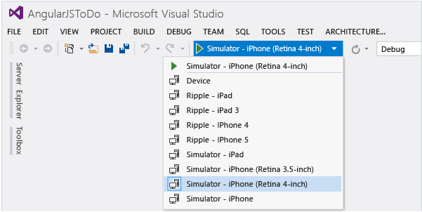
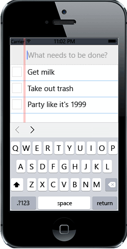

<properties
   pageTitle="Build a Cordova app for iOS by using Parallels | Cordova"
   description="description"
   services="na"
   documentationCenter=""
   authors="Chuxel"
   tags=""/>
<tags ms.technology="cordova" ms.prod="visual-studio-dev14"
   ms.service="na"
   ms.devlang="javascript"
   ms.topic="article"
   ms.tgt_pltfrm="mobile-multiple"
   ms.workload="na"
   ms.date="09/11/2015"
   ms.author="clantz"/>

#Build a Cordova app for iOS by using Parallels

This article shows how you can build hybrid apps using Apache Cordova in Visual Studio and deploy them to iOS using Parallels. By using [Parallels](http://www.parallels.com/), you can develop Cordova apps using only a Mac. To accomplish this, you’ll need the following:

 - [Xcode on OS X](https://itunes.apple.com/us/app/xcode/id497799835?mt=12)
 - [Node JS on OS X](http://nodejs.org/)
 - [Windows 7 or 8+](http://windows.microsoft.com/en-us/windows/downloads)
 - [Parallels on OS X](http://www.parallels.com/) or a similar virtual machine solution
 - [Visual Studio 2015](http://go.microsoft.com/fwlink/p/?linkid=517106) with [Visual Studio Tools for Apache Cordova](https://www.visualstudio.com/en-us/features/cordova-vs.aspx) installed

Any Mac that can run Mavericks or Yosemite should work with Parallels and Visual Studio, such as a 2013 MacBook Pro.

## Configure Parallels
To install Parallels and Windows 8 on your Mac, follow the [instructions](http://kb.parallels.com/en/4729) that come with Parallels. Once you’ve installed Parallels and Windows 8, consider whether you should give your VM extra RAM and storage space, because the default values might not provide optimal performance. The following illustration shows some example settings in Parallels.

In the environment we tested, we gave the VM 2 CPUS and 3 GB RAM with 8 GB RAM on the Mac. This seemed to provide good performance for Windows while still leaving plenty of memory for OS X as well.

>**Important**: Cordova is not designed to run off of network shares and Windows will not allow you to install a Windows app from a file
> share. For this reason, you either need to uncheck the Shared Profile
> option in your VM configuration (which causes your Documents folder to
> originate from a share) or choose a location for your app that is on
> disk that is local to your VM.

## Set up Node.js with remotebuild
Once you’ve got Parallels up and running, you’re ready to set up your Mac. First you need to install Node.js on OS X. Follow the directions at [the NodeJS web site](http://nodejs.org/) to install it.

Once Node.js is installed, get the [remotebuild](http://go.microsoft.com/fwlink/?LinkId=618169) agent. The remotebuild agent allows Visual Studio to communicate with OS X and use your Mac as a build service. You can install the remotebuild agent by opening the Terminal App on your Mac and typing the following command:

    sudo npm install -g remotebuild

The preceding command installs the remotebuild agent for all users of Node.js on your Mac, as well as the taco-remote module for building Cordova projects. If you don't want to allow others to use the remotebuild agent, you can drop the –g flag from the command to install the agent for the current user.

>**Important**: If Node.js displays error messages, you may need to start Xcode first and accept one or more license agreements. Once you
> do that, re-run the preceding command.

Make sure you have Parallels running. With remotebuild installed, start the agent by typing the following command in the Terminal App.

    remotebuild

>**Note**: By default, your iOS builds will show up in ~/.taco_home/remote-builds/taco-remote/builds.

When you run remotebuild for the first time, the agent asks for permission to install some additional third party packages using the Homebrew package manager.

Next, the agent creates some security certificates and you will see the following information.

You’ll need to use the PIN when you configure the agent in Visual Studio. The remotebuild agent is now up and running. Leave the Terminal App open.

## Get the IP address on your Mac
With Parallels running, the most reliable way to connect from Parallels to the Mac side is to use one of the VNIC IP addresses because it generally won’t change between restarts. You can get these IP addresses by going to Terminal App and typing the following command:

    ifconfig

The results should look similar to the following:

Either of the VNIC IP addresses will work. With remotebuild running and a VNIC IP address ready to use, you can open Visual Studio in Parallels and start building on the Mac.

## Configure Visual Studio to use remotebuild
With Visual Studio open in Parallels, choose **Tools**, then **Options**. Open **Tools for Apache Cordova**, and then choose **Remote Agent Configuration**. Make the following changes to the remote agent settings.

 - Set **Enable remote iOS processing** to **True**.
 - Set **Host** to one of the vnic IP addresses your obtained previously.
 - Use the default **Port** setting of 3000.
 - Set **Secure Mode** to **True**.
 - Set **Security PIN** to the PIN displayed when you first ran remotebuild.

> **Note:** If you don’t see Tools for Apache Cordova in the Options dialog box, then you may need to install the tools. In Programs and Features, find Visual Studio 2015 and select **Change**, then **Modify**, then make sure that cross-platform tools for HTML/JavaScript (Apache Cordova) is selected. (If the tools are already installed, try selecting **Show all settings** if it is present at the bottom of the Options dialog box.)

If time expires on your security PIN (10 minutes by default), you may need to regenerate your certificates again.

## Build your project for iOS
Next, make sure that your project is set to build for iOS. If you don't see the Solutions Platforms list on your debug toolbar, you can show it by choosing the dropdown arrow at the right of the debug toolbar as shown in the following illustration.

Select iOS in **Solution Platforms** list. Then select the device you want to build for in the Debug Target list, such as **Simulator – iPhone 5**.

After you select the device you want, choose the start debugging button (green right arrow). Visual Studio builds your project, handing off iOS build tasks to remotebuild. Once the build completes, remotebuild starts the simulator and loads your app.

Now you have a working hybrid mobile app development environment for iOS using Visual Studio and Parallels. You can develop your Cordova app and easily test it in iOS.

In later development sessions following a shutdown, you will need to restart remotebuild. As described previously, just open the Terminal App in OS X and type the following on the command line:

    remotebuild

With that, good luck, and happy travels developing your next mobile app!
