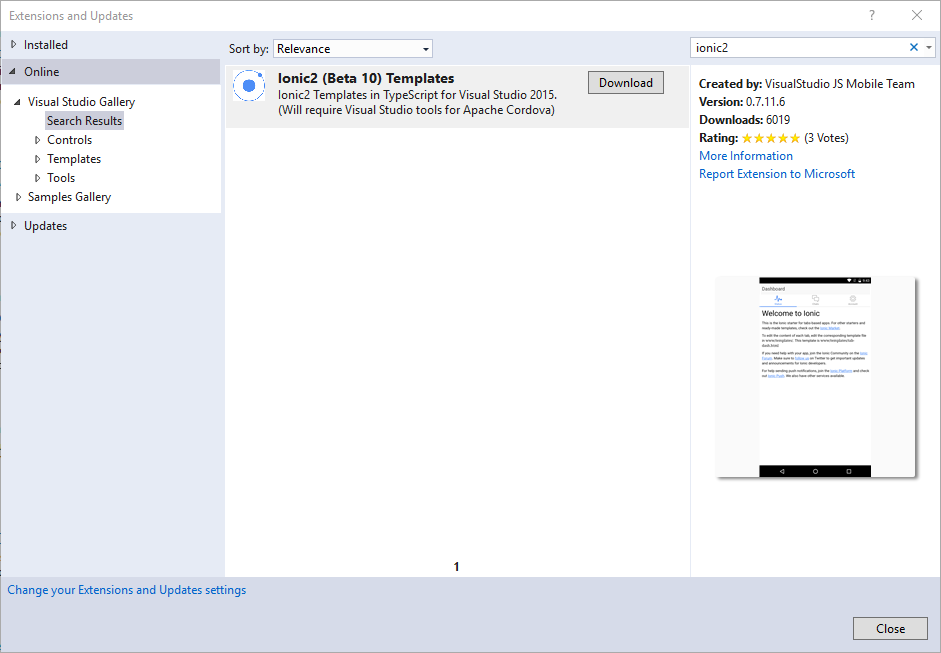
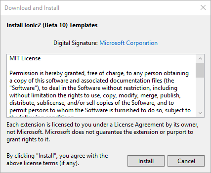
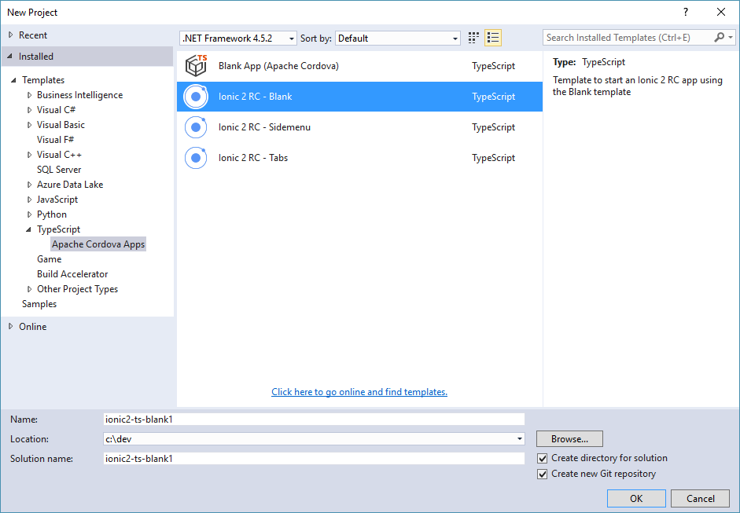
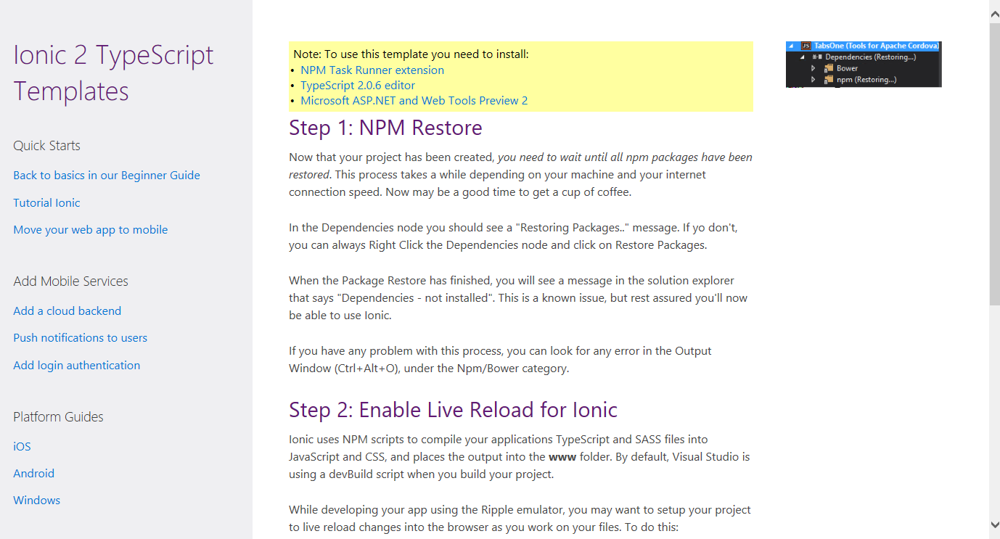
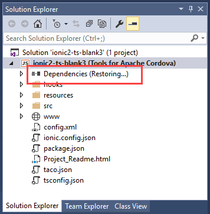
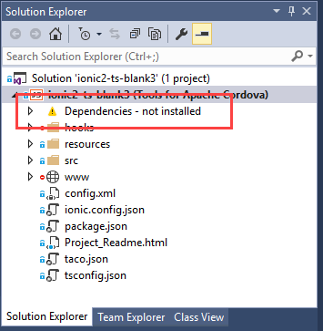
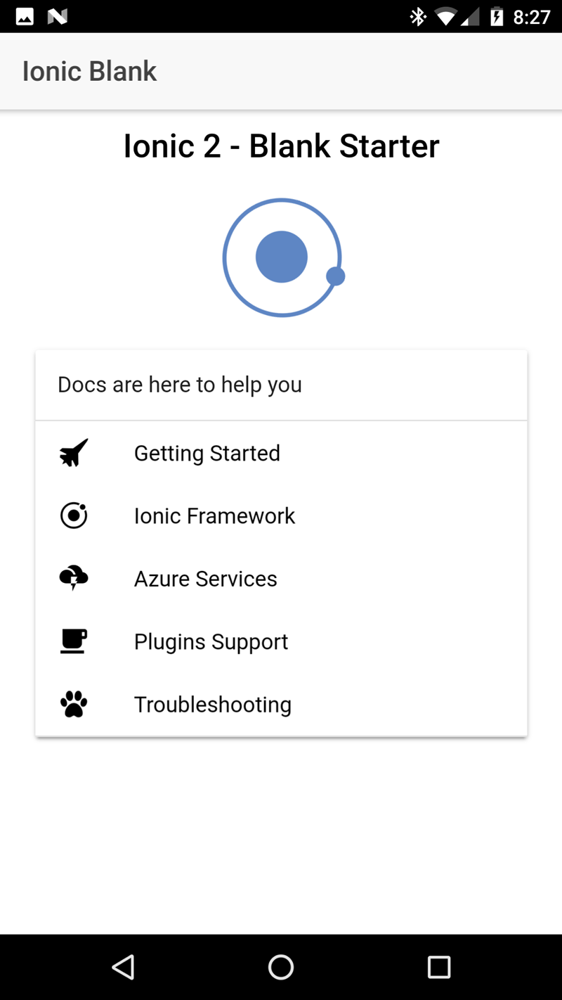

<properties pageTitle="Getting started with Ionic 2 apps in Visual Studio"
  description="Tutorial on how to create, code and run Ionic 2 apps in Visual Studio."
  services=""
  documentationCenter=""
  authors="mikejo5000, johnwargo" />
  <tags ms.technology="cordova" ms.prod="visual-studio-dev14"
     ms.service="na"
     ms.devlang="javascript"
     ms.topic="article"
     ms.tgt_pltfrm="mobile-multiple"
     ms.workload="na"
     ms.date="08/03/2016"
     ms.author="johnwargo"/>

# Get started with Ionic 2 apps in Visual Studio <a name="video"></a>

[Ionic](http://www.ionicframework.com) is a popular front-end JavaScript framework for developing cross-platform mobile apps using Cordova. You can use Visual Studio 2015 to easily create and debug cross-platform Ionic apps. 

## Requirements

To manage Ionic 2 applications using Visual Studio, you will need to install the following:

+ [Visual Studio 2015](http://go.microsoft.com/fwlink/?LinkID=533794)
+ [Visual Studio Tools For Apache Cordova](http://taco.visualstudio.com/en-us/docs/install-vs-tools-apache-cordova/)
+ Visual Studio Ionic 2 Templates (described below)
+ Ionic Template dependencies (described below)

## Installing the Ionic 2 templates <a name="getTemplates"></a>

1. If you haven't already, [install Visual Studio 2015](http://go.microsoft.com/fwlink/?LinkID=533794).

    Under the covers, Ionic apps are Apache Cordova apps, you'll need a functional Cordova development environment before you can use with Ionic. When you install Visual Studio, make sure you include the optional components, **HTML/JavaScript (Apache Cordova)** under Cross-Platform Mobile Development.

    > **Note:** Verify that you can create and run the default **Cordova Blank App**. In Visual Studio, open the **File** menu, select **New**, then **Project**. In the new project dialog, expand the **JavaScript** templates section, select **Apache Cordova Apps** then pick the **Blank App (Apache Cordova)** template. Give the new project a name and location then click the **OK** button. Press **F5** to build and run the new project in the **Ripple Emulator**. The Chrome browser should open and render the app's content. If you have any issues running the application, see these [troubleshooting steps](../tips-and-workarounds/general/tips-and-workarounds-general-readme.md).

2.	Install the Ionic template in Visual Studio by selecting the **Tools** menu, then **Extensions and Updates...**. In the Extensions and Updates dialog box, select **Online**. In the search box located in the upper-right corner of the dialog, type **Ionic2**. Select the Microsoft Ionic templates in the list. Click the **Download** button to initiate the installation process.
	
	

	The template files will download, then Visual Studio will automatically start the installation process. When prompted, click the **Install** button to begin the installation.

	
   
3.	The Ionic templates will not appear in Visual Studio until it's restarted. Close, then re-open Visual Studio.

## Creating an Ionic Project in Visual Studio

1.	Create a new Ionic project. Open the **File** menu, select **New**, then **Project**. In the new project dialog, expand the **TypeScript** templates section, select **Apache Cordova Apps** then pick one of the available Ionic templates for the project:

    + Ionic 2 Blank
    + Ionic 2 SideMenu
    + Ionic 2 Tabs

	Give the new project a name and location then, click the **OK** button.

	

2.	Check the new Ionic project's readme file for any additional tools that must be installed to use the template. 
	
	 

	At the time of this writing, you'll need to install the following Visual Studio extensions:

	+ NPM Task Runner
	+ TypeScript 2.0.6 editor
	+ Microsoft ASP.NET and Web Tools Preview 2
	
	The requirements may change as updates are made to the templates. To install the extensions, open the **Tools** menu, and select **Extensions and Updates**. Use search to locate and install the required extensions.

3.	Ionic is a heavy framework, it requires a lot of tools and libraries to operate. Once Visual Studio creates the new project, it kicks off a process to download and install the required components using npm. Wait a few minutes as Ionic's npm packages are installed.

    > **Note** This process will take several minutes depending on your system and internet connection speeds.

    To check progress, open **Solution Explorer** and look for the **Dependencies** node. You should see **Restoring...**, if you don't, right-click on the Dependencies node and click **Restore Packages**.

	

    > **Note:** After Visual Studio finishes installing dependencies, the Dependencies node may show **not installed**. This is a known issue; the Ionic project will be OK at this point.
    > 
    > 

	You can monitor the installation process through Visual Studio's Output window. Open the **View** menu, then select **Output** or use the keyboard shortcut **Ctrl-W** + **O**:
    
	

4.	At this point, you have a complete Ionic application project ready to go. To test and debug the application in Visual Studio, select a **target platform** in the Standard Toolbar, select a **target device**, then pres **F5** to run the application on the selected target. Developing iOS applications requires some extra configuration; refer to the [Visual Studio Tools for Apache Cordova: iOS Guide](vs-taco-2017-ios-guide.md) for additional information.
	
   

## Enabling Live Reload in Ripple

Ionic uses Node Package Manager ([npm](https://www.npmjs.com)) scripts to compile your application's TypeScript and SASS files into JavaScript and CSS, then copies the output into the project's `www` folder. By default, Visual Studio uses the `ionic:build` command in the project's `package.json` to build the project. Visual Studio executes this script every time you launch the Ionic application. 
					
While developing your app using the Ripple emulator, you may want to setup your project to live reload changes into the browser as you work on your files. To do this:

1.	Open the **Task Runner Explorer**: In Visual Studio, open the **View** menu, select **Other Windows** then Task Runner Explorer. You can also use the keyboard shortcut: **Ctrl** + **Alt** + **Backspace**.

2.	Right click the ionic:build task and choose the **Bindings** -> **Project Open** menu to setup the watch task to run when you load your project.

3.	Run your Ionic app in the Ripple browser.

After following the above steps, you'll now be able to make edits to the files in your `src` folder and your changes will automatically show up in the Ripple emulator. The status of the watch task will appear in a separate window in the Task Runner Explorer.


## Troubleshooting: Let's fix it

A few errors are fairly common in the starter templates when debugging in Visual Studio.

[I installed the Ionic templates, but they don't appear as an option in Visual Studio](#no-templates)

[Did you receive an error message that says: 'Promise is not defined'?](#node)

[Did you receive an error message indicating that some node modules won't restore?](#node_modules)

[Did you receive a WWAHost runtime error?](#wwahost)

[Did you receive an error message asking you to install a new app?](#partialpages)

[Did you receive an 'Unhandled exception' running on Windows?](#unhandled)

[Did you receive an error messaging indicating that the `appxrecipe` file is missing?](#appxrecipe)

[Did you receive an error message saying that the Content Security Policy is missing?](#scp)

[Did you receive a certificate error on Windows?](#certificate)

[Visual Studio Emulator for Android won't run?](#vsAndroidEmu)

[Having trouble hitting breakpoints in your .ts files?](#breakpoints)

[Other issues?](#other)

---

### <a id="no-templates"></a>I installed the Ionic templates, but they don't appear as an option in Visual Studio

Did you close, then restart Visual Studio? After the installation, the templates aren't available until Visual Studio restarts. 

### <a id="node"></a> Did you receive an error message indicating that some node modules won't restore?

The installed version of Node.js may not support Promises. To fix this, you must install the latest Visual Studio 2015 update (Update 3 or later) and Microsoft ASP.NET and Web Tools. Check for any notifications or warning icons in the upper-right corner of the Visual Studio IDE and install these components, if instructed.


If you are unable to install the Web Tools:

1.	[Download the latest version of the Web Tools here](https://visualstudiogallery.msdn.microsoft.com/c94a02e9-f2e9-4bad-a952-a63a967e3935).

2.	Run the following command from the folder containing the download:

    ```
    DotNetCore.1.0.0-VS2015Tools.Preview2.exe SKIP_VSU_CHECK=1
    ```

3.	Create a new Ionic 2 project from the templates that you downloaded previously.

### <a id="node_modules"></a> Did you receive an error message indicating that some node modules won't restore?

If you can't restore some of the Node.js modules, such as ionic-angular, make sure that you have installed the Update 3 or later of Visual Studio and Microsoft ASP.NET and Web Tools (for more instructions, see the [previous issue](#node)).

If that doesn't resolve the issue, open a command line and go to the project folder, then run this command:

```
npm install
```

and then this command:

```
npm rebuild node-sass
```

Then create a new Ionic 2 project from the templates you downloaded previously.

### <a id="wwahost"></a> Did you receive a WWAHost runtime error?

When debugging on a Windows 8.1 dev machine, you may get a WWAHost runtime error when navigating between pages in Ionic apps. You can work around this by:

+ Closing DOM Explorer before navigating pages, or

+ Upgrading to Windows 10 on your dev machine (the platform issue is fixed in Windows 10).

### <a id="partialpages"></a> Did you receive an error message asking you to install a new app?

When you are using the AngularJS routing module (Ionic templates use this module) on Windows, you may need to include a call to `aHrefSanitizationWhitelist`. This will correct errors that occur when loading partial pages.

If you see the dialog box shown here, you have likely run into this issue.

 

Typically, you include the code fix in app.js or wherever you are calling your module configuration code (inside `angular.module.config`):

```
$compileProvider.aHrefSanitizationWhitelist(/^\s*(https?|ftp|mailto|file|ghttps?|ms-appx|ms-appx-web|x-wmapp0):/);

$compileProvider.imgSrcSanitizationWhitelist(/^\s*(https?|ftp|file|ms-appx|ms-appx-web|x-wmapp0):|data:image\//);
```

If you use the preceding code, then add a reference to $compileProvider in the following line of code.

```
.config(function ($stateProvider, $urlRouterProvider) {
```

so that it looks like this:

```
.config(function ($compileProvider, $stateProvider, $urlRouterProvider) {
```

### <a id="unhandled"></a> Did you receive an 'Unhandled exception' running on Windows?

If you see the following unhandled exception when targeting Win/WinPhone 8.1, follow the [earlier steps](#configWindows) to call platformOverrides.js to fix this issue.


If you see the same error when targeting Windows 10, make sure you set **Windows 10.0** as the target in the Windows tab of the configuration designer.

### <a id="appxrecipe"></a> Did you receive an error messaging indicating that the `appxrecipe` file is missing?

If you see this error when targeting Windows 10, make sure you set **Windows 10.0** as the target in the Windows tab of the configuration editor (config.xml). Then delete the platforms\windows folder and rebuild the project.

### <a id="csp"></a> Did you receive an error message saying that the Content Security Policy is missing?

Cordova projects automatically add the Whitelist plugin to every project, so you must add the following `meta` element to the project's `index.html` file:

```
<meta http-equiv="Content-Security-Policy" content="default-src 'self' data: gap: https://ssl.gstatic.com 'unsafe-eval'; style-src 'self' 'unsafe-inline'; media-src *">
```

### <a id="certificate"></a> Did you receive a certificate error on Windows?

Make sure your user credentials in Visual Studio are up to date. Check for any notifications or warning icons in the upper-right corner of the Visual Studio IDE:


You may need to re-enter your credentials. If the notifications indicate that you need to update Cordova tooling, please click on the notifications and follow the provided instructions.

### <a id="vsAndroidEmu"></a> Visual Studio Emulator for Android won't run?

The VS Emulator for Android requires Hyper-V and is not supported when running on a VM. For more info, see [this information](https://msdn.microsoft.com/en-us/library/mt228282.aspx#NoStart2).

If you have previously run the VS Emulator for Android successfully but now the emulator won't run, try deleting the emulator VM instance in the Hyper-V Manager. For more info, see [Troubleshooting] (https://msdn.microsoft.com/en-us/library/mt228282).

### <a name="breakpoints"></a> Having trouble hitting breakpoints in your .ts files?

There is a known issue debugging Ionic 2 in VSCode. Otherwise, this indicates a problem with your sourcemaps. When running your app, look for your .ts files under **Script Documents** in Solution Explorer. They should look similar to the illustration below. You can right-click on the .ts file and choose Properties to view the current path used by the sourceMaps.


